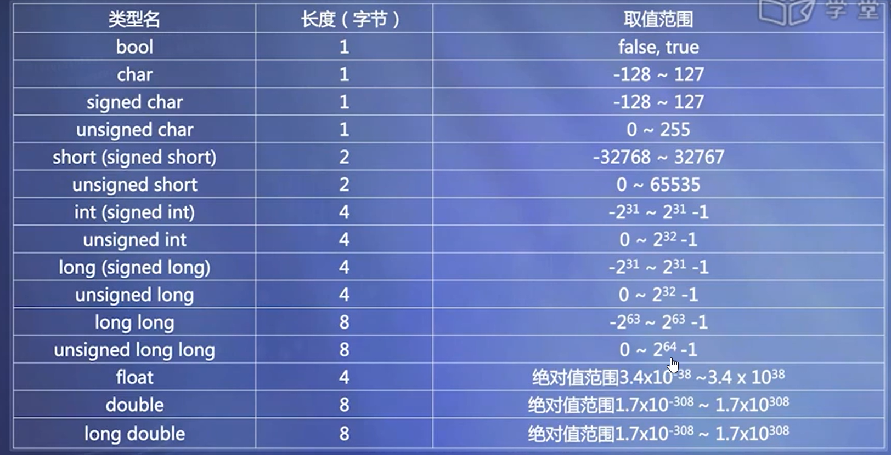
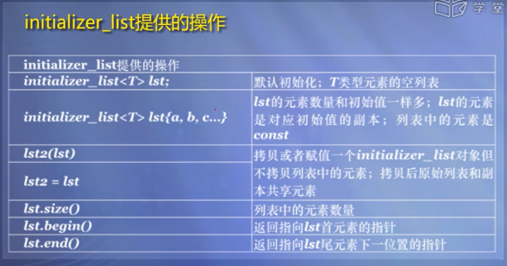

# C++笔记

## 一、基础

### 1. 数据类型

#### 变量

1. 整数类型
   * int 、signed、unsigned、 short、long、long long
2. 字符类型（char)
   * 存储的本质也是整数
3. 浮点类型
   * float
   * double
   * long double(拓展精度)
4. 字符串类型：
   * 字符串常量
   * 基本类型中没有字符串变量
   * 使用字符数组存储字符串（C风格的字符串，c++中不鼓励使用）
5. 布尔类型（bool)



#### 常量

1. 整数常量

   * 十进制、八进制（0）、十六进制（0x）

   * 后缀： L或l 表示类型至少是long

     LL或ll 表示类型是long long

     U或u 表示unsigned类型

2. 浮点常量

   * 12.5  -12.5
   * 0.34E+2 , -0.34E-3
   * 12.3(double), 12.3f(float)

3. C风格字符串

   * 以'\0'为结束标识

#### 变量初始化

* int a = 0
* int a(0)
* int a = {0} 或 int a{0} 这种方式不允许信息丢失（降低精度）
* 常量 const int a = 1

### 2. sizeof、位运算

#### 1. sizeof 

```c++
sizeof(a);
sizeof a;
```

#### 2. 位运算

* &
* |
* ^ (按位异或)
* ~（按位取反）
* << （左移）：左移后，低位补零
* \>\> (右移) ：右移后无符号数补零，有符号数补符号位

### 3. 类型转换

类型转换操作符：

* const_cast
* dynamic_case
* reinterpret_cast
* static_case

### 4. 输入输出

#### 1. 标准输入输出

```c++
cin >> a >> b;
cout << a << b;
```

#### 2. 常用I/O流类库操纵符

| 操纵符名           | 含义                               |
| ------------------ | ---------------------------------- |
| dec                | 使用十进制表示                     |
| hex                | 使用十六进制表示                   |
| oct                | 使用八进制表示                     |
| ws                 | 提取空白符                         |
| endl               | 插入换行符，并刷新流               |
| ends               | 插入空字符                         |
| setsprecision(int) | 设置浮点数的小位位数（包括小数点） |
| setw(int)          | 设置域宽                           |

```c++
cout << setw(5) << setprecision(3) << 3.1415926
```

### 3. 自定义类型

#### 1. 为已有类型另外命名

* typedef 已有类型名 新类型名
* using 新类型名 = 已有类型名

例：

```c++
using Area = double;
using Volume = double;
```

#### 2. 枚举类型

语法形式： enum 枚举类型名 {变量值列表}

```c++
enum Weekday
{SUN, MON,TUE,WED,THU,FRI,SAT}
```

不限定作用域枚举类型说明：

* 枚举类型是常量，不能对他们赋值

  ```c++
  enum Weekday{SUN,MON,TUE,WED,THU,FRI,SAT}
  //错误表达
  SUN = 0;
  ```

* 枚举类型具有默认值，他们依次为 0,1,2,3...

  * 也可以在声明时另行指定枚举元素的值

    ```c++
    enum Weekday{SUN=7,MON=1,TUE,WED,THU,FRI,SAT}
    ```

* 整数类型不能直接赋值给枚举变量

  * 如果需要，应进行强制类型转换

* 枚举值可以赋给整型变量

```c++
#include <iostream>
using namespace std;
enum GameResult {WIN, LOSE, TIE, CANCEL};
int main()
{
	GameResult result;
	GameResult omit = CANCEL;
	for (int i = WIN; i <= CANCEL; i++) {
		result = GameResult(i);//整型强制转换枚举类型
		if (result == omit) {
			cout << "The game was cancled" << endl;
		}
		else {
			cout << "The game was played";
			if (result == WIN) cout << " and we won!";
			if (result == LOSE) cout << " and we lost.";
			cout << endl;
		}

	}
	return 0;
}
```

#### 3. auto类型与decltype类型

##### 1. auto

编译器通过初始值自动推断变量的类型

```c++
auto val = val1 + val2;
//假如val1 + val2 是int类型，则val是int类型
//如果val1 + val2 是double类型，则val是double类型
```

##### 2. decltype

定义一个变量与某一个表达式的类型相同，但不使用该表达式初始化变量

```c++
decltype(i) j = 2;
//表示j 以2作为初始值，类型与i一致
```

### 4. 函数

* 普通函数
* 内联函数
* constexpr修饰的函数

#### 1. 定义引用

```c++
int i = 2;
int &j = i;//定义一个引用时必须初始化其值
```

#### 2. 含有可变参数的函数

* 如果所有的实参类型相同，可以穿第一个名为initializer_list的标准库类
* 如果实参类型不同，我们可以编写可变参数的模板（后面提及）


#### 3.内联函数

> 编译期在调用出用函数体进行替换，节省了参数传递，控制转移等开销

注意事项：

* 内联函数体内不能有循环语句和switch 语句
* 内联函数的定义必须出现在内联函数第一次‘被调用之前
* 对内联函数不能进行异常接口声明

#### 4. constexpr修饰的函数

> constexpr修饰的函数，在其所有参数都是constexpr时(即编译期就能知道其返回值)，一定返回constexpr

```c++
constexpr int get_size(){return 20;}
constexpr int foo = get_size();
```

#### 5. 带默认参数值的函数

* 有默认参数的形参必须在形参列表的最右，即默认参数值的釉面不能有无默认值的参数
* 如果函数有原型声明，且原型声明在定义之前，则默认函数值应在函数原型声明中给出。

#### 6. 函数重载

注意：

* 重载函数的形参必须：个数不同或类型不同

#### 7. C++系统函数

cmath:

* sin（）
* cos()
* tan()
* sqrt()
* abs

### 5. 面向对象

* 基本特点： 抽象、封装、继承、多态


