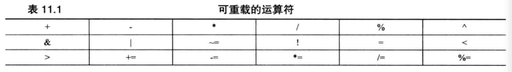
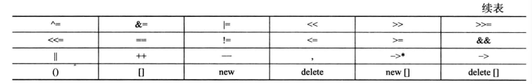
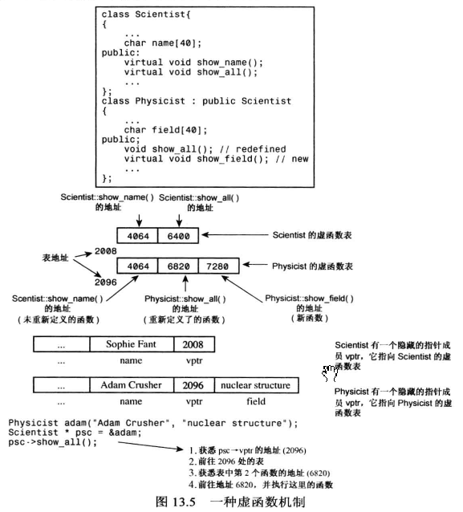
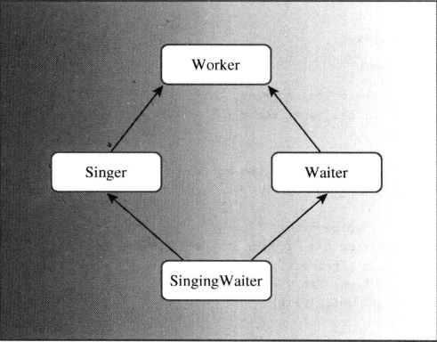
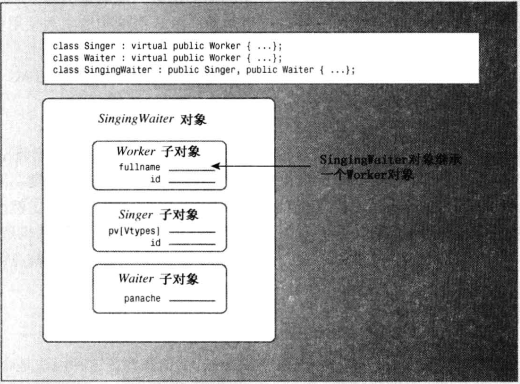

## 一、前半部分汇总

前半部分基本都在C语言时学过，所以只做一些杂七杂八的汇总。

1. C++的头文件命名约定
   
   | 头文件类型   | 约 定          | 示例         | 说明                                  |
   |:-------:|:------------:|:----------:|:-----------------------------------:|
   | C++旧式风格 | 以 .h结尾       | iostream.h | C++程序可以使用                           |
   | C旧式风格   | 以.h结尾        | math.h     | C、C++程序可以使用                         |
   | C++新式风格 | 没有拓展名        | iostream   | C++程序可以使用，使用namespace std           |
   | 转换后的C   | 加上前缀C， 没有拓展名 | cmath      | C++程序可以使用，可以使用不是C的特性，如namespace std |

2. C++ 以下划线开头的命名
   
   以两个下划线或下划线和大写字母大头的名称被保留给实现（编译期及使用的资源）使用。以一个下划线开头的名称被保留给实现，用作全局标识符。

3. C++11初始化方式
   
   ```cpp
   int hamburgers = {24}; // set hamburgers to 24
   int rheas = {12}; //set rheas to 12
   ```
   
   大括号不包括任何东西，变量将被初始化为零。
   
   ```cpp
   int rocs = {}; //set rocs to 0
   ```
   
   这种初始化方法对类型转换的要求比较严格，具体来说，列表初始化不允许缩窄，即变量的类型可能无法赋给的它的值。

4. wcha_t 宽字符（略）

5. C++11 新增类型：char16_t和char32_t

6. C和C++对于有效位数的要求是，float至少32位，double至少48位，且不少于float，long double至少和double一样多。 通常，float为32位，double为64位。

7. 前置类型转换的通用格式
   
   ```cpp
   (typeName) value //c语言风格
   typeName (value)//C++风格
   ```

8. 输入
   
   * 面向行的输入： getline()
     
     ```cpp
     cin.getline(name, strSize);
     //注意与 getline(cin, str)区分
     ```
     
     getline()将丢弃换行符!
   
   * 面向行的输入：get()
     
     get()不会丢弃换行符！
     
     ```cpp
     char* chars = new char[10];
     //cin 和 cin.get()遇到空格都会停止
     while (cin.get(chars, 10).get()) {//读取一行并吃掉回车
     //cin.get()会返回一个istream对象，可以转换为bool类型
         cout << chars << endl;
     }
     ```

9. C++原生字符串
   
   ```
   //一般情况下原生字符串
   cout << R"(Hello world!)" << endl;
   //字符串包含特殊字符时（‘"’或 ’（‘）
   cout << R"+*(Hello world!)+*" << endl;//使用 “+*(”代替默认的定界符 "(和)"
   ```

10. 匿名共用体
    
    ```cpp
    struct widget
    {
        char brand{20};
        int type;
        union{
            long id_num;//type 1 widgetss
            char id_char[20];//other widgets
        }
    };
    ...
    widget prize;
    ...
    if(prize.type == 1)
        cin >> prize.id_num;
    else
        cin >> prize.id_char;
    ```

11. 枚举体
    
    * 枚举量是整型，可以被提成为int类型，但int类型不能自动转换为枚举类型：
      
      ```cpp
      enum spectrum {red, orangem ,yellow};
      int color = blue; //valid, spectrum type promoted to int
      band = 3 ;//invalid, int not converted to spectrum
      ```
    
    * 如果int值是有效的，则可以通过强制类型转换，将它赋给枚举变量。
      
      ```cpp
      band = spectrum{3};
      ```
    
    * 枚举的取值范围
      
      每个枚举都有取值范围，通过强制类型转换，可以将取值范围中的任何整数赋给枚举变量，及时这个值不是枚举值。
      
      取值范围定义如下：
      
      * 上限：首先要知道枚举量最大值，找到大于这个最大值的、最小的2的幂，将它减去1，得到的就是取值范围的上限。
      * 下限：如果最小值大于零，那么下限就是0，否则找到最小值，方法同上限，最后加上负号。

12. 数组的地址
    
    ```cpp
    shor tell[10];
    cout << tell << endl;
    cout << &tell << endl;
    ```
    
    从数字上说，这两个地址相同。但从概念上说，&tell[0]（即tell）是一个2字节内存块的地址，而&tell是一个20字节内存块的地址。

13. 模板类array(c++11)
    
    ```cpp
    #include <array>
    ....
    using namespace std;
    array<int, 5> ai;
    array<double, 4> ad = {2.3, 4.3, 0, 0};
    ```

14. cin.get(ch)与 cin.get()区别
    
    | 属性            | cin.get(ch)               | ch=cin.get() |
    | ------------- | ------------------------- | ------------ |
    | 传递输入的字符方式     | 赋给参数ch                    | 将函数返回值赋给ch   |
    | 用于字符输入时函数的返回值 | istream对象（执行bool转换后为true) | int 类型的字符编码  |
    |               | istream对象（执行bool转换为false) | EOF(ch=-1)   |

15. 关于istream类输入结束时
    
    * 遇到EOF，cin.eof()返回true
    * 类型不匹配： cin.eof(), cin.fail()都返回true
    * 读取出现问题： cin.bad()返回true
    * 没有任何错误：cin.good（）返回true

16. 指针和const
    
    * 常量指针：指针指向的数据不能修改，指针的指向可以更改。
      
      ```cpp
      int a = 10, b = 1;
      const int *p = &a; //常量指针
      *p = 20; //尝试修改指向的数据，报错
      
      p = &b;//尝试修改指针的指向，可以
      ```
    
    * 指针常量: 指针指向的数据可以修改，指针的指向不能更改。
      
      ```cpp
          int a = 10, b = 1;
          int * const p = &a;//指针常量
      
          *p = 20;//尝试修改指向的数据，可以
          p = &b;//尝试修改指针的指向，报错
      ```
    
    * 非const类型指针指向const类型数据：C++禁止
      
      ```cpp
      const int cnt = 10;
      int* p1 = &cnt;//报错
      int* const p2 = &cnt;//报错
      const int* p3 = &cnt;
      ```
    
    * const int * const p: 指针指向和指向的数据都不能被修改

17. 函数指针
    
    * 声明
      
      ```cpp
      double (*pf)(int);
      ```
    
    * 调用
      
      ```cpp
      (*pf)(3);//方式一
      pf(3);//方式二临时变量、引用参数和const
      ```
    
    * 函数指针数组
      
      ```cpp
      //声明一些函数指针
      const double *f1(const double ar[], int n);
      const double *f2(const double [], int n);
      const double *f3(const double *, int n);
      
      //声明一个函数指针数组
      const double * (*pa[3])(const double *, int) = {f1, f2, f3};
      //pa[3]表示p3是一个包含三个元素的数组
      //运算符[]的优先级大于*， 所以*pa[3]表示pa是一个包含三个指针的数组
      
      //调用函数
      const double *px = pa[0](av, 3);
      const double *py = (*pa[1])(av, 3);
      
      //创建一个指向整个数组的指针
      auto pc = &pa;
      const double * (*(*pd)[3])(const double *, int ) = &pa;
      //我的理解：
      //const double * (* pd)(const double *,int ):一个函数指针
      //const double * (* pd[3])(const double *, int): 一个函数指针数组
      //const double * (* (*pd)[3])(const double *, int):如果把(*pd)看成
      //和上面pa一样的整体，那么此处的(*pd)整体就是一个函数指针数组，从而此处的pd就是一个函数指针数组
      //的指针
      ```
    
    * 关于`*`和`[]`共用时的一些想法
      
      * `int* a`: `int`类型的指针
      
      * `int * b[10]`: `b`是一个有10个`int*`类型元素的指针数组
      
      * `int (*pd)[10]`: `pd`是一个指针，指向包含10个`int`元素的数组
      
      * `int (*py[3])[4]`: 
        
        1. `(*py[3])`整体是一个包含4个`int`元素的数组
        
        2. `py[3]`代表`py`是一个包含3个元素的数组
        
        3. `*py[3]`表示`py`是一个包含三个指针的数组
        
        以上可以推断出`py`是一个包含三个指针的数组，数组中每个指针指向包含4个`int`元素的数组。
        
        ```cpp
        int(*py[3])[4];
            int** px;
            int arr1[4] = { 1, 2, 3, 4 };
            int arr2[4] = { 2, 3, 4, 5 };
            int arr3[4] = { 3, 4, 5, 6 };
            py[0] = &arr1; py[1] = &arr2; py[2] = &arr3;
        
            px = new int* [3];
            px[0] = new int[4]{ 1,2, 3, 4 };
            px[1] = new int[3]{ 3, 2, 1 };
            px[2] = new int[2]{ 2, 1 };
        
            for (int i : *py[0]) {
                cout << i << " ";
            }
            cout << endl;
        
            for (int i = 0; i < 4; i++)
            {
                cout << px[0][i] << " ";
            }
            cout << endl;
        ```

18. > 原因如下： 
    > 
    > * 如果接受引用参数的函数的意图时修改作为参数传递的变量，C++创建临时变量会阻止这种意图的实现。
    > * 解决办法是：禁止此情形下创建临时变量。
    >   详见《C++ primer plus》 P262

19. 函数重载总结
    
    * 重载后的函数遇到未有类型参数时，可寻找可做类型转换的重载函数，但如果找到了多个，则会拒绝调用。
    * 类型引用和类型本身作为同一个特征标
    * const参数可以作为重载的区分(疑问:指针和引用可以，普通类型就报错？)
    * 返回值类型不能作为重载的区分

20. 函数模板
    
    * 模板声明
      
      ```cpp
      template <typename AnyType>
      void Swap(AnyType &a, AnyType &b)
      {
          ...
      }
      ```
    
    * 实例化和具体化
      
        实例化:
      
      * 代码中包含函数模板本身不会生成函数定义，只有在用到模板函数时，编译器才会根据传递的实参，使用模板创建一个模板函数的实例。
      
      * 使用`template`可以显式让编译器创建一个模板函数实例： `template void foo<char>(char a)` 或 `template void foo(char a)`.
        
        ```cpp
        template <typename T>
        void foo(T arg){...}
        int main()
        {
         //直接调用
         foo<char>('a');
        
         //先实例化再调用
         template void foo<char> (char arg);
         foo('a');
        }
        ```
        
        具体化：
        
        * 告诉编译器不要用原函数模板来生成函数定义，而是使用专门为其定义的函数定义。
          * 因此具体化必须提供函数定义。
        
        ```cpp
        template <typename T>
        void foo(T arg){...}
        
        //对foo进行追加定义
        //以下两种具体化方式等价
        template<> void foo(char arg){...}
        // template<> void foo<char>(char arg){...}
        
        int main()
        {
         foo('a');
        }
        ```

21. 模板函数发展
    
    * 关键字decltype用于推断模板函数变量类型
      
      `decltype(expression) var;` 
      
      推断依据如下：
      
      * 如果expression是一个没有括号括起的标识符，var的类型与该标识符类型相同。
      
      * 如果expression是一个函数调用，var的类型与函数的返回值相同
      
      * 如果expression是一个左值（被括号括起来也算），则var为指向其类型的引用。
        
        ```cpp
        double xx = 4.4
        double yy;
        decltype ((xx)) r2 = xx;  //r2 是doible &类型
        decltype(yy=xx) r3 = xx; //yy=xx得到一个左值， r3为double &类型
        decltype(xx) w = xx; //w 是double类型
        ```
      
      * 如果以上都不符合，则var类型与expression类型相同。
    
    * C++11后置返回类型
      
      示例：
      
      ```cpp
      double h(int x, float y);//原型
      auto h(int x, float y) -> double;
      ```
      
      其中auto是个占位符。
      
      上述用于解决模板函数返回值类型的推断。
      
      ```cpp
      template <class T1, class T2>
      ?type? gt(T1 x, T2 y){
          return x + y;//返回类型不确定
      }
      ```
      
        //使用后置返回类型
        template <class T1, class T2>
        auto gt(T1 x, T2 y) -> decltype(x + y){
      
            ....
            return x + y;
      
        }
      
      ```
      
      ```

22. 关于二重指针与二维数组
    
    ```cpp
     闲话少说，这里我就以三个二维数组的比较来展开讨论：
        (1)、int **Ptr;
        (2)、int *Ptr[ 5 ];
        (3)、int ( *Ptr )[ 5 ];
        以上三例都是整数的二维数组，都可以用形如 Ptr[ 1 ][ 1 ] 的
    方式访问其内容；但它们的差别却是很大的。下面我从四个方面对它们
    进行讨论：
        一、内容：
           它们本身都是指针，它们的最终内容都是整数。注意我这里说
    的是最终内容，而不是中间内容，比如你写 Ptr[ 0 ]，对于三者来说，
    其内容都是一个整数指针，即 int *；Ptr[ 1 ][ 1  ] 这样的形式才
    是其最终内容。
        二、意义：
           (1)、int **Ptr 表示指向"一群"指向整数的指针的指针。
           (2)、int *Ptr[ 5 ] 表示指向 5 个指向整数的指针的指针。
           (3)、int ( *Ptr )[ 5 ] 表示指向"一群"指向 5 个整数数
    组的指针的指针。
        三、所占空间：
           (1)、int **Ptr 和 (3)、int ( *Ptr )[ 5 ] 一样，在32位平
    台里，都是4字节，即一个指针。
           但 (2)、int *Ptr[ 5 ] 不同，它是 5 个指针，它占5 * 4 = 20
    个字节的内存空间。
        四、用法：
           (1)、int **Ptr 
           因为是指针的指针，需要两次内存分配才能使用其最终内容。首
    先，Ptr = ( int ** )new int *[ 5 ]；这样分配好了以后，它和(2)的
    意义相同了；然后要分别对 5 个指针进行内存分配，例如：
      Ptr[ 0 ] = new int[ 20 ];
      它表示为第 0 个指针分配 20 个整数，分配好以后， Ptr[ 0 ] 为指
    向 20 个整数的数组。这时可以使用下标用法 Ptr[ 0 ][ 0 ] 到
    Ptr[ 0 ][ 19 ] 了。
          如果没有第一次内存分配，该 Ptr 是个"野"指针，是不能使用
    的，如果没有第二次内存分配，则 Ptr[ 0 ] 等也是个"野"指针，也
    是不能用的。当然，用它指向某个已经定义的地址则是允许的，那是另外
    的用法（类似于"借鸡生蛋"的做法），这里不作讨论（下同）。
          (2)、int *Ptr[ 5 ]
          这样定义的话，编译器已经为它分配了 5 个指针的空间，这相当
    于(1)中的第一次内存分配。根据对(1)的讨论可知，显然要对其进行一次
    内存分配的。否则就是"野"指针。
          (3)、int ( *Ptr )[ 5 ]
          这种定义我觉得很费解，不是不懂，而是觉得理解起来特别吃力，
    也许是我不太习惯这样的定义吧。怎么描述它呢？它的意义是"一群"
    指针，每个指针都是指向一个 5 个整数的数组。如果想分配 k 个指针，
    这样写： Ptr = ( int ( * )[ 5 ] ) new int[ sizeof( int ) * 5 * k ]。
    这是一次性的内存分配。分配好以后，Ptr 指向一片连续的地址空间，
    其中 Ptr[ 0 ] 指向第 0 个 5 个整数数组的首地址，Ptr[ 1 ] 指向第
    1 个 5 个整数数组的首地址。
       综上所述，我觉得可以这样理解它们：
       int ** Ptr <==> int Ptr[ x ][ y ];
       int *Ptr[ 5 ] <==> int Ptr[ 5 ][ x ];
       int ( *Ptr )[ 5 ] <==> int Ptr[ x ][ 5 ];
       这里 x 和 y 是表示若干的意思。
    ```

## 二、内存模型和命名空间

#### 1. 头文件中常包含的内容

* 函数原型
* 使用#define或const定义的符号常量
* 结构声明
* 类声明
* 模板声明
* 内联函数

> 1. 将结构声明在头文件中是可以的，因为他们不创建变量
> 2. 同样，模板声明不是将被编译的代码
> 3. 被声明为const的数据和内联函数有特殊的链接属性，因此可以将其放在头文件中

#### 2.存储持续性、作用域和链接性

* 自动存储持续性：在函数定义中声明的变量的存储连续性为自动的。在所属的函数或代码块执行时被创建，在执行完函数或代码块时被释放。

* 静态存储连续性：在函数定义外的变量和使用关键字static定义的变量的存储连续性都为静态。它们在程序整个运行过程中都存在。
  
  ```cpp
  //静态存储持续性变量三种连接性
  int global = 100;//静态存储持续，且有外部链接性
  static int one_file = 50;//静态存储持续，有内部链接性
  void function(int n){
      static int count = 0;//静态存储持续，无链接性
  }
  ```

* 线程存储持续性（c++11):当前，多核处理器常见。如果变量是使用关键字thread_local声明的，则其生命周期与所属的线程一样长。

* 动态存储持续性：用new运算符分配的内存将一直存在，直到使用delete释放或程序结束为止

| 存储描述     | 持续性 | 作用域 | 链接性 | 声明                  |
|:--------:|:---:|:---:| --- |:-------------------:|
| 自动       | 自动  | 代码块 | 无   | 在代码块中               |
| 寄存器      | 自动  | 代码块 | 无   | 代码块中使用关键字register   |
| 静态，无链接性  | 静态  | 代码块 | 无   | 代码块中使用关键字static     |
| 静态，外部链接性 | 静态  | 文件  | 外部  | 不在任何函数内             |
| 静态，内部链接  | 静态  | 文件  | 内部  | 不在任何函数中，使用关键字static |

##### 2.1静态持续性、外部链接性

单定义规则：该规则之处，变量只能有一次定义。

* 定义声明：简称为定义，给变量分配空间。

* 引用声明：简称声明，不给变量分配空间。使用关键字extern，且不进行初始化。
  
  ```cpp
  //file01.cpp
  extern int cats = 20;//定义声明(实际情况会报错，因为使用了extern关键字并初始化了这个变量)
  int dogs = 22; //定义声明
  int fleas; //定义声明
  
  //file02.cpp
  //use cats and dogs from file01.cpp
  extern int cats;// not definitions because they use 
  extern int dogs;//
  ....
  //file98.cpp
  //use cats, dogs and fleas from file01.cpp
  extern int cats;
  extern int dogs;
  extern int fleas;
  ```

##### 2.2 说明符和限定符

1. cv-限定符(书中P317)
   
   * const
   
   * volatitle
     
     > 关键字volatile声明，即使程序代码没有对内存单元进行修改，其值也可能发生变化。
     > 
     > 例如硬件可能修改其中的内容，或两个程序可能相互影响。
     > 
     > 该关键字能告诉编译器，不要进行将多次使用的某变量值进行缓存的优化。

2. mutable
   
   可用用它指出，即使结构（或类）变量为const,其某个成员也可以被修改。
   
   ```cpp
   struct data
   {
       char name[30];
       mutable int accesses;
       ...
   };
   const data veep = {"Claybourne Clodde", 0, ...};
   strcpy(veep.name, "Joye Joux"); //not allowed
   veep.accesses++; //allowed
   ```

3. 再谈const
   
    在C++(但不是C语言)中，const限定符对默认存储类型稍有影响。全局const定义就像使用的static说明符一样，const全局变量的链接性为内部的。
   
   ```cpp
   const int fingers = 10;//same as static const int fingers = 10;
   int main(){...}
   ```
   
    如果希望某个常量的链接性为外部的，可以使用extern关键字来覆盖默认的内部连接性。
   
   ```cpp
   extern const int fingers = 10; //definition with external linkage
   ```

##### 2.3函数链接性

可以使用static关键字使函数链接性为内部链接性（默认为外部链接性）。

##### 2.4语言链接性

> 在C语言中，一个名称只对应一个函数，例如可以将spiff这样的函数翻译为_spiff，但在C++中，由于可以重载，必须将这些函数翻译不同的符号名称，例如将`spiff(int)`翻译为` _spoff_i`，而将`spiff(double,double)`转换为` _spiff_d_d`。

为解决这种问题，可以使用函数原型来指出要使用的约定。

```cpp
extern "C" void spiff(int);//use C protocol for name look-up
extern void spoff(int);//use C++ protocol
extern "C++" void spaff(int);//use C++ protocol
```

##### 2.5 存储方案和动态分配

1. 使用new运算符初始化
   
   C++98:
   
   ```cpp
   int *pi = new int(6);
   double *pd = new double(99.99);
   ```
   
   C++11:
   
   ```cpp
   struct where {double x, double y, double z};
   where *one = new where{2.5, 5.3, 7.2};
   int *arr = new int[4]{2,4,6,7};
   int *pin = new int{6};
   double *pdo = new double{99.99};
   ```

2. new：运算符、函数和替换函数
   
   运算符new和new[]分别调用了如下函数：
   
   ```cpp
   void * operator new(std::size_t);//used by new
   void * operator new[](std::size_t);// used by new[]
   ```
   
   delete和delete[]也有类似的函数。
   
   因此可以进行如下替换：
   
   ```cpp
   int *pi = new int;
   //int *pi = new(sizeof(int));
   
   int *pa = new int[40];
   //int *pa = new(40 * sizeof(int));
   ```

3. 定位new
   
   定位new让你置顶要使用的位置。要使用定位new的特性，首先要包含头文件new,它提供的这种版本new运算符的原型。
   
   ```cpp
   #include <new>
   struct chaff{
       char dross[20];
       int slag;
   };
   char buffer1[50];
   char buffer2[500];
   int main()
   {
       chaff *p1, *p2;
       int *p3, *p4;
       //first the regular froms of new
       p1 = new chaff; //place structure in heap
       p3 = new int[20]; // place int array in heap
       //now the two forms of placement new
       p2 = new (buffer1) chaff; //place structure in buffer1
       p4 = new (buffer2) int[20]; // place int array in buffer2
   
       delete p1;
       delete[] p3;
       //p2,p4使用的是buffer1和buffer2指定的静态内存区内存，不需要手动释放
   }
   ```
   
   详见《C++ primer plus》 9.2.10

#### 3.名称空间

##### 1. C++新增名称空间

使用关键字namespace创建名称空间：

```cpp
namespace Jacl{
    double pail;
    void fetch();
    int pal;
    struct Well{...};
}

using Jacl::fetch;
fetch();
```

名称空间可以是全局的，也可以位于另一个名称空间中，但不能位于代码块中。默认情况下，在名称空间中声明的名称链接性为外部的（除非它引用了常量）。

名称空间是开放的：可以把名称加入到已有的名称空间中。

```cpp
namespace Jill{
    char *goose(const char *);//将名称goose添加到Jill已有的名称列表中
}
```

* 名称空间可以嵌套

* 可以给命名空间创建别名来简化对嵌套名称空间的使用
  
  ```cpp
  namespace mvft = myth::elements::fire;
  ```

* 可以省略名称空间名称来创建未命名的名称空间
  
  ```cpp
  namespace{
      int ice;
      int bandycoot;
  }
  ```

空间里的变量无法通过using在其他文件使用，所以名称空间内声明的变量可以看做链接性为内部的静态变量。

## 三、对象和类

### 1.抽象和类

```cpp
class World
{
    float mass;  //private by default
    char name[20];
    public:
    void tellall(void);
};
```

### 2.实现类成员函数

* 定义成员函数时，使用作用域解析运算符（::）来标识函数所属的类；
  
  ```cpp
  void Stock::update(double price);
  ```

* 类方法可以访问类的private组件。

* 定义于类声明中的函数都将自动成为内联函数

* 使用inline限定符在类声明外定义内联函数
  
  ```cpp
  class Stock{
      private:
      void set_tot();
      public:
      ...
  };
  inline void Stock::set_tot() //use inline in definition
  {
      total_val = shares * share_val;
  }
  ```

### 3.类的构造函数和析构函数

#### 1.声明和定义构造函数

构造函数名称与类名相同，且没有返回值。

```cpp
Stock::Stock(const string &co, long m, double pr){
    ....
}
```

#### 2.使用构造函数

显式调用

```cpp
Stock garment = Stock("Furry Mason", 20, 3.2);
```

隐式调用

```cpp
Stock garment("Furry Mason", 20, 3.2);
```

动态创建

```cpp
Stock *pstock = new Stock("Furry Mason", 20, 3.2);
```

#### 3.默认构造函数

* 默认构造函数是在为提供显式初始值时，用来创建对象的构造函数。
* 当且仅当没有定义任何构造函数时，编译器才会提供默认构造函数。
* 设计类时，通常应该提供对所有类成员做隐式初始化的默认构造函数。

#### 4.析构函数

如果使用new来分配内存，则析构函数将使用delete来释放这些内存。

```cpp
Stock::~Stock()
{
}
```

### 5.对象赋值

默认情况下，给类对那个赋值时，将把一个对象的成员复制给另一个。

```cpp
Stock stock1 = Stock("Furry Mason", 20, 3.2);

//新建一个Stock的临时对象，将该临时对象的值复制到stock1中，然后销毁临时对象
stock1 = Stock("Tencent", 20, 3.1);
```

#### 5.其它

1. C++11列表初始化
   
   * 只要提供与某个构造函数列表匹配的内容，就可以将列表初始化语法作用于类
     
     ```cpp
     Stock hot_tip = {"Derivatives Pluss Pluss", 100, 45.0};
     Stock jock{"Sport Age Storage, Inc"};
     Stock temp{};
     ```

2. const 成员函数
   
   下面的代码片段将被编译器拒绝执行
   
   ```cpp
   const Stock land = Stock("Klidgehor");
   land.show(); //报错，无法保证函数不会修改其对象
   ```
   
   C++将const关键字放在函数的括号后面来保证不会修改调用的对象。

```cpp
//show的声明
void show() const;

//show的定义
void Stock::show() const{};
```

### 4.this指针

略

### 5. 对象数组

使用默认构造函数

```cpp
Stock stocks[4];
```

使用构造函数进行初始化

```cpp
Stock stocks[4] = {
    Stock("Name1", 23, 3.9),
    Stock("Name2, ", 34, 3.3);
    Stock("Name3", 34, 3.2),
    Stock();
}
```

### 6.类作用域

#### 1. 创建作用域为类的常量

下列代码将编译不过

```cpp
class Bakery
{
private:
    const int Moths = 12;
    double consts[Moths];//报错，Moths为非静态变量
};
```

方式一，使用枚举类型

```cpp
class Bakery{
    private:
    enum{Months = 12};
    double costs[Months];
}
```

> 注意，用这种方式声明枚举类型并不会创建类数据成员。Months只是一个符号名称，在作用域为整个类的代码中遇见 它时，编译器会用30来代替它。

方式二

```cpp
class Bakery{
    private:
    static const int Months = 12;
    double costs[Months];
}
```

#### 2.作用域内枚举

下列代码将报错

```cpp
enum egg{Small, Medium, Large, Jumbo};
enum t_shirt{Small, Medium, Large, Jumbo};
```

为避免传统枚举两个枚举类型内枚举量名字一样会产生编译错误的问题。C++11提供了一种新枚举:

```cpp
enum class egg{Small, Medium, Large, Jumbo};
enum class t_shirt{Small, Medium, Large, Jumbo};

egg choic = egg:Large;
t_shirt Floyd = t_shirt::Large;
```

* 有些情况下，常规枚举将自动转换为整型：如将其赋值给int变量或用于比较表达式时，但作用域内枚举不能**隐式**转换为整型.

* 必要时，作用域内枚举可以进行显示类型转换
  
  ```cpp
  int Frodo = int(t_shirt::Small);
  ```

* 枚举用于某种底层整型类型表示，默认情况下，C++11作用域内枚举的底层类型为int。另外还提供了一种语法，用于作出不同的选择：
  
  ```cpp
  enum class : short pizza{Small, Medium, Large};//将底层类型指定为short
  ```

## 四、使用类

### 1. 运算符重载

#### 1.添加运算符重载

```cpp
class Time{
    private:
    int hours;
    int minutes;
    ....
    public:
    Time operator+(const Time &t) const;

}
```

可以直接调用operator+()方法

```cpp
total = time1.operator+(time2);
```

也可以使用运算符表示法

```cpp
total = time1 + time2;
//total = time1 + time2 + time3 可以连加
```

> 注意，在运算符表示法中，运算符左侧的对象是调用对象，运算符右边的对象是作为参数被传递的对象。

#### 2.重载限制

1. 重载后的运算符必须至少有一个操作数是用户定义的类型（防止用户为标准类型重载运算符）。

2. 使用运算符时不能违反运算符原来的句法则, 同样不能修改运算符的优先级。
   
   ```cpp
   int x;
   Time shiva;
   % x; //invalid for modules operator
   % shiva; //invalid for overloaded operator
   ```

3. 不能创建新的运算符。 

4. 不能重载下面的运算符：
   
   ```
   sizeof //sizeof运算符
   .      //成员运算符
   .*     //成员指针运算符
   ::     //作用域解析运算符
   ?:     //条件预算福
   typeid //一个RTTI运算符
   const_cast //强制类型转换运算符
   dynamic_cast //强制类型转换运算符
   reinterpret_cast //强制类型转换运算符
   static_cast //强制类型转换运算符
   ```

5. 下列大多数运算符都可以通过成员或非成员函数进行重载
   
   



其中以下运算符只能通过成员函数进行重载

* =
* ()
* []
* ->

注意：重载`[]`时，考虑到常量对象只能调用const函数，所以应该提供一个运算符重载函数的const版本。

```cpp
template <class T>
T &operator[](int i);

//供常量对象调用
template <class T>
T operator[](int i)const;
```

### 2.友元

使用运算符重载时，如果为之前的Time类重载乘法运算符，使用过程中则会出现以下问题：

```cpp
a = time * 3; //合法
a = 3 * time; //不合法
```

#### 1.创建友元

1. 创建友元函数的第一步是将其原型放在类声明中，并在原型声明前加上关键字friend:
   
   ```cpp
   friend Time operator*(double m, const Time&t);
   ```
   
   该原型意味着下面两点：
   
   * 虽然`operator*()`函数是在类声明中声明的，但它不是成员函数，因此不能使用成员运算符来调用；
   * 虽然`operator*()`函数不是成员函数，但它与成员函数的访问权限相同

2. 第二步是编写函数定义。
   
   ```cpp
   Time operator*(double m, const Time &t){
       ...
   }
   ```

#### 2.常见友元 <<

重载<<运算符，使cout能够输出c_name对象

```cpp
ostream & operator<< (ostream &os, const c_name &obj){
    os << ...;
    return os;
}
```

### 3.类的自动转换和强制类型转换

（个人理解为自动封装）

在C++中，接受一个参数的构造函数为将类型与该参数相同的值转换为类提供了蓝图。

例如Stonewt类有如下构造函数

```cpp
Stonewt(double lbs);
```

则可以编写如下代码

```cpp
Stonewt myCat;
myCat = 19.6;
```

程序将使用构造函数Stonewt(double)来创建一个临时的Stonewt对象，并将19.6作为初始化值。然后采用逐成员赋值方式将该临时对象的内容复制到myCat中。**这一过程称为隐式转换**。

只有接收一个参数的构造函数才能作为转换函数。

```cpp
Stonewt(int stn, double lbs);//not a conversion function
```

但如果给第二个参数提供默认值，它便可以用于转换int:

```cpp
Stonewt(int stn, double lbs = 0);
```

为防止意外的类型转换，C++使用**explicit**关键字关闭这种特性：

```cpp
explicit Stonewt(double lbs);
```

但仍然允许显式转换

```cpp
Stonewt mycat;
mycat = 19.6; //非法  
mycat = Stonewt(19.6); //显式转换
mycat = (Stonewt) 19.6; //老式显式转换写法
```

但当同时定义了一下构造函数

```cpp
Stonewt(int ){...};         
Stonewt(long ){...};
```

下列转换将出现二义性

```cpp
Stonewt mycat = 12;//报错
```

#### 1.转换函数

（一下个人理解为自动解封）

如若要将对象转换为typeName类型，可以为其定义转换函数

```cpp
operator typeName();
```

注意一下几点

* 转换函数必须是类方法
* 转换函数不能指定返回类型
* 转换函数不能有参数
* 虽然该函数没有声明返回类型，但应返回所需类型的值。

例如将如下原型添加到类声明中：

```cpp
class Stonewt{
    private:
    .....
    public:
    ....
    operator doube() const;
    operator int() const;
}
```

但将某Stonewt对象复制给一个long类型时

```cpp
Stonewt s;
long t = s;//报错，int和double类型都可以转换为long类型，将出现二义性
```

但可以使用显示调用转换函数来解决上述问题：

```cpp
Stonewt s;
long t = double(s);
t = int(s);
```

**若不希望转换函数隐式自动执行，可使用explicit关键字修饰转换函数**

```cpp
class Stonewt{
    ....
    explicit operator int() const;
    explicit operator double() const;
}
```

总结：

* 只有**一个参数**的类**构造函数**用于将类型与参数相同的值转换为类类型。然而在构造函数声明中使用**explicit**可防止隐式转换，只允许显式转换。
* 被称为转换函数的特殊类成员运算符函数，用于将类对象转换为其他类型。转换函数是类成员，没有返回类型、没有参数、名为operator typeName( )，其中，typeName是对象将被转换成的类型。将类对象赋给typeName变量或将其强制转换为typeName类型时，该转换函数将自动被调用。

#### 2.实现加法时的选择

让double量和Stonewt相加。第一种方法是将下面的函数定义为友元函数，让Stonewt(double)构造函数将double类型的参数转换为Stonewt类型的参数：

```cpp
friend operator+(const Stonewt &, const Stonewt &)
```

第二种方法是将加法运算符重载为一个显式使用double类型的函数

```cpp
Stonewt operator + (double x); //适用于 Stonewt + double
friend Stonewt operator+(double x, Stonewt &s);//适用于 double + Stonewt
```

每一种方法都有其优点。第一种方法（依赖于隐式转换）使程序更简短，因为定义的函数较少。这也意味程序员需要完成的工作较少，出错的机会较小。这种方法的缺点是，每次需要转换时，都将调用转换构造函数，这增加时间和内存开销。第二种方法（增加一个显式地匹配类型的函数）则正好相反。它使程序较长，程序员需要完成的工作更多，但运行速度较快。

## 五、类和动态内存分配

### 1.动态内存和类

#### 1. 静态类成员

> 静态数据成员在类声明中声明，在包含类方法的文件中初始化。初始化时使用作用域解析运算符来指出静态成员所属的类。但如果静态成员是整型或枚举型const，则可以在类声明中初始化。

#### 2.特殊成员函数

1. 默认构造函数
   
   如果没有提供任何构造函数，C++简化创建默认构造函数。例如，假如定义了一个Klunk类，但没有提供任何构造函数，则编译器将提供下述默认构造函数：
   
   ```cpp
   Klunk::Klunk(){};
   ```

2. 复制构造函数
   
   复制构造函数用于将一个对象复制到新创建的对象中。也就是说，**它用于初始化过程中**（包括按值传递参数)，而不是常规的赋值过程中。类的复制构造函数原型通常如下:
   
   ```cpp
   class_name(const class_name &) ;
   ```
   
   它接受一个指向类对象的常量引用作为参数。例如，String类的复制构造函数的原型如下:stringBad(const stringBad &) ;
   对于复制构造函数，需要知道两点:何时调用和有何功能。

3. 何时调用赋值构造函数
   
   **新建一个对象并将其初始化为同类现有对象时，复制构造函数都将被调用**。这在很多情况下都可能发生，最常见的情况是将新对象显式地初始化为现有的对象。例如，假设motto是一个StringBad对象，则下面4种声明都将调用复制构造函数:
   
   ```cpp
   StringBad ditto(motto);// calls stringBad(const StringBad &)
   stringBad metoo = motto; // calls StringBad(const StringBad &)
   StringBad also = StringBad (motto);// calls StringBadi(const StringBad &)
   StringBad * pstringBad = new StringBad(motto); //使用motto初始化一个匿名对象，并将新对象的地址赋给pstring 指针。
   ```
   
   每当程序生成了对象副本时，编译器都将使用复制构造函数。具体地说，**当函数按值传递对象或函数返回对象时，都将使用复制构造函数**。记住，按值传递意味着创建原始变量的一个副本。编译器生成临时对象时，也将使用复制构造函数。
   由于按值传递对象将调用复制构造函数，因此应该按引用传递对象。这样可以节省调用构造函数的时间以及存储新对象的空间。
   
   > **警告：如果类中包含了使用new初始化的指针成员，应当定义一个复制构造函数，以复制指向的数据，而不是指针，这被称为深度复制。**

#### 3.赋值运算符

ANSI C允许结构赋值，而C++允许类对象赋值，这是通过自动为类重载赋值运算符实现的。这种运算符的原型如下:

```cpp
Class_name& Class_name ::operator=(const Class_name &);
```

它接受并返回一个指向类对象的引用。例如，StringBad类的赋值运算符的原型如下:

```cpp
StringBad& StringBad::operator=(const StringBad&);
```

1. 赋值运算符的功能以及何时使用
   
   将**已有**对象赋值给另一个对象时，将使用重载的赋值运算符：
   
   ```cpp
   StringBad headline1("Hello");
   StringBad knot;
   knot = heandline1;
   ```
   
   但初始化对象时，不一定会使用赋值运算符，往往会使用复制构造函数
   
   ```cpp
   StringBad metoo = knot;
   ```
   
   与复制构造函数相似，赋值运算符的隐式实现也对成员进行逐个复制。

2. 重载赋值运算符注意事项：
   
   * 由于目标对象可能引用了以前分配的数据，所以函数应使用delete[]来释放这些数据
   * 函数应当避免将对象赋给自身；否则，给对象重新赋值前，释放内存操作可能删除对象的内容。
   * 函数返回一个指向调用对象的引用。
   
   ```cpp
   //示例
   class StringBad{
       private:
       char *str;
       int len;
       static int num_strings;
       public:
       StringBad & operator=(const StringBad&st);
   }
   StringBad& StringBad::operator=(const StringBad &st){
       if(this == st){//避免赋值给自己
           return *this;
       }
       delete []str;//释放之前申请的内存
       len = st.len;
       str = new char[len + 1];
       std::strcpy(str, st.str);
       return *this;//返回一个指向调用对象的
   }
   ```

#### 4.补充

重载比较运算符示例

```cpp
bool operator<(const String& str1, const String& str2){
    return (std::strcmp(str1.str, str2.str) < 0);
}
```

重载[]运算符

```cpp
char& String::operator[](int i){
    return str[i];
}
```

仅有此还不够，下列代码将会报错

```cpp
const String answer("futile");
cout << answer[0];//报错,answer是常量，上述方法无法确保不修改数据
```

所以还得提供const String对象的operator[]()版本

```cpp
const char& String::operator[](int i) const{
    return str[i];
}
```

#### 5.静态类成员函数

* 将成员函数声明中包含关键字static来声明静态函数，但如果函数定义是独立的，则其中不能包含关键字static
* 不能通过对象调用静态函数，实际上静态成员函数甚至不能使用this指针。
* 其次，由于静态成员函数不与特定的对象相关联，因此只能使用静态数据成员。

### 2.在构造函数中使用new时应注意的事项

* 如果在构造函数中使用new来初始化指针成员，则应在析构函数中使用delete.
* new和delete必须相互兼容。new对应于delete，new[]对应于delete[]。
* 如果有多个构造函数，则必须以相同的方式使用new,要么都带中括号，要么都不带。因为只有一个析构函数，所有构造函数都必须与它兼容。
* 应定义一个[复制构造函数](#2.特殊成员函数)，通过深度复制讲一个对象初始化为另一个对象。
* 应当定义一个[赋值运算符](#3.赋值运算符)，通过深度复制将一个对象复制给另一个对象。

### 3.使用定位new为类获取内存时应注意的事项

先看一个例子

```cpp
class JustTesting{
    private:
    char *p;
    ....
    public:
    //构造函数为成员指针分配内存
    JustTesting(const char *str){
        p = new char[strlen(p) + 1];
        strcpy(p, str);
    }
    //析构函数释放成员指针指向的内存
    ~JustTesting{delete []p};
}
```

遇到下面这种情况：使用delete[]释放buffer指向的内存，将无法自动调用这块内存上JustTesting 对象t的析构函数。这会导致JustingTest构造函数中申请的内存无法释放：

```cpp
char * buffer = new char[512];
JustTesting *t = new(buffer) JustTesting;
delete[]buffer;//内存泄漏
```

解决方案是在释放buffer指向的内存前，显式调用t的析构函数，来释放JustTesting构造函数申请的内存，再释放buffer指向的内存。

```cpp
t -> ~JustTesting();
delete[] buffer;
```

### 4.类成员初始化列表

假设某类定义如下：

```cpp
class Person{
    private:
    string name;
    int age;
    const string gender;//常量
    public:
    Person(string nm, int a, string gd){
        name = nm;
        age = a;
        gender = gd;//报错
    }
}
```

类成员gender是常量，只能进行初始化，但不能给它赋值。

调用构造函数将导致程序首先给四个成员变量分配内存。然后流程进入到括号中，使用常规的赋值 方式将值存储到内存中。因此，对于const数据变量，必须在执行到构造函数体之前，即创建对象时进行初始化。

C++提供了**成员初始化列表**来完成上述工作：

```cpp
Person::Person(string nm, int a, string gd): gender(gd){
    name = nm;
    age = a;
}
```

* 只有构造函数可以使用这种初始化列表语法
* 必须用这种格式来初始化非静态const数据成员
* 必须用这种格式来初始化引用数据成员
* 子类必须用这种格式初始化父类的私有成员；

除此之外，C++11可以使用更直观的方式进行初始化：

```cpp
class Classy{
    int mem1 = 10;
    const int mem2 = 20;
}
```

这样在构造函数中使用成员初始化列表等价。

## 六、类继承

### 1.一个简单的基类

#### 1.派生一个类

```cpp
//Derived为Base的派生类
class Derived: public Base{
    .....
}
```

* 派生类对象存储了基类的数据成员（派生类继承了基类的实现）。
* 派生类对象可以使用基类的方法（派生类继承了基类的接口）。
* 派生类不能直接访问基类的私有成员，而必须通过基类方法进行访问。

#### 2.派生类

* 由于派生类不能直接访问基类的私有成员，而必须通过基类方法进行访问。

所以**派生类构造函数必须使用基类构造函数**。

* **创建派生类对象时，程序首先创建基类对象**。C++使用成员初始化列表来完成这种工作。
  
  ```cpp
  Derived::Derived(int mem, int base_mem1, int base_mem2) :Base(mem1, mem2)
  {
      this.mem = mem;
  }
  ```

* 派生类可以调用基类复制构造函数
  
  ```cpp
  Derived::Derived(int mem, Base &b):Base(b)
  {
      this.mem = mem;
  }
  ```

* 派生类对象过期时，程序将首先调用派生类析构函数，然后再调用基类析构函数。

* 基类指针可以在不进行显示类型转换的情况下指向派生类对象；基类引用可以在不进行显示类型转换的情况下引用派生类对象(上转型？）。
  
  > 然而，基类指针或引用只能调用基类方法。
  
  * 引用兼容性属性可以让您能够将基类初始化为派生类对象：
    
    ```cpp
    Derive d1(1, 2, 3);
    Base base(d1);
    ```
    
    要初始化base, 匹配的构造函数原型如下：
    
    ```cpp
    Base(Derive &d); //此函数不存在
    ```
    
    但存在隐式复制构造函数
    
    ```cpp
    Base(Base& b)
    ```
    
    所以将base初始化为d1时，将使用该构造函数，复制d中的属于Base基类的成员变量。
  
  * 同样，也可以将派生类赋给基类对象
    
    ```cpp
    Derive derive(1, 2, 3);
    Base base;
    base = derive;
    ```
    
    这种情况下，将使用隐式重载赋值运算符
    
    ```cpp
    Base &operator=(const Base &)const;
    ```

* 因为友元不是成员函数，所以不能被继承。但如果想调用某派生类的基类的友元函数，可以将派生类对象的引用或指针，强制转换为基类的引用或指针，就可以调用基类的友元函数了。

### 2.虚函数

#### 1.虚函数

```cpp
class Brass
{
    private:
       string:fullName;
    long acctNum;
    double balance;
    public:
    Brass(const string &s = "Nullbody", long an = -1,
         double bal = 0.0);
    virtual void Withdraw(double amt);
    virtual ~Brass(){}
}

class BrassPlus: public Brass{
    private:
    ....
    public:
    virtual void Withdraw(double amt);
    ....
}
```

* Brass 类在声明Withdraw()时使用了关键字virtual。这些方法称为虚方法
  
  虚方法如果是通过引用或指针而不是对象调用的，它将确定使用哪一种方法:
  
  * ==**如果没有使用关键字virtual，程序交将根据引用类型或指针类型选择方法**==
  * ==**如果使用了virtual，程序将根据引用或指针指向的对象的类型来选择方法**==。
  * 方法在基类中被声明为虚方法后，它在派生类中将自动成为虚方法。
  * 经常在基类中将派生类会重新定义的方法声明为虚方法，为基类声明一个虚析构函数也是一种惯例。
  
  ```cpp
  Brass dom;
  BrassPlus dot;
  Brass &b1_ref = dom;
  Brass &b2_ref = dot;
  b1_ref.Withdraw();// 调用Brass::Withdraw()
  b2_ref.Withdraw();//调用BrassPlus::Withdraw()
  ```

* Brass类声明了一个虚析构函数。
  
  为什么需要一个虚函数？
  
  * 如果使用一个基类指针指向一个动态申请的派生类内存，系统将内存回收时，则将只调用基类的析构函数，尽管指针指向的是一块派生类内存。
  * 如果将基类析构函数定义为虚函数，则能够正确的调用派生类的析构函数。

### 3.静态联编和动态联编

#### 1.指针和引用类型的兼容性

略（《C++ primer plus》 13.4）

#### 2.虚成员函数和动态联编

略

#### 3.有关虚函数的注意事项

* 虚函数工作原理：
  
  C++规定了虚函数的行为，但将实现方法留给了编译器作者。不需要知道实现方法就可以使用虚函数，但了解虚函数的工作原理有助于更好地理解概念，因此，这里对其进行介绍。
  通常，编译器处理虚函数的方法是:给每个对象添加一个隐藏成员。隐藏成员中保存了一个指向函数地址数组的指针。这种数组称为虚函数表(virtual function table，vtbl)。虚函数表中存储了为类对象进行声明的虚函数的地址。例如，基类对象包含一个指针，该指针指向基类中所有虚函数的地址表。派生类对象将包含一个指向独立地址表的指针。如果派生类提供了虚函数的新定义，该虚函数表将保存新函数的地址;如果派生类没有重新定义虚函数，该vtbl将保存函数原始版本的地址。如果派生类定义了新的虚函数，则该函数的地址也将被添加到vtbl中(参见下图)。注意，无论类中包含的虚函数是1个还是10个，都只需要在对象中添加1个地址成员，只是表的大小不同而已。



* 注意事项
  
  * 在基类方法的声明中使用关键字virtual可使该方法在基类以及所有的派生类中是虚的
  
  * 如果使用指向对象的引用或指针来调用虚方法，程序将使用为对象类型定义的方法，而不使用为引用或指针类型定义的方法。这称为**动态联编**或**晚期联编**。这种行为非常重要，因为这样基类指针或引用可以指向派生类对象。
  
  * 如果定义的类将被用作基类，则应将那些要在派生类中重新定义的类方法声明为虚的。
  
  * 其它事项
    
    * 构造函数不能是虚函数
    
    * 析构函数应当是虚函数，除非类不用做基类。
    
    * 友元不能是虚函数。如果有需求，可以调用虚函数。
    
    * 如果派生类没有重新定义函数，将使用该函数的基类版本。如果派生类位于派生链中，则使用最新的虚函数版本，例外的情况是基类版本是隐藏的（稍后介绍）
    
    * 重新定义将隐藏方法：**重新定义继承的方法并不是重载！**而是将基类版本隐藏。
      
      以下是引出的两条经验规则：
      
      * 如果重新定义继承的方法，应确保与原来的类型完全相同，但但如果返回类型是基类的引用或指针，则可以修改为指向派生类的引用或指针。这种特性被称为**返回类型协变**。
      
      * 如果基类声明被重载了，则应在派生类中重新定义所有的基类版本。如果只重新定义一个版本，则另外两个版本将被隐藏。
        (除非使用作用域解析符明确调用父类方法，否则在派生类中未被定义的重载方法将无法调用)。
        
        ```cpp
        class Dwelling
        {
            public:
            //基类某方法声明包含多个重载
            virtual void showperks(int a)const;
            virtual void showperks(double x)const;
            virtual void showperks()const;
        };
        
        class Hovel: public Dwelling
        {
            //派生类应重新定义所有的基类版本
            public:
            virtual void showperks(int a) const;
            virtual void showperks(double x) const;
            virtual void showperks()const;
        }
        ```

### 4.访问控制：protect

protect与private相似，区别只在派生类中才会表现出来。派生类的成员可以直接访问基类的protect成员，但不能直接访问private成员。

> 最好对类数据成员采用私有访问控制，不要使用保护访问控制；同时通过基类方法使派生类能访问基类数据。

### 5.抽象基类

如果类A与类B具有相互共有的特性，同时A和B并不能简单使用基类与派生的关系去描述，则可以使用一个抽象基类C来提取A和B的共性，同时从C中派生出A类和B类。

* 纯虚函数：在基类中声明的虚函数原型后面加 `=0`
  
  ```cpp
  virtual void foo() = 0;
  ```

* 当类声明中包含虚函数时，该类变成一个抽象类，不能创建该类的对象。所以包含虚函数的类只能作为基类。

* C++允许纯虚函数有定义！

我的理解：类似于JAVA的接口，但可以有成员变量。

### 6.继承和动态内存分配

假设基类使用了动态内存分配

```cpp
class baseDMA
{
    private:
    char * lable;
    int rating;
    public:
    baseDMA(const char * l = "null", int r = 0);
    baseDMA(const baseDMA & rs);
    virtual ~baseDMA();
    baseDMA& operator=(const baseDMA& rs);
}
```

* 当派生类不使用new时，则不需要为派生类显式定义析构函数、复制构造函数、赋值运算符。

* 当派生类使用new时，则需要必须显式定义析构函数、复制构造函数、赋值运算符。
  
  ```cpp
  class hasDMA: public baseDMA
  {
      private:
       char *style;
      ....
  };
  ```

* 定义**析构函数**释放派生类所申请的内存(派生类析构函数自动调用基类的析构函数）。
  
  ```cpp
  hasDMA::~hasDMA()
  {
      delete []style;
  }
  ```

* 定义**复制构造函数**，完成派生类成员复制的同时，**显式调用基类的复制构造函数**。
  
  ```cpp
  hasDMA::hasDMA(const hasDMA& hs):baseDMA(hs)
  {
      style = new char[strlen(hs.style) + 1];
      std::strcpy(style, hs.style);
  }
  ```

* 定义**赋值运算符函数**，完成派生类成员赋值的同时，**显式调用基类的赋值运算符函数**。
  
  ```cpp
  hasDMA& hasDMA::operator=(const hasDMA &hs)
  {
      if(this == &hs) return *this;
      baseDMA::operator=(hs);//调用基类的赋值运算符函数
      delete[] style;
      style = new char[strlen(hs.style) + 1];
      strcpy(style, hs.style);
      return *this;
  }
  ```

## 七、C++中的代码重用

### 1.包含对象成员的类

#### 1.valarray类简介

valarray类由头文件valarray类支持。类似于array类，，但提供更多的算术支持。

1. 构造函数
   
   ```cpp
   double gpa[5] = {1.2, 2.1, 4.2, 5.1, 5.6};
   valarray<double> v1;// double类型数组，大小为零
   valarray<int> v2(8);//int类型数组，大小为8
   valarray<int> v3(10, 8); //一个int类型数组，大小为8，设置每个元素值为10
   
   valarray<double> v4(gpa, 4); //一个包含四个元素的double类型数组，初始化为gpa数组的前四个元素值
   
   //C++11可以使用初始化列表
   valarray<int> v5 = {29, 34, 34, 54};
   ```

2. 其它方法
   
   ```cpp
   operator[]();
   size();//返回包含的元素数
   sum();返回所有元素之和   
   max();返回最大的元素
   min();返回最小的元素
   ```

> 使用共有继承中，类可以继承接口，可能还有实现（基类的纯虚函数提供接口，但不提供实现）。获得接口是is-a关系的组成部分。而使用组合，类可以获得实现，但不能获得接口。不继承接口是has-a关系的组成部分。

#### 2. C++初始化顺序

当初始化列表包含多个项目时，这些项目初始化的顺序为它们被声明的顺序，而不是它们在初始化列表中的顺序。

```cpp
class Student{
    string name;
    int scores;
public:
    //尽管name在初始化列表中的位置比scores靠后，但按照Student类成员的声明顺序，name将被首先初始化
    Student(int s, string nm): scores(s), name(nm){} 
};
```

### 2.私有继承

#### 1. 包含关系和私有继承

（详细见：C++PrimerPlus 14.1包含对象成员的类 P543， 14.2私有继承 P542）

类的实现是选择包含关系还是私有继承？

* 一般使用包含关系。（易于理解、继承可能会引发问题）
* 需要修改基类的protect成员，可以选择私有继承关系。
* 需要重新定义基类的虚函数，可以选择私有继承关系。

#### 2.保护继承

| 特征       | 公有继承       | 保护继承        | 私有继承       |
| -------- | ---------- | ----------- | ---------- |
| 共有成员变成   | 派生类的公有成员   | 派生类的保护成员    | 派生类的私有成员   |
| 保护成员变成   | 派生类的保护成员   | 派生类的保护成员    | 派生类的私有成员   |
| 私有成员变成   | 只能通过基类接口访问 | 只能通过基类接口访问  | 只能通过基类接口访问 |
| 能否隐式向上转换 | 是          | 是（但只能在派生类中） | 否          |

#### 3. 使用using重新定义访问权限

派生类中可以使用using重新定义基类成员权限（前提是派生类可以访问到这些成员）。

```cpp
class Student : private std::valarray<double>{
public:
    using std::valarray::min;
    using std::valarray::max;
}
```

（经过我的实验，using并不能用来完全封锁公有继承来的成员）

```cpp
class Base{
    public:
    void foo(){cout << "Foo in base" << endl;}

};

class Derived : public Base{
private:
    using Base::foo;

};
int main()
{
    Derived d;
    d.foo();//无妨访问，报错
    d.Base::foo();//可以访问
    return 0;
}
```

### 3.多重继承（虚基类）

多继承会带来一个问题：



上图中，将会在SingingWaiter类中产生两个Worker子对象！

因此使用Worker类的指针或者引用指向一个SingingWaiter类时，将会出现二义性，必须明确指出使用Singer还是Waiter的基类子对象：

```cpp
SingingWaiter sw;

Worker *w0 = sw;//将会产生二义性
Worker *w1 = (Singer) sw;
Worker *w2 = (Waiter) sw;
```

在SingingWaiter对象使用Singer与Waiter同名的方法也必须加作用域解析符。

#### 1.多继承

虚基类使得从多个类（它们的基类相同）派生出来的对象只继承一个基类对象。

使用关键字`virtual`使基类被当做虚基类：

```cpp
class Singer: virtual public Worker{...};
class Waiter: public virtual Worker{...};

class SingerWaiter: public Singer, pulbic Waiter{...};
```



1. 新的构造函数规则
   
    C++基类是虚的时，禁止信息通过中间类传递自动传给基类：
   
   ```cpp
   //下面的初始+对象
   //Worker子对象将使用默认构造函数
   SingingWaiter(const Worker &wk, int p, int v)
   :Waiter(wk, p), Singer(wk, v)
   {...}; 
   //可以显式调用所需的基类构造函数
    SingingWaiter（const Worker&wk, int p, int v）
    :Worker(wk), Waiter(wk, p), Singer(wk, v)
    {...}
   ```
   
   多继承中，调用重名方法
   
   - 默认优先级：派生类中的名称优先与直接或间接祖先类中的相同名称。
     - 踩坑：如果优先级最高的那个方法是不可访问的（如private）,直接调用该方法，编译器不会去自动寻找其他可访问的重名方法，而是会直接报错。
   - 使用作用域解析符指明要调用谁的方法。

2. 混合使用虚基类和非虚基类
   
   假设类B被当做类C和D的虚基类，同时被用作X和Y的非虚基类，而类M是从C、D、X和Y派生来的， 类M将从虚派生祖先（C、D）继承一个B的子对象，
   从非虚派生祖先（X、Y）分别继承一个B类子对象。因此，类M将包含三个B类子对象。

（虚基类多继承示例，见C++PrimerPlus 程序清单14.11 P562）

### 4.类模板

#### 1. 定义类模板

```cpp
template 
class Stack{
private:
 Type* items;
 ...
public:
 bool pop(Type &item);
}

//模板类方式实现
template 
Stack::Stack(){
 ...
}
```


由于模板不是函数，它们不能单独变异。模板必须与特定的模板实例化请求一起使用。为此，最简单的方法时将所有模板信息放在一个头文件中，并在要使用这些模板的文件中包含该头文件。

#### 2.非类型参数

形如`template <class T, int n>`:

* `class`/`typename` 指出T为类型参数;
* `int n`指出n的类型为`int`, 这种参数成为非类型或表达式参数。

非类型参/表达式参数的限制：

* 类型可以使整型、枚举、引用、或指针。
* 模板代码不能修改参数的值，也不能使用参数的地址。
  - 形如`n++`或者`&n`等都是违法的。
* 实例化模板时，用作表达式参数的值必须是常量表达式。

注意：非类型参数值的不同会产生不同的模板，例如以下代码将会产生两套独立的类声明：

```cpp
#include <array>
using namespace std;
int main()
{
    array<int, 4> arr1;
    array<int, 5> arr2;
    return 0;
}
```

（将泛型容器大小通过构造函数的参数传入则没有上述限制。）