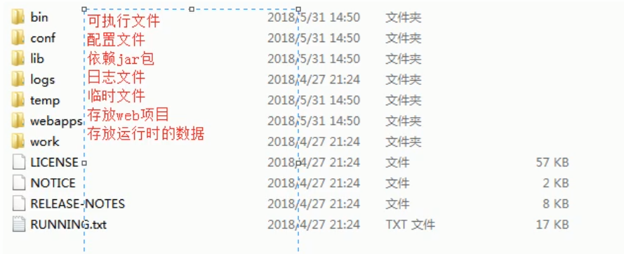
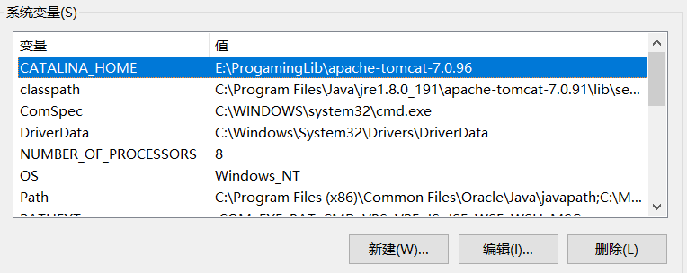
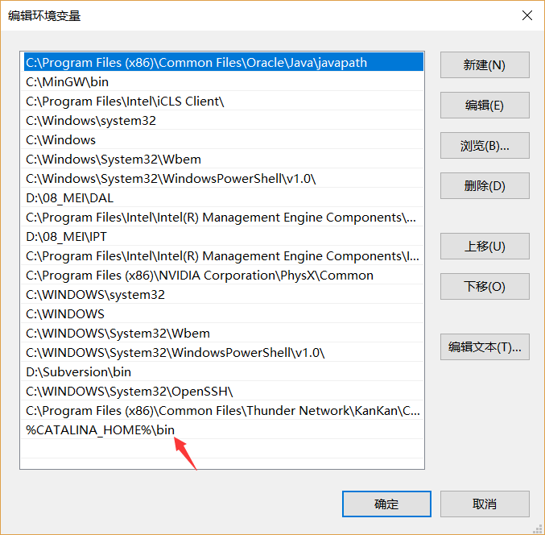
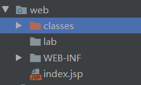
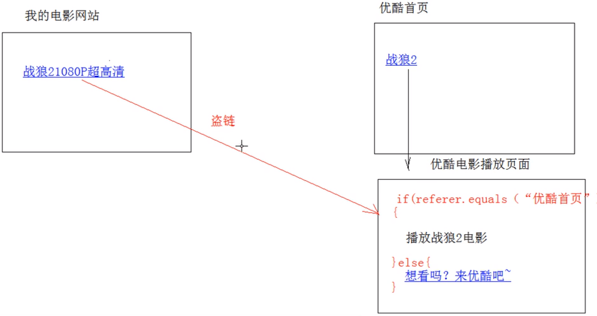
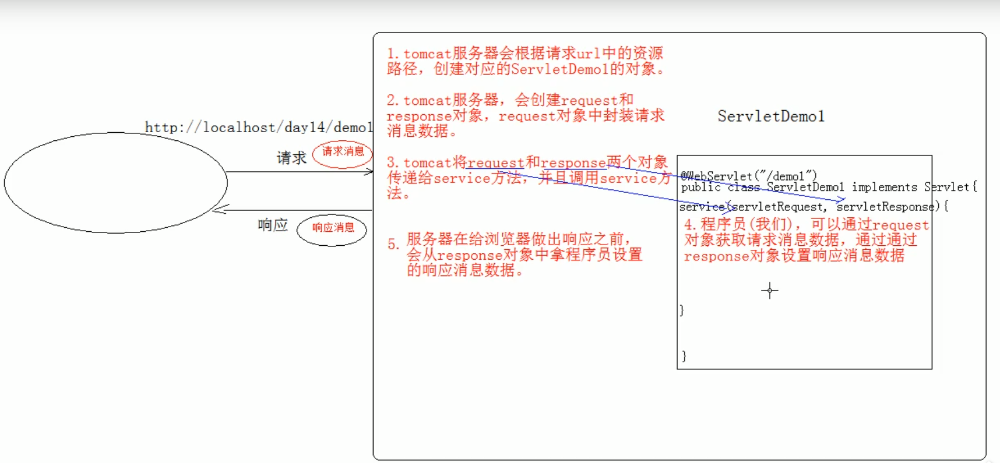
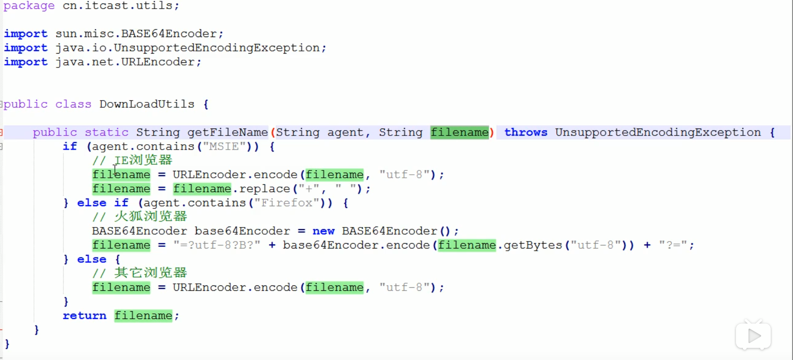
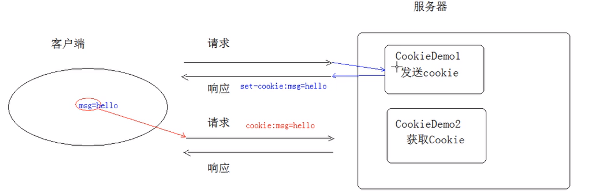

## 一、Tomcat 介绍及部署

### 1.目录结构



### 2.启动

启动bin目录下startup.bat即可。

### 3.配置环境变量

 1).系统变量新建CATALINA_HOME:tomcat安装目录：



2).系统变量Path增加目录：%CATALINA_HOME%/bin;   



3).修改自身端口号：tomcat目录`/config/server.xml`文件


4).关闭Tomcat

* 运行 ：`/bin/shutdown.bat`

* `ctrl + c`

### 4.部署项目

* 法一：将项目目录放到tomcat目录`/webapps/`

* 法二：项目war包放到`/webapps`目录下

* 法三：在`conf/server.xml`文件的`<Host>`标签配置（不安全）

  > ```xml
  > <Context docBase="D:\hello" path="/hehe"/>
  > ```
  >
  >  docBase:项目存放路径
  >
  >  path：虚拟目录

* 法四：在`conf/Catalina/localhost`创建任意名称的`xml`文件，在文件中编写**（推荐）**

  > ```xml
  > <Context docBase="D:\hello"/>
  > ```
  >
  > 此时的虚拟目录：xml文件名
  >
  > docBase:项目存放路径

## 二、Servlet介绍

### 1.配置Servlet

在项目web/WEB-INF/web.xml文件中添加新的`<servlet>`标签和`<servlet-mapping>`标签

```xml
<?xml version="1.0" encoding="UTF-8"?>
<web-app xmlns="http://xmlns.jcp.org/xml/ns/javaee"
         xmlns:xsi="http://www.w3.org/2001/XMLSchema-instance"
         xsi:schemaLocation="http://xmlns.jcp.org/xml/ns/javaee http://xmlns.jcp.org/xml/ns/javaee/web-app_4_0.xsd"
         version="4.0">
    <servlet>
        <servlet-name>ServletTest</servlet-name>
    <!-- 要写全类名 -->
        <servlet-class>cn.ServletTest</servlet-class>
    </servlet>
    <!-- 配置映射 -->
    <servlet-mapping>
        <!--   名字 -->
        <servlet-name>ServletTest</servlet-name>
        <!--- 访问路径 -->
        <url-pattern>/ServletTest</url-pattern>
    </servlet-mapping>
</web-app>
```

### 2.Servlet作用原理


### 3.servlet生命周期

```java
/* 
	*初始化方法
	*Servlet 被创建时只会执行一次
*/
public void init(ServletConfig servletConfig) throws ServletException{  
}

/*
	*提供服务的方法
	*Servlet被访问时提供服务，执行多次
*/
public void service(ServletRequest servletRequest, ServletResponse servletResonse) throws ServletException, IOException{
}
	
/*
	*销毁方法
	*服务器正常关闭时执行一次
*/
public void destroy(){
}
```

> 控制Servlet创建时机：
>
> ```xml
> <servlet>
>     <servlet-name>ServletTest</servlet-name>
> 
>     <!-- 要写全类名 -->
>     <servlet-class>cn.ServletTest</servlet-class>
>         
>     <!-- 指定Servlet的创建时机
>         1.第一次使用时，创建
>             <load-on-startup>的值为负数
>         2.在服务器启动时，创建
>             <load-on-startup>的值为0或正整数 
>     -->
>         
>     <load-on-startup>-1</load-on-startup>
> </servlet>
> ```

*Serlvet* 的`init`方法，只执行一次，说明*Servlet*在内存中只存在一个对象，*Servlet*是单例的。

* 多个用户同时访问时，可能存在线程安全问题。
* 解决：尽量不要在Servlet中定义成员变量。

### 4.Servlet 3.0

> Serlvet 3.0支持注解配置，可以不需要web.xml了。

步骤：

* 创建JavaEE项目， 选择Servlet的版本3.0以上，可以不创建web.xml
* 定义一个类，实现Servlet接口
* 复写方法
* 在类上使用`@WebServlet`注解，进行配置

> JavaEE 6.0以上支持Servlet 3.0

Servlet相关配置

1. urlPartten:Servlet访问路径
   * 一个`Servlet`可以定义多个访问路径：`@WebServlet(urlPartten={"/d1", "/d2", "/d3"})`
   * 路径定义规则:
     1. /xxx
     2. /xxx/xxx:多层路径，目录结构
     3. *.do

### 5.Servlet体系结构

`Servlet` 接口 ----> `GenericServlet` 抽象类 ------> `HttpServlet`抽象类

* `GenericSetvlet`:将Servlet接口其它方法进行了默认实现，只将`service()`方法作为抽象
* `HttpServlet`:对http协议的一种封装，简化操作
  1. 定义类继承`HttpServlet`
  2. 复写`doGet()`和`doPost()`方法

## 三、Tomcat 和IDEA

* IDEA 会为每一个Tomcat部署的项目单独建立一份配置文件

  查看控制台的*Using CATALINA_BASE:   "C:\Users\shangjin\.IntelliJIdea2019.2\system\tomcat\Tomcat_7_0_91_JavaWebLearn"*

* *工作空间项目*  和  *Tomcat部署的Web项目*

  Tomcat真正访问的是 *Tomcat部署的Web项目*，*Tomcat部署的Web项目*对应*工作空间项目*的`web`目录下的所有资源。

  

  *WEB-INF*目录下的资源不能!被浏览器直接访问。

* 断点调试使用*debug启动*

## 四、HTTP协议

> Hyper Text Transfer Protocol 超文本传输协议

特点：

* 基于TCP/IP的高级协议
* 默认端口号：80
* 基于请求/相应模型的一次请求对应一次相应
* 无状态的协议：每次请求之间相互独立

历史版本：

​      1.0 : 每次请求都会建立新的连接

​      1.1：复用连接

### 1.请求数据格式

1. 请求行

   请求方式  请求url 请求协议/版本 

   GET /login.html HTTP/1.1

   * 请求方式：

     GET:

     1. 请求参数在请求行中，在url后
     2. 请求的url长度有限制
     3. 不太安全

     Post:

     1. 请求参数在请求体中
     2. 请求的url长度没有限制
     3. 相对安全

2. 请求头：客户端浏览器告诉服务器一些信息

   请求头的名称： 请求头值

   常见请求头：

   1. User-Agent: 浏览器告诉服务器，浏览器的版本

   2. Referer: http://localhost/login.html

      告诉服务器我从哪里来

      作用：

      1. 防盗链

         

      2. 统计工作

3. 请求空行：分割POST请求的请求头和请求体

4. 请求体：

   封装POST请求消息的请求参数

5. 字符串格式：

   ```http
   User-Agent: Mozilla/5.0 (Windows NT 10.0; Win64; x64; rv:70.0) Gecko/20100101 Firefox/70.0
   Accept: text/html,application/xhtml+xml,application/xml;q=0.9,*/*;q=0.8
   Accept-Language: zh-CN,zh;q=0.8,zh-TW;q=0.7,zh-HK;q=0.5,en-US;q=0.3,en;q=0.2
   Accept-Encoding: gzip, deflate, br
   Referer: https://union-click.jd.com/jdc?e=&p=AyIGZRprFDJWWA1FBCVbV0I
   Connection: keep-alive
   Upgrade-Insecure-Requests: 1
   ```
### 2.响应格式数据格式
   响应消息：服务器端发送给客户端的数据

   数据格式：

   1. 响应行
   
      * 组成：协议/版本 相应状态码 状态码描述
      
      * 响应状态码：服务器告诉客户端本次请求和相应的状态
      
        * 状态码都是三位数字
        
        * 分类
        
          * 1XX:服务器接收客户端消息，但没有接收完成，等待一段时间后，发送1XX多状态码
        
          * 2XX：成功。 代表：200
        
          * 3XX:重定向。 代表：302(重定向) 304(访问缓存)
        
          * 4xx:客户端错误。 代表：404（无对应请求资源）405（请求方式没有对应的doXX方法）
        
          * 5xx:服务器端错误。 
        
            代表：500（服务器端异常）
   
   2. 响应头
   
      格式：头名称：值
   
      常见响应头
   
      * Content-Type:服务器告诉客户端本次相应体数据格式以及编码
      
      * Content-dispostion:服务器告诉客户端以什么格式打开响应体数据
      
        值：
      
        1. inline:默认值，在当前页面打开
        2. attachment;filename=xxx:以附件形式打开响应体。（文件下载）
   
   3. 相应空行
   
   4. 响应体:真是的传输数据

   响应字符串格式

   ```
   HTTP/2.0 200 OK
   
   Content-Type:text/html;charset=UTF-8
   
   Content-Length:101
   
   Date: Wed, 06 JUN 2018 07:08:42 GMT
   
   <html>
   	<head>
   	</head>
   <html/>
   ```

### 3.request和response原理



1. response 和request对象是由服务器创建的，我们使用他们
2. request获取请求消息，response设置响应消息

### 4.request对象继承体系结构

ServletRequest        --接口

​     |    继承

HttpServletRequest  --接口

​     |   实现

org.apache.catalina.connector.RequestFacade类 （tomcat)

### 5.request对象的功能

1. 获取请求消息数据

   * 获取请求行数据

     * GET /cn/demo?name=zhangsan HTTP/1.1

     * 方法：

       1. 获取请求方式：GET

          `String getMethod()` 
          
    2. **获取虚拟目录**：/cn
       
       `String getContextPath()`
       
       3. 获取Servlet路径： /demo1
       
          `String getServletPath()`
       
       4. 获取get方式的请求参数：name=zhangsan
       
          `String getQueryString()`
       
       5. **获取请求URL**:/cn/demo
       
          `String getRequestURI()`:/cn/demo
       
          `StringBuffer getRequestURL()`: http://localhost/cn/demo
       
       6. 获取协议及其版本
       
          `String getProtocol()`
       
       7. 获取客户机的IP地址
       
          `String getRemoteAddr()`
   
   
   * 获取请求头数据
   
     方法：
   
     * **`Sttring getHeader(String name)`**:通过请求头的名称获取请求头的值
   
     * `Enumeration<String> getHeaderNames()`:获取所有请求头名称
   
       ```java
       protected void doGet(HttpServletRequest request, HttpServletResponse response) throws ServletException, IOException {
           Enumeration<String> head = request.getHeaderNames();
           while(head.hasMoreElements()){
               String name = head.nextElement();
           }
       }
       ```
   
       
   
   * 获取请求体数据
   
     请求体：只有POST请求方式，才有请求体，在请求体重封装了POST请求的请求参数。
   
     步骤：
   
     * 获取流对象
   
       `BufferedReader getReader()`:获取字符输入流(只能操作字符数据)
   
       ```java
       protected void doPost(HttpServletRequest request, HttpServletResponse response) throws ServletException, IOException {
           BufferedReader br = request.getReader();
           String line = br.readLine();
           while(line != null){
               System.out.println(line);
               line = br.readLine();
           }
       }
       ```
   
       `ServletInputStream getInputStream()`:获取字节输入流（可以操作所有类型数据）
   
     * 再从流对象中获取数据
   
   * 其它功能
   
     * 获取请求参数**通用**方式:不论get还是post方式都可以
   
       1. `String getParameter(String name)`:根据参数名称获取参数值 username=zs&passwd=123
   
       2. `String[] getParameterValues(String name)`:根据参数名称获取参数值的数组 hobby=xx&hobby=game(复选框等)
   
       3. `Enumeration<String> getParameterNames()`:获取所有请求参数名
   
       4. `Map<String, String[]> getParameter`:获取所有请求参数键值对的结合。
   
          中文乱码问题：
   
          * Tomca 8.0已经将**get**方式请求中文乱码问题解决。
   
          * post方式乱码：获取参数前设置request的编码
   
            ```java
            request.setCharacterEncoding("utf-8");
            ```
   
     * 请求转发:一种在服务器内部资源跳转的方式
   
       步骤：
   
       1. 通过request对象获取请求转发器对象：`RequestDispatcher getRequestDispatcher(String path)`
       2. `使用RequestDispatcher`对象进行转发:`forward(ServletRequest req, ServletResponse res)`
   
       特点：
   
       1. 浏览器地址栏路径没有发生变化
       2. 只能转发到当前服务器内部资源中
       3. 转发是同一次请求
   
     * 共享数据：
   
       **域对象**：一个有作用范围的对象，可以在范围内共享数据
   
       requestq域：代表一次请求范围，一般用于请求转发的多个资源中共享数据。
   
       方法：
   
       1. `void setAttribute(String name, Object obj)`
       2. `Object getAttribute(String name, Object obj)`
       3. `void removeAtrribute(String name)`
   
     * 获取ServletContext:`getServlertContext()`

### 6.BeanUtils工具类

用于封装JavaBean。

1. JavaBean:标准的Java类

   * 要求：
     1. 类必须被pulic 修饰
     2. 必须提供空参的构造器
     3. 成员变量必须使用private修饰
     4. 提供公共setter()和gettter()方法
   * 功能：封装数据

2. 常用方法：

   `populate(Object obj, Map map)`:将map结合的简直信息封装到对应的JavaBean对象中。

### 7.Response对象

功能：设置响应信息

1. 设置响应行

   * 格式 HTTP/1.1 20 OK
   * 设置状态码： `setStatus(int sc)`

2. 设置响应头:`setHeader(String name, String value)`：

3. 设置响应体

   使用步骤

   * 获取输出流

     字符输出流: `PrintWriter getWriter()`

     ```java
     response.getWriter().write("Something");
     ```

     字节输出流：`ServletOutputStream getOutputStream()`

     ```java
     response.getOutputStream().write("你好".getBytes());
     ```

4. 中文乱码问题

   ```java
   //方法1.告诉浏览器使用该编码解码
   response.setHeader("content-type", "text/html;charset=utf-8");
   
   //方法2.简单写法
   response.setContentType("text/html;charset=utf-8");
   ```

5. 重定向特点

   ```Java
   //重定向举例
   
   //1.重定向方式1
   response.setStatus(302);
   response.setHeader("location", "/cn/JavaWeb/demo");
   
   //2.重定向方式2
   response.sendRedirect("/cn/JavaWeb/demo");
   ```

   特点（注意和转发的对比）：

   * 地址栏发生变化（转发不变）
   * 重定向可以访问其他站点的资源（转发不能）
   * 重定向是两次请求（转发是一次请求）

### 8.相对路径和绝对路径

动态获取虚拟目录：

```Java
String path = request.getContextPath();
```

JSP中获取虚拟目录：

```JSP
${pageContext.request.contextPath}
```

### 9.验证码示例

```java
protected void doPost(HttpServletRequest request, HttpServletResponse response) throws ServletException, IOException {
    int width = 100;
    int height = 50;
    //1.创建一个对象，在内存中的图片
    BufferedImage image = new BufferedImage(width, height, BufferedImage.TYPE_INT_RGB);
    //2.美化图片
    Graphics g = image.getGraphics();//画笔对象
    g.setColor(Color.pink);//画笔颜色
    g.fillRect(0,0, width, height);//填充背景色

    //2.2画边框
    g.setColor(Color.blue);
    g.drawRect(0, 0, width - 1, height - 1);
    //2.3写验证码
    String str = "ABCDEFGHIJKLMNOPQRSTUVWXYZabcdefghijklmnopqrstuvwxyz1234567890";
    //生成随机角标
    Random ran = new Random();
    for(int i = 1; i <= 4; i++){
        int index  = ran.nextInt(str.length());
        //获取字符
        char ch = str.charAt(index);
        //写验证码
        g.drawString(ch+ "", width/5 * i, height / 2);
    }
    //2.4画干扰线
    g.setColor(Color.green);
    for(int i = 0; i < 10; i++){
        //生成随机坐标点
        int x1 = ran.nextInt(width);
        int y1 = ran.nextInt(height);
        int x2 = ran.nextInt(width);
        int y2 = ran.nextInt(height);
        g.drawLine(x1, y1, x2, y2);
    }
    //3.将图片输出到页面展示
    ImageIO.write(image, "jpg", response.getOutputStream());
}
```

```jsp
<%@ page contentType="text/html;charset=UTF-8" language="java" %>
<html>
  <head>
    <title>$Title$</title>
    <script type="text/javascript">
      window.onload = function (){
        var img = document.getElementById("checkCode");
        img.onclick = function (){
          var date = new Date().getTime();
          img.src = "${pageContext.request.contextPath}/ServletTest?" + date;
        }
      }
    </script>
  </head>
  <body>
  
  </body>
</html>

```

## 五、ServletContext对象

1. 概念：代表整个Web应用，可以和程序的容器（服务器）来通讯

2. 获取

   * 通过request对象获取

     ```java
     reqeust.getServletContext();
     ```

   * 通过HttpServlet获取

     ```
     getServletContext();
     ```

3. 功能：

   * 获取MIME类型:在互联网通信过程中定义的一种文件数据格式

     格式：大类型/小类型   例：text/html

     获取：`getMimeType()`

     ```java
     protected void doPost(HttpServletRequest request, HttpServletResponse response) throws ServletException, IOException {
         String filename = "a.jpg";
         ServletContext context = this.getServletContext();
         String mimeType = context.getMimeType(filename);//image/jpg
     }
     ```

   * 域对象：共享数据

     1. setAttribute(String name, Object value)
     2. getAttribute(String name)
     3. removeAttribute(String name)

     SetvletContext对象范围：所有用户所有请求的数据

   * 获取文件的真实（服务器）路径

     ```java
     String realPath = context.getRealPath("/b.txt");//参数为web目录下的资源路径
     String realPath = context.getRealPath("/WEB-INF/c.txt");//参数为WEB-INF目录下的资源访问
     String realPath = context.getRealPath("/WEB-INF/classes/a.txt");//src目录下的资源访问
     ```


### 1. 文件下载实现

步骤：

1. 定义界面，编辑超链接href属性，指向Servlet, 传资源名filename

2. 定义Servlet

   * 获取文件名

   * 使用字节输入流加载文件进内存

   * 指定response的响应头：content-disposition:attchment;filename=xxx

   * 将数据写出到response输出流

     *1.png*位于web根目录下

     JSP文件如下

     ```html
   <%@ page contentType="text/html;charset=UTF-8" language="java" %>
       <html>
          <head>
               <title>$Title$</title>
          </head>
         <body>
         <a href="${pageContext.request.contextPath}/DownloadServlet?filename=1.jpg">
           图片
         </a>
         </body>
       </html>
     ```
     
     
   
     DownloadServlet类如下
   
     ```java
     
     ```
   
   @WebServlet("/DownloadServlet")
     public class DownloadServlet extends HttpServlet {
      protected void doPost(HttpServletRequest request, HttpServletResponse response) throws ServletException, IOException {
             //1.获取请求参数（文件名称）
          String filename = request.getParameter("filename");
             //2.使用字节输入流加载文件进内存
             //2.1找到文件服务器路径
             ServletContext sc = this.getServletContext();
             String realPath = sc.getRealPath("/" + filename);
             //2.2用字节流关联
             FileInputStream fileInputStream = new FileInputStream(realPath);
             //3.设置response的响应头
             //3.1设响应头类型
             response.setHeader("content-type", sc.getMimeType(filename));
             //3.2设置响应头打开方式
             response.setHeader("content-disposition", "attachment;filename="+ filename);
             //4.将输入流的数据写入到输出流中
             ServletOutputStream sos = response.getOutputStream();
             byte[] buff = new byte[1024 * 8];
             int len = fileInputStream.read(buff);
             while(len != -1){
                 sos.write(buff, 0, len);
                 len = fileInputStream.read(buff);
             }
             fileInputStream.close();
   
         }
         protected void doGet(HttpServletRequest request, HttpServletResponse response) throws ServletException, IOException {
             doPost(request, response);
         }
     }
     ```
   
     问题：中文文件名乱码
   
     1. 获取客户端使用浏览器信息
     2. 根据不同的版本信息，设置filename的编码方式不同
   
     ```

  

## 六、会话技术

 功能：在一次会话的范围内的多次请求间共享数据

方式：

1. 客户端会话技术：Cookie
2. 服务器端会话技术：Session

### 1.Cookie 

快速入门：

1. 创建Cookie对象，绑定数据

   ```java
   new Cookie(String name, String value);
   ```

2. 发送Cookie对象

    ```java
   response.addCookie(Cookie cookie)
   ```

3. 获取Cookie,拿到数据

   ```java
   Cookie[] request.getCookies()
   ```

实现原理：



Cookie细节：

1. 可发送多个cookie

2. cookie在浏览器中保存

   * 默认情况下，当浏览器关闭后，Cookie数据关闭

   * 设置Cookie生命周期

     ```java
     setMaxAge(int seconds);
     //1.正数：将Cookie数据写到硬盘晚间，持久化
     //2.负数：浏览器关闭后Cookie删除
     //3.0:删除Cookie
     ```

   * Cookie存储中文：

     * tomcat 8之前，cookie中不能直接存储中文数据
     * tomcat 8之后，cookie可以存储中文数据
   
   * Cookie的共享问题
   
     * 默认不能共享
   
     * 在一个tomcat服务器中，部署了多个项目，如果要共享，可以将path设置为“/”
   
       ```java
       setPath(String path);
       //设置Cokie的取值范围，默认为当前虚拟目录
       ```
   
     * 不同的tomcat服务器间共享cookie
   
       ```java
       setDomain(String path);
       //如果设置一级域名相同，那么多个服务器间cookie可以共享
       
       //setDomain(".baidu.com"),那么tieba.baidu.com 和news.baidu.com中cookie可以共享
       ```
   
3. Cookie 的特点和作用

   * cookie存储在客户端浏览器
   * 浏览器对单个cookie的大小有限制（4kb)， 对同一域名下的总Cookie数量也有限制（20）
   * 作用
     * 存储少量不太敏感的数据
     * 在不登录的情况下，保存对客户端的设置。

### 2.Session 

服务器端会话技术，在一次对话的多次请求间共享数据，将数据保存到服务器端的对象中。

快速入门：

* 获取HttpSession对象

  HttpSession session = request.getSession()

* 使用Session对象

1. getAttribute()
2. setAttribute()
3. removeAttribute()

实现原理：


Session细节：

1. 客户端关闭后，服务器不关闭，两次获取Session是否同一个？

   * 默认不是（客户端关闭，会话关闭）

     ```java
     HttpSession session = request.getSession();
     
     //期望客户端关闭后，session也能相同
     Cookie cookie = new Cookie("JSESSIONID", session.getId());
     c.setMaxAge(60*60); //一个小时
     response.addCookie(cookie);
     ```

2. 客户端不关闭，服务器关闭后，两次获取的session是同一个吗？

   * 不是同一个，但是要确保数据不丢失

     session的钝化：

     * 在服务器正常关闭之前，将session对象序列到硬盘上

     session的活化：

     * 在服务器启动后，将session文件转化为内存中的session对象即可。

     （以上tomcat服务器已经自动完成）

3. session什么时候被销毁？

   * 服务器关闭

   * session对象调用invalidate()方法

   * session默认失效时间 ：30分钟

     配置文件的：

     ```xml
     <session-config>
     	<session-timeout>
         30
         </session-timeout>
     </session-config>
     ```

Seesion的特点：

1. session用于存储一次会话的多次请求数据，存在服务器端。
2. session可以存储任意类型，任意大小的数据。
3. session相对安全。

## 七、JSP

> JSP本质上就是一个Servlet.

JSP脚本：

1. <% 代码 %>: 定义java代码，在service方法方法中。Service方法中可以定义什么，就可以定义什么。
2. <%! 代码 %> 定义java方法，在jsp转化java类的成员位置。
3. <%= 代码 %> 定义的代码会输出到页面上，输出语句定义什么，就可以定义什么。

JSP内置对象：

在JSP页面中不需要获取和创建，可以直接使用对象。

一共9个内置对象。

1. requese

2. response:输出永远

3. out：字符输出流对象。可以直接将数据输出到页面上，和response.getWriter()类似。

   response.getWriter()数据输出永远在out.write()之前

### 1.指令

* 作用：用于配置JSP页面，导入文件

* 格式：

  ```jsp
  <%@ 指令名称 属性名1=属性值 属性名2=属性值 ... %>
  ```

* 分类：

  1. page: 配置JSP界面。

     * contentType:等同于response.setContentType（）
       1. 设置响应体的mime类型以及字符集
       2. 设置当前jsp页面的编码（只能是高级开发工具才能生效）
       3. import：导包
       4. errorPage:当前页面发成异常后，会自动跳转到指定的错误页面
       5. isErrorPage:表示当前是否是errorPage
          * true:是，可以使用内置对象exception
          * false:否，默认值

  2. include： 页面包含的。 导入页面的资源文件

     ```jsp
     <%@include file="top.jsp">
     ```

  3. taglib: 导入资源(导入JSTL标签库)

     ```jsp
     <%@ taglib prefix="c" uri="http://java.sun.com/jsp/jstl/core" %>
     //prefix：前缀，自定义的
     ```

* 注释：

  * <!--    -->:只能注释html代码片段
  * <%-- --%>: 可注释所有

* 内置对象：

  ​      变量名                           真实对象                              作用

  1. pageContext:             PageContext               当前页面共享数据（可获取其它8个对象）
  2. request:                      HttpServletRequest   一次请求访问的多个资源（转发）
  3. session:                      HttpSession               一次会话的多个请求间
  4. application              ServletContext              所有用户间共享数据
  5. response                 HttpServletResponse   相应对象
  6. page                         Object                            当前页面对象（Servlet)
  7. out                            JSPWriter                     输出对象，数据输出到页面上
  8. config                       ServletConfig              Servlet的配置对象
  9. exception(为errorPage是可用): Throwable      异常对象

## 八、EL表达式

语法：${表达式}

JSP默认支持EL表达式

* 设置jsp中page指令中：`isELIgnored = true`忽略当前JSP界面中的所有EL表达式
* \\${表达式}:忽略当前这个EL表达式

使用：

1. 运算

   * 运算符：
     1. 算数运算符： +-*/%
     2. 比较：> < >= == != <=
     3. 逻辑运算符：&& || ！
     4. 空运算符：empty

2. 获取值

   1. el表达式只能从域对象中获取值

   2. 语法

      * ${域名.键名}：从指定域中获取值

        域名城：

        1. pageScope	--->	pageContext
        2. requesScope --->    request
        3. sessionScope --->   session
        4. applicationScope---> application(ServletContext)

      * ${键名}：表示依次从最小的域中查找该键对应的值，知道找到为止

      * 获取对象、List集合、Map集合的值

        1. 对象：${域名城.键名.属性名}

           本质上去调用对象的getter方法

        2. List集合：${域名称.键名[索引]}

        3. Map集合：${域名称.键名.key}

           ​					${域名称.键名["key"]}

3. 隐式对象

   用pageContext获取其它八个。

   常用：

   ```jsp
   ${pageContext.request.contextPath}
   ```

## 九、JSTL

用于简化或替换jsp界面上的java代码。

使用步骤：

1. 导入jstl相关jar包
2. 导入标签库:<%@ taglib prefix="c" uri="http://java.sun.com/jsp/jstl/core" %>

### 常用JSTL标签

1. if	:相当于java的if

   * 属性：

     test 必须属性，接收boolean表达式

     * 如果表达式为true,则显示if标签内内容。
     * 一般情况下，test属性值或结合el表达式一起使用

   * 注意：if没有else标签

2. choose:相当于java的switch

   ```jsp
   <c:choose>
   	<c:when test="${表达式}"></c:when>
       <c:when test="${表达式}"></c:when>
       <c:otherwise></c:otherwise>
   </c:choose>
   ```

3. foreach：相当于java的for

   ```jsp
   <!-- 普通循环 -->
   <c:foreach begin="1" end="10" var="i" step="1"></c:foreach>
   ```

   begin:开始值

   end:结束值

   var:临时变量

   step:步长

   varStatus:循环状态变量

   * index:容器中元素索引，从0开始
   * count:循环次数，从1开始

   ```jsp
   <!-- 遍历容器 -->
   <%
   List list = new ArrayList();
   list.add("aaa");
   list.add("bbb");
   %>
   
   <c:foreach items="${list}" var="str" varStatus="s">
   	${s.index} ${s.count} ${str}
   </c:foreach>
   ```

## 十、Filter

作用：一般完成一些通用的操作。如：登录验证、统一编码、敏感字符过滤。

### 快速入门

1. 步骤：定义一个类，实现接口Filter
2. 复写方法
3. 配置拦截路径

> ```java
> @WebFilter("/*")//拦截所有访问
> ```

### 过滤器细节

1. web.xml配置：

   ```xml
   <filter>
       <filter-name>Filter</filter-name>
       <filter-class>cn.Filter</filter-class>
   </filter>
   
   <!-- 映射路径 -->
   <filter-mapping>
       <filter-name>Filter</filter-name>
       <url-pattern>/*</url-pattern>
    </filter-mapping>
   ```

2. 生命周期

   服务器启动后，创建Filter对象，调用`init`方法

   服务器关闭后，销毁Filter对象，调用`destroy`方法

   在每一次拦截请求资源时执行一次`doFilter`方法

3. 过滤器配置

   * 拦截路径配置：

     1. 具体资源路径： /index.jsp ：只访问index.jsp资源时，拦截器才会被执行
     2. 拦截目录： /user/* ： 访问/user目录下所有资源时，过滤器被执行
     3. 后缀名拦截： *.jsp ： 访问所有后缀名为jsp资源时，过滤器被执行
     4. 拦截所有资源：/*

   * 过滤方式配置：资源被访问的方式

     1. 注解配置：

        * 设置dispatchType属性
          1. REQEUST:默认值。浏览器世界请求资源
          2. FORWARD: 转发访问资源
          3. \*INCLUDE：包含访问资源
          4. \*ERROR:错误跳转资源
          5. \*ASYNC:异步访问资源

        xml配置：

        ```xml
        <filter>
        <filter-name>Filter</filter-name>
        <filter-class>cn.Filter</filter-class>
        </filter>
        <filter-mapping>
        <filter-name>Filter</filter-name>
        <url-pattern>/*</url-pattern>
        <dispatcher>
            REQUEST
        </dispatcher>
        <dispatcher>
            FORWARD
        </dispatcher>
        </filter-mapping>
        ```

        注解配置：

        > ```java
        > @WebFilter(value = "/index.jsp", dispatcherTypes = {DispatcherType.REQUEST, DispatcherType.FORWARD})
        > ```

1. 拦截方式配置
   * 执行顺序：多个过滤器依次执行
   * 先后顺序：
     1. 注解配置：按照类名的字符串比较，值小的先执行
     2. web.xml配置：谁定义在上面，谁先执行

## 十一、动态代理

略

## 十二、监听器

监听器机制：

1. 事件： 一件事情
2. 事件源： 事情发生的地方
3. 监听器：一个对象
4. 注册监听：将事件、事件源、监听器绑定在一起。当事件发生后，执行监听器代码。

ServletContextListener: 监听ServletContext对象的创建和销毁

* `void contextDestroyed(ServletContextEvent sce)`:ServletContext对象被销毁之前调用该方法
* `void contextInitialized(ServletContextEvent sce)`:ServletContext对象被创建后调用该方法

步骤：

1. 定义一个类，实现ServletContextListener接口

2. 复写方法

3. 配置

   * web.xml配置
   * 注解配置

4. 动态加载配置文件示例：

   web.xml下添加标签

   ```xml
   <context-param>
       <param-name>contextConfigLocation</param-name>
       <param-value>/WEB-INF/confi.xml</param-value>
   </context-param>
   ```

   监听器代码：

   ```java
   public void contextInitialized(ServletContextEvent sce) {
    /* This method is called when the servlet context is
        initialized(when the Web application is deployed). 
        You can initialize servlet context related data here.
     */
     //1.获取ServletContext对象
       ServletContext servletContext = sce.getServletContext();
       //2.加载资源文件
       String contextConfigLocation = servletContext.getInitParameter("contextConfigLocation");
   
       //3.获取真实资源路径
       String realPath = servletContext.getRealPath(contextConfigLocation);
   
       //4.加载进内存
       try {
           FileInputStream fis = new FileInputStream(realPath);
       } catch (FileNotFoundException e) {
           e.printStackTrace();
       }
   }
   ```

   

## 十三、（附）c3p0配置文档编写

```xml

<?xml version="1.0" encoding="UTF-8"?>
<c3p0-config>
	<!-- 这是默认配置信息 -->
	    <default-config>
        <!-- 连接四大参数配置 -->
        <property name="jdbcUrl">jdbc:mysql://localhost:3306/OnlineTestSystem?serverTimezone=Asia/Shanghai&amp;useSSL=false</property>
        <property name="driverClass">com.mysql.cj.jdbc.Driver</property>
        <property name="user">root</property>
        <property name="password">111111</property>
        <!-- 池参数配置 -->
        <property name="acquireIncrement">3</property>
        <property name="initialPoolSize">10</property>
        <property name="minPoolSize">2</property>
        <property name="maxPoolSize">10</property>
    </default-config>
	
	<!-- 专门为oracle提供的配置信息 -->
	<named-config name="oracle-config">
	<property name="jdbcUrl">jdbc:mysql://localhost:3306/mydb1</property>
	<property name="driverClass">com.mysql.jdbc.Driver</property>
	<property name="user">root</property>
	<property name="password">123</property>
	<property name="acquireIncrement">3</property>
	<property name="initialPoolSize">10</property>
	<property name="minPoolSize">2</property>
	<property name="maxPoolSize">10</property>
	</named-config>
</c3p0-config>
```

数据库工具类编写

```java
import java.sql.Connection;
import java.sql.SQLException;

import javax.sql.DataSource;
import com.mchange.v2.c3p0.ComboPooledDataSource;

/**
 * @ClassName DataSourceUtils
 * @Desciption TODO
 * @Author shangjin
 * @Date 2019-11-28 21:26
 * @Version 1.0
 **/
public class DataSourceUtils {
    private static DataSource dataSource = new ComboPooledDataSource();
    private static ThreadLocal<Connection> tl = new ThreadLocal<Connection>();

    public static DataSource getDataSource() {
        System.out.println("getdatasource");
        return dataSource;
    }

    public static Connection getConnection() throws SQLException {
        Connection con = tl.get();
        if (con == null) {
            con = dataSource.getConnection();
            tl.set(con);
        }
        return con;
    }

    public static void startTransaction() throws SQLException {
        Connection con = getConnection();
        if (con != null) {
            con.setAutoCommit(false);
        }
    }

    public static void releaseAndCloseConnection() throws SQLException {
        Connection con = getConnection();
        if (con != null) {
            con.commit();
            tl.remove();
            con.close();
        }
    }

    public static void rollback() throws SQLException {
        Connection con = getConnection();
        if (con != null) {
            con.rollback();
        }
    }
}
```

BaseDAO类编写（自带释放Connection）

```java
import java.lang.reflect.ParameterizedType;
import java.lang.reflect.Type;
import java.sql.Connection;
import java.util.List;
 
import org.apache.commons.dbutils.QueryRunner;
import org.apache.commons.dbutils.handlers.BeanHandler;
import org.apache.commons.dbutils.handlers.BeanListHandler;
import org.apache.commons.dbutils.handlers.ScalarHandler;
 
import com.njupt.javaweb.db.JdbcUtils;
 
/**
 * 
* 项目名称：javaWebMVCProject 
* 类名称：DAO 
* 类描述： 封装了基本的数据库增删改查（CRUD）的方法
* 		当前DAO无事务处理，直接在方法内过去连接
* 创建人：Administrator 
* 创建时间：2018年8月5日 下午6:07:43 
* 修改人：Administrator 
* 修改时间：2018年8月5日 下午6:07:43 
* 修改备注： 
* @version 1.0 
* @param <T>
 */
public class DAO<T> {
	//因为用到反射需要T的class类
	@SuppressWarnings("unused")
	private Class<T> clazz; 
	private QueryRunner queryRunner = new QueryRunner();
	/**
	 * DAO的构造器，在构造器内解析出泛型T的Class类
	 */
	public DAO() {
			Type superClass = this.getClass().getGenericSuperclass();
			if( superClass instanceof ParameterizedType ) {
				ParameterizedType parameterizedType = (ParameterizedType)superClass;
				Type [] typeArgs = parameterizedType.getActualTypeArguments();
				if( typeArgs != null && typeArgs.length > 0) {
					if( typeArgs[0] instanceof Class) {
						clazz = (Class)typeArgs[0];
					}
				}
			}
	}
	/**
	 * 获取数据库查询后的某一个字段的值，单行单列。例如获取Name字段的值，或者Count(*)记录的条数
	 * @param sql 用于执行的sql语句
	 * @param args 填充SQL语句的占位符
	 * @return 单行单列的值
	 */
	public <E> E getForValue( String sql , Object ... args ) {
		Connection connection = null;
		try {
			connection=JdbcUtils.getConnection();
			//返回数据对应的对象
			return queryRunner.query(connection,sql,new ScalarHandler<E>(),args);
		} catch (Exception e) {
			// TODO: handle exception
			e.printStackTrace();
		}finally {
			JdbcUtils.releaseConnection(connection);
		}
		return null;
	}
	/**
	 * 获取由一组T的对象构成的List
	 * @param sql 用于执行的sql语句
	 * @param args 填充SQL语句的占位符
	 * @return T的对象构成的List
	 */
	public List<T> getForList( String sql , Object ... args ){
		Connection connection = null;
		try {
			connection=JdbcUtils.getConnection();
			//返回数据对应的对象
			return queryRunner.query(connection,sql,new BeanListHandler<T>(clazz),args);
		} catch (Exception e) {
			// TODO: handle exception
			e.printStackTrace();
		}finally {
			JdbcUtils.releaseConnection(connection);
		}
		return null;
	}
	/**
	  * 获取T的实体类对象，该对象与数据库的记录相一致
	  * 因为用到反射需要T的class类
	 * @param sql 用于执行的sql语句
	 * @param args 填充SQL语句的占位符
	 * @return T的实体类对象
	 */
	public T get( String sql , Object ... args ) {
		Connection connection = null;
		try {
			connection=JdbcUtils.getConnection();
			//返回数据对应的对象
			System.out.println(connection);
			System.out.println(clazz);
			return queryRunner.query(connection,sql,new BeanHandler<T>(clazz),args);
		} catch (Exception e) {
			// TODO: handle exception
			e.printStackTrace();
		}finally {
			JdbcUtils.releaseConnection(connection);
		}
		return null;
	}
	/**
	 * 该方法封装了，INSERT,DELETE,UPDATE相关的数据库操作
	 * @param sql 用于执行的sql语句
	 * @param args 填充SQL语句的占位符
	 */
	public void update( String sql , Object ... args ) {
		Connection connection = null;
		try {
			connection=JdbcUtils.getConnection();
			queryRunner.update(connection, sql, args);
		} catch (Exception e) {
			// TODO: handle exception
			e.printStackTrace();
		}finally {
			JdbcUtils.releaseConnection(connection);
		}
	}
}
```

Spring动态代理学习回顾：Service层可以经过动态代理增强，增加事务控制功能。动态代理的增强可以在工厂类中完成。

## 十四、（附）发送邮件示例

```java
/**
 * @ClassName SendEmailUtils
 * @Desciption 发送一封邮件
 * @Author shangjin
 * @Date 2019-12-08 16:46
 * @Version 1.0
 **/
public class SendEmailUtils {
    // 发件人的 邮箱 和 密码（替换为自己的邮箱和密码）
    // PS: 某些邮箱服务器为了增加邮箱本身密码的安全性，给 SMTP 客户端设置了独立密码（有的邮箱称为“授权码”）,
    // 对于开启了独立密码的邮箱, 这里的邮箱密码必需使用这个独立密码（授权码）。

    private static String fromEmail = "shangjinv5@163.com";//发送用的email
    private static String authorization = "951780442sj";//163客户端授权码
    /**
     * @Author: Shangjin
     * @Description:发送邮件
     * @Param:
     * @Return:
     * @Date: 17:47 2019-12-08
     */
    public static void sendEmail(String toEmail, String content) throws UnsupportedEncodingException, MessagingException {
        Properties properties = new Properties();
        // 1. 创建参数配置, 用于连接邮件服务器的参数配置
        properties.setProperty("mail.transport.protocol", "smtp");// 使用的协议（JavaMail规范要求）
        //SMTP服务器地址：一般是 smtp.xxx.com，比如163邮箱是smtp.163.com，qq邮箱是smtp.qq.com。
        properties.setProperty("mail.smtp.host", "smtp.163.com");//发件人的邮箱的 SMTP 服务器地址
        properties.setProperty("mail.smtp.auth", "true");// 需要请求认证
        // PS: 某些邮箱服务器要求 SMTP 连接需要使用 SSL 安全认证 (为了提高安全性, 邮箱支持SSL连接, 也可以自己开启),
        // 如果无法连接邮件服务器, 仔细查看控制台打印的 log, 如果有有类似 “连接失败, 要求 SSL 安全连接” 等错误,
        // 打开下面 /* ... */ 之间的注释代码, 开启 SSL 安全连接。
        /*
       // SMTP 服务器的端口 (非 SSL 连接的端口一般默认为 25, 可以不添加, 如果开启了 SSL 连接,
       //   需要改为对应邮箱的 SMTP 服务器的端口, 具体可查看对应邮箱服务的帮助,
        //   QQ邮箱的SMTP(SLL)端口为465或587, 其他邮箱自行去查看)
       final String smtpPort = "465";
        props.setProperty("mail.smtp.port", smtpPort);
        props.setProperty("mail.smtp.socketFactory.class", "javax.net.ssl.SSLSocketFactory");
        props.setProperty("mail.smtp.socketFactory.fallback", "false");
        props.setProperty("mail.smtp.socketFactory.port", smtpPort);
        */

        // 2. 根据配置创建会话对象, 用于和邮件服务器交互
        Session session = Session.getDefaultInstance(properties, new Authenticator() {
            @Override
            protected PasswordAuthentication getPasswordAuthentication() {
                return new PasswordAuthentication(fromEmail,authorization );
            }
        });
        session.setDebug(true);// 设置为debug模式, 可以查看详细的发送 log

        // 3. 创建一封邮件
        MimeMessage message = createMimeMessage(session, fromEmail, toEmail, content);

        // 4. 根据 Session 获取邮件传输对象
        Transport transport = session.getTransport();

        //5. 使用 邮箱账号 和 密码 连接邮件服务器, 这里认证的邮箱必须与 message 中的发件人邮箱一致, 否则报错
        transport.connect("smtp.163.com", fromEmail, authorization);

        // 6. 发送邮件, 发到所有的收件地址, message.getAllRecipients() 获取到的是在创建邮件对象时添加的所有收件人, 抄送人, 密送人
        transport.sendMessage(message, message.getAllRecipients());

        // 7.关闭连接
        transport.close();
    }
    /**
     * @Author: Shangjin
     * @Description:创建一个MinmeMessage对象
     * @Param:
     * @Return:
     * @Date: 17:47 2019-12-08
     */
    private static MimeMessage createMimeMessage(Session session, String sendMail, String receivemail, String content) throws UnsupportedEncodingException, MessagingException {
        //创建一封邮件
        MimeMessage message = new MimeMessage(session);

        // 设置From: 发件人
        message.setFrom(new InternetAddress(sendMail, "在线答题系统", "UTF-8"));

        //设置收件人
        message.setRecipient(MimeMessage.RecipientType.TO, new InternetAddress(receivemail, "在线答题系统用户", "UTF-8"));
        //设置邮件主题
        message.setSubject("修改密码", "UTF-8");
        //设置邮件内容
        message.setContent(content, "text/html;charset=UTF-8");
        //设置邮件时间
        message.setSentDate(new Date());
        message.saveChanges();
        return message;
    }
}

```

```xml
<?xml version="1.0" encoding="UTF-8"?>
<project xmlns="http://maven.apache.org/POM/4.0.0" xmlns:xsi="http://www.w3.org/2001/XMLSchema-instance"
         xsi:schemaLocation="http://maven.apache.org/POM/4.0.0 https://maven.apache.org/xsd/maven-4.0.0.xsd">
    <modelVersion>4.0.0</modelVersion>
    <parent>
        <groupId>org.springframework.boot</groupId>
        <artifactId>spring-boot-starter-parent</artifactId>
        <version>2.2.5.RELEASE</version>
        <relativePath/> <!-- lookup parent from repository -->
    </parent>
    <groupId>com.shj</groupId>
    <artifactId>eids</artifactId>
    <version>0.0.1-SNAPSHOT</version>
    <name>eids</name>
    <description>Demo project for Spring Boot</description>

    <properties>
        <java.version>1.8</java.version>
    </properties>

    <dependencies>
        <dependency>
            <groupId>org.springframework.boot</groupId>
            <artifactId>spring-boot-starter-jdbc</artifactId>
        </dependency>
        <dependency>
            <groupId>org.springframework.boot</groupId>
            <artifactId>spring-boot-starter-thymeleaf</artifactId>
        </dependency>
        <dependency>
            <groupId>org.springframework.boot</groupId>
            <artifactId>spring-boot-starter-web</artifactId>
        </dependency>
        <dependency>
            <groupId>org.mybatis.spring.boot</groupId>
            <artifactId>mybatis-spring-boot-starter</artifactId>
            <version>2.1.1</version>
        </dependency>

        <dependency>
            <groupId>mysql</groupId>
            <artifactId>mysql-connector-java</artifactId>
            <scope>runtime</scope>
        </dependency>
        <dependency>
            <groupId>org.projectlombok</groupId>
            <artifactId>lombok</artifactId>
            <optional>true</optional>
        </dependency>
        <!-- https://mvnrepository.com/artifact/log4j/log4j -->
        <dependency>
            <groupId>log4j</groupId>
            <artifactId>log4j</artifactId>
            <version>1.2.17</version>
        </dependency>
        <!-- https://mvnrepository.com/artifact/com.alibaba/druid -->
        <dependency>
            <groupId>com.alibaba</groupId>
            <artifactId>druid</artifactId>
            <version>1.1.20</version>
        </dependency>
        <!-- layui -->
        <dependency>
            <groupId>org.webjars.bowergithub.sentsin</groupId>
            <artifactId>layui</artifactId>
            <version>2.5.6</version>
        </dependency>
        <!-- jQuery-->
        <dependency>
            <groupId>org.webjars</groupId>
            <artifactId>jquery</artifactId>
            <version>3.4.1</version>
        </dependency>
        <!-- https://mvnrepository.com/artifact/com.alibaba/fastjson -->
        <dependency>
            <groupId>com.alibaba</groupId>
            <artifactId>fastjson</artifactId>
            <version>1.2.62</version>
        </dependency>
        <!-- 验证码 -->
        <dependency>
            <groupId>com.github.penggle</groupId>
            <artifactId>kaptcha</artifactId>
            <version>2.3.2</version>
        </dependency>
        <!-- 邮件发送 -->
        <dependency>
            <groupId>org.springframework.boot</groupId>
            <artifactId>spring-boot-starter-mail</artifactId>
        </dependency>
        <!-- https://mvnrepository.com/artifact/dom4j/dom4j -->
        <dependency>
            <groupId>dom4j</groupId>
            <artifactId>dom4j</artifactId>
            <version>1.6.1</version>
        </dependency>
        <!-- 百度人脸识别 -->
        <!-- https://mvnrepository.com/artifact/com.baidu.aip/java-sdk -->
        <dependency>
            <groupId>com.baidu.aip</groupId>
            <artifactId>java-sdk</artifactId>
            <version>4.12.0</version>
        </dependency>
        <!-- https://mvnrepository.com/artifact/com.alibaba/easyexcel -->
        <!-- 操作excel表格 -->
        <dependency>
            <groupId>com.alibaba</groupId>
            <artifactId>easyexcel</artifactId>
            <version>2.1.6</version>
        </dependency>

        <dependency>
            <groupId>org.springframework.boot</groupId>
            <artifactId>spring-boot-starter-test</artifactId>
            <scope>test</scope>
            <exclusions>
                <exclusion>
                    <groupId>org.junit.vintage</groupId>
                    <artifactId>junit-vintage-engine</artifactId>
                </exclusion>
            </exclusions>
        </dependency>
    </dependencies>

    <build>
        <plugins>
            <plugin>
                <groupId>org.springframework.boot</groupId>
                <artifactId>spring-boot-maven-plugin</artifactId>
            </plugin>
        </plugins>
    </build>

</project>

```

