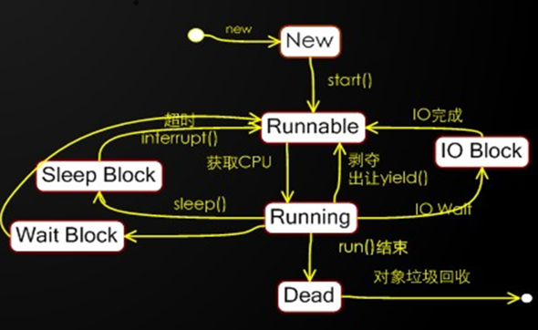

# 多线程

* 线程:一个顺序的单一的程序执行流程就是一个线程。代码一句一句的有先后顺序的执行。

* 多线程:多个单一顺序执行的流程并发运行。造成"感官上同时运行"的效果。

* 并发:
  
  多个线程实际运行是走走停停的。线程调度程序会将CPU运行时间划分为若干个时间片段并
  
  尽可能均匀的分配给每个线程，拿到时间片的线程被CPU执行这段时间。当超时后线程调度
  
  程序会再次分配一个时间片段给一个线程使得CPU执行它。如此反复。由于CPU执行时间在
  
  纳秒级别，我们感觉不到切换线程运行的过程。所以微观上走走停停，宏观上感觉一起运行的现象称为并发运行!

* 用途：
  
  * 当出现多个代码片段执行顺序有冲突时，希望它们各干各的时就应当放在不同线程上"同时"运行
  
  * 一个线程可以运行，但是多个线程可以更快时，可以使用多线程运行。

* 线程生命周期
  
  

## 1. 创建线程的两种方式

1. 继承`Thread`并重写`run`方法
   
   定义一个线程类，重写`run`方法，在其中定义线程要执行的任务(希望和其他线程并发执行的任务)。
   
   注:启动该线程要调用该线程的`start`方法，而不是`run`方法！！！
   
   ```java
   package thread;
   
   /**
    * 多线程
    * 线程:程序中一个单一的顺序执行流程
    * 多线程:多个单一顺序执行流程"同时"执行
    *
    * 多线程改变了代码的执行方式，从原来的单一顺序执行流程变为多个执行流程"同时"执行。
    * 可以让多个代码片段的执行互不打扰。
    *
    * 线程之间是并发执行的，并非真正意义上的同时运行。
    * 常见线程有两种方式:
    * 1:继承Thread并重写run方法
    *
    */
   public class ThreadDemo1 {
       public static void main(String[] args) {
           //创建两个线程
           Thread t1 = new MyThread1();
           Thread t2 = new MyThread2();
           /*
               启动线程,注意:不要调用run方法！！
               线程调用完start方法后会纳入到系统的线程调度器程序中被统一管理。
               线程调度器会分配时间片段给线程，使得CPU执行该线程这段时间，用完后
               线程调度器会再分配一个时间片段给一个线程，如此反复，使得多个线程
               都有机会执行一会，做到走走停停，并发运行。
               线程第一次被分配到时间后会执行它的run方法开始工作。
            */
           t1.start();
           t2.start();
   
       }
   }
   /**
    * 第一种创建线程的优点:
    * 结构简单，利于匿名内部类形式创建。
    *
    * 缺点:
    * 1:由于java是单继承的，这会导致继承了Thread就无法再继承其他类去复用方法
    * 2:定义线程的同时重写了run方法，这等于将线程的任务定义在了这个线程中导致
    *   线程只能干这件事。重(chong)用性很低。
    */
   class MyThread1 extends Thread{
       public void run(){
           for (int i=0;i<1000;i++){
               System.out.println("hello姐~");
           }
       }
   }
   class MyThread2 extends Thread{
       public void run(){
           for (int i=0;i<1000;i++){
               System.out.println("来了~老弟!");
           }
       }
   }
   ```
   
   优点:
   
   在于结构简单，便于匿名内部类形式创建。
   
   缺点:
   
   1. 直接继承线程，会导致不能在继承其他类去复用方法，这在实际开发中是非常不便的。
   
   2. 定义线程的同时重写了run方法，会导致线程与线程任务绑定在了一起，不利于线程的重用。

2. 实现`Runnable`接口单独定义线程任务
   
   ```java
   public class ThreadDemo2 {
       public static void main(String[] args) {
           //实例化任务
           Runnable r1 = new MyRunnable1();
           Runnable r2 = new MyRunnable2();
           //创建线程并指派任务
           Thread t1 = new Thread(r1);
           Thread t2 = new Thread(r2);
   
           t1.start();
           t2.start();
       }
   }
   class MyRunnable1 implements Runnable{
       public void run() {
           for (int i=0;i<1000;i++){
               System.out.println("你是谁啊?");
           }
       }
   }
   class MyRunnable2 implements Runnable{
       public void run() {
           for (int i=0;i<1000;i++){
               System.out.println("开门!查水表的!");
           }
       }
   }
   ```
   
   优点:
   
   - 犹豫是实现接口，没有继承冲突问题
   - 线程与任务没有耦合关系，便于线程的重用
   
   缺点:
   
   - 创建复杂一些(其实也不能算缺点)

3. 匿名内部类形式的线程创建
   
   ```java
   package thread;
   
   /**
    * 使用匿名内部类完成线程的两种创建
    */
   public class ThreadDemo3 {
       public static void main(String[] args) {
           Thread t1 = new Thread(){
               public void run(){
                   for(int i=0;i<1000;i++){
                       System.out.println("你是谁啊?");
                   }
               }
           };
   //        Runnable r2 = new Runnable() {
   //            public void run() {
   //                for(int i=0;i<1000;i++){
   //                    System.out.println("我是查水表的!");
   //                }
   //            }
   //        };
           //Runnable可以使用lambda表达式创建
           Runnable r2 = ()->{
                   for(int i=0;i<1000;i++){
                       System.out.println("我是查水表的!");
                   }
           };
       Thread t2 = new Thread(r2);
   
       t1.start();
       t2.start();
       }
   }
   ```
   
   ## 2. 获取当前线程
   
   java中的代码都是靠线程运行的，执行main方法的线程称为"主线程"。
   
   线程提供了一个方法:
   
   - `static Thread currentThread()`
     
     该方法可以获取运行这个方法的线程
     
     ```java
      public static void main(String[] args) {
         /*
             后期会学习到一个很重要的API:ThreadLocal,它可以使得我们在一个线程上跨越多个
             方法时共享数据使用，其内部要用到currentThread方法来辨别线程。
             如spring的事物控制就是靠ThreadLocal实现的。
          */
         Thread main = Thread.currentThread();//获取执行main方法的线程(主线程)
         System.out.println("线程:"+main);
     
         dosome();//主线程执行dosome方法
     
     }
     ```

## 3. 线程API

### 1. 获取线程相关信息的方法

```java
package thread;

/**
 * 获取线程相关信息的一组方法
 */
public class ThreadInfoDemo {
    public static void main(String[] args) {
        Thread main = Thread.currentThread();//获取主线程

        String name = main.getName();//获取线程的名字
        System.out.println("名字:"+name);

        long id = main.getId();//获取该线程的唯一标识
        System.out.println("id:"+id);

        int priority = main.getPriority();//获取该线程的优先级
        System.out.println("优先级:"+priority);

        boolean isAlive = main.isAlive();//该线程是否活着
        System.out.println("是否活着:"+isAlive);

        boolean isDaemon = main.isDaemon();//是否为守护线程
        System.out.println("是否为守护线程:"+isDaemon);

        boolean isInterrupted = main.isInterrupted();//是否被中断了
        System.out.println("是否被中断了:"+isInterrupted);

    }
}
```

### 2. 线程优先级

线程start后会纳入到线程调度器中统一管理,线程只能被动的被分配时间片并发运行,而无法主动索取时间片.线程调度器尽可能均匀的将时间片分配给每个线程.

线程有10个优先级,使用整数1-10表示

- 1为最小优先级,10为最高优先级.5为默认值
- 调整线程的优先级可以最大程度的干涉获取时间片的几率.优先级越高的线程获取时间片的次数越多,反之则越少.

```java
package thread;

public class PriorityDemo {
    public static void main(String[] args) {
        Thread max = new Thread(){
            public void run(){
                for(int i=0;i<10000;i++){
                    System.out.println("max");
                }
            }
        };
        Thread min = new Thread(){
            public void run(){
                for(int i=0;i<10000;i++){
                    System.out.println("min");
                }
            }
        };
        Thread norm = new Thread(){
            public void run(){
                for(int i=0;i<10000;i++){
                    System.out.println("nor");
                }
            }
        };
        min.setPriority(Thread.MIN_PRIORITY);
        max.setPriority(Thread.MAX_PRIORITY);
        min.start();
        norm.start();
        max.start();
    }
}
```

### 3. sleep阻塞

线程提供了一个静态方法:

- `static void sleep(long ms)`
- 使运行该方法的线程进入阻塞状态指定的毫秒,超时后线程会自动回到RUNNABLE状态等待再次获取时间片并发运行.

```java
package thread;

public class SleepDemo {
    public static void main(String[] args) {
        System.out.println("程序开始了!");
        try {
            Thread.sleep(5000);//主线程阻塞5秒钟
        } catch (InterruptedException e) {
            e.printStackTrace();
        }
        System.out.println("程序结束了!");
    }
}
```

sleep方法处理异常:`InterruptedException`.

当一个线程调用sleep方法处于睡眠阻塞的过程中,该线程的interrupt()方法被调用时,sleep方法会抛出该异常从而打断睡眠阻塞.

```java
package thread;

/**
 * sleep方法要求必须处理中断异常:InterruptedException
 * 当一个线程调用sleep方法处于睡眠阻塞的过程中，它的interrupt()方法被调用时
 * 会中断该阻塞，此时sleep方法会抛出该异常。
 */
public class SleepDemo2 {
    public static void main(String[] args) {
        Thread lin = new Thread(){
            public void run(){
                System.out.println("林:刚美完容，睡一会吧~");
                try {
                    Thread.sleep(9999999);//会超时，抛出InterruptException异常
                } catch (InterruptedException e) {
                    System.out.println("林:干嘛呢!干嘛呢!干嘛呢!都破了像了!");
                }
                System.out.println("林:醒了");
            }
        };

        Thread huang = new Thread(){
            public void run(){
                System.out.println("黄:大锤80!小锤40!开始砸墙!");
                for(int i=0;i<5;i++){
                    System.out.println("黄:80!");
                    try {
                        Thread.sleep(1000);
                    } catch (InterruptedException e) {
                    }
                }
                System.out.println("咣当!");
                System.out.println("黄:大哥，搞定!");
                lin.interrupt();//中断lin的睡眠阻塞
            }
        };
        lin.start();
        huang.start();
    }
}
```

### 4.守护线程

守护线程也称为:后台线程

- 守护线程是通过普通线程调用`setDaemon(boolean on)`方法设置而来的,因此创建上与普通线程无异.
- 守护线程的结束时机上有一点与普通线程不同,即:进程的结束.
- 进程结束:当一个进程中的所有普通线程都结束时,进程就会结束,此时会杀掉所有正在运行的守护线程.

```java
package thread;

/**
 * 守护线程
 * 守护线程是通过普通线程调用setDaemon(true)设置而转变的。因此守护线程创建上
 * 与普通线程无异。
 * 但是结束时机上有一点不同:进程结束。
 * 当一个java进程中的所有普通线程都结束时，该进程就会结束，此时会强制杀死所有正在
 * 运行的守护线程。
 */
public class DaemonThreadDemo {
    public static void main(String[] args) {
        Thread rose = new Thread(){
            public void run(){
                for(int i=0;i<5;i++){
                    System.out.println("rose:let me go!");
                    try {
                        Thread.sleep(1000);
                    } catch (InterruptedException e) {
                    }
                }
                System.out.println("rose:啊啊啊啊啊啊AAAAAAAaaaaa....");
                System.out.println("噗通");
            }
        };

        Thread jack = new Thread(){
            public void run(){
                while(true){
                    System.out.println("jack:you jump!i jump!");
                    try {
                        Thread.sleep(1000);
                    } catch (InterruptedException e) {
                    }
                }
            }
        };
        rose.start();
        jack.setDaemon(true);//设置守护线程必须在线程启动前进行
        jack.start();

    }
}
```

通常当我们不关心某个线程的任务什么时候停下来,它可以一直运行,但是程序主要的工作都结束时它应当跟着结束时,这样的任务就适合放在守护线程上执行.比如GC就是在守护线程上运行的.

### 5.进程锁和互斥锁

互斥性：

当使用多个`synchronized`锁定读个代码片段，并且指定了相同的同步监视器对象时，那么这些代码片段之间就是互斥的，多个线程不能同时执行它们。

```java
public class SyncDemo4 {
    public static void main(){
        Boo boo = new Boo();
        Thread t1 = new Thread(){
            public void run(){
                boo.methodA();
            }
        };
        Thread t2 = new Thread(){
            public void run(){
                boo.methodB();
            }
        };

        t1.start();
        t2.start();
    }
}
class Boo{
    public synchronized void methodA(){
        Thread t = Thread.currentThread();
        try{
            System.out.println(t.getName() + "methodA正在执行");
        }catch (Exception e){
            e.printStackTrace();
        }
        System.out.println(t.getName() + "methodA执行完毕");
    }

    public synchronized void methodB(){
        Thread t = Thread.currentThread();
        try{
            System.out.println(t.getName() + "methodB正在执行");
        }catch (Exception e){
            e.printStackTrace();
        }
        System.out.println(t.getName() + "methodB执行完毕");
    }

    //synchronized 加在块上进行更精细操作
     public void methodC(){
          synchronized (this){
           try{
                Thread t = Thread.currentThread();
                System.out.println(t.getName() + "methodB正在执行");
                System.out.println(t.getName() + "methodB执行完毕");
            }catch (Exception e){
                e.printStackTrace();
            }
        }
    }
}
```