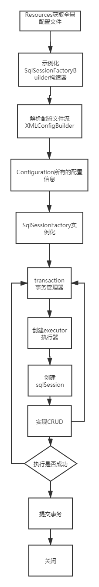

# Mybabits笔记

## 一、第一个Mybatis程序

### 1. 搭建环境

1. 新建Maven项目

2. 配置父项目依赖

   ```xml
   <?xml version="1.0" encoding="UTF-8"?>
   <project xmlns="http://maven.apache.org/POM/4.0.0"
            xmlns:xsi="http://www.w3.org/2001/XMLSchema-instance"
            xsi:schemaLocation="http://maven.apache.org/POM/4.0.0 http://maven.apache.org/xsd/maven-4.0.0.xsd">
       <modelVersion>4.0.0</modelVersion>
       <!-- 父项目 -->
       <groupId>org.example</groupId>
       <artifactId>Mybatis</artifactId>
       <version>1.0-SNAPSHOT</version>
   
       <dependencies>
           <!--Mybatis-->
           <dependency>
               <groupId>org.mybatis</groupId>
               <artifactId>mybatis</artifactId>
               <version>3.5.4</version>
           </dependency>
           <!-- junit4 -->
           <dependency>
               <groupId>junit</groupId>
               <artifactId>junit</artifactId>
               <version>4.13</version>
               <scope>test</scope>
           </dependency>
       </dependencies>
   </project>
   ```

### 2.创建一个模块

新建模块，名mybatis-01

当前目录结构如下


写入Mybatis配置文件 mybatis-config.xml

```xml
<?xml version="1.0" encoding="UTF-8" ?>
<!DOCTYPE configuration
        PUBLIC "-//mybatis.org//DTD Config 3.0//EN"
        "http://mybatis.org/dtd/mybatis-3-config.dtd">
<!-- 核心配置文件 -->
<configuration>
    <environments default="development">
        <environment id="development">
            <transactionManager type="JDBC"/>
            <dataSource type="POOLED">
                <property name="driver" value="com.mysql.cj.jdbc.Driver"/>
                <property name="url" value="jdbc:mysql://localhost:3306/mybatis?serverTimezone=Asia/Shanghai&amp;characterEncoding=UTF-8&amp;useUnicode=true"/>
                <property name="username" value="root"/>
                <property name="password" value="111111"/>
            </dataSource>
        </environment>
    </environments>
    <mappers>
</configuration>
```

### 3.编写代码

实体类

```java
//实体类
public class User {
    private Integer id;
    private String name;
    private String pwd;
	//get and set.....
}
```

数据库接口

```java
public interface IUserDao {
    List<User> getAllUserList();
}
```

工具类

```java
public class MybatisUtils {
    public static SqlSessionFactory sqlSessionFactory = null;
    static {
        //获取SqlSessionFactory对象
        String resource = "mybatis-config.xml";
        try {
            InputStream is = Resources.getResourceAsStream(resource);
            sqlSessionFactory = new SqlSessionFactoryBuilder().build(is);

        } catch (IOException e) {
            e.printStackTrace();
        }
    }
    public static SqlSession getSqlSession(){
        return sqlSessionFactory.openSession();
    }
}
```

**DAO接口类的实现类变为一个Mapper配置文件**

```xml
<?xml version="1.0" encoding="UTF-8" ?>
<!DOCTYPE mapper
        PUBLIC "-//mybatis.org//DTD Mapper 3.0//EN"
        "http://mybatis.org/dtd/mybatis-3-mapper.dtd">
<!--绑定一个指定的Dao/Mapper接口-->
<mapper namespace="dao.IUserDao">
    <!-- 查询语句 -->
    <!-- id 为方法名 -->
    <select id="getAllUserList" resultType="domain.User">
        select * from mybatis.user
    </select>
</mapper>
```

**该文件中的mapper必须在mybatis-config.xml中注册**

```xml
<configuration>
    <environments default="development">
        <!-- 配置省略 --->
    </environments>
    <mappers>
        <mapper resource="dao/impl/IUserMapper.xml"/>
    </mappers>
</configuration>
```

当前目录结构


### 4. 测试

```java
public class UserDaoTest {
    @Test
    public void test1(){
        //1.获取SqlSession对象
        SqlSession sqlSession = MybatisUtils.getSqlSession();
        //方式一、getMapper(推荐)
        IUserDao userDao = sqlSession.getMapper(IUserDao.class);
        List<User> list = userDao.getAllUserList();
//        //方式二、
//        List<User> list = sqlSession.selectList("dao.IUserDao.getAllUserList");
        sqlsession.close();
    }

}
```

### 5.小结

SqlSessionFactoryBuilder: 创建SqlSessionFactory, **创建后就没啥用了**。

SqlSessionFactory: 一旦被创建在应用中应一致存在，**不建议重复创建**，可以使用单例模式。

SqlSession: **SqlSession 的实例不是线程安全的，因此是不能被共享的**。.... **换句话说，每次收到的 HTTP 请求，就可以打开一个 SqlSession，返回一个响应，就关闭它。** 

```java
try (SqlSession session = sqlSessionFactory.openSession()) {
  // 你的应用逻辑代码
}
```

## 二、CRUD

`<select>` `<insert>` `<delete>` `<update>`标签详细属性属性详见[官网文档](https://mybatis.org/mybatis-3/zh/sqlmap-xml.html#select)

**注意**：

* mybatis-config.xml中mappers的resource指定的包名要和mapper.xml中的namespace定义的一致。
* Mybatis 的增删改操作必须提交事务！
* Map传参数，直接在sql中取出key即可 [parameterType="map"]。
* 独享对象传参数，直接在sql中取出对象属性即可 [parameterType="User"]。
* 只有一个基本类型参数的情况下，可以直接sql中取到。
* 多个参数用Map，或者注解（后面讲）

数据库接口

```java
public interface IUserDao {
    public List<User> getAllUserList();
    public User getUserById(Integer id);
    public boolean addUser(User user);
    public boolean delUserById(Integer id);
    public boolean updateUser(User user);
}
```

Mapper配置

```xml
<?xml version="1.0" encoding="UTF-8" ?>
<!DOCTYPE mapper
        PUBLIC "-//mybatis.org//DTD Mapper 3.0//EN"
        "http://mybatis.org/dtd/mybatis-3-mapper.dtd">
<!--绑定一个指定的Dao/Mapper接口-->
<mapper namespace="com.shj.dao.IUserDao">
    <!-- 查询语句 -->
    <select id="getUserById" resultType="com.shj.domain.User" parameterType="java.lang.Integer">
        select * from mybatis.user where id=#{id};
    </select>
    <insert id="addUser" parameterType="com.shj.domain.User">
        insert into mybatis.user(name, pwd) values (#{name}, #{pwd});
    </insert>
    <update id="updateUser" parameterType="com.shj.domain.User">
        update mybatis.user set name=#{name}, pwd=#{pwd} where id=#{id};
    </update>
    <delete id="delUserById" parameterType="java.lang.Integer">
        delete from mybatis.user where id=#{id}
    </delete>
</mapper>
```

测试（仅举例添加测试）

```java
@Test
public void addUserTest(){
    System.out.println("添加测试");
    SqlSession sqlSession = MybatisUtils.getSqlSession();
    try{
        IUserDao userDao = sqlSession.getMapper(IUserDao.class);
        userDao.addUser(new User("李四", "12344"));
        sqlSession.commit();
    }catch (Exception e){
        e.printStackTrace();
    }finally {
        sqlSession.close();
    }
}
```

#### 模糊查询拓展

模糊查询实现方法

1. 代码执行的时候传递通配符

   ```java
   List<User> list = mapper.getUserLike("%李%");
   ```

2. 在sql拼接中使用通配符

   ```sql
   select *  from mybatis.user where name like "%"#{valuse}"%"
   ```

## 三、配置解析

### 1.核心配置文件

* mybatis-config.xml

* ```
  MyBatis 的配置文件包含了会深深影响 MyBatis 行为的设置和属性信息。 配置文档的顶层结构如下：
  
  configuration（配置）
  properties（属性）
  settings（设置）
  typeAliases（类型别名）
  typeHandlers（类型处理器）
  objectFactory（对象工厂）
  plugins（插件）
  environments（环境配置）
  environment（环境变量）
  transactionManager（事务管理器）
  dataSource（数据源）
  databaseIdProvider（数据库厂商标识）
  mappers（映射器）
  ```

### 2. 环境配置

MyBatis 可以配置成适应多种环境，**尽管可以配置多个环境，但每个 SqlSessionFactory 实例只能选择一种环境。**

Mybatis 默认的事务管理器是JDBC, 连接池：POOLED

### 3.Properties


我们可以使用properties属性引用外部配置。

编写一个db.propertie

```
driver=com.mysql.cj.jdbc.Driver
url=jdbc:mysql://localhost:3306/mybatis?serverTimezone=Asia/Shanghai&amp;characterEncoding=UTF-8&amp;useUnicode=true
username=root
password=111111
```

在mybatis-config.xml中引入

```xml
<?xml version="1.0" encoding="UTF-8" ?>
<!DOCTYPE configuration
        PUBLIC "-//mybatis.org//DTD Config 3.0//EN"
        "http://mybatis.org/dtd/mybatis-3-config.dtd">
<!-- 核心配置文件 -->
<configuration>
<!--    引入外部配置文件-->
    <properties resource="db.properties">
        <!-- 也可以在这里配置数据库属性 -->
        <!-- 此处配置的优先级较高 -->
        <property name="driver" value="${driver}"/>
        <property name="driver" value="${driver}"/>
    </properties>
    <environments default="development">
        <environment id="development">
            <transactionManager type="JDBC"/>
            <dataSource type="POOLED">
                <property name="driver" value="${driver}"/>
                <property name="url" value="${url}"/>
                <property name="username" value="${username}"/>
                <property name="password" value="${password}"/>
            </dataSource>
        </environment>
    </environments>
    <mappers>
        <mapper resource="com/shj/dao/impl/IUserMapper.xml"/>
    </mappers>
</configuration>
```

小结：

* 可以引入外部文件
* 可以在其中增加一些属性配置
* 如果两个文件有同一字段，优先使用外部配置文件的。

### 4. 别名

意义：

* 为java类型设置一个短的名字
* 存在的意义仅在于用来减少类完全限定名的冗余

#### 4.1 配置别名

示例：

```xml
<!-- 为全类名起别名 -->
<typeAliases>
    <typeAlias type="com.shj.domain.User" alias="User"></typeAlias>
</typeAliases>
```

也可以指定一个包名，MyBatis 会在包名下面搜索需要的 Java Bean，比如：

```xml
<typeAliases>
  <package name="domain.blog"/>
</typeAliases>
```

每一个在包 `domain.blog` 中的 Java Bean，在没有注解的情况下，会使用 Bean 的首字母小写的非限定类名来作为它的别名。若有注解`@Alias`，则别名为其注解值。

#### 4.2 内建的常用Java类型别名

| 别名       | 映射的类型 |
| :--------- | :--------- |
| _byte      | byte       |
| _long      | long       |
| _short     | short      |
| _int       | int        |
| _integer   | int        |
| _double    | double     |
| _float     | float      |
| _boolean   | boolean    |
| string     | String     |
| byte       | Byte       |
| long       | Long       |
| short      | Short      |
| int        | Integer    |
| integer    | Integer    |
| double     | Double     |
| float      | Float      |
| boolean    | Boolean    |
| date       | Date       |
| decimal    | BigDecimal |
| bigdecimal | BigDecimal |
| object     | Object     |
| map        | Map        |
| hashmap    | HashMap    |
| list       | List       |
| arraylist  | ArrayList  |
| collection | Collection |
| iterator   | Iterator   |

### 5.设置

完整的设置

```xml
<settings>
  <setting name="cacheEnabled" value="true"/>
  <setting name="lazyLoadingEnabled" value="true"/>
  <setting name="multipleResultSetsEnabled" value="true"/>
  <setting name="useColumnLabel" value="true"/>
  <setting name="useGeneratedKeys" value="false"/>
  <setting name="autoMappingBehavior" value="PARTIAL"/>
  <setting name="autoMappingUnknownColumnBehavior" value="WARNING"/>
  <setting name="defaultExecutorType" value="SIMPLE"/>
  <setting name="defaultStatementTimeout" value="25"/>
  <setting name="defaultFetchSize" value="100"/>
  <setting name="safeRowBoundsEnabled" value="false"/>
  <!-- 开启驼峰命名规则映射 即从经典数据库列名转换为Java驼峰命名 -->
  <setting name="mapUnderscoreToCamelCase" value="false"/>
  <setting name="localCacheScope" value="SESSION"/>
  <setting name="jdbcTypeForNull" value="OTHER"/>
  <setting name="lazyLoadTriggerMethods" value="equals,clone,hashCode,toString"/>
</settings>
```


| 设置名             | 描述                                                         | 有效值                                                       | 默认值 |
| :----------------- | :----------------------------------------------------------- | :----------------------------------------------------------- | :----- |
| logImpl            | 指定 MyBatis 所用日志的具体实现，未指定时将自动查找。        | SLF4J \| LOG4J \| LOG4J2 \| JDK_LOGGING \| COMMONS_LOGGING \| STDOUT_LOGGING \| NO_LOGGING | 未设置 |
| cacheEnabled       | 全局地开启或关闭配置文件中的所有映射器已经配置的任何缓存。   | true \| false                                                | true   |
| lazyLoadingEnabled | 延迟加载的全局开关。当开启时，所有关联对象都会延迟加载。 特定关联关系中可通过设置 `fetchType` 属性来覆盖该项的开关状态。 | true \| false                                                | false  |

### 6.其他配置

- [typeHandlers（类型处理器）](https://mybatis.org/mybatis-3/zh/configuration.html#typeHandlers)
- [objectFactory（对象工厂）](https://mybatis.org/mybatis-3/zh/configuration.html#objectFactory)
- [plugins（插件）](https://mybatis.org/mybatis-3/zh/configuration.html#plugins)
  * mybatis-generator-core
  * mybatis-plus
  * 通用mapper

### 7.映射器（Mapper）

```xml
<!-- 使用相对于类路径的资源引用 推荐 -->
<mappers>
  <mapper resource="org/mybatis/builder/AuthorMapper.xml"/>
  <mapper resource="org/mybatis/builder/BlogMapper.xml"/>
  <mapper resource="org/mybatis/builder/PostMapper.xml"/>
</mappers>
<!-- 使用完全限定资源定位符（URL）不推荐 -->
<mappers>
  <mapper url="file:///var/mappers/AuthorMapper.xml"/>
  <mapper url="file:///var/mappers/BlogMapper.xml"/>
  <mapper url="file:///var/mappers/PostMapper.xml"/>
</mappers>
<!-- 使用映射器接口实现类的完全限定类名
	注意点：
 		1.接口和他的Mapper配置文件必须同名
		2.接口和他的Mapper配置文件必须在同一个包下
-->
<mappers>
  <mapper class="org.mybatis.builder.AuthorMapper"/>
  <mapper class="org.mybatis.builder.BlogMapper"/>
  <mapper class="org.mybatis.builder.PostMapper"/>
</mappers>
<!-- 将包内的映射器接口实现全部注册为映射器
	注意点：
 		1.接口和他的Mapper配置文件必须同名
		2.接口和他的Mapper配置文件必须在同一个包下 
-->
<mappers>
  <package name="org.mybatis.builder"/>
</mappers>
```

### 8.声明周期和作用域


SqlSessionFactoryBuilder:

* 一旦创建SqlSessionFactory,就不需要他了
* **局部变量**

SqlSessionFactory:

* 可以想象为数据库连接池
* SqlSessionFacotory一旦创建就应该在应用的运行期间一直存在，没有理由丢弃它或重新创建另一个实例。
* 因此SqlSessionFacory的最佳作用域是**应用作用域**
* 最简单的就是使用单例模式或者静态单例对象。

SqlSession:

* 连接到连接池的一个对象
* 实例不是线程安全的，因此不能共享。最佳的作用域是方法作用域。
* 用完即关。

每一个Mapper就代表一个业务。

## 四、解决属性名和字段名不一致问题

当实体类的属性名和数据库表的列名不一致时


```java
public class User {
    private Integer id;
    private String name;
    private String password;
}
```

解决方法

1. 起别名

   ```sql
   <select id="getUserById" resultType="com.shj.domain.User" parameterType="java.lang.Integer">
       select id,name,pwd as password from user where id=#{id}
   </select>
   ```

2. ResultMapper

   ```xml
   <?xml version="1.0" encoding="UTF-8" ?>
   <!DOCTYPE mapper
           PUBLIC "-//mybatis.org//DTD Mapper 3.0//EN"
           "http://mybatis.org/dtd/mybatis-3-mapper.dtd">
   
   <!--绑定一个指定的Dao/Mapper接口-->
   <mapper namespace="com.shj.dao.IUserDaoMapper">
       <resultMap id="UserMap" type="User">
       <!-- colimn数据库中的字段， property实体类中的属性 -->
           <result column="id" property="id"/>
           <result column="name" property="name"/>
           <result column="pwd" property="password"/>
       </resultMap>
       <!-- 查询语句 -->
       <select id="getUserById" resultType="com.shj.domain.User" parameterType="java.lang.Integer" resultMap="UserMap">
           select * from mybatis.user where id=#{id};
       </select>
   </mapper>
   ```

## 五、日志

### 1. 日志工厂

| logImpl | 指定 MyBatis 所用日志的具体实现，未指定时将自动查找。 | SLF4J \| LOG4J（掌握） \| LOG4J2 \| JDK_LOGGING \| COMMONS_LOGGING \| STDOUT_LOGGING （掌握）\| NO_LOGGING | 未设置 |
| ------- | ----------------------------------------------------- | ------------------------------------------------------------ | ------ |
|         |                                                       |                                                              |        |

```xml
<?xml version="1.0" encoding="UTF-8" ?>
<!DOCTYPE configuration
        PUBLIC "-//mybatis.org//DTD Config 3.0//EN"
        "http://mybatis.org/dtd/mybatis-3-config.dtd">
<!-- 核心配置文件 -->
<configuration>
    <!--    引入外部配置文件:标准日志工厂实现-->
    <properties resource="db.properties">
        <!-- 也可以在这里配置数据库属性 -->
    </properties>
    
    <settings>
        <!-- 设置日志实现 -->
        <setting name="logImpl" value="STDOUT_LOGGING"/>
    </settings>
    
    <typeAliases>
    </typeAliases>
    <environments default="development">
    </environments>
    <mappers>
        <package name="com.shj.dao"/>
    </mappers>
</configuration>
```

### 2.log4j

1. 导入依赖

   ```xml
   <!-- https://mvnrepository.com/artifact/log4j/log4j -->
   <dependency>
       <groupId>log4j</groupId>
       <artifactId>log4j</artifactId>
       <version>1.2.17</version>
   </dependency>
   ```

2. 配置文件 log4j.properties

   ```properties
   #将等级为DEBUG的日志信息输出到console和file这两个目的地，console和file的定义在下面的代码
   log4j.rootLogger=DEBUG,console,file
   
   #控制台输出的相关设置
   log4j.appender.console = org.apache.log4j.ConsoleAppender
   log4j.appender.console.Target = System.out
   log4j.appender.console.Threshold=DEBUG
   log4j.appender.console.layout = org.apache.log4j.PatternLayout
   log4j.appender.console.layout.ConversionPattern=[%c]-%m%n
   
   #文件输出的相关设置
   log4j.appender.file = org.apache.log4j.RollingFileAppender
   log4j.appender.file.File=./log/test.log
   log4j.appender.file.MaxFileSize=10mb
   log4j.appender.file.Threshold=DEBUG
   log4j.appender.file.layout=org.apache.log4j.PatternLayout
   log4j.appender.file.layout.ConversionPattern=[%p][%d{yy-MM-dd}][%c]%m%n
   
   #日志输出级别
   log4j.logger.org.mybatis=DEBUG
   log4j.logger.java.sql=DEBUG
   log4j.logger.java.sql.Statement=DEBUG
   log4j.logger.java.sql.ResultSet=DEBUG
   log4j.logger.java.sql.PreparedStatement=DEBUG
   ```

3. 在mybatis-config.xml配置log4j为日志的实现

   ```xml
   <settings>
       <setting name="logImpl" value="LOG4J"/>
   </settings>
   ```

4. 简单使用

   1. 在使用的log4j的类中，导入包org.apache.log4j.Logger;

   2. 生成日志对象，加载参数为当前类的class

   3. ```java
      @Test
      public void log4jTest(){
          Logger logger = Logger.getLogger(UserDaoTest.class);
          //日志级别
          logger.info("info:进入了testLog4j");
          logger.debug("debug: 进入了testLog4j");
          logger.error("error进入了tetLog4j");
      }
      ```

## 六、分页

### 1. 使用Limit

接口

```java
public List<User> getUserByLimit(Map<String, Integer> map);
```

实现

```
<select id="getUserByLimit" resultType="User" parameterType="map">
    select * from mybatis.user limit #{startIndex}, #{pageSize};
</select>
```

测试

```java
public void getUserByLimit(){
    SqlSession sqlSession = MybatisUtils.getSqlSession();
    try{
        IUserDaoMapper userDao = sqlSession.getMapper(IUserDaoMapper.class);
        HashMap map = new HashMap<String, Integer>();
        map.put("startIndex", 0);
        map.put("pageSize", 2);
        List<User> users = userDao.getUserByLimit(map);
        for(User u: users){
            System.out.println(u);
        }
    }catch (Exception e){
        e.printStackTrace();
    }finally {
        sqlSession.close();
    }
}
```

### 2.RowBounds(了解)

1. 接口

   ```java
   public List<User> getUserByRowBounds();
   ```

2. mapper.xml

   ```xml
   <select id="getUserByRowBounds" resultMap="UserMap">
       select * from mybatis.user;
   </select>
   ```

3. 测试

```java
@Test
public void getUserByLimit(){
    SqlSession sqlSession = MybatisUtils.getSqlSession();
    try{
        IUserDaoMapper userDao = sqlSession.getMapper(IUserDaoMapper.class);
        List<User> users = sqlSession.selectList("com.shj.dao.IUserDaoMapper.getUserByRowBounds", null, new RowBounds(1, 2));
        for(User u: users){
            System.out.println(u);
        }
    }catch (Exception e){
        e.printStackTrace();
    }finally {
        sqlSession.close();
    }
}
```

### 3.Mybatis分页插件

**PageHelper** (略)


## 七、使用注解开发

### 1. 使用注解

1. 注解在接口上实现

   ```java
   public interface UserMapper {
       @Select("select * from user")
       public List<User> getUsers();
   }
   ```

2. 需要在核心配置文件中绑定接口

   ```xml
   <mappers>
       <mapper class="com.shj.dao.UserMapper"/>
   </mappers>
   ```

3. 测试

本质：使用反射机制实现

底层：动态代理。



### 2.注解CRUD

我们可以在工具类创建的时候自动提交事务。

```java
public static SqlSession getSqlSession(){
    return sqlSessionFactory.openSession(true);
}
```

基于注解的CRUD:

接口

```java
public interface UserMapper {
    @Select("select * from user")
    public List<User> getUsers();
//    存在多个参数，参数前面必须加@Param()
    @Select("select * from user where id=#{id} and name=#{name};")
    public List<User> getUsersByIdAndName(@Param("id") Integer id, @Param("name") String name);
    @Insert("insert into user(name,pwd) values(#{name},#{pwd});")
    public void addUser(User u);
    @Delete("delete from user where id=#{id};")
    public void delUserById(Integer id);
    @Update("update user set name=#{name}, pwd=#{pwd} where id=#{id};")
    public void updateUser(User u);

}
```

**注意：我们必须将接口注册绑定到配置文件中.**

```xml
<mappers>
    <mapper class="com.shj.dao.UserMapper"/>
</mappers>
```


**关于@Param()注解**

* 基本类型的参数或者String类型需要加上
* 引用类型不需要加
* 如果只有一个基本类型，可以不加，但建议加上
* 我们在SQL中引用的就是我们在@Param中设定的属性名。

#{}：预编译的（防止SQL注入）

${}: 非预编译的

## 八、Lombok

使用步骤：

1. IDEA安装插件

   

2. 在项目中导入lombok Maven依赖

   ```xml
   <!-- https://mvnrepository.com/artifact/org.projectlombok/lombok -->
   <dependency>
       <groupId>org.projectlombok</groupId>
       <artifactId>lombok</artifactId>
       <version>1.18.12</version>
       <scope>provided</scope>
   </dependency>
   ```

3. ```java
   @Getter and @Setter
   @FieldNameConstants
   @ToString
   @EqualsAndHashCode
   @AllArgsConstructor, @RequiredArgsConstructor and @NoArgsConstructor
   @Log, @Log4j, @Log4j2, @Slf4j, @XSlf4j, @CommonsLog, @JBossLog, @Flogger, @CustomLog
   @Data
   @Builder
   @SuperBuilder
   @Singular
   @Delegate
   @Value
   @Accessors
   @Wither
   @With
   @SneakyThrows
   @val
   @var
   experimental @var
   @UtilityClass
   Lombok config system
   Code inspections
   Refactoring actions (lombok and delombok)
   
   ```

   @Data: 无参构造+get+set+tostring+hashcode+equals

   @AllArgsConstructor:

   @NoArgsConstructor:

   @ToString

   @EqualsAndHashCode

   @Getter(可放字段或者类上)

   @Setter(同上)

4. 在实体类上加上相应注解即可

## 九、多表查询

### 1. 多对一

多个学生对应一个老师，对于学生而言，就是多对一的关系。

实体类

```java
import lombok.Data;
import org.apache.ibatis.type.Alias;@Data
@Alias("Student")
public class Student {
    private Integer id;
    private String name;
    //关联一个老师
    private Teacher teacher;
}
```

```java
package com.shj.domain;
import lombok.Data;
import org.apache.ibatis.type.Alias;
@Data
@Alias("Teacher")
public class Teacher {
    public Integer id;
    public String name;
}
```

#### 1.1 按照查询嵌套处理(类似SQL子查询)

接口

```java
package com.shj.dao;
import com.shj.domain.Student;
import java.util.List;
public interface StudentMapper {
    public List<Student> getStudents();

}
```

StudentMapper.xml

```xml
<?xml version="1.0" encoding="UTF-8" ?>
<!DOCTYPE mapper
        PUBLIC "-//mybatis.org//DTD Mapper 3.0//EN"
        "http://mybatis.org/dtd/mybatis-3-mapper.dtd">
<!--绑定一个指定的Dao/Mapper接口-->
<mapper namespace="com.shj.dao.StudentMapper">
    <select id="getStudents" resultMap="StudentTeacher" resultType="list">
        select * from student;
    </select>
    <resultMap id="StudentTeacher" type="Student">
        <result property="id" column="id"/>
        <result property="name" column="name"/>
        <!--
            复杂的属性：我们需要单独处理
            对象：association
            集合：collection
            -->
        <association property="teacher" column="tid" javaType="Teacher" select="getTeacher"/>
    </resultMap>
    <select id="getTeacher" resultType="Teacher">
        select * from teacher where id=#{id};
    </select>
</mapper>
```

测试

```java
@Test
public void test(){
    SqlSession sqlSession = MybatisUtils.getSqlSession();
    try{
        StudentMapper studentMapper = sqlSession.getMapper(StudentMapper.class);
        List<Student> students = studentMapper.getStudents();
        for(Student s: students){
            System.out.println(s);
        }
    }catch (Exception e){
        e.printStackTrace();
    }finally {
        sqlSession.close();
    }
}
```

可以理解为先把所有的学生信息查出来（id, name, tid），再根据查出学生属性(tid)去查询老师，将查询到的老师封装到相应学生实体类的属性（teacher）中。这样，学生实体类的信息就完整了，将学生封装。

#### 1.2 按照结果嵌套处理（类似SQL表连接查询）

接口

```java
package com.shj.dao;
import com.shj.domain.Student;
import java.util.List;
public interface StudentMapper {
    public List<Student> getStudents2();
}
```

StudentMapper.xml

```xml
<?xml version="1.0" encoding="UTF-8" ?>
<!DOCTYPE mapper
        PUBLIC "-//mybatis.org//DTD Mapper 3.0//EN"
        "http://mybatis.org/dtd/mybatis-3-mapper.dtd">
<!--绑定一个指定的Dao/Mapper接口-->
<mapper namespace="com.shj.dao.StudentMapper">
    <select id="getStudents2" resultMap="StudentTeacher2">
        select  s.id sid, s.name sname, t.name tname
        from student s, teacher t
        where s.tid=t.id;
    </select>
    
    <resultMap id="StudentTeacher2" type="Student">
        <result property="id" column="sid"/>
        <result property="name" column="sname"/>
        <association property="teacher" javaType="Teacher">
            <result property="name" column="tname"/>
            <result property="id" column="tid"/>
        </association>
    </resultMap>
</mapper>
```

理解：现将两个表连接（student.tid=teacher.id), 连接后的表就有了封装Student类的所有信息，封装即可。


### 2. 一对多

多个学生对应一个老师，对于老师而言，就是一对多的关系。

实体类

```java
@Data
@Alias("Student")
public class Student {
    private Integer id;
    private String name;
    //关联一个老师
    private Integer tid;
}
```

```java
@Data
@Alias("Teacher")
public class Teacher {
    public Integer id;
    public String name;
    public List<Student> students;
}
```

接口

```java
package com.shj.dao;
import com.shj.domain.Teacher;
import java.util.List;
public interface TeacherMapper {
    public List<Teacher> getTeachers();
}
```

#### 2.1子查询方式

```xml
<?xml version="1.0" encoding="UTF-8" ?>
<!DOCTYPE mapper
        PUBLIC "-//mybatis.org//DTD Mapper 3.0//EN"
        "http://mybatis.org/dtd/mybatis-3-mapper.dtd">
<!--绑定一个指定的Dao/Mapper接口-->
<mapper namespace="com.shj.dao.TeacherMapper">
    <select id="getTeachers" resultType="Teacher" resultMap="TeacherMap">
        select * from teacher;
    </select>
    <resultMap id="TeacherMap" type="Teacher">
        <result property="id" column="id"/>
        <result property="name" column="name"/>
<!--        使用javaType 和ofType指定为 ArrayList<Student> 类型-->
        <collection property="students" select="getStudents" javaType="ArrayList" ofType="Student" column="id"/>
    </resultMap>
    <select id="getStudents" resultType="Student" parameterType="int">
        select * from student where tid=#{id}
    </select>
</mapper>
```

#### 2.2表连接

```xml
<!DOCTYPE mapper
        PUBLIC "-//mybatis.org//DTD Mapper 3.0//EN"
        "http://mybatis.org/dtd/mybatis-3-mapper.dtd">
<!--绑定一个指定的Dao/Mapper接口-->
<mapper namespace="com.shj.dao.TeacherMapper">
    <select id="getTeachers" resultType="Teacher" resultMap="TeacherMap">
        select s.id sid, s.name sname, t.id tid, t.name tname
        from student s, teacher t
        where s.tid=t.id
    </select>
    <resultMap id="TeacherMap" type="Teacher">
        <result property="id" column="tid"/>
        <result property="name" column="tname"/>
        <collection property="students" ofType="Student">
            <result column="sid" property="id"/>
            <result column="sname" property="name"/>
            <result column="tid" property="tid"/>
        </collection>
    </resultMap>
</mapper>
```

### 3. 小结

1. 关联 -association [多对一]
2. 集合-collection [一对多]
3. javaType & ofType
   * javaType指定实体类中属性的类型
   * ofType 只当映射到List或者集合中的pojo类型，泛型中的类型。

## 十 、动态SQL

### 环境搭建：

建表：

```sql
DROP TABLE IF EXISTS `blog`;
CREATE TABLE `blog`  (
  `id` varchar(11) NOT NULL COMMENT '博客id',
  `title` varchar(100) CHARACTER SET utf8mb4 COLLATE utf8mb4_0900_ai_ci NOT NULL COMMENT '博客标题',
  `author` varchar(30) CHARACTER SET utf8mb4 COLLATE utf8mb4_0900_ai_ci NOT NULL COMMENT '博客作者',
  `create_time` datetime(0) NOT NULL COMMENT '创建时间',
  `views` int(30) NOT NULL COMMENT '浏览量'
) ENGINE = InnoDB CHARACTER SET = utf8mb4 COLLATE = utf8mb4_0900_ai_ci ROW_FORMAT = Dynamic;

```

实体类

```java
package com.shj.domain;
import lombok.Data;
import java.util.Date;
@Data
public class Blog {
    private String id;
    private String title;
    private String author;
    private Date cteateTime;
    private int views;
}
```

```java
@Alias("User")
@Data
@NoArgsConstructor
@AllArgsConstructor
public class User {
    private Integer id;
    private String name;
    private String password;
}
```

工具类

MybatisUtils

```java
package com.shj.utils;
import org.apache.ibatis.io.Resources;
import org.apache.ibatis.session.SqlSession;
import org.apache.ibatis.session.SqlSessionFactory;
import org.apache.ibatis.session.SqlSessionFactoryBuilder;
import java.io.IOException;
import java.io.InputStream;
public class MybatisUtils {
    public static SqlSessionFactory sqlSessionFactory = null;
    static {
        //获取SqlSessionFactory对象
        String resource = "mybatis-config.xml";
        try {
            InputStream is = Resources.getResourceAsStream(resource);
            sqlSessionFactory = new SqlSessionFactoryBuilder().build(is);

        } catch (IOException e) {
            e.printStackTrace();
        }
    }
    public static SqlSession getSqlSession(){
        return sqlSessionFactory.openSession();
    }
}
```

IDutils

```
public class IDutils {
    public static String getId(){
        return UUID.randomUUID().toString().replace("-", "");
    }

}
```

配置文件mybatis.config

开启驼峰命名-----> 经典数据库命名映射

```xml
<settings>
    <setting name="mapUnderscoreToCamelCase" value="true"/>
</settings>
```

### 1. if where

接口

```java
public interface BlogMapper {
    public List<Blog> getBlogs(Map<String, String> map);
    public List<Blog> getBlogsByAuthor(User user);
}
```

配置文件

```xml
<?xml version="1.0" encoding="UTF-8" ?>
<!DOCTYPE mapper
        PUBLIC "-//mybatis.org//DTD Config 3.0//EN"
        "http://mybatis.org/dtd/mybatis-3-mapper.dtd">
<mapper namespace="com.dynamicsql.dao.BlogMapper">
    <!-- 使用Where标签 -->
    <select id="getBlogs" parameterType="map" resultType="Blog">
        select * from blog
        <where>
            <if test="author!= null">
                and author=#{author}
            </if>
            <if test="title != null">
                and title =#{title}
            </if>
        </where>
    </select>
    <!-- 1.不是用Where标签
		 2.传入的参数为实体类
	-->
    <select id="getBlogsByAuthor" parameterType="User" resultType="Blog">
        select * from blog where 1=1
        <if test="name!=null">
            and author=#{name}
        </if>
    </select>
</mapper>
```

测试

```java
public class BlogDaoTest {
    SqlSession sqlSession;
    BlogMapper blogDao;
    @Before
    public void pref(){
        sqlSession = MybatisUtils.getSqlSession();
        blogDao = sqlSession.getMapper(BlogMapper.class);
    }
    @Test
    public void getBlogsTest(){
        Map<String, String> map = new HashMap<>();
        map.put("author", "尚进");
        map.put("title", "Mybatis");
        List<Blog> list1 = blogDao.getBlogs(map);
        for(Blog b : list1){
            System.out.println(b);
        }
    }
    @Test
    public void getBlogsByAuthorTest(){
        User u = new User();
        u.setName("尚进");
        List<Blog> list2 = blogDao.getBlogsByAuthor(u);
        for(Blog b : list2){
            System.out.println(b);
        }
    }
}
```

### 2.choose（when otherwise）

有时我们不想应用到所有的条件语句，而只想从中**择其一项**,使用**choose**

遇到第一个满足项时结束。

```xml
<select id="findActiveBlogLike"
     resultType="Blog">
  SELECT * FROM BLOG WHERE state = ‘ACTIVE’
  <choose>
    <when test="title != null">
      AND title like #{title}
    </when>
    <when test="author != null and author.name != null">
      AND author_name like #{author.name}
    </when>
    <otherwise>
      AND featured = 1
    </otherwise>
  </choose>
</select>
```

### 3.trim, set

1. set:效果类似where

   1. 

   ```xml
   <update id="updateAuthorIfNecessary">
     update Author
       <set>
         <if test="username != null">username=#{username},</if>
         <if test="password != null">password=#{password},</if>
         <if test="email != null">email=#{email},</if>
         <if test="bio != null">bio=#{bio}</if>
       </set>
     where id=#{id}
   </update>
   ```

   ```
   <update id="updateAuthorIfNecessary">
     update Author
       <set>
         <if test="username != null">username=#{username},</if>
         <if test="password != null">password=#{password},</if>
         <if test="email != null">email=#{email},</if>
         <if test="bio != null">bio=#{bio}</if>
       </set>
     where id=#{id}
   </update>
   ```

   **注意这里我们删去的是后缀值（，），同时添加了前缀值（set）。**

2. **trim**

   举例`<where>`标签的trim

   ```xml
   <trim prefix="WHERE" prefixOverrides="AND |OR ">
     ...
   </trim>
   //添加前缀where  覆盖后缀'AND '或者'OR '（有空格） 
   ```

### 4. Foreacher

接口

```java
public interface BlogMapper {
    public List<Blog> getThreeBlogs(Map<String,List<String>> map);
}
```

查询语句

```xml
<select id="getThreeBlogs" parameterType="map" resultType="Blog">
	select * from blog
	<where>
		<foreach collection="authors" item="author" open="(" close=")" separator=" or ">
		author = #{author}
		</foreach>
	</where>
</select>
```

测试

```java
public class BlogDaoTest {
    SqlSession sqlSession;
    BlogMapper blogDao;
    @Before
    public void pref(){
        sqlSession = MybatisUtils.getSqlSession();
        blogDao = sqlSession.getMapper(BlogMapper.class);
    }
    @Test
    public void getThreeBlogsTest(){
        HashMap<String, List<String>> map = new HashMap<>();
        ArrayList<String> list = new ArrayList<>();
        list.add("尚进");
        list.add("狂风");
        list.add("鲁迅");
        map.put("authors", list);
        List<Blog> blogs = blogDao.getThreeBlogs(map);
        for(Blog b: blogs){
            System.out.println(b);
        }
    }
}
```

原SQL语句：

```sql
select * from blog WHERE ( author = '尚进' or author = '狂风' or author = '鲁迅' ) 
```


### 5. SQL片段

有时候我们可能会将一些SQL语句公共的部分抽取出来。

将[if where](#1. if where)所展示**id为getBlogs**的查询SQL的代码用SQL片段重构：

1.抽取sql语句片段

```xml
<!-- id名随便取 -->
<sql id="if-author-title">
    <if test="author!= null">
        and author=#{author}
    </if>
    <if test="title != null">
        and title =#{title}
    </if>
</sql>
```
2.使用include将sql语句片段插入

```xml
<select id="getBlogs" parameterType="map" resultType="Blog">
    select * from blog
    <!-- 将前面的sql片段插入于此 -->
    <where>
        <include refid="if-author-title"></include>
    </where>
</select>
```

完整代码

```xml
<?xml version="1.0" encoding="UTF-8" ?>
<!DOCTYPE mapper
        PUBLIC "-//mybatis.org//DTD Config 3.0//EN"
        "http://mybatis.org/dtd/mybatis-3-mapper.dtd">
<mapper namespace="com.dynamicsql.dao.BlogMapper">
    <!-- id名随便取 -->
    <sql id="if-author-title">
        <if test="author!= null">
            and author=#{author}
        </if>
        <if test="title != null">
            and title =#{title}
        </if>
    </sql>
    <select id="getBlogs" parameterType="map" resultType="Blog">
        select * from blog
        <!-- 将前面的sql片段插入于此 -->
        <where>
            <include refid="where-if-if"></include>
        </where>
    </select>
    <select id="getBlogsByAuthor" parameterType="User" resultType="Blog">
        select * from blog where 1=1
        <if test="name!=null">
            and author=#{name}
        </if>
    </select>

</mapper>
```

注意事项：

* 最好基于单表来定义SQL片段
* 不要存在where标签

## 十一、缓存

### 1. 简介

```java
查询 -> 连接数据库 -> 耗费资源
  一次查询的结果，给他暂存在一个可以直接取到的地方 --->内存
  我们再次查询相同的数据时，直接走缓存，就不用了走数据库了。
```

### 2.Mybatis缓存

* **默认开始一级缓存**（SqlSession级别缓存）。
* **需手动开启二级缓存**（namespace级别缓存）。
* 我们可以通过实现Cache接口来实现二级缓存。

### 3.一级缓存

一级缓存也叫本地缓存：SqlSession

* 与数据库同一次会话期间查询的数据会放在本地缓存中
* 以后如果需要获取相同的数据，直接从缓存中拿，没必要再去查询数据库

测试步骤：

1. 开启日志

2. 测试一个Session中查询两次相同的记录

   ```java
   public class UserDaoTest {
       SqlSession sqlSession;
       UserMapper userDao;
       @Before
       public void f(){
           sqlSession = MybatisUtils.getSqlSession();
           userDao = sqlSession.getMapper(UserMapper.class);
       }
       @Test
       public void daoTest(){
           User u1 = userDao.getUserById(34);
           System.out.println(u1);
           System.out.println("************************");
           User u2 = userDao.getUserById(34);
           System.out.println(u2);
           System.out.println(u1 == u2);
           sqlSession.close();
       }
   }
   ```

3. 查看日志输出

   

4. 手动清除缓存：

   ```java
   sqlSession.clearCache();
   ```

### 4.二级缓存

 要启用全局的二级缓存，只需要在你的 SQL 映射文件中添加一行：

```
<cache/>
```

基本上就是这样。这个简单语句的效果如下:

- 映射语句文件中的所有 select 语句的结果将会被缓存。
- 映射语句文件中的所有 insert、update 和 delete 语句会刷新缓存。
- 缓存会使用最近最少使用算法（LRU, Least Recently Used）算法来清除不需要的缓存。
- 缓存不会定时进行刷新（也就是说，没有刷新间隔）。
- 缓存会保存列表或对象（无论查询方法返回哪种）的 1024 个引用。
- 缓存会被视为读/写缓存，这意味着获取到的对象并不是共享的，可以安全地被调用者修改，而不干扰其他调用者或线程所做的潜在修改。

**提示** 缓存只作用于 cache 标签所在的映射文件中的语句。如果你混合使用 Java API 和 XML 映射文件，在共用接口中的语句将不会被默认缓存。你需要使用 @CacheNamespaceRef 注解指定缓存作用域。

这些属性可以通过 cache 元素的属性来修改。比如：

```
<cache
  eviction="FIFO"
  flushInterval="60000"
  size="512"
  readOnly="true"/>
```

这个更高级的配置创建了一个 FIFO 缓存，每隔 60 秒刷新，最多可以存储结果对象或列表的 512 个引用，而且返回的对象被认为是只读的，因此对它们进行修改可能会在不同线程中的调用者产生冲突。

可用的清除策略有：

- `LRU` – 最近最少使用：移除最长时间不被使用的对象。
- `FIFO` – 先进先出：按对象进入缓存的顺序来移除它们。
- `SOFT` – 软引用：基于垃圾回收器状态和软引用规则移除对象。
- `WEAK` – 弱引用：更积极地基于垃圾收集器状态和弱引用规则移除对象。

默认的清除策略是 LRU。

flushInterval（刷新间隔）属性可以被设置为任意的正整数，设置的值应该是一个以毫秒为单位的合理时间量。 默认情况是不设置，也就是没有刷新间隔，缓存仅仅会在调用语句时刷新。

size（引用数目）属性可以被设置为任意正整数，要注意欲缓存对象的大小和运行环境中可用的内存资源。默认值是 1024。

readOnly（只读）属性可以被设置为 true 或 false。只读的缓存会给所有调用者返回缓存对象的相同实例。 因此这些对象不能被修改。这就提供了可观的性能提升。而可读写的缓存会（通过序列化）返回缓存对象的拷贝。 速度上会慢一些，但是更安全，因此默认值是 false。

**提示** 二级缓存是事务性的。这意味着，当 SqlSession 完成并提交时，或是完成并回滚，但没有执行 flushCache=true 的 insert/delete/update 语句时，缓存会获得更新。


工作机制：

* 一个会话查询一条数据，这个数据会放在当前会话的一级缓存中
* **如果当前会话关闭了，这个会话对应的一级缓存就没有了，但是我们想要的是，会话数据保存到二级缓存中**
* 新的会话查询信息，就可以从二级缓存中获取内筒
* 不同的mapper查询出的数据会放在自己对应的缓存中

#### 步骤

* mybatis-config.xml开启全局缓存功能

  ```xml
  <!-- 本语句默认开启， 但一般情况下都会显式写出来 -->
  <setting name="cacheEnabled" value="true"/>
  ```

* 在要使用二级缓存的Mapper中开启

  ```xml
  <?xml version="1.0" encoding="UTF-8" ?>
  <!DOCTYPE mapper
          PUBLIC "-//mybatis.org//DTD Config 3.0//EN"
          "http://mybatis.org/dtd/mybatis-3-mapper.dtd">
  <mapper namespace="com.shj.dao.UserMapper">
      <cache
              eviction="FIFO"
              flushInterval="60000"
              size="512"
              readOnly="true"/>
      <select id="getUserById" parameterType="int" resultType="User">
          select * from user where id=#{id};
      </select>
  </mapper>
  ```

* 测试（貌似实体类需要实现序列化）

  ```java
  @Test
  public void daoTest(){
      //同时开启两个会话
      SqlSession sqlSession1 = MybatisUtils.getSqlSession();
      SqlSession sqlSession2 = MybatisUtils.getSqlSession();
      UserMapper userDao1 = sqlSession1.getMapper(UserMapper.class);
      UserMapper userDao2 = sqlSession2.getMapper(UserMapper.class);
      User u1 = userDao1.getUserById(34);
      System.out.println(u1);
      //关闭第一次会话
      sqlSession1.close();
      //第二次会话查询结果
      User u2 = userDao2.getUserById(34);
      System.out.println(u2);
      System.out.println(u1 == u2);
      sqlSession2.close();
  
  }
  ```

* 输出

  

#### 小结：

* 只要开启了二级缓存，在同一个Mapper下就有效
* 所有的数据都会先放在一个一级缓存中
* 只有当会话提交，或者关闭的时候，才会提交到二级缓存中

### 5.缓存原理


### 6.自定义缓存-ehcache

导入依赖

```xml
<dependency>
    <groupId>org.mybatis.caches</groupId>
    <artifactId>mybatis-ehcache</artifactId>
    <version>1.1.0</version>
</dependency>
```

略。

