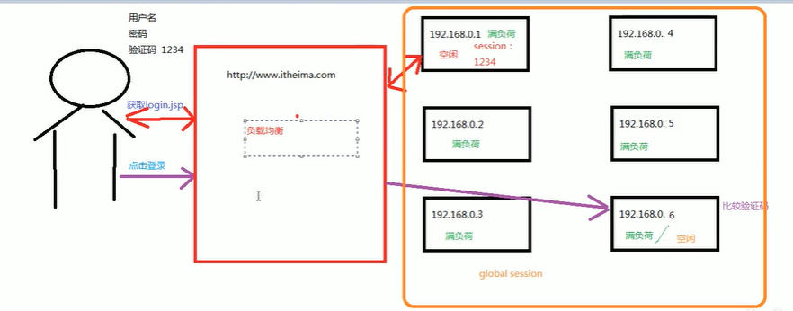
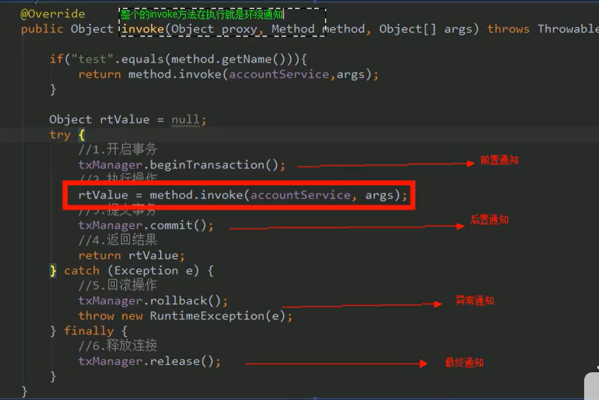
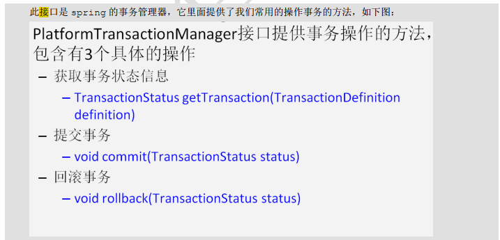
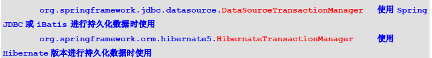
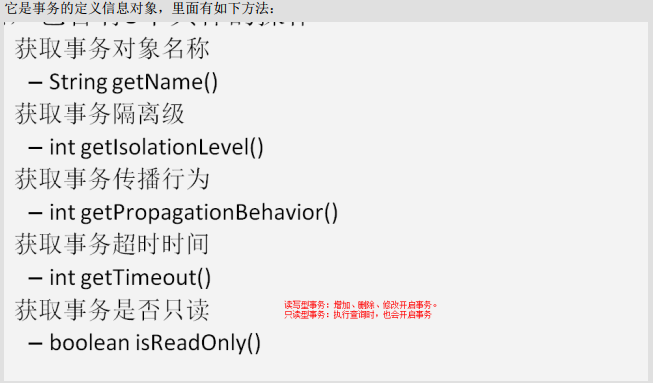
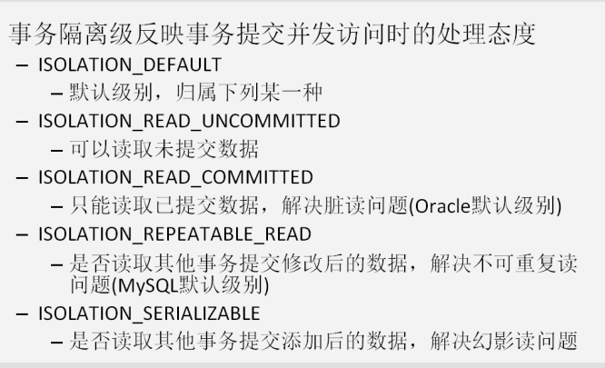
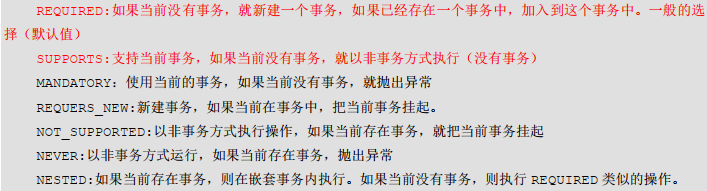
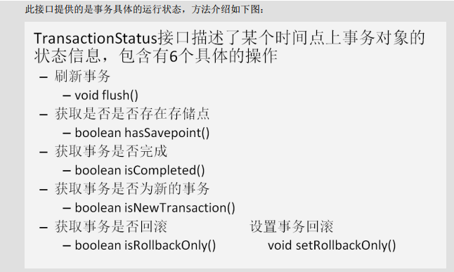
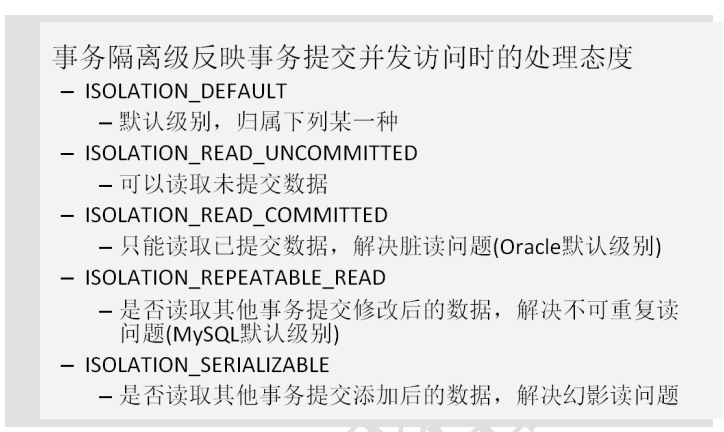

## 配置文件约束集合

```xml
<?xml version="1.0" encoding="UTF-8"?>
<beans xmlns="http://www.springframework.org/schema/beans"
    xmlns:xsi="http://www.w3.org/2001/XMLSchema-instance"
    xmlns:util="http://www.springframework.org/schema/util"
    xmlns:jee="http://www.springframework.org/schema/jee"
    xmlns:lang="http://www.springframework.org/schema/lang"
    xmlns:jms="http://www.springframework.org/schema/jms"
    xmlns:aop="http://www.springframework.org/schema/aop"
    xmlns:tx="http://www.springframework.org/schema/tx"
    xmlns:context="http://www.springframework.org/schema/context"
    xmlns:jdbc="http://www.springframework.org/schema/jdbc"
    xmlns:cache="http://www.springframework.org/schema/cache"
    xmlns:mvc="http://www.springframework.org/schema/mvc"
    xmlns:oxm="http://www.springframework.org/schema/oxm"
    xmlns:task="http://www.springframework.org/schema/task"
    xmlns:tool="http://www.springframework.org/schema/tool"
    xmlns:websocket="http://www.springframework.org/schema/websocket"
    xsi:schemaLocation="
        http://www.springframework.org/schema/beans http://www.springframework.org/schema/beans/spring-beans.xsd
        http://www.springframework.org/schema/util http://www.springframework.org/schema/util/spring-util.xsd
        http://www.springframework.org/schema/jee http://www.springframework.org/schema/jee/spring-jee.xsd
        http://www.springframework.org/schema/lang http://www.springframework.org/schema/lang/spring-lang.xsd
        http://www.springframework.org/schema/jms http://www.springframework.org/schema/jms/spring-jms.xsd
        http://www.springframework.org/schema/aop http://www.springframework.org/schema/aop/spring-aop.xsd
        http://www.springframework.org/schema/tx http://www.springframework.org/schema/tx/spring-tx.xsd
        http://www.springframework.org/schema/context http://www.springframework.org/schema/context/spring-context.xsd
        http://www.springframework.org/schema/jdbc http://www.springframework.org/schema/jdbc/spring-jdbc.xsd
        http://www.springframework.org/schema/cache http://www.springframework.org/schema/cache/spring-cache.xsd
        http://www.springframework.org/schema/mvc http://www.springframework.org/schema/mvc/spring-mvc.xsd
        http://www.springframework.org/schema/oxm http://www.springframework.org/schema/oxm/spring-oxm.xsd
        http://www.springframework.org/schema/task http://www.springframework.org/schema/task/spring-task.xsd
        http://www.springframework.org/schema/tool http://www.springframework.org/schema/tool/spring-tool.xsd
        http://www.springframework.org/schema/websocket http://www.springframework.org/schema/websocket/spring-websocket.xsd">

</beans>
```


## 正文

#### 1.程序间的耦合


* 耦合：程序间的依赖关系（例如导包）
  * 包括：
    * 类之间的依赖（如组合关系）
    * 方法间的依赖
* 解耦：降低程序间的依赖关系
* 实际开发中应做到：
  * 编译期不依赖，运行时才依赖
* 解决思路：
  * 第一步：使用反射创建对象，避免使用new关键字
  * 第二步：通过读取配置文件来获取要创建的对象全限定类名。
* Bean:在计算机英语中，有可重用组件的意思。
  * JavaBean > 实体类

#### 2. 工厂模式解耦

1. 需要一个配置字文件配置我们的service和dao

   配置的内容：唯一表示=全限定类名 （key=value）

2. 通过读取配置文件配置的内容，反射创建对象

   示例如下：

   ``` java
   public class BeanFactory {
       //定义一个Properties对象
       private static Properties props;
   
       //使用静态代码块为Properties对象赋值
       static {
           try{
               //实例化对象
               props = new Properties();
               //这种获取配置文件输入流的方法是默认路径就是Sources Root
               InputStream in = BeanFactory.class.getClassLoader().getResourceAsStream("bean.properties");
               props.load(in);-
           }catch (Exception e){
               throw new ExceptionInInitializerError("初始化properties失败!");
           }
       }
       public static Object getBean(String beanName){
           Object bean = null;
           try {
               String beanPath = props.getProperty(beanName);
               bean = Class.forName(beanPath).newInstance();
           }catch (Exception e){
               e.printStackTrace();
           }
           return  bean;
       }
   }
   ```

3. 上述工厂模式的问题：

   

   这句语句每次被执行时都会创建一个新的对象。

   工厂模式单例模式改进（饿汉模式）

   ``` java
   public class BeanFactory {
       //定义一个Properties对象
       private static Properties props;
       //定义一个Bean容器
       private static Map<String, Object> beans;
       //使用静态代码块为Properties对象赋值
       static {
           try{
               //实例化对象
               props = new Properties();
               //这种获取配置文件输入流的方法是默认路径就是Sources Root
               InputStream in = BeanFactory.class.getClassLoader().getResourceAsStream("bean.properties");
               props.load(in);
               //实例化容器
               beans = new HashMap<String, Object>();
               //取出配置文件中所有的key
               Enumeration keys = props.keys();
               //遍历枚举
               while(keys.hasMoreElements()){
                   String key = keys.nextElement().toString();
                   //根据key获取value
                   String beanPath = props.getProperty(key);
                   //反射创建对象
                   Object value = Class.forName(beanPath).newInstance();
                   //把key和value存入容器中
                   beans.put(key, value);
               }
   
           }catch (Exception e){
               throw new ExceptionInInitializerError("初始化properties失败!");
           }
       }
       public static Object getBean(String beanName){
           return  beans.get(beanName);
       }
   }
   ```

#### 3. IOC（控制反转）

理解：以前写代码时，当client端需要一个bean时可以自己new一个想要的bean,但这样就会存在较高的耦合。上述BeanFactory的创建，则将client端自主创建想要类的权利交给了BeanFactory类，从主动创建类变为被动接受一个类，此谓控制反转。

作用：削减耦合度。

#### 4. spring的IOC


Core Container:可以理解为就是上面工厂模式里的map。

##### 1.搭建入门

1. Maven依赖

   ``` xml
   <dependency>
      <groupId>org.springframework</groupId>
       <artifactId>spring-context</artifactId>
       <version>5.2.2.RELEASE</version>
   </dependency>
   ```

2. 新建ApplicationContext.xml（名字随便,但这是固定叫法）,加入约束(Reference中，core标签下搜索**xmlns**)

   ``` xml
   <?xml version="1.0" encoding="UTF-8"?>
   <beans xmlns="http://www.springframework.org/schema/beans"
          xmlns:xsi="http://www.w3.org/2001/XMLSchema-instance"
          xsi:schemaLocation="http://www.springframework.org/schema/beans
           https://www.springframework.org/schema/beans/spring-beans.xsd">
       <bean id="Service" class="sj.Service"></bean>
   </beans>
   ```

   `<bean>`标签中的

   * id:唯一表示一个类的id
   * class:全类名

3. 获取IOC核心容器

   ```java
   public class Main {
       public static void main(String[] args) {
           ApplicationContext ac = new ClassPathXmlApplicationContext("ApplicationContext.xml");
           Service service = ac.getBean("Service", Service.class);
      }
   }
   ```

##### 2.ApplicationContext的三个实现类

* `ClassPathXmlApplicationContext`:它可以加载类路径下的配置文件，要求配置文件必须在该类路径下。
* `FileSystemXmlApplicationContext`:它可以加载磁盘任意路径下的配置文件（必须有访问权限）。
* `AnnotationConfigApplicationContext`:它是用于读取注解创建容器的。详见[后面](#6.基于配置类的IOC配置)

> ApplicationContext 的创建单例对象是使用的饿汉模式。

##### 3. spring对Bean的管理细节

1. 创建Bean的三种方式

   * 使用默认构造函数创建

     * 在spring的配置文件中使用bean标签，配以id和class属性后，且没有其他属性和标签时，采用的事默认构造函数创建bean对象，此时类中没有默认构造函数，则无法构建。

   * 使用普通工厂中的方法创建对象（使某个类中的方法创建对象，并存入spring容器）

     ```xml
     <!-- 声明普通工厂对象 -->
     <bean id="instanceFactory" class="sj.factory.InstanceFactory"></bean>
     <!-- 用上面声明的普通工厂对象的getServiceInstance方法创建一个Service对象 -->
     <bean id="service" factory-bean="instanceFactory" factory-method="getServiceInstance"></bean>
     ```

   * 使用工厂中的静态方法创建对象（使用某个类中的静态方法创建对象，并存入spring容器）

     ```xml
     <!-- 直接使用StaticFactory类的静态方法getServiceInstance创建一个Service对象 -->
     <bean id="service" class="sj.factory.StaticFactory" factory-method="getServiceInstance"></bean>
     ```

2. `<bean>`标签的作用范围调整

   * bean标签的scope 属性：

     * 作用：用于指定bean的作用范围

     * 取值：

       **singleton:单例的，默认值**

       **prototype:多例的**

       request:作用wen应用的请求范围

       session:作用于web应用的会话范围

       global-session:作用于集群环境的会话范围（全局会话范围），当不是集群环境时，他就是session(5.0不被支持，未验证)

       

3. bean对象的生命周期

   * 单例对象：

     * 出生：容器创建时，对象出生
     * 活着：容器还在，对象一直活着
     * 死亡：容器销毁，对象消亡

     总之：与容器共存亡

   * 多例对象

     * 出生：当我们使用对象时spring框架为我们创建
     * 活着：对象只要是使用工程中就一直活着
     * 死亡：spring不会销毁多例对象，由java垃圾回收机制回收

##### 4.spring的依赖注入

* 依赖注入：Dependency Injection

* IOC的作用：降低程序间的耦合（依赖关系）

* 依赖关系的管理：

  以后都交给了spring来维护

* 当前类需要的其他类对象，由spring为我们维护，我们只需要在配置文件中说明。

* 依赖关系的维护就称为依赖注入。

* 依赖注入：

  * 能注入的数据：

    * 基本类型和String
    * 其它bean类型（在配置文件中活着注解配置过的bean)
    * 复杂类型/集合类型

  * 注入方法：

    1. 使用构造函数提供

       使用标签`<constructor-arg>`

       标签重现的位置：bean标签内部

       标签中的属性

       * type:用于指定要注入的数据的数据类型，该数据类型也是构造函数中某个或某些参数的类型

       * index: 用于指定要注入的数据给构造函数中指定索引位置的参数赋值。索引从0开始

       * name:用于指定给构造函数中指定名称的参数赋值

         示例：

         ``` java
         //将要创建的bean
         public class AccountService {
             public String name;
             public Integer age;
             public Date birthday;
             public AccountService(String name, Integer age, Date birthday) {
                 this.name = name;
                 this.age = age;
                 this.birthday = birthday;
             }
         }
         ```

         若要使用带参构造函数，配置文件：

         ``` xml
         <?xml version="1.0" encoding="UTF-8"?>
         <beans xmlns="http://www.springframework.org/schema/beans"
                xmlns:xsi="http://www.w3.org/2001/XMLSchema-instance"
                xsi:schemaLocation="http://www.springframework.org/schema/beans
                 https://www.springframework.org/schema/beans/spring-beans.xsd">
             <bean id="accountService" class="sj.AccountService">
         <!--        <constructor-arg index="0" value="小明"/>-->
         <!--        <constructor-arg index="1" value="18"/>-->
         <!--        <constructor-arg index="2" ref="now"/>-->
                 <constructor-arg name="name" value="小明"/>
                 <constructor-arg name="age" value="18"/>
                 <constructor-arg name="birthday" ref="now"/>
             </bean>
             <bean id="now" class="java.util.Date"></bean>
         </beans>
         ```

         ---

       * value:用于提供基本类型和String类型的函数

       * ref：用于指定其他的bean类型数据。它指的就是spring的IOC核心容器中出现过的对象

       弊端：改变了bean对象的实例化方式，使我们在创建对象时，如果用不到这些数据，也必须提供。

    2. 使用set方法提供（常用）

       涉及标签：property

       出现位置：bean标签的内部

       标签属性：

       * name:用于指定注入时所调用的set方法名称
       * value:用户提供基本类型和String类型的数据
       * ref:用于指定其他的bean类型数据。它指的就是在spring的IOC容器中出现过的bean对象。

       优势：创建对象时没有明显的限制，可直接使用默认构造函数。

       示例如下

       ```java
       //将被创建的Bean
       public class AccountService {
           public String name;
           public Integer age;
           public Date birthday;
           public AccountService(){
       
           }
           public AccountService(String name, Integer age, Date birthday) {
               this.name = name;
               this.age = age;
               this.birthday = birthday;
           }
       
           public String getName() {
               return name;
           }
       
           public void setName(String name) {
               this.name = name;
           }
       
           public Integer getAge() {
               return age;
           }
       
           public void setAge(Integer age) {
               this.age = age;
           }
       
           public Date getBirthday() {
               return birthday;
           }
       
           public void setBirthday(Date birthday) {
               this.birthday = birthday;
           }
       }
       ```

       使用set方法注入的配置文件

       ```xml
       <?xml version="1.0" encoding="UTF-8"?>
       <beans xmlns="http://www.springframework.org/schema/beans"
              xmlns:xsi="http://www.w3.org/2001/XMLSchema-instance"
              xsi:schemaLocation="http://www.springframework.org/schema/beans
               https://www.springframework.org/schema/beans/spring-beans.xsd">
       <bean id="accountService" class="sj.AccountService">
           <property name="name" value="小明"/>
           <property name="age" value="18"/>
           <property name="birthday" ref="now"/>
       </bean>
       <bean id="now" class="java.util.Date"></bean>
       </beans>
       ```

       复杂类型注入：

       ``` java
       public class AccountService {
           public List<String> myList;
           public Map<String, Integer> myMap;
           public String[] myArr;
           public Properties myProps;
       
           public AccountService() {
           }
       
           public List<String> getMyList() {
               return myList;
           }
       
           public void setMyList(List<String> myList) {
               this.myList = myList;
           }
       
           public Map<String, Integer> getMyMap() {
               return myMap;
           }
       
           public void setMyMap(Map<String, Integer> myMap) {
               this.myMap = myMap;
           }
       
           public String[] getMyArr() {
               return myArr;
           }
       
           public void setMyArr(String[] myArr) {
               this.myArr = myArr;
           }
       
           public Properties getMyProps() {
               return myProps;
           }
       
           public void setMyProps(Properties myProps) {
               this.myProps = myProps;
           }
       }
       ```

       配置文件

       ``` xml
       <?xml version="1.0" encoding="UTF-8"?>
       <beans xmlns="http://www.springframework.org/schema/beans"
              xmlns:xsi="http://www.w3.org/2001/XMLSchema-instance"
              xsi:schemaLocation="http://www.springframework.org/schema/beans
               https://www.springframework.org/schema/beans/spring-beans.xsd">
       <bean id="accountService" class="sj.AccountService">
           <property name="myArr">
               <array>
                   <value>AAA</value>
                   <value>BBB</value>
                   <value>CCC</value>
               </array>
           </property>
           <property name="myList">
               <list>
                   <value>AAA</value>
                   <value>BBB</value>
                   <value>CCC</value>
               </list>
           </property>
           <property name="myMap">
               <map>
                   <entry key="testA" value="1"></entry>
                   <entry key="testB">
                       <value>2</value>
                   </entry>
                   <entry key="testC" value="3"></entry>
               </map>
           </property>
           <property name="myProps">
               <props>
                   <prop key="testA">AAA</prop>
                   <prop key="testB">BBB</prop>
               </props>
           </property>
       </bean>
       </beans>
       ```

       >用于给List结构集合注入的标签：list array set
       >
       >用于给Map结构结合注入的标签：map props
       >
       >结构形同，标签可以互换

    3. 使用注解提供（后文）

##### 5.基于注解的IOC配置

曾经的XML配置：

```xml
<bean id="..." class="..." scope="..." init-method="..." destroy-method="..."></bean>
```

基于注解的IOC配置准备工作：

需要以下jar包依赖


在Reference中core标签中搜索**xmlns:context**

```xml
<?xml version="1.0" encoding="UTF-8"?>
<beans xmlns="http://www.springframework.org/schema/beans"
       xmlns:xsi="http://www.w3.org/2001/XMLSchema-instance"
       xmlns:context="http://www.springframework.org/schema/context"
       xsi:schemaLocation="http://www.springframework.org/schema/beans
        https://www.springframework.org/schema/beans/spring-beans.xsd
        http://www.springframework.org/schema/context
        https://www.springframework.org/schema/context/spring-context.xsd">
    <!-- 告知spring在创建容器时要扫描的包，配置所需要的标签不是在beans的约束中，而是一个名为context名称空间的约束中。-->
    <context:component-scan base-package="sj"></context:component-scan>
</beans>
```

###### 1.用于创建对象的注解

* `@Component`：

  * 作用：用于把当前类对象存入spring容器中
  * 属性：
    * value:用于指定bean的id，当我们不写时，它的默认值是当前类名，且首字母小写。

* `@Controller`:一般用于表现层

* `@Service`：一般用于业务层

* `@Repository`:一般用于持久层

  以上三个注解他们的作用和属性和Component是一样的

  他们三个是spring框架为我们提供明确的三层使用的注释，是我们的三层对象更加清晰。

###### 2.注入数据的注解

* `@Autowired`:

  * 作用：自动按照类型注入。只要容器中由**唯一**的一个bean对象类型和要注入的变量类型匹配，就可以**注入成功**；如果**没有任何一个**类型匹配，则**报错**；如果**有多个类型匹配**：①按照类型，**圈定出所有匹配的**容器中的bean。 ②**以变量名称作为bean的id**在圈定出来的bean中查找一样的。（如果有一个成功，则注入成功，否则报错）

  * 出现位置：可以是变量上，也可以是方法上。

  * 细节：在使用注解注入时，set方法就不是必须的了。

    示例：

    ``` java
    //要注入的bean
    @Component
    public class AccountUtil {
        public AccountUtil(){
        }
    }
    ```

    ```java
    //要被注入的bean
    @Component("accountService")
    public class AccountService {
        //被注入的属性
        @Autowired
        public AccountUtil util = null;
    
        public AccountService() {
        }
    
        public AccountUtil getUtil() {
            return util;
        }
    
        public void setUtil(AccountUtil util) {
            this.util = util;
        }
    }
    ```

    ```java
    public class Main {
        public static void main(String[] args) {
            ApplicationContext ac = new ClassPathXmlApplicationContext("bean.xml");
            AccountService service = ac.getBean("accountService", AccountService.class);
            System.out.println(service.getUtil());
        }
    }
    ```

* `@Qualifier`:

  * 作用：在按照类注入的基础上在按照名称注入。它在给类成员注入时，不能单独使用; 但是给方法参数注入时，可以单独使用（后文）。

* `@Resource`:

  * 作用：直接按照bean的id注入。它可以独立使用
  * 属性：
    * name:用于指定bean的id

  以上三个注入都只能注入其他bean类型的数据，而基本类型和String类型无法使用上述注解实现。

  另外，集合类型的注入只能通过xml实现。

* `@Value`:

  * 作用：用于注入基本类型和String类型的数据
  * 属性：
    * value:用于指定数据的值。它可以使用spring中的SpEL(spring的EL表达式)
      * #{表达式}： SpEL的写法
      * ${表达式}: 从环境变量、配置文件中获取值

###### 3.用于改变作用范围的注解

* 他们的作用和bean标签中使用scope属性实现的功能是一样的。

* `@Scope`
  * 作用：用于指定bean的作用范围
  * 属性：
    * value:指定范围的数值，常用取值：singleton, prototype

###### *4.生命周期相关的注解

* 他们的作用和bean标签中使用init-method和destroy-methode的作用是一样的。
* `@PreDestroy`:指定销毁方法
* `@PostConstruct`:指定初始化方法

##### 6.基于配置类的IOC配置

1. 创建一个配置类（类名包名随意）

2. `@Configuration`:指定当前类是一个配置类

   * 细节：当配置类作为AnnotationConfigApplicationContext对象创建的参数时，该注解可以不写。
     * 我的理解：配置类若要能被spring框架扫描到，就要么将配置类的Class当做参数传入AnnotationConfigApplicationContext类的构造函数中;要么不传class的配置类加`@Configuration`注解，并且在AnnotationConfigApplicationContext构造函数传入的class的类上面标明要扫描的包（`@ComponentScan`）；要么AnnotationConfigApplicationContext构造函数传入class的配置类用`@Import`注解标注其他配置类

3. `@Import`:（推荐）

   * 作用：导入其它配置类

   * 属性：

     * value: 指定其它配置类的字节码

       当我们使用`@Import`注解后，由Import注解的为主配置类，其它的为子配置类。

4. `@ComponentScan/@ComponentScans`:用于通过注释指定spring在创建容器时要扫描的包

   * 属性：

     * value:它和basePackages的作用是一样的，都是用于指定配置容器时要扫描的包。

       我们使用此注解就等同于在xml里配置了：

       ```xml
       <context:component-scan base-package="..."></context:component-scan>
       ```

5. `@Bean`:用于把当前方法的返回值作为bean存入spring的ioc容器中。

   * 属性：
     * name：用于指定bean的id.当不写时，默认值是当前方法的名称。

   细节：当我们使用注解方法时，如果方法有参数，spring框架会去容器中查找有没有可用的bean对象，查找的方式和`@Autowired`注解的作用是一样的。

示例：

要**被代替**的配置文件

```xml
<!-- 原xml配置文档 -->
<?xml version="1.0" encoding="UTF-8"?>
<beans xmlns="http://www.springframework.org/schema/beans"
       xmlns:xsi="http://www.w3.org/2001/XMLSchema-instance"
       xmlns:context="http://www.springframework.org/schema/context"
       xsi:schemaLocation="http://www.springframework.org/schema/beans
        https://www.springframework.org/schema/beans/spring-beans.xsd
        http://www.springframework.org/schema/context
        https://www.springframework.org/schema/context/spring-context.xsd">
    <!-- 告知spring在创建容器时要扫描的包，配置所需要的标签不是在beans的约束中，而是一个名为context名称空间的约束中。-->
    <context:component-scan base-package="com.sj"></context:component-scan>
    <bean id="runner" class="org.apache.commons.dbutils.QueryRunner" scope="prototype">
        <constructor-arg name="ds" ref="dataScource"></constructor-arg>
    </bean>
    <bean id="dataScource" class="com.mchange.v2.c3p0.ComboPooledDataSource">
        <property name="driverClass" value="com.mysql.cj.jdbc.Driver"></property>
        <property name="jdbcUrl" value="jdbc:mysql://localhost:3306/eesy"></property>
        <property name="user" value="root"></property>
        <property name="password" value="111111"></property>
    </bean>
</beans>
```

```java
/*
主配置文件
 */
//@Configuration
@Import(JDBCConfiguration.class)//导入子配置文件
@PropertySource("classpath:jdbcConfig.properties")
public class SpringConfiguration {

}
```

```java
/*
子配置文件
 */
public class JDBCConfiguration {
    @Value("${jdbc.driver}")
    public String driver;
    @Value("${jdbc.url}")
    public String url;
    @Value("${jdbc.user}")
    public String user;
    @Value("${jdbc.password}")
    public String password;
    /*
    用于创建一个QueryRunner对象
     */
    @Bean(name = "runner")
    @Scope("prototype")//多例
    public QueryRunner createQueryRunner(DataSource dataSource){
        return  new QueryRunner(dataSource);
    }

    @Bean(name = "dataSource")
    public DataSource createDataSource(){
        try{
            ComboPooledDataSource ds = new ComboPooledDataSource();
            ds.setDriverClass(driver);
            ds.setJdbcUrl(url);
            ds.setUser(user);
            ds.setPassword(password);
            return ds;
        }catch (Exception e){
            e.printStackTrace();
        }
        return  null;
    }
    @Bean(name = "testString")
    public String createString(){
        return user.toString();
    }
}
```

```pr
# jdbcConfig.properties
jdbc.driver=com.mysql.cj.jdbc.Driver
jdbc.url=jdbc:mysql://localhost:3306/eesy
jdbc.user=root
jdbc.password=111111
```

获取IOC容器

```java
public class Main {
    public static void main(String[] args) {
        ApplicationContext aa = new AnnotationConfigApplicationContext(SpringConfiguration.class);
    }
}
```

6. `@PropertySource`:
   * 作用：用于指定propertied文件的位置
   * 属性：
     * value:指定文件的名称和文件路径
       * 关键字：classpath:表示类路径下 

#### 5. 动态代理

动态代理：

* 特点：字节码随用随创建，随用随加载
* 作用：不修改源码的基础上对方法增强
* 分类：
  * 基于接口的动态代理
  * 基于子类的动态代理

##### 1.基于接口的动态代理

* 基于接口的动态代理：

  * 涉及的类：Proxy
  * 提供者：JDK官方

* 如何创建代理对象：

  * 使用Proxy类中的newProxyInstance方法

* 创建代理对象的要求：

  * 被代理类至少实现一个家口，如果没有则不能使用

* newProxyInstance方法的参数

  * ClassLoader:类加载器

    * 它是用于加载代理对象字节码的。和被代理对象使用相同的类加载器。
    * **固定写法**：代理谁，就传谁的ClassLoader（getClass().getClassLoader()）

  * Class[]：字节码数组

    * 它是让代理对象和被代理对象有相同方法。
    * **固定写法**：要代理的对象实现的接口（getClass().getInterfaces()）

  * InvocationHandler：用于提供增强的代码

    * 它是让我们写如何代理。我们一般都是写一个该接口的实现类，通常情况下都是匿名内部类，但不是必须的。
    * 此接口的实现类，都是使用谁写。

  * 示例：

    ```java
    /*
    	IProducer.java
    /*
    public interface IProducer {
        /**
         * 销售
         * @param money
         */
        public void saleProduct(float money);
    
        /**
         * 售后
         * @param money
         */
        public void afterService(float money);
    
    }
    ```

    ```java
    /*
    Producer.java
     */
    public class Producer implements IProducer {
        @Override
        public void saleProduct(float money) {
            System.out.println("销售产品，并拿到钱：" + money);
        }
    
        @Override
        public void afterService(float money) {
            System.out.println("提供售后，并拿到钱：" + money);
        }
    }
    ```

    ```java
    /*Main.java*/
    public class Main {
        public static void main(String[] args) {
            Producer pr = new Producer();
            IProducer proxyProducer = (IProducer) Proxy.newProxyInstance(Producer.class.getClassLoader(), Producer.class.getInterfaces(), new InvocationHandler() {
                /*
                    作用：执行被代理对象的任何接口方法都会经过该方法
                    方法参数：
                        proxy:代理对象的引用
                        method:当前执行的方法
                        args:当前执行方法所需要的参数
                    @return: 和被代理对象有相同的返回值
                 */
                @Override
                public Object invoke(Object proxy, Method method, Object[] args) throws Throwable {
                    //提供增强的代码
                    Object returnValue = null;
                    //1.获取方法执行的参数
                    Float money = (Float)args[0];
                    //2.判断当前方法是不是销售
                    if("saleProduct".equals(method.getName())){
                        returnValue = method.invoke(pr, money * 0.8f);
                    }
                    return returnValue;
                }
            });
            proxyProducer.saleProduct(1000);//销售产品，并拿到钱：800.0
        }
    }
    ```

##### 2.基于子类的动态代理

* 基于子类的动态代理：

  * 涉及的类：Enhancer
  * 提供者：第三方cglib库

* 如何创建代理对象：

  * 使用Enhancerl类中的create方法

* 创建代理对象的要求：

  * 被代理类不能是最终类（无法创建子类）

* create()方法的参数

  * Class:字节码
    * 它是用于指定被代理对象的字节码
  * Callback:用于提供增强的代码
    * 他是让我们写如何代理。我们一般都是写一个该接口的实现类，通常情况下都是匿名内部类，但不是必须的。
    * 此接口的实现类谁调用谁写。
    * 我们一般写的都是该接口的子接口实现类，MethodInterceptor。

* 示例：

  Maven依赖
  
  ```xml
  <dependency>
      <groupId>cglib</groupId>
      <artifactId>cglib</artifactId>
      <version>2.1_3</version>
  </dependency>
  ```
  
  ```java
  public class Main {
      public static void main(String[] args) {
          final Producer pr = new Producer();
          Producer cglibProducer = (Producer) Enhancer.create(pr.getClass(), new MethodInterceptor() {
              /*
                  执行被代理的对象的任何方法都会经过该方法
                  @param:
                      proxy:
                      method:
                      args:
                  以上三个，与基于接口的动态代理的invoke方法的作用是一样的
                      methodProxy:当前执行方法的代理对象
               */
              @Override
              public Object intercept(Object o, Method method, Object[] args, MethodProxy methodProxy) throws Throwable {
                  Object returnValue = null;
                  Float money = (Float)args[0];
                  if("saleProduct".equals(method.getName())){
                      returnValue = method.invoke(pr, money * 0.8f);
                  }
                  return  returnValue;
              }
          });
          cglibProducer.saleProduct(1000);
      }
  }
  ```

#### 6. Spring AOP

AOP概念：Aspect Oriented Programming, 面向切面编程。

相关术语：

* 连接点（Joinpoint）:是指那些被拦截到的点。在spring中，这些点指的是方法，因为spring只支持方法类型的连接点。（所有方法）

* 切入点（Pointcut）：所谓切入点是指我们要对哪些Joinpoint进行拦截定义。（被增强的方法）

* 通知/增强（Advice）：所谓通知是指拦截到Joinpoint之后所要做的事情就是通知。

  * 通知的类型：
    * 前置通知
    * 后置通知
    * 异常通知
    * 最终通知
    * 环绕通知
  * 

* 引介（Introduction）：是一种特殊的通知，在不修改类代码的前提下，Introduction可以在运行期为类动态的添加一些方法或Field.

* 目标对象（Target):代理的目标对象

* 织入（Weaving):是把增强应用到目标对象来创建新的代理对象的过程。

  Spring采用动态代理织入，而AspectJ采用编译期织入和类装载期织入。

* 代理（Proxy):一个类被AOP织入增强后，就产生一个结果代理类

* Aspect（切面）：是切入点和通知（引介）的结合。

##### 1. Spring基于xml的AOP

配置文件约束：

​	在Reference中Core下搜索xmlns:aop

```xml
<?xml version="1.0" encoding="UTF-8"?>
<beans xmlns="http://www.springframework.org/schema/beans"
    xmlns:xsi="http://www.w3.org/2001/XMLSchema-instance"
    xmlns:aop="http://www.springframework.org/schema/aop"
    xsi:schemaLocation="http://www.springframework.org/schema/beans
        https://www.springframework.org/schema/beans/spring-beans.xsd
        http://www.springframework.org/schema/aop
        https://www.springframework.org/schema/aop/spring-aop.xsd">

    <!-- an HTTP Session-scoped bean exposed as a proxy -->
    <bean id="userPreferences" class="com.something.UserPreferences" scope="session">
        <!-- instructs the container to proxy the surrounding bean -->
        <aop:scoped-proxy/> 
    </bean>

    <!-- a singleton-scoped bean injected with a proxy to the above bean -->
    <bean id="userService" class="com.something.SimpleUserService">
        <!-- a reference to the proxied userPreferences bean -->
        <property name="userPreferences" ref="userPreferences"/>
    </bean>
</beans>
```

spring中基于XML的AOP配置步骤：

1. 把通知Bean也交给spring来管理

2. 使用aop：config标签表明开始AOP的配置

3. 使用aop:aspect标签表明配置切面

   * id属性：给切面一个唯一标识
   * ref属性：是指通知类bean的Id.

4. 在aop：aspect标签的内部使用对应标签来配置通知的类型

   ​	我们现在示例是让printLog方法在切入点方法执行前：所以是前置通知

   * aop:before:表示配置前置通知

     * method属性：用于指定Logger类中哪个方法是前置通知

     * pointcut属性：用于指定切入点表达式，该表达式的含义是对业务层中哪些方法增强。

     * 切入的点表达式的写法：

       * 关键字：execution(表达式)

       * 需要的Maven依赖

         ```xml
    <dependency>
             <groupId>org.aspectj</groupId>
      <artifactId>aspectjweaver</artifactId>
             <version>1.8.7</version>
         </dependency>
         ```

       * 表达式：
   
         访问修饰符 返回值 包名.包名.包名...类名.方法名（参数列表）
   
         示例表达式写法:
   
         ```java
         public void com.sj.AccountServiceImpl.saveAccount()
         ```
       
         访问修饰符可以省略
         
         ```java
         void com.sj.AccountServiceImpl.saveAccount()
         ```
         
         返回值可以使用通配符，表示任意返回值
         
         ```java
         * com.sj.AccountServiceImpl.saveAccount()
         ```
         
         包名可以使用通配符表示任意包。但是有几级包就得写几个*.
         
         ```java
         void *.*.AccountServiceImpl.saveAccount()
         ```
         
         包名也可以使用..表示当前包及其子包
         
         ```java
      void *..AccountServiceImpl.seveAccount()
         ```
     
         类名和方法名都可以用*来实现通配
         
         ```java
         void com.sj.*.*()
         ```
         
         参数列表：
         
         * 可以直接写数据类型：
           * 基本类型直接写类名    int
           * 引用类型写包名.类名的方式  java.lang.String
         * 可以使用通配符表示任意类型，但必须有参数
         * 可以使用`..`表示有无参数均可，有参数可以是任意类型
         
         全通配写法
         
         ```java
         * *..*.*(..)
         ```
   
   示例：
   
   IAccountService.java
   
   ```java
   package com.sj;
   /**
    * @ClassName: IAccountService
    * @Description:账户的业务层接口
    @Author: ShangJin
   * @Create: 2020-01-15 21:34
     **/
     public interface IAccountService {
      /*
      模拟保存账户
       */
      void saveAccount();
   
      /*
          模拟更新账户
       */
      void updateAccount(int i);
   
      /*
          模拟删除账户
      */
      int deleteAccount();
     }
   ```

AccountServiceImpl.java

```java
   package com.sj;
   
   /**
    * @ClassName: AccountServiceImpl
    * @Description:
    * @Author: ShangJin
    * @Create: 2020-01-15 21:37
    **/
   public class AccountServiceImpl implements IAccountService{
       @Override
       public void saveAccount() {
           System.out.println("执行了保存");
   
       }
   
       @Override
       public void updateAccount(int i) {
           System.out.println("执行了更新"+i);
       }
   
       @Override
       public int deleteAccount() {
           System.out.println("执行了删除");
        return 0;
       }

   }
```

   Logger.java

   ```java
   package com.sj.Utils;
   
   /**
    * @ClassName: Logger
    * @Description: 用于记录日志的工具类，它里面提供了公共的代码
    * @Author: ShangJin
    * @Create: 2020-01-15 21:39
    **/
   public class Logger {
       /*
           用于打印日志：计划让其在切入点方法执行前执行（切入点就是业务层方法）
        */
       public void printLog(){
           System.out.println("Logger类中的printLog方法开始记录日志了....");
       }
   }
   ```

   bean.xml

   ```xml
   <?xml version="1.0" encoding="UTF-8"?>
   <beans xmlns="http://www.springframework.org/schema/beans"
          xmlns:xsi="http://www.w3.org/2001/XMLSchema-instance"
          xmlns:aop="http://www.springframework.org/schema/aop"
          xsi:schemaLocation="http://www.springframework.org/schema/beans
           https://www.springframework.org/schema/beans/spring-beans.xsd
           http://www.springframework.org/schema/aop
           https://www.springframework.org/schema/aop/spring-aop.xsd">
   
       <!-- 配置spring的ioc, 把Service对象配置进来-->
       <bean id="accountService" class="com.sj.AccountServiceImpl"></bean>
       <!-- spring 中基于xml的AOP -->
       <bean id="logger" class="com.sj.Utils.Logger"></bean>
   
       <!-- 配置AOP -->
       <aop:config>
           <aop:aspect id="logAdvice" ref="logger">
               <aop:before method="printLog" pointcut="execution(public void com.sj.AccountServiceImpl.saveAccount())"></aop:before>
           </aop:aspect>
       </aop:config>
   </beans>
   ```

   Main.java

   ```java
   import com.sj.IAccountService;
   import org.springframework.context.ApplicationContext;
   import org.springframework.context.support.ClassPathXmlApplicationContext;
   
   /**
    * @ClassName: Main
    * @Description:
    * @Author: ShangJin
    * @Create: 2020-01-09 21:03
    **/
   public class Main {
       public static void main(String[] args) {
           ApplicationContext ac = new ClassPathXmlApplicationContext("bean.xml");
           IAccountService accountService = (IAccountService) ac.getBean("accountService");
           accountService.saveAccount();
       }
   }
   ```

5. 切入的点表达式的配置

   ```xml
   <?xml version="1.0" encoding="UTF-8"?>
   <beans xmlns="http://www.springframework.org/schema/beans"
          xmlns:xsi="http://www.w3.org/2001/XMLSchema-instance"
          xmlns:aop="http://www.springframework.org/schema/aop"
          xsi:schemaLocation="http://www.springframework.org/schema/beans
           https://www.springframework.org/schema/beans/spring-beans.xsd
           http://www.springframework.org/schema/aop
           https://www.springframework.org/schema/aop/spring-aop.xsd">
   
       <!-- 配置spring的ioc, 把Service对象配置进来-->
       <bean id="accountService" class="com.sj.AccountServiceImpl"></bean>
       <!-- spring 中基于xml的AOP -->
       <bean id="logger" class="com.sj.Utils.Logger"></bean>
   
       <!-- 配置AOP -->
       <aop:config>
           <aop:aspect id="logAdvice" ref="logger">
               <!-- 配置前置通知 在切入点方法执行前执行-->
               <aop:before method="beforePrintLog" pointcut-ref="pt1"></aop:before>
               <!-- 配置后置通知 在切入点方法正常执行后执行，它和异常通知只能执行一个-->
               <aop:after-returning method="afterReturningPrintLog" pointcut-ref="pt1"></aop:after-returning>
               <!-- 配置异常通知 在切入点方法执行产生异常之后执行-->
               <aop:after-throwing method="afterThrowingPrintLog" pointcut-ref="pt1"></aop:after-throwing>
               <!-- 配置最终通知 无论切入点方法是否正常执行它都会在其后面执行-->
               <aop:after method="afterPrintLog" pointcut-ref="pt1"></aop:after>
               <!-- 配置切入点表达式，id属性用于指定表达式唯一标识。expression属性用于指定表达式内容
                   此标签写在aop:aspect标签内只能在当前切面使用
                   它也可以写在aop:aspect外面(写在切面之前)，此时就变成了所有切面可用
                -->
               <aop:pointcut id="pt1" expression="execution(public void com.sj.*.*(..))"/>
           </aop:aspect>
       </aop:config>
   </beans>
   ```

6. 环绕通知

   > Spring框架为我们提供了一个接口，ProceedingJoinPoint，该接口有一个方法proceed(),此方法就相当于明确调用切入点方法。
   >
   > 该接口可以作为环绕通知的方法参数，在程序执行时，spring框架会为我们提供该接口的实现类供我们使用。

   spring中的环绕通知：它是spring框架为我们提供的一种方式，可以在代码中手动控制增强方法何时执行的方式。

   示例：

   * 配置bean.xml

     ```xml
     <?xml version="1.0" encoding="UTF-8"?>
     <beans xmlns="http://www.springframework.org/schema/beans"
            xmlns:xsi="http://www.w3.org/2001/XMLSchema-instance"
            xmlns:aop="http://www.springframework.org/schema/aop"
            xsi:schemaLocation="http://www.springframework.org/schema/beans
             https://www.springframework.org/schema/beans/spring-beans.xsd
             http://www.springframework.org/schema/aop
             https://www.springframework.org/schema/aop/spring-aop.xsd">
     
         <!-- 配置spring的ioc, 把Service对象配置进来-->
         <bean id="accountService" class="com.sj.AccountServiceImpl"></bean>
         <!-- spring 中基于xml的AOP -->
         <bean id="logger" class="com.sj.Utils.Logger"></bean>
     
         <!-- 配置AOP -->
         <aop:config>
             <aop:aspect id="logAdvice" ref="logger">
                 <aop:pointcut id="pt1" expression="execution(public void com.sj.*.*(..))"/>
                 <aop:around method="aroundPrintLog" pointcut-ref="pt1"></aop:around>
             </aop:aspect>
         </aop:config>
     </beans>
     ```

   * Logger.java

     ```java
     import org.aspectj.lang.ProceedingJoinPoint;
     /**
      * @ClassName: Logger
      * @Description: 用于记录日志的工具类，它里面提供了公共的代码
      * @Author: ShangJin
      * @Create: 2020-01-15 21:39
      **/
     public class Logger {
         /*
             用于打印日志：计划让其在切入点方法执行前执行（切入点就是业务层方法）
          */
         public Object aroundPrintLog(ProceedingJoinPoint pjp){
             Object returnValue = null;
             try{
                 Object[] args = pjp.getArgs();//获取方法执行所需的参数
                 //写前置通知
                 returnValue = pjp.proceed(args);
                 //写后置通知
                 return returnValue;
             }catch (Throwable t){
                 //写异常通知
                 throw new RuntimeException(t);
             }finally {
                 //写最终通知
             }
         }
     }
     ```


##### 2.基于注解的AOP配置

加入约束

```xml
<?xml version="1.0" encoding="UTF-8"?>
<beans xmlns="http://www.springframework.org/schema/beans"
       xmlns:xsi="http://www.w3.org/2001/XMLSchema-instance"
       xmlns:aop="http://www.springframework.org/schema/aop"
       xmlns:comtext="http://www.springframework.org/schema/context"
       xsi:schemaLocation="http://www.springframework.org/schema/beans
        https://www.springframework.org/schema/beans/spring-beans.xsd
        http://www.springframework.org/schema/aop
        https://www.springframework.org/schema/aop/spring-aop.xsd
        http://www.springframework.org/schema/context
        https://www.springframework.org/schema/context/spring-contextd.xsd">
     
    <!-- 配置要扫描的包 -->
    <context:component-scan base-package="com.sj"></context:component-scan>

    <!-- 配置spring 开启注解AOP的支持 -->
    <aop:aspectj-autoproxy></aop:aspectj-autoproxy>
</beans>
```

切片类Logger:

```java
//Logger.java
import org.springframework.stereotype.Component;

/**
 * @ClassName: Logger
 * @Description: 用于记录日志的工具类，它里面提供了公共的代码
 * @Author: ShangJin
 * @Create: 2020-01-15 21:39
 **/
@Component("logger")
@Aspect()//表示这是一个切面类

public class Logger {
    /*
        用于打印日志：计划让其在切入点方法执行前执行（切入点就是业务层方法）
     */
    @Pointcut("execution(public void com.sj.*.*(..))")
    private void pt1(){}

    //@Around("pt1()")
    public Object aroundPrintLog(ProceedingJoinPoint pjp){
        Object returnValue = null;
        try{
            Object[] args = pjp.getArgs();//获取方法执行所需的参数
            //写前置通知
            returnValue = pjp.proceed(args);
            //写后置通知
            return returnValue;
        }catch (Throwable t){
            //写异常通知
            throw new RuntimeException(t);
        }finally {
            //写最终通知
        }
    }
    @Before("pt1()")
    public void beforPrintLog(){
        System.out.println("前置通知");
    }
}
```

Bean类，AccountServiceImpl.java

```java
@Service("accountService")
public class AccountServiceImpl implements IAccountService{
    @Override
    public void saveAccount() {
        System.out.println("执行了保存");

    }
}
```

Main.java

```java
public class Main {
    public static void main(String[] args) {
        ApplicationContext ac = new ClassPathXmlApplicationContext("bean.xml");
        IAccountService accountService = (IAccountService) ac.getBean("accountService");
        accountService.saveAccount();
        //前置通知
		//执行了保存
    }
}
```


#### 7. JdbcTemplate

##### 1. 快速入门

相关依赖

```xml
    <dependencies>
        <!-- Spring IOC -->
        <dependency>
            <groupId>org.springframework</groupId>
            <artifactId>spring-context</artifactId>
            <version>5.2.2.RELEASE</version>
        </dependency>

        <!-- mysql -->
        <dependency>
            <groupId>mysql</groupId>
            <artifactId>mysql-connector-java</artifactId>
            <version>8.0.18</version>
        </dependency>

        <!-- spring数据源 -->
        <dependency>
            <groupId>org.springframework</groupId>
            <artifactId>spring-jdbc</artifactId>
            <version>5.0.2.RELEASE</version>
        </dependency>
    </dependencies>
```

示例：

```java
public class Main{
    public static void main(String[] args) {
        //准备数据源 spring内置数据源
        DriverManagerDataSource ds = new DriverManagerDataSource();
        ds.setDriverClass("com.mysql.cj.jdbc.Driver");
        ds.setJdbcUrl("jdbc:mysql://localhost:3306/OnlineTestSystem?serverTimezone=Asia/Shanghai&useSSL=false");
        ds.setUser("root");
        ds.setPassword("111111");

        //1.创建JdbcTemplate对象
        JdbcTemplate jt = new JdbcTemplate(ds);
        jt.execute("SELECT * FROM account");
        /*
        查询多个结果
         */
        List<Account> list = jt.query("SELECT * FROM account where money>?",new AccountRowMapper(), 30f);
//        List<Account> list = jt.query("SELECT * FROM account where money>?",new BeanPropertyRowMapper<Account>(Account.class), 30f);

        /*
        查询单行单列
         */
        Integer id = jt.queryForObject("SELECT id FROM account where money>?", Integer.class, 30f);

    }
}
class AccountRowMapper implements RowMapper<Account>{
    @Override
    public Account mapRow(ResultSet resultSet, int i) throws SQLException {
        Account account = new Account();
        account.setId(resultSet.getInt("id"));
        account.setMoney(resultSet.getFloat("money"));
        account.setName(resultSet.getString("name"));
        return  account;
    }
}
```

##### 2.JdbcDaoSupport

实际开发中，每个Dao的实现类里都可能会有一个JdbcTemplate对象。为去除这些重复代码，可以考虑将Dao的实现类继承JdbcDaoSupport类，通过xml配置注入Template对象，通过`getJdbcTemplate()`方法获取JdbcTemplate对象。

例如

```java
public class AccountDaoImpl extends JdbcDaoSupport implements IAccountDao{
    @Override
    public Integer getId() {
        //getJdbcTemplate().query();
        return null;
    }

    @Override
    public String getName() {
        return null;
    }
}
```

#### 8. 小结

##### 1.基于XML的AOP实现事务控制

实体类

```java
package com.sj.domain;
/**
 * @ClassName: Account
 * @Description:
 * @Author: ShangJin
 * @Create: 2020-01-19 21:14
 **/
public class Account {
    private Integer id;
    private String name;
    private Float money;

    public Account() {
    }

    public Integer getId() {
        return id;
    }

    public void setId(Integer id) {
        this.id = id;
    }

    public String getName() {
        return name;
    }

    public void setName(String name) {
        this.name = name;
    }

    public Float getMoney() {
        return money;
    }

    public void setMoney(Float money) {
        this.money = money;
    }

    @Override
    public String toString() {
        return "Account{" +
                "id=" + id +
                ", name='" + name + '\'' +
                ", money=" + money +
                '}';
    }
}
```

数据库接口及实现

```java
//IAccountDao.java
package com.sj.dao;
import com.sj.domain.Account;
/**
 * @ClassName: IAccountDao
 * @Description:
 * @Author: ShangJin
 * @Create: 2020-01-22 03:50
 **/
public interface IAccountDao {
    public Account getAccountById(Integer id);
}
```

```java
//AccountDaoImp.java
package com.sj.dao.daoImpl;
import com.sj.dao.IAccountDao;
import com.sj.domain.Account;
import com.sj.utils.ConnectionUtils;
import org.apache.commons.dbutils.QueryRunner;
import org.apache.commons.dbutils.handlers.BeanHandler;
import java.sql.SQLException;

/**
 * @ClassName: AccountDaoImp
 * @Description:
 * @Author: ShangJin
 * @Create: 2020-01-22 20:40
 **/
public class AccountDaoImp implements IAccountDao{
    //注入
    private QueryRunner runner = null;
    private ConnectionUtils connectionUtils = null;//注入

    public void setRunner(QueryRunner runner) {
        this.runner = runner;
    }

    public void setConnectionUtils(ConnectionUtils connectionUtils) {
        this.connectionUtils = connectionUtils;
    }

    @Override
    public Account getAccountById(Integer id) {
        try {
            return runner.query(connectionUtils.getThreadConnection(), "select * from account where id=?", new BeanHandler<Account>(Account.class), id);
        } catch (SQLException e) {
            throw new RuntimeException(e);
        }
    }
}
```

数据库连接管理类

```java
package com.sj.utils;

import javax.sql.DataSource;
import java.sql.Connection;
import java.sql.SQLException;

/**
 * @ClassName: ConnectionUtils
 * @Description:
 * @Author: ShangJin
 * @Create: 2020-01-22 21:36
 **/
public class ConnectionUtils {
    private ThreadLocal<Connection> tl = new ThreadLocal<Connection>();
    //在配置文件中注入
    private DataSource dataSource;

    public void setDataSource(DataSource dataSource) {
        this.dataSource = dataSource;
    }
    public Connection getThreadConnection(){
        try{
            Connection con = tl.get();
            if(con == null){
                con = dataSource.getConnection();
                tl.set(con);
            }
            return con;
        }catch (Exception e){
            throw new RuntimeException(e);
        }
    }
    public void removeAndReleaseConnection(){
        Connection con = tl.get();
        if(con != null){
            tl.remove();
            try {
                con.commit();
                con.close();
            } catch (SQLException e) {
                e.printStackTrace();
            }
        }
    }
}
```

事务控制类

```java
package com.sj.utils;

/**
 * @ClassName: TransactionManager
 * @Description:
 * @Author: ShangJin
 * @Create: 2020-01-22 21:42
 **/
public class TransactionManager {
    //注入
    private ConnectionUtils connectionUtils;
    public void setConnectionUtils(ConnectionUtils connectionUtils){
        this.connectionUtils = connectionUtils;
    }
    
    /*
    开始事务
     */
    public void beginTransaction(){
        try{
            connectionUtils.getThreadConnection().setAutoCommit(false);
        }catch (Exception e){
            e.printStackTrace();
        }
    }

    /*
    提交事务
     */
    public void commit(){
        try {
            connectionUtils.getThreadConnection().commit();
        }catch (Exception e){
            e.printStackTrace();
        }
    }

    /*
    回滚
     */
    public void rollback(){
        try {
            connectionUtils.getThreadConnection().rollback();
        }catch (Exception e){
            e.printStackTrace();
        }
    }

    /*
    释放
     */
    public void release(){
        connectionUtils.removeAndReleaseConnection();
    }

}
```

Service层

```java
package com.sj.Service;

import com.sj.dao.IAccountDao;
import com.sj.domain.Account;

/**
 * @ClassName: AccountService
 * @Description:此类由TransactionManager类增强提供事务控制
 * @Author: ShangJin
 * @Create: 2020-01-22 21:01
 **/
public class AccountService {
    //注入
    private IAccountDao accountDao = null;

    public void setAccountDao(IAccountDao accountDao) {
        this.accountDao = accountDao;
    }

    public IAccountDao getAccountDao() {
        return accountDao;
    }

    public Account getAccountById(Integer id){
        return accountDao.getAccountById(id);
    }
}
```

Main函数

```java
import com.sj.Service.AccountService;
import org.springframework.context.ApplicationContext;
import org.springframework.context.support.ClassPathXmlApplicationContext;

public class Main{
    public static void main(String[] args) {
        ApplicationContext ac = new ClassPathXmlApplicationContext("bean.xml");
        AccountService service = (AccountService) ac.getBean("accountService");
        System.out.println(service.getAccountById(1));
    }
}
```

XML配置

```xml
<?xml version="1.0" encoding="UTF-8"?>
<beans xmlns="http://www.springframework.org/schema/beans"
       xmlns:xsi="http://www.w3.org/2001/XMLSchema-instance"
       xmlns:aop="http://www.springframework.org/schema/aop"
       xsi:schemaLocation="http://www.springframework.org/schema/beans
        http://www.springframework.org/schema/beans/spring-beans.xsd
        http://www.springframework.org/schema/aop
        http://www.springframework.org/schema/aop/spring-aop.xsd">

<!-- 配置spring 开启注解AOP的支持 -->
    <aop:aspectj-autoproxy></aop:aspectj-autoproxy>
    <beans>
        <!-- 配置数据源 -->
        <bean id="dataSource" class="com.mchange.v2.c3p0.ComboPooledDataSource">
            <property name="password" value="111111"></property>
            <property name="jdbcUrl" value="jdbc:mysql://localhost:3306/OnlineTestSystem?serverTimezone=Asia/Shanghai&amp;useSSL=false"></property>
            <property name="user" value="root"></property>
            <property name="driverClass" value="com.mysql.cj.jdbc.Driver"></property>
        </bean>
        <!-- 配置QueryRunner -->
        <bean id="runner" class="org.apache.commons.dbutils.QueryRunner"></bean>
        <!-- 配置配置Connection的工具类 ConnectionUtils -->
        <bean id="connectionUtils" class="com.sj.utils.ConnectionUtils">
            <property name="dataSource" ref="dataSource"></property>
        </bean>
        <!-- 配置事务管理器-->
        <bean id="txManager" class="com.sj.utils.TransactionManager">
            <property name="connectionUtils" ref="connectionUtils"></property>
        </bean>
        <!--配置Dao对象-->
        <bean class="com.sj.dao.daoImpl.AccountDaoImp" id="accountDaoImp">
            <property name="connectionUtils" ref="connectionUtils"></property>
            <property name="runner" ref="runner"></property>
        </bean>

        <bean id="accountService" class="com.sj.Service.AccountService">
            <property name="accountDao" ref="accountDaoImp"></property>
        </bean>
        <!-- AOP -->
        <aop:config>
            <!--配置通用切入点表达式-->
            <aop:pointcut id="pt1" expression="execution(* com.sj.Service.*.*(..))"/>

            <aop:aspect id="txManager" ref="txManager">
                <!--配置前置通知：开启事务-->
                <aop:before method="beginTransaction" pointcut-ref="pt1"></aop:before>
                <!--配置后置通知：提交事务-->
                <aop:after-returning method="commit" pointcut-ref="pt1"></aop:after-returning>
                <!--配置异常通知：回滚事务-->
                <aop:after-throwing method="rollback" pointcut-ref="pt1"></aop:after-throwing>
                <!--配置最终通知：释放连接-->
                <aop:after method="release" pointcut-ref="pt1"></aop:after>
            </aop:aspect>
        </aop:config>
    </beans>
</beans>
```

##### 2.基于注解的AOP实现事务控制（有问题）

实体类

```java
package com.sj.domain;

/**
 * @ClassName: Account
 * @Description:
 * @Author: ShangJin
 * @Create: 2020-01-19 21:14
 **/
public class Account {
    private Integer id;
    private String name;
    private Float money;

    public Account() {
    }

    public Integer getId() {
        return id;
    }

    public void setId(Integer id) {
        this.id = id;
    }

    public String getName() {
        return name;
    }

    public void setName(String name) {
        this.name = name;
    }

    public Float getMoney() {
        return money;
    }

    public void setMoney(Float money) {
        this.money = money;
    }

    @Override
    public String toString() {
        return "Account{" +
                "id=" + id +
                ", name='" + name + '\'' +
                ", money=" + money +
                '}';
    }
}
```

数据库接口实现类

```java
package com.sj.dao.daoImpl;

import com.sj.dao.IAccountDao;
import com.sj.domain.Account;
import com.sj.utils.ConnectionUtils;
import org.apache.commons.dbutils.QueryRunner;
import org.apache.commons.dbutils.handlers.BeanHandler;
import org.springframework.beans.factory.annotation.Autowired;
import org.springframework.stereotype.Repository;

import java.sql.SQLException;

/**
 * @ClassName: AccountDaoImp
 * @Description:
 * @Author: ShangJin
 * @Create: 2020-01-22 20:40
 **/
@Repository("accountDao")
public class AccountDaoImp implements IAccountDao{
    //注入
    @Autowired
    private QueryRunner runner = null;
    @Autowired
    private ConnectionUtils connectionUtils;


    public void setConnectionUtils(ConnectionUtils connectionUtils) {
        this.connectionUtils = connectionUtils;
    }

    @Override
    public Account getAccountById(Integer id) {
        try {
            return runner.query(connectionUtils.getThreadConnection(), "select * from account where id=?", new BeanHandler<Account>(Account.class), id);
        } catch (SQLException e) {
            throw new RuntimeException(e);
        }
    }
}
```

数据库连接工具类

```java
package com.sj.utils;

import org.springframework.beans.factory.annotation.Autowired;
import org.springframework.stereotype.Component;

import javax.sql.DataSource;
import java.sql.Connection;
import java.sql.SQLException;

/**
 * @ClassName: ConnectionUtils
 * @Description:
 * @Author: ShangJin
 * @Create: 2020-01-22 21:36
 **/
@Component
public class ConnectionUtils {
    private ThreadLocal<Connection> tl = new ThreadLocal<Connection>();
    @Autowired
    private DataSource dataSource;

    public void setDataSource(DataSource dataSource) {
        this.dataSource = dataSource;
    }
    public Connection getThreadConnection(){
        try{
            Connection con = tl.get();
            if(con == null){
                con = dataSource.getConnection();
                tl.set(con);
            }
            return con;
        }catch (Exception e){
            throw new RuntimeException(e);
        }
    }
    public void removeAndReleaseConnection(){
        Connection con = tl.get();
        if(con != null){
            tl.remove();
            try {
                con.commit();
                con.close();
            } catch (SQLException e) {
                e.printStackTrace();
            }
        }
    }
}
```

事务管理类

```java
package com.sj.utils;

import org.aspectj.lang.annotation.*;
import org.springframework.beans.factory.annotation.Autowired;
import org.springframework.context.annotation.Bean;
import org.springframework.stereotype.Component;

/**
 * @ClassName: TransactionManager
 * @Description:
 * @Author: ShangJin
 * @Create: 2020-01-22 21:42
 **/
@Component("txManager")
@Aspect
public class TransactionManager {
    @Autowired
    private ConnectionUtils connectionUtils;
    //切入点表达式
    @Pointcut("execution(* com.sj.Service.*.*(..))")
    private void pt1(){}

    /*
    开始事务
     */
    @Before("pt1()")
    public void beginTransaction(){
        try{
            connectionUtils.getThreadConnection().setAutoCommit(false);
        }catch (Exception e){
            e.printStackTrace();
        }
    }

    /*
    提交事务
     */
    @AfterReturning("pt1()")
    public void commit(){
        try {
            connectionUtils.getThreadConnection().commit();
        }catch (Exception e){
            e.printStackTrace();
        }
    }

    /*
    回滚
     */
    @AfterThrowing("pt1()")
    public void rollback(){
        try {
            connectionUtils.getThreadConnection().rollback();
        }catch (Exception e){
            e.printStackTrace();
        }
    }

    /*
    释放
     */
    @After("pt1()")
    public void release(){
        connectionUtils.removeAndReleaseConnection();
    }

}
```

Service层

```java
package com.sj.Service;

import com.sj.dao.IAccountDao;
import com.sj.domain.Account;
import org.springframework.beans.factory.annotation.Autowired;
import org.springframework.stereotype.Service;

/**
 * @ClassName: AccountService
 * @Description:此类由TransactionManager类增强提供事务控制
 * @Author: ShangJin
 * @Create: 2020-01-22 21:01
 **/
@Service
public class AccountService {
    @Autowired
    private IAccountDao accountDao = null;

    public void setAccountDao(IAccountDao accountDao) {
        this.accountDao = accountDao;
    }

    public IAccountDao getAccountDao() {
        return accountDao;
    }

    public Account getAccountById(Integer id){
        return accountDao.getAccountById(id);
    }
}
```

配置文件

```java
<?xml version="1.0" encoding="UTF-8"?>
<beans xmlns="http://www.springframework.org/schema/beans"
       xmlns:xsi="http://www.w3.org/2001/XMLSchema-instance"
       xmlns:aop="http://www.springframework.org/schema/aop"
       xmlns:context="http://www.springframework.org/schema/context"
       xsi:schemaLocation="http://www.springframework.org/schema/beans
        http://www.springframework.org/schema/beans/spring-beans.xsd
        http://www.springframework.org/schema/aop
        http://www.springframework.org/schema/aop/spring-aop.xsd http://www.springframework.org/schema/context https://www.springframework.org/schema/context/spring-context.xsd">


    <context:component-scan base-package="com.sj"></context:component-scan>

<!-- 配置spring 开启注解AOP的支持 -->
    <aop:aspectj-autoproxy></aop:aspectj-autoproxy>
    <beans>
        <!-- 配置数据源 -->
        <bean id="dataSource" class="com.mchange.v2.c3p0.ComboPooledDataSource">
            <property name="password" value="111111"></property>
            <property name="jdbcUrl" value="jdbc:mysql://localhost:3306/OnlineTestSystem?serverTimezone=Asia/Shanghai&amp;useSSL=false"></property>
            <property name="user" value="root"></property>
            <property name="driverClass" value="com.mysql.cj.jdbc.Driver"></property>
        </bean>
        <!-- 配置QueryRunner -->
        <bean id="runner" class="org.apache.commons.dbutils.QueryRunner"></bean>
    </beans>
</beans>
```

但是由于基于注解的AOP配置spring会先调用最终通知在后置通知之前，所以以上事务管理会在事务提交前把数据库连接释放掉，解决办法是使用环绕通知。

修改事务控制类

```java
package com.sj.utils;

import org.aspectj.lang.ProceedingJoinPoint;
import org.aspectj.lang.annotation.*;
import org.springframework.beans.factory.annotation.Autowired;
import org.springframework.context.annotation.Bean;
import org.springframework.stereotype.Component;

/**
 * @ClassName: TransactionManager
 * @Description:
 * @Author: ShangJin
 * @Create: 2020-01-22 21:42
 **/
@Component("txManager")
@Aspect
public class TransactionManager {
    @Autowired
    private ConnectionUtils connectionUtils;
    //切入点表达式
    @Pointcut("execution(* com.sj.Service.*.*(..))")
    private void pt1(){}

    /*
    开始事务
     */
    public void beginTransaction(){
        try{
            connectionUtils.getThreadConnection().setAutoCommit(false);
        }catch (Exception e){
            e.printStackTrace();
        }
    }

    /*
    提交事务
     */
    public void commit(){
        try {
            connectionUtils.getThreadConnection().commit();
        }catch (Exception e){
            e.printStackTrace();
        }
    }

    /*
    回滚
     */
    public void rollback(){
        try {
            connectionUtils.getThreadConnection().rollback();
        }catch (Exception e){
            e.printStackTrace();
        }
    }

    /*
    释放
     */
    public void release(){
        connectionUtils.removeAndReleaseConnection();
    }
    @Around("pt1()")
    public Object aroundAdvice(ProceedingJoinPoint pjp){
        Object rtValue = null;
        try {
            //1.获取参数
            Object []args = pjp.getArgs();
            //2.前置通知：开启事务
            this.beginTransaction();
            //3.执行方法
            rtValue = pjp.proceed(args);
            //4.后置通知：提交事务
            this.commit();
            //返回结果
            return rtValue;
        }catch (Throwable e){
            //异常通知：回滚
            this.rollback();
            throw new RuntimeException(e);
        }finally {
            //最终通知
            this.release();
        }
    }

}
```


#### 9.spring的事务控制API

##### 1.事务控制API介绍

1. PlatformTransactionManager

   

   实现类

   

2. TransactionDefinition

   

   * 事务的隔离级别

     

   * 事务的传播行为

     

   * 超时时间：

     默认为-1，即永不超时。

     设置以秒为单位。

3. TransactionStatus

   

##### 2. 基于XML的声明式事务控制配置

1. 配置事务管理器

2. 配置事务的通知

   * 此时我们需要导入事务的约束,tx名称空间和约束，同时也需要aop的;

     Reference中，DataAccess中搜索`xmlns:tx`

     ```xml
     <?xml version="1.0" encoding="UTF-8"?>
     <beans xmlns="http://www.springframework.org/schema/beans"
         xmlns:xsi="http://www.w3.org/2001/XMLSchema-instance"
         xmlns:aop="http://www.springframework.org/schema/aop"
         xmlns:tx="http://www.springframework.org/schema/tx"
         xsi:schemaLocation="
             http://www.springframework.org/schema/beans
             https://www.springframework.org/schema/beans/spring-beans.xsd
             http://www.springframework.org/schema/tx
             https://www.springframework.org/schema/tx/spring-tx.xsd
             http://www.springframework.org/schema/aop
             https://www.springframework.org/schema/aop/spring-aop.xsd">
     ```

     * 使用`<tx:advice>`标签配置事务通知
       * 属性：
         * id：给事务通知起一个唯一标识
         * transaction-manager:给事务通知提供一个事务管理器引用。

3. 配置AOP中的通用切入点表达式

4. 建立事务通知和切入点表达式之间的关系。

5. 配置事务的属性

   * 实在事务的通知`<tx:advice>`标签内部

   * 属性：

     * isolation:用于指定事务的隔离级别，默认是DEFAUL,表示使用数据库的默认隔离级别

       

     * propagation:用于指定事务的传播行为。默认是REQUIRED，表示一定会有事务，增删改的选择。查询方法可以选择SUPPIORTS.

     * read-only: 用于指定事务是否只读。只有查询方法才能设置为true,默认是false,表示读写。

     * timeout:用于指定事务的超时时间，默认是-1，表示永不超时。如果指定了数值，以秒为单位。

     * rollback-for:用于指定一个异常，产生该异常时事务回滚，产生其他异常时，事务不回滚。没有默认值，表示任何异常都回滚。

     * no-rollback-for:用于指定一个异常，当产生该异常时，事务不回滚，产生其他异常时事务回滚。没有默认值，表示任何异常都回滚。

示例

```xml
<?xml version="1.0" encoding="UTF-8"?>
<beans xmlns="http://www.springframework.org/schema/beans"
       xmlns:xsi="http://www.w3.org/2001/XMLSchema-instance"
       xmlns:tx="http://www.springframework.org/schema/tx"
       xmlns:context="http://www.springframework.org/schema/context"
       xsi:schemaLocation="http://www.springframework.org/schema/beans
        https://www.springframework.org/schema/beans/spring-beans.xsd
        http://www.springframework.org/schema/tx
        https://www.springframework.org/schema/tx/spring-tx.xsd
        http://www.springframework.org/schema/context http://www.springframework.org/schema/context/spring-context.xsd">
    <context:component-scan base-package="com.sj"></context:component-scan>
   <!-- 配置数据源-->
    <bean id="dataSource" class="org.springframework.jdbc.datasource.DriverManagerDataSource">
        <property name="driverClassName" value="com.mysql.cj.jdbc.Driver"></property>
        <property name="url" value="jdbc:mysql://localhost:3306/OnlineTestSystem?serverTimezone=Asia/Shanghai&amp;useSSL=false"></property>
        <property name="username" value="root"></property>
        <property name="password" value="111111"></property>
    </bean>
    <!-- spring中基于XML的声明式事务控制配置步骤
    1、配置事务管理器
    2、配置事务的通知
        此时我们需要导入事务的约束 tx名称空间和约束，同时也需要aop的
        使用tx:advice标签配置事务通知
            属性：
                id：给事务通知起一个唯一标识
                transaction-manager：给事务通知提供一个事务管理器引用
    3、配置AOP中的通用切入点表达式
    4、建立事务通知和切入点表达式的对应关系
    5、配置事务的属性
        
       是在事务的通知tx:advice标签的内部
-->
    <!-- 事务管理器 -->
    <bean id="transactionManager" class="org.springframework.jdbc.datasource.DataSourceTransactionManager">
        <property name="dataSource" ref="dataSource"></property>
    </bean>
    <!-- 配置事务通知 -->
    <tx:advice id="txAdvice" transaction-manager="transactionManager">
        <!-- 配置事务属性 -->
        <tx:attributes>
            <!-- 查询以外的操作 -->
            <tx:method name="*" propagation="REQUIRED" read-only="false"/>
            <!-- 优先级更高 ，查询操作 -->
            <tx:method name="find*" propagation="SUPPORTS" read-only="true"></tx:method>
        </tx:attributes>
    </tx:advice>
</beans>
```

账户数据库接口实现类

```java
/**
 * @ClassName: AccountDaoImp
 * @Description:
 * @Author: ShangJin
 * @Create: 2020-01-22 20:40
 **/
public class AccountDaoImp extends JdbcDaoSupport implements IAccountDao{
    @Override
    public Account getAccountById(Integer id) {
        return (Account) getJdbcTemplate().query("select * from account where id=?", new BeanPropertyRowMapper<Account>(Account.class), id).get(0);
    }
}
```

Service层

```java
public class AccountService {
    //注入
    private IAccountDao accountDao = null;
    public void setAccountDao(IAccountDao accountDao) {
        this.accountDao = accountDao;
    }

    public IAccountDao getAccountDao() {
        return accountDao;
    }

    public Account getAccountById(Integer id){
        return accountDao.getAccountById(id);
    }
}
```

##### 3. 基于注解的事务控制配置

1. 配置事务管理器

2. 开启spring对注解事务的支持

   ```xml
    <tx:annotation-driven transaction-manager="transactionManager"></tx:annotation-driven>
   ```

3. 在需要事务支持的地方`@Transactional`

   示例：

   配置文件

   ```xml
   <?xml version="1.0" encoding="UTF-8"?>
   <beans xmlns="http://www.springframework.org/schema/beans"
          xmlns:xsi="http://www.w3.org/2001/XMLSchema-instance"
          xmlns:aop="http://www.springframework.org/schema/aop"
          xmlns:tx="http://www.springframework.org/schema/tx" xmlns:context="http://www.springframework.org/schema/context"
          xsi:schemaLocation="http://www.springframework.org/schema/beans
           http://www.springframework.org/schema/beans/spring-beans.xsd
           http://www.springframework.org/schema/tx
           http://www.springframework.org/schema/tx/spring-tx.xsd
           http://www.springframework.org/schema/aop
           http://www.springframework.org/schema/aop/spring-aop.xsd http://www.springframework.org/schema/context http://www.springframework.org/schema/context/spring-context.xsd">
       <context:component-scan base-package="com.sj"></context:component-scan>
   
       <!-- 配置数据源-->
       <bean id="dataSource" class="org.springframework.jdbc.datasource.DriverManagerDataSource">
           <property name="driverClassName" value="com.mysql.cj.jdbc.Driver"></property>
           <property name="url" value="jdbc:mysql://localhost:3306/OnlineTestSystem?serverTimezone=Asia/Shanghai&amp;useSSL=false"></property>
           <property name="username" value="root"></property>
           <property name="password" value="111111"></property>
       </bean>
       <bean id="jdbcTemplate" class="org.springframework.jdbc.core.JdbcTemplate">
           <property name="dataSource" ref="dataSource"></property>
       </bean>
   
       <!-- 事务管理器 -->
       <bean id="transactionManager" class="org.springframework.jdbc.datasource.DataSourceTransactionManager">
           <property name="dataSource" ref="dataSource"></property>
       </bean>
       <!-- 开启spring对注解事务的支持 -->
       <tx:annotation-driven transaction-manager="transactionManager"></tx:annotation-driven>
   
   </beans>
   ```
   
   ```java
/**
    * @ClassName: AccountDaoImp
    * @Description:
    * @Author: ShangJin
    * @Create: 2020-01-22 20:40
    **/
   @Component
   public class AccountDaoImp implements IAccountDao{
       @Autowired
       private JdbcTemplate jdbcTemplate;
       @Override
       public void transfer(Integer id) {
           jdbcTemplate.update("Update account set money = 200 where id = 1");
           int a = 1/0;
           jdbcTemplate.update("Update account set money = 00 where id = 2");
       }
   }
   ```
   
   ```java
@Service
   @Transactional(propagation = Propagation.SUPPORTS, readOnly = true)//只读型事务的配置
   public class AccountService {
       @Autowired
       private IAccountDao accountDao = null;
       @Transactional(propagation = Propagation.REQUIRED, readOnly = false)//读写型事务的配置
       public void transfer(){
           accountDao.transfer();
       }
   }
   ```
   
4. 编程式事务控制

   略；


## 总结：Spring读取外部properties文件

1. 在Spring配置文件中加入标签`<context:property-placeholder location=""/>`
2. 在配置类中加入注解 `@PropertySource`

