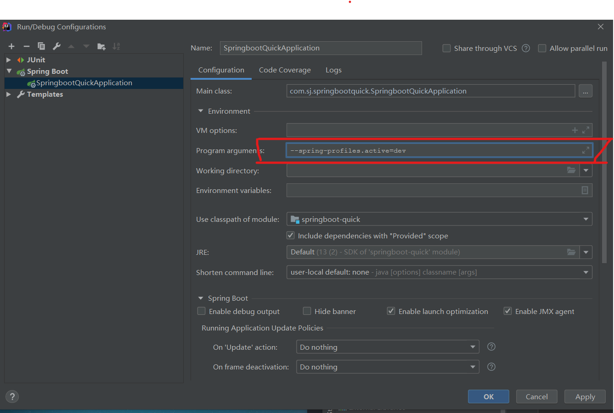
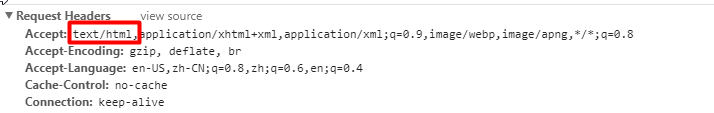

拦截器、本地化](#6、RestfulCRUD)

[数据源配置](#五、数据访问)


## 〇、彩蛋

在resources根目录下放入banner.txt， 即可显示其中的图案。

## 一、SpringBoot入门

### 1、微服务

2014， martion fowler

微服务：构架风格（服务微化）

一个应用应该是一组小服务； 可以通过HTTP协议互通；

每个功能元素最终都是一个可以替换和独立升级的软件单元；

### 2. SpringBoot HelloWorld

#### 1. 创建一个Maven工程

#### 2. 导入依赖spring boot相关的依赖

```xml
    <parent>
        <groupId>org.springframework.boot</groupId>
        <artifactId>spring-boot-starter-parent</artifactId>
        <version>2.2.4.RELEASE</version>
        <relativePath/> <!-- lookup parent from repository -->
    </parent>
    <dependencies>
    <dependencies>
        <dependency>
            <groupId>org.springframework.boot</groupId>
            <artifactId>spring-boot-starter-web</artifactId>
            <version> 2.2.4.RELEASE</version>
        </dependency>
    </dependencies>
    </dependencies>
```

#### 3.编写主程序，启动SpringBoot程序

```java
/*
 * @SpringBootApplication 来标注一个主程序类，说明这是一个SpringBoot应用
 */
@SpringBootApplication
public class Main {
    public static void main(String[] args) {
        SpringApplication.run(Main.class, args);
    }
}
```

#### 4. 编写相关的Controller、Service

```java
@Controller
public class HelloControler {
    @ResponseBody
    @RequestMapping("/hello")
    public String hello(){
        return "Hello World!";
    }
}
```

#### 5.运行主程序测试

#### 6.简化部署

```xml
    <!-- 将SpringBoot应用打包成一个jar包（自带Tomcat） -->
	<build>
        <plugins>
            <plugin>
                <groupId>org.springframework.boot</groupId>
                <artifactId>spring-boot-maven-plugin</artifactId>
            </plugin>
        </plugins>
    </build>
```

### 3. HelloWorld探究

#### 1. POM文件

##### 1. 父项目

```xml
<parent>
    <groupId>org.springframework.boot</groupId>
    <artifactId>spring-boot-starter-parent</artifactId>
    <version>2.2.4.RELEASE</version>
    <relativePath/> <!-- lookup parent from repository --></parent>
<!-- 它的父项目 -->
<parent>
    <groupId>org.springframework.boot</groupId>
    <artifactId>spring-boot-dependencies</artifactId>
    <version>2.2.4.RELEASE</version>
    <relativePath>../../spring-boot-dependencies</relativePath>
</parent>
<!-- 它是真正管理SpringBoot应用里面的所有依赖版本 -->
```

SpringBoot的版本仲裁中心：以后我们导入依赖默认是不需要写版本；（没有在dependencyies里面管理的依赖自然需要声明版本）

##### 2.启动器

```xml
    <dependency>
        <groupId>org.springframework.boot</groupId>
        <artifactId>spring-boot-starter-web</artifactId>
        <version> 2.2.4.RELEASE</version>
    </dependency>
```

###### spring-boot-starter-web: 

​	sping-boot场景启动器：帮我们导入了web模块正常运行所依赖的组件。

SpringBoot将所有的功能场景都抽取出来，做成一个个的starters(启动器)，只需要在项目里面引入这些starter相关场景的所有依赖都会导入进来。要用到什么功能就导入什么场景的启动器。

#### 2.主程序类，主入口类

```java
/*
 * @SpringBootApplication 来标注一个主程序类，说明这是一个SpringBoot应用
 */
@SpringBootApplication
public class Main {
    public static void main(String[] args) {
        SpringApplication.run(Main.class, args);
    }
}
```

* `@SpringBootApplication`

  SpringBoot应用标注在某个类上说明这个类是SpringBoot的主配置类，SpringBoot就应该运行这个类的main方法来启动SpringBoot应用。

  ```java
  @Target({ElementType.TYPE})
  @Retention(RetentionPolicy.RUNTIME)
  @Documented
  @Inherited
  @SpringBootConfiguration
  @EnableAutoConfiguration
  @ComponentScan(
      excludeFilters = {@Filter(
      type = FilterType.CUSTOM,
      classes = {TypeExcludeFilter.class}
  ), @Filter(
      type = FilterType.CUSTOM,
      classes = {AutoConfigurationExcludeFilter.class}
  )}
  )
  public @interface SpringBootApplication {
  ```

  * `@SpringBootConfiguration`:

    SpringBoot的配置类：标注在某个类上，表示这是一个SpringBoot的配置类.

    * `@Configuration`:配置类上来标注这个注解（Spring）

    配置类 ------- 配置文件；配置类也是容器中的一个组件（`@Component`）

  * `@EnableAutoConfiguration`

    开启自动配置功能；

    ```java
    @AutoConfigurationPackage
    @Import(AutoConfigurationImportSelector.class)
    public @interface EnableAutoConfiguration {
    ```

    * `@AutoConfigurationPackage`:自动配置包

      ```java
      @Import(AutoConfigurationPackages.Registrar.class)
      public @interface AutoConfigurationPackage {
      ```

      * `@Import(AutoConfigurationPackages.Registar.class)`:

        Spring的底层注解`@Import`, 给容器导入一个组件；导入的组件由AutoConfigurationPackages.Registar.class

        **将主配置类（@SpringBootApplication标注的类）的所有包及下面所有子包里面的所有组件扫描到Spring容器中。**

    * `@Import(AutoConfigurationImportSelector.class)`

      导入`AutoConfigurationImportSelector`组件

      * `AutoConfigurationImportSelector`:

        将所有需要导入的组件以全类名的方式返回，这些组件被添加到容器中。

        会给容器中导入非常多的自动配置类。就是给容器导入这个场景所需要的所有组件，并配置好这些组件。

        * **SpringBoot在启动的时候从类路径下的META-INF/spring-factories中获取EnableAutoConfiguration指定的值，将这些值作为自动配置类导入到容器中，自动类就生效，帮我们进行自动配置工作。**
        * J2EE的整体整合解决方案和自动配置都在**spring-boot-autoconfigure**-2.2.4.RELEASE中。

### 4.使用Spring Initializer快速创建Spring Boot项目


​	选择需要的模块，向导会联网创建SpringBoot项目。

示例：

目录结构：


```java
package com.sj.springbootquick;

import org.springframework.boot.SpringApplication;
import org.springframework.boot.autoconfigure.SpringBootApplication;

@SpringBootApplication
public class SpringbootQuickApplication {
    public static void main(String[] args) {
        SpringApplication.run(SpringbootQuickApplication.class, args);
    }
}
```

```java
package com.sj.springbootquick.controller;
import org.springframework.stereotype.Controller;
import org.springframework.web.bind.annotation.RequestMapping;
import org.springframework.web.bind.annotation.ResponseBody;
//这个类的所有方法返回的数据直接写给浏览器（如果是对象转为json 数据）
//@ResponseBody
@Controller
//@RestController = @Controller + @ResponseBody
public class HelloController {
    @ResponseBody//返回的数据直接写给浏览器
    @RequestMapping("/hello")
    public String hello(){
        return "hello world quick!";
    }
}
```

默认生成的SpringBoot项目：

* 主程序已经生成好了，我们只需要我们自己的逻辑
* resources文件夹中的目录结构：
  * static: 保存所有的静态资源： js css images。
  * templates:保存所有模板页面；（SpringBoot默认jar包使用嵌入式的Tomcat, 默认不支持jsp页面，可以使用模板引擎：freemaker/thymeleaf）。
  * applicaiton.properties:SpringBoot应用配置文件， 可以修改一些默认配置。

##  二、配置文件

### 1、配置文件

SpringBoot使用一个全局的配置文件，配置文件名是固定的：

application.properties/application.yml

YMAL(YAML Ain't Markup Language)

​		YAML A Markup Language: 是一个标记语言

​		YAML isn't Markup Language: 不是一个标记语言

配置例子：

YAML:

```yaml
server:
	port: 8080
```

XML:

```xml
<server>
	<port>8080</port>
</server>
```

### 2、YAML语法及注入

#### 1、基本语法

```yaml
k:(空格)v:表示一对键值对（空格必须有）
```

以空格的缩进来控制层级关系，只要是左对齐的一列数据，就是同一个层级的

```yaml
server:
	port: 8080
	path: /hello
```

属性和值也是大小写敏感。

#### 2、值的写法

1. 字面量：普通的值（数字，字符串，布尔）

   K: V: 字面直接写

   字符串默认不用加单引号或双引号：

   * 双引号 "":原生字符
   * 单引号 '': 会转义特殊字符

2. 对象、Map(键值对)：

   K: V:在下一行来写对象的属性和值的关系

   ```yaml
   friends:
   	lastName: 张三
   	age: 20
   ```

   行内写法：

   ```yaml
   friends: {lastName: zhangsan,age: 10}
   ```

3. 数组（List、Set）

   用- 值表示数组中的一个元素

   ```yaml
   pets:
   	- cat
   	- dog
   	- pig
   ```

   行内写法

   ```yaml
   pets: [cat,dog,pig]
   ```

#### 3、（注入）YAML配置实例

Person.java

```java
/**
 * 将配置文件中配置的每一个属性的值，映射到这个组件中
 **/
@Component
@ConfigurationProperties(prefix = "person")

/*
@ConfigurationProperties:告诉SpringBoot将本类中的所有属性和配置文件中相关的配置进行绑定
    prefix = "person": 配置文件中哪个下面的所有属性进行一一映射
 */
public class Person {
    private String lastName;
    private Integer age;
    private Boolean boss;
    private Date birth;
    private Map<String, Object> maps;
    private List<Object> list;
    private Dog dog;

    public String getLastName() {
        return lastName;
    }

    public void setLastName(String lastName) {
        this.lastName = lastName;
    }

    public Integer getAge() {
        return age;
    }

    public void setAge(Integer age) {
        this.age = age;
    }

    public Boolean getBoss() {
        return boss;
    }

    public void setBoss(Boolean boss) {
        this.boss = boss;
    }

    public Date getBirth() {
        return birth;
    }

    public void setBirth(Date birth) {
        this.birth = birth;
    }

    public Map<String, Object> getMaps() {
        return maps;
    }

    public void setMaps(Map<String, Object> maps) {
        this.maps = maps;
    }

    public List<Object> getList() {
        return list;
    }

    public void setList(List<Object> list) {
        this.list = list;
    }

    public Dog getDog() {
        return dog;
    }

    public void setDog(Dog dog) {
        this.dog = dog;
    }

    @Override
    public String toString() {
        return "Person{" +
                "lastName='" + lastName + '\'' +
                ", age=" + age +
                ", boss=" + boss +
                ", birth=" + birth +
                ", maps=" + maps +
                ", list=" + list +
                ", dog=" + dog +
                '}';
    }
}
```

Gog.java

```java
public class Dog {
    private String name;
    private Integer age;

    public String getName() {
        return name;
    }

    public void setName(String name) {
        this.name = name;
    }

    public Integer getAge() {
        return age;
    }

    public void setAge(Integer age) {
        this.age = age;
    }

    @Override
    public String toString() {
        return "Dog{" +
                "name='" + name + '\'' +
                ", age=" + age +
                '}';
    }
}
```

application.yml

```yaml
person:
  lastName: zhangsang
  age: 18
  boss: false
  birth: 2020/1/1
  maps: {k1: v1, k2: v2}
  lists:
    - list
    - zhaoliu
  dog:
    name: xiaogou
    age: 2
```

测试类

```java
@RunWith(SpringRunner.class)//使用spring的驱动器跑，而不是Junit
@SpringBootTest
class SpringbootQuickApplicationTests {
    @Autowired
    Person person;
    @Test
    void contextLoads() {
        System.out.println(person);
    }

}
```

我们可以导入配置文件处理器，以后编写配置文件就有提示了

```xml
<dependency>
    <groupId>org.springframework.boot</groupId>
    <artifactId>spring-boot-configuration-processor</artifactId>
</dependency>
```

#### 4、（注入）properties 配置文件乱码

将[配置实例](#3、配置实例)中的yml文件内容，用properties文件实现

```properties
person.last-name=张三
person.age=18
person.birth=2020/1/1
person.boss=false
person.dog.name=dog
person.dog.age=2
```

运行时中文输出会出现乱码，进行如下设置：


#### 5、（注入）使用@Value获取值

也可以使用spring注解`@Value`进行数据注入

application.properties文件

```properties
person.last-name=张三
person.age=18
person.birth=2020/1/1
person.boss=false
person.dog.name=dog
person.dog.age=2
```

bean文件(get和set方法被省略)

```java
public class Person {
    @Value("${person.last-name}")
    private String lastName;
    @Value("#{11 * 2}")//SpEL
    private Integer age;
    @Value("true")
    private Boolean boss;
    private Date birth;
    private Map<String, Object> maps;
    private List<Object> list;
    private Dog dog;
    //Get and Set...
}
```

#### 6、注入小结

|                                            | @ConfigurationProperties |   @Value   |
| :----------------------------------------: | :----------------------: | :--------: |
|                    功能                    | 批量注入配置文件中的属性 | 一个个指定 |
| 松散绑定（松散语法：user_name==>userName） |           支持           |   不支持   |
|                    SpEL                    |          不支持          |    支持    |
|               JSR303数据校验               |           支持           |   不支持   |
|                复杂类型封装                |           支持           |   不支持   |

> JSR303数据校验：
>
> ```java
> public class Person {
>     @Email//规定lastName必须是邮箱格式的
>     private String lastName;
>     //Get and Set...
> }
> ```

#### 7、 @PropertySource  @ImportResource

1. PropertySource

   @ConfiguratuinProperties注解默认向默认配置文件获取值。

   如果想向指定配置文件获取值，使用`@PropertySource`指定配置文件

   示例:

   ```properties
   # person.properties
   person.last-name=李四
   person.age=18
   person.birth=2020/1/1
   person.boss=false
   person.dog.name=dog
   person.dog.age=2
   ```

   ```java
   @Component
   @PropertySource(value = {"classpath:person.properties"})//告诉SpringBoot到指定文件加载信息
   @ConfigurationProperties(prefix = "person")
   public class Person {
       private String lastName;
       private Integer age;
       private Boolean boss;
       private Date birth;
       private Map<String, Object> maps;
       private List<Object> list;
       private Dog dog;
       //Get and Set....
   }
   ```

2. @ImportResource

   导入Spring的配置文件，让配置文件的内容生效。

   SpringBoot里面没有Spring的配置文件，我们自己编写的配置文件也不能自动识别。

   如果想让Spring配置文件加载，要把`@ImportResource`标注在一个配置类上。

   ```java
   @ImportResource(locations = {"classpath:beans.xml"})
   ```

   **SpringBoot推荐给容器中添加组件的方式**：推荐全注解的方式（spring笔记：**基于配置类的IOC配置**）

   1. 配置类===Spring配置文件
   2. 使用@Bean给容器添加组件

### 3、配置文件的占位符

* 配置文件中可以使用**随机数**

  ${random.value}  ${random.int} ${random.long} ${random.int(10)}  ${random.int[1024, 65536]}

* 属性配置**占位符**

  ```properties
  person.last-name=张三
  person.age=${random.int}
  person.dog.name=${person.last-name}_dog
  ```

  > ${person.last-name:默认值}来指定找不到属性时的默认值

### 4、Profile

#### 1. 多Profile文件

我们在主配置文件编写的时候，文件名可以使：application-{profile}.properties/yml

默认使用application.properties的配置

#### 2.yml支持多文档块的方式

```yaml
# 激活pro模块的设置
server:
  port: 8081
spring:
  profiles:
    active: pro
---
# dev文档块
server:
  port: 8082
spring:
  profiles: dev
---
# pro文档块
server:
  port: 8083
spring:
  profiles: pro

```

#### 3. 激活指定profile

1. 在配置文件中指定`spring.profiles.active=dev`

2. 命令行

   ```shell
   --spring-profiles.active=dev
   ```

   * IDEA添加该设置：

     

   * cmd配置方式：

     在打包后的目录下打开命令行

     ```shell
     java -jar springboot-quick-0.0.1-SNAPSHOT.jar --spring.profiles.active=dev 
     ```

   3. 虚拟机参数

      ```shell
      -Dspring.profiles.active=dev
      ```

      IDEA配置

      

### 5.配置文件位置


> classpath: 可以理解为resources文件目录

SpringBoot会从这四个位置全部加载主配置文件，**互补配置**。

我们还可以使用spring.config.location来改变默认的配置文件位置

**项目打包好后，我们可以使用命令行参数的形式，启动项目的时候赖志定配置文件的新位置；指定配置文件和默认加载的这些配置文件共同起作用形成互补配置。**

例如

```shell
java -jar springboot-quick-0.0.1-SNAPSHOT.jar --spring.config.location=D:app/application.properties
```

### 6、外部配置的加载顺序

SpringBoot也可以从以下位置加载配置：优先从高到低；高优先级的配置覆盖低优先级的配置，所有的配置会形成互补配置。

**1.命令行参数**

```shell
java -jar springboot-quick-0.0.1-SNAPSHOT.jar --server.port=8081
```

2.来自java:comp/env的JNDI属性

3.Java系统属性( System.getProperties() )

4.操作系统环境变量

5.RandomValuePropertySource配置的random.*属性值

==**由jar包外向jar包内**==

* ==**优先加载带profile**==

  **6.jar包外部的application-{profile}.properties或application.yml(带spring.profile)配置文件**

  **7.jar包内部的application-{profile}.properties或application.yml(带spring.profile)配置文件**

* **==再来加载不带profile==**

  **8.jar包外部的application.properties或application.ym(不带spring.profile)配置文件**

  **9.jar包内部的application.properties或application.ym(不带spring.profile)配置文件**

10.@Configuration注解类上的@PropertySource

11.通过SpringApplication.setDefaultProperties指定的默认属性

### 7、 自动配置原理

可以配置的属性见[说明文档](https://docs.spring.io/spring-boot/docs/2.2.4.RELEASE/reference/html/appendix-application-properties.html#common-application-properties)

注解结构如下：

@SpringBootApplication

* @SpringBootConfiguration： SpringBoot的配置

  * @Configuration： 说明这也是也spring的组件

* @EnableAutoConfiguration：自动配置

  * @AutoConfigurationPackage:自动配置包

    * @Import(AutoConfigurationPackages.Registrar.class)：自动配置包注册

  * @Import(AutoConfigurationImportSelector.class)：导入选择器

    * 获取候选配置

      ```java
      List<String> configurations = getCandidateConfigurations(annotationMetadata, attributes);
      ```

图解如下：


1. 自动配置原理

   * SpringBoot 启动的时候加载主配置类，开启了自动配置功能 `@EnableAutoConfiguration`

   * `@EnableAutoConfiguration`作用：

     * 利用AutoConfigurationImportSelector给容器导入一些组件

     * 查看AutoConfigurationImportSelector的selectImports()方法的内容：

       * ```java
         //以下为源码
         List<String> configurations = getCandidateConfigurations(annotationMetadata, attributes);//获取候选的配置
         
         .....//剩下的看不懂了....
         ```
    ```
     
    ```
* **总之将类路径下的META-INF.spring.factories里面配置的所有EnableAutoConfiguration的值加入到容器中。**
  
       ```properties
       org.springframework.boot.autoconfigure.EnableAutoConfiguration=\
       org.springframework.boot.autoconfigure.admin.SpringApplicationAdminJmxAutoConfiguration,\
       org.springframework.boot.autoconfigure.aop.AopAutoConfiguration,\
       org.springframework.boot.autoconfigure.amqp.RabbitAutoConfiguration,\
       org.springframework.boot.autoconfigure.batch.BatchAutoConfiguration,\
       org.springframework.boot.autoconfigure.cache.CacheAutoConfiguration,\
       #..... 文件过长，只截取部分
  ```
     
  每一个这样的 xxxAutoConfiguration类都是容器中的一个容器，都加入到容器中，用他们来做配置
  ```
  
* 以 **HttpEncodingAutoConfiguration**为例解释自动配置原理
  
       ```java
       //以下为源码
       @Configuration(proxyBeanMethods = false)//表示这是个配置类
       @EnableConfigurationProperties(HttpProperties.class)//启用指定类的ConfigurationProperties功能,将配置文件中对应的值和HttpProperties绑定起来，并加入到IOC容器中
       @ConditionalOnWebApplication(type = ConditionalOnWebApplication.Type.SERVLET)//Spring底层@Conditional注解，根据不同条件，如果满足指定的条件整个配置类里面的配置才会生效。  （判断当前应用是否是web应用）
       @ConditionalOnClass(CharacterEncodingFilter.class)//判断当前项目有没有这个类CharacterEncodingfilter:SpringMVC中进行乱码解决的过滤器
       @ConditionalOnProperty(prefix = "spring.http.encoding", value = "enabled", matchIfMissing = true)//判断文件中是否存在某个配置 spring.http.encoding，如果不存在，判断是成立的
       //总之，以上注解就是根据当前不同的条件判断，决定这个配置类是否生效。
       public class HttpEncodingAutoConfiguration {
           private final HttpProperties.Encoding properties;
       
           //只有一个有参构造请的情况下，参数的值就会从容器中拿
       	public HttpEncodingAutoConfiguration(HttpProperties properties) {
       		this.properties = properties.getEncoding();
       	}
           
       	@Bean//给容器中添加组件
       	@ConditionalOnMissingBean
       	public CharacterEncodingFilter characterEncodingFilter() {
       		CharacterEncodingFilter filter = new OrderedCharacterEncodingFilter();
       		filter.setEncoding(this.properties.getCharset().name());
       		filter.setForceRequestEncoding(this.properties.shouldForce(Type.REQUEST));
       		filter.setForceResponseEncoding(this.properties.shouldForce(Type.RESPONSE));
       		return filter;
       	}
  }
     ```
  
     上面源码可以看出，关于 **HttpEncodingAutoConfiguration**相关的配置都是被封装在**HttpProperties**类中的，查看该类**源码**
       
       ```java
       //以下为源码
       @ConfigurationProperties(prefix = "spring.http")
       public class HttpProperties {
       	private boolean logRequestDetails;
       	private final Encoding encoding = new Encoding();
       
       	public boolean isLogRequestDetails() {
       		return this.logRequestDetails;
       	}
       
       	public void setLogRequestDetails(boolean logRequestDetails) {
       		this.logRequestDetails = logRequestDetails;
       	}
       
       	public Encoding getEncoding() {
       		return this.encoding;
       	}
       
       	public static class Encoding {
       
       		public static final Charset DEFAULT_CHARSET = StandardCharsets.UTF_8;
               
       		private Charset charset = DEFAULT_CHARSET;
       
       		private Boolean force;
       
       		private Boolean forceRequest;
       
       		private Boolean forceResponse;
       
       		private Map<Locale, Charset> mapping;
       
       		public Charset getCharset() {
       			return this.charset;
       		}
       
       		public void setCharset(Charset charset) {
       			this.charset = charset;
       		}
       
       		public boolean isForce() {
       			return Boolean.TRUE.equals(this.force);
       		}
       
       		public void setForce(boolean force) {
       			this.force = force;
       		}
       
       		public boolean isForceRequest() {
       			return Boolean.TRUE.equals(this.forceRequest);
       		}
       
       		public void setForceRequest(boolean forceRequest) {
       			this.forceRequest = forceRequest;
       		}
       
       		public boolean isForceResponse() {
       			return Boolean.TRUE.equals(this.forceResponse);
       		}
       
       		public void setForceResponse(boolean forceResponse) {
       			this.forceResponse = forceResponse;
       		}
       
       		public Map<Locale, Charset> getMapping() {
       			return this.mapping;
       		}
       
       		public void setMapping(Map<Locale, Charset> mapping) {
       			this.mapping = mapping;
       		}
       
       		public boolean shouldForce(Type type) {
       			Boolean force = (type != Type.REQUEST) ? this.forceResponse : this.forceRequest;
       			if (force == null) {
       				force = this.force;
       			}
       			if (force == null) {
       				force = (type == Type.REQUEST);
       			}
       			return force;
       		}
       
       		public enum Type {
       
       			REQUEST, RESPONSE
       
       		}
       
       	}
       
  }
     
     ```
  
       这个类是由配置文件注入，因此我们写配置文件
  
  ```properties
     spring.http.encoding.enable=true
  ```
  
  即可注入HttpProperties.encoding.enable的值。
  
  **总结：一旦配置类生效，这个配置类就会给容器中添加各种组件；这些组件的属性时从对应的properties类中获取的，这些类里面的每一个属性又是和配置文件绑定的。**
  
       xxxAutoAconfiguration:自动配置的类，给容器添加组件
       
       xxxProperties:封装配置文件中相关属性
  
2. 细节

   1. @Conditional派生注解

      作用：必须是@Condition指定的条件成立，才给容器中添加组件，配置类里面的所有内容才生效。

      | @Conditional扩展注解          | 作用(判断是否满足当前指定条件)                     |
      | ----------------------------- | -------------------------------------------------- |
      | @ConditionalOnjava            | 系统的java版本是否符合要求                         |
      | @ConditionalOnBean            | 容器中存在指定Bean ;                               |
      | @ConditionalOnMissingBean     | 容器中不存在指定Bean ;                             |
      | @ConditionalOnExpression      | 满足SpEL表达式指定                                 |
      | @ConditionalOnClass           | 系统中有指定的类                                   |
      | @ConditionalOnMissingClass    | 系统中没有指定的类                                 |
      | @ConditionalOnSingleCandidate | 容器中只有一一个指定的Bean ,或者这个Bean是首选Bean |
      | @ConditionalOnProperty        | 系统中指定的属性是否有指定的值                     |

      自动配置类必须在一定条件下才能生效。

      我们可以通过启用debug=true属性来让控制台打印自动配置报告，这样就很方便的知道哪些配置类生效了。

## 三、日志

### 1、日志框架

| 日志门面( 日志的抽象层)                                      | 日志实现                                            |
| ------------------------------------------------------------ | --------------------------------------------------- |
| ~~JCL ( Jakarta Commons Logging )~~ SLF4j ( Simple LoggingFacade for Java) ~~jboss-logging~~ | Log4j    JUL( java.util.logging )    Log4j2 Logback |

日志门面：SLF4j

日志实现：Logback

SpringBoot:底层是spring框架，Spring框架默认是JCL; SpringBoot选用SLF4j 和logback.

### 2、SLF4j使用

#### 1.如何在系统使用SLF4j

> 以后开发时，日志记录方法的调用，不应该直接调用日志的实现类，而是调用日志抽象层里面的方法。

给系统导入slf4j的jar和 logback的实现jar

```java
import org.slf4j.Logger;
import org.slf4j.LoggerFactory;

public class HelloWorld {
  public static void main(String[] args) {
    Logger logger = LoggerFactory.getLogger(HelloWorld.class);
    logger.info("Hello World");
  }
}
```


每个日志的实现框架都有自己的配置文件。使用slf4j后，配置文件还是做成 日志实现框架的配置文件。

#### 2、遗留问题

如何让系统中所有的日志统一到slf4j:

* 将系统中其他的日志框架先排除出去

* 用中间包替换原有的日志框架

* 我们导入slf4j其他实现

  

### 3、SpringBoot日志关系

```xml
<dependency>
  <groupId>org.springframework.boot</groupId>
  <artifactId>spring-boot-starter</artifactId>
  <version>2.2.4.RELEASE</version>
  <scope>compile</scope>
</dependency>
```

SpringBoot用它来作日志

```xml
<dependency>
  <groupId>org.springframework.boot</groupId>
  <artifactId>spring-boot-starter-logging</artifactId>
  <version>2.2.4.RELEASE</version>
  <scope>compile</scope>
</dependency>
```


总结：

* SpringBoot底层也是使用slf4j+logback的方式记录日志

* SpringBoot也把其他的日志都替换成了slf4j

  替换包举例：将log4j 替换为slf4j

  

* 如果我们引入其他框架，一定要把这个框架的默认日志依赖移除掉

* **SpringBoot能自动适配所有的日志，而且底层使用slf4j+logback的方式记录日志，引入其他框架的时候，只需要把这个框架依赖的日志框架排除掉**

### 4、日志使用

修改SpringBoot日志的默认配置

```properties
# 将com.sj.springbootquick包下的日志界别改为trace级别
logging.level.com.sj.springbootquick = trace

# 不指定路径，默认在当前项目下生成springboot.log日志

# 在当前磁盘的跟路径下创建spring文件夹和里面的log文件夹，使用spring.log作为默认文件
logging.file.path=/spring/log

# 在控制台输出日志的格式
logging.pattern.console=%d{yyyy-MM-dd HH:mm:ss.SSS} [%thread] %-5level %logger{50} - %msg%n

# 在文件中日志输出的格式
logging.pattern.file=%d{yyyy-MM-dd HH:mm:ss.SSS} [%thread] %-5level %logger{50} - %msg%n
```

日志输出格式

    日志输出格式：
    	%d表示日期时间，
    	%thread表示线程名，
    	%-5level：级别从左显示5个字符宽度
    	%logger{50} 表示logger名字最长50个字符，否则按照句点分割。 
    	%msg：日志消息，
    	%n是换行符
    -->
    %d{yyyy-MM-dd HH:mm:ss.SSS} [%thread] %-5level %logger{50} - %msg%n
输出日志示例

```java
@SpringBootTest
class SpringbootQuickApplicationTests {
    Logger logger = LoggerFactory.getLogger(getClass());
    @Test
    void contextLoads() {
        /*
         * 日志的级别：
         * 由低到高 trace < debug < info < warn < error
         * SpringBoot默认使用info级别的
         * 没有指定级别的就用SpringBoot默认规定的级别：root级别
         */
        logger.trace("这是trace日志");
        logger.debug("这是debug日志");
        logger.info("这是info日志");
        logger.warn("这是warn日志");
        logger.error("这是error日志");
    }
}
```

SpringBoot对logger的默认配置在spring-boot包下org.springframework.boot.logging下

详细Logging配置在SpringBoot[说明文档](https://docs.spring.io/spring-boot/docs/2.2.4.RELEASE/reference/html/index.html)中Feature标签的Logging中。

#### 1. 指定位置

给类路径下放上每个日志框架自己的配置文件即可，SpringBoot就不使用其它默认配置了。

| Logging System          | Customization                                                |
| :---------------------- | :----------------------------------------------------------- |
| Logback                 | `logback-spring.xml`, `logback-spring.groovy`, `logback.xml`, or `logback.groovy` |
| Log4j2                  | `log4j2-spring.xml` or `log4j2.xml`                          |
| JDK (Java Util Logging) | `logging.properties`                                         |

logback.xml: 直接被日志框架识别了。

**logback-spring.xml**：日志框架就不直接加载日志的配置项，由SpringBoot解析日志配置，可以使用SpringBoot的高级Profile功能

```xml
<springProfile name="staging">
    <!-- configuration to be enabled when the "staging" profile is active -->
  	可以指定某段配置只在某个环境下生效
</springProfile>

```

如：

```xml
<appender name="stdout" class="ch.qos.logback.core.ConsoleAppender">
        <!--
        日志输出格式：
			%d表示日期时间，
			%thread表示线程名，
			%-5level：级别从左显示5个字符宽度
			%logger{50} 表示logger名字最长50个字符，否则按照句点分割。 
			%msg：日志消息，
			%n是换行符
        -->
        <layout class="ch.qos.logback.classic.PatternLayout">
            <springProfile name="dev">
                <pattern>%d{yyyy-MM-dd HH:mm:ss.SSS} ----> [%thread] ---> %-5level %logger{50} - %msg%n</pattern>
            </springProfile>
            <springProfile name="!dev">
                <pattern>%d{yyyy-MM-dd HH:mm:ss.SSS} ==== [%thread] ==== %-5level %logger{50} - %msg%n</pattern>
            </springProfile>
        </layout>
</appender>
```


如果使用logback.xml作为日志配置文件，还要使用profile功能，会有以下错误

 `no applicable action for [springProfile]`

#### 2. 切换日志框架（例：logback 切换）

1. 切换原理（例：logback切换 log4j）

   

   * 排除掉logback包,导入log4j包
   * 排除将log4j转为slf4j的包
   * 导入使用log4j实现slf4j接口的适配包（slf4-log4j）

2. 使用starter切换到log4j2

   

   加入新依赖

   ```xml
   <dependency>
       <groupId>org.springframework.boot</groupId>
       <artifactId>spring-boot-starter-log4j2</artifactId>
   </dependency>
   ```

## 四、Web开发

### 1、简介

使用SpringBoot:

* 创建SpringBoot应用，选中我们需要的模块
* SpringBoot已经默认将这些场景配置好了，只需要配置文件中指定少量配置就可以运行起来
* 自己编写业务代码

自动配置原理？：

​	这个场景SpringBoot帮我们配置了什么？能不能修改？能修改那	些配置？能不能扩展？

```java
xxxAutoConfiguration: 帮我们给容器中自动配置组件
xxxProperties:配置类来封装配置文件的内容
```

### 2、SpringBoot对静态资源的映射规则

```java
@ConfigurationProperties(prefix = "spring.resources", ignoreUnknownFields = false)
public class ResourceProperties {
//可以设置和资源有关的参数，如缓存时间
```

> SpringBoot对SpringMVC的相关配置在WebMvcAutoConfiguration 类下。

```java
//以下为源码
WebMvcAuotConfiguration：
		@Override
		public void addResourceHandlers(ResourceHandlerRegistry registry) {
			if (!this.resourceProperties.isAddMappings()) {
				logger.debug("Default resource handling disabled");
				return;
			}
			Integer cachePeriod = this.resourceProperties.getCachePeriod();
			if (!registry.hasMappingForPattern("/webjars/**")) {
				customizeResourceHandlerRegistration(
						registry.addResourceHandler("/webjars/**")
								.addResourceLocations(
										"classpath:/META-INF/resources/webjars/")
						.setCachePeriod(cachePeriod));
			}
			String staticPathPattern = this.mvcProperties.getStaticPathPattern();
          	//静态资源文件夹映射
			if (!registry.hasMappingForPattern(staticPathPattern)) {
				customizeResourceHandlerRegistration(
						registry.addResourceHandler(staticPathPattern)
								.addResourceLocations(
										this.resourceProperties.getStaticLocations())
						.setCachePeriod(cachePeriod));
			}
		}

        //配置欢迎页映射
		@Bean
		public WelcomePageHandlerMapping welcomePageHandlerMapping(
				ResourceProperties resourceProperties) {
			return new WelcomePageHandlerMapping(resourceProperties.getWelcomePage(),
					this.mvcProperties.getStaticPathPattern());
		}

       //配置喜欢的图标
		@Configuration
		@ConditionalOnProperty(value = "spring.mvc.favicon.enabled", matchIfMissing = true)
		public static class FaviconConfiguration {

			private final ResourceProperties resourceProperties;

			public FaviconConfiguration(ResourceProperties resourceProperties) {
				this.resourceProperties = resourceProperties;
			}

			@Bean
			public SimpleUrlHandlerMapping faviconHandlerMapping() {
				SimpleUrlHandlerMapping mapping = new SimpleUrlHandlerMapping();
				mapping.setOrder(Ordered.HIGHEST_PRECEDENCE + 1);
              	//所有  **/favicon.ico 
				mapping.setUrlMap(Collections.singletonMap("**/favicon.ico",
						faviconRequestHandler()));
				return mapping;
			}

			@Bean
			public ResourceHttpRequestHandler faviconRequestHandler() {
				ResourceHttpRequestHandler requestHandler = new ResourceHttpRequestHandler();
				requestHandler
						.setLocations(this.resourceProperties.getFaviconLocations());
				return requestHandler;
			}

		}
```


1. **所有/webjars/**下的请求，都去classpath:/META-INF/resources/webjars/下找资源**

   > webjars:以jar的形式访问web静态资源（例：jQuery）
   >
   > 例引入jQuery的依赖
   >
   > ```xml
   > <dependency>
   >     <groupId>org.webjars</groupId>
   >     <artifactId>jquery</artifactId>
   >     <version>3.3.1</version>
   > </dependency>
   > ```

   wabjars目录结构：

   

   localhost:8080/webjars/jquery/3.4.1/jquery.js

2. **/\*\* 访问当前项目的任何资源**

   ```
   "classpath:/META-INF/resources/"
   "classpath:/resources/"
   "classpath:/static/"
   "classpath:/public/" 
   "/" :当前项目的根路径
   ```
   
3. **欢迎页：静态资源文件夹下的所有index.html页面， 被 /\*\* 映射**

   > 在SpringBoot默认静态资源访问路径下添加名为index.html文件，那么访问localhost:8080,会自动跳转到这个index.html

4. **所有的 \*\*/favicon.ico 都是在静态资源文件下找**

   > 在SpringBoot中，可以把ico格式的图标放在默认静态资源文件路径下，并以favicon.ico命名，应用图标会自动变成指定的图标（谷歌浏览器下不显示）
   >
   > **上述SpringBoot 2.2.x不支持，想要自定义图标，需要自己在网页中添加**
   >
   > ```
   > <link rel="icon" th:href="@{/favicon.ico}" type="image/x-icon"/>
   > <link rel="bookmark" th:href="@{/favicon.ico}" type="image/x-icon"/>
   > ```

5. 改变静态文件的路径：

   ```properties
   spring.resources.static-locations=classpath:/hello/,classpath:/static/
   ```
   
6. 自定义资源映射

   ```java
   @Override
   public void addResourceHandlers(ResourceHandlerRegistry registry) {
       //registry.setOrder(Integer.MAX_VALUE);
       registry.addResourceHandler("/favicon.ico").addResourceLocations("classpath:/static/favicon.ico");
       registry.addResourceHandler("/static/**").addResourceLocations("classpath:/static/");
       registry.addResourceHandler("/**/favicon.ico").addResourceLocations("classpath:/static/favicon.ico");
       // .setCachePeriod(3600);
   }
   ```

### 3、 模板引擎

JSP、Velocity、Freemarker、Thymeleaf


SpringBoot推荐的Thymeleaf；

语法更简单，功能更强大；

#### 1. 引入Thymeleaf

```xml
<dependency>
    <groupId>org.springframework.boot</groupId>
    <artifactId>spring-boot-starter-thymeleaf</artifactId>
</dependency>
```

> SpringBoot低版本可能使用的Thymeleaf版本较低，所以要切换版本
>
> ```xml
> <properties>
> 		<thymeleaf.version>3.0.9.RELEASE</thymeleaf.version>
> 		<!-- 布局功能的支持程序  thymeleaf3主程序  layout2以上版本 -->
> 		<!-- thymeleaf2   layout1-->
> 		<thymeleaf-layout-dialect.version>2.2.2</thymeleaf-layout-dialect.version>
> </properties>
> ```

#### 2. Thymeleaf使用

> 详细使用文档见[官网文档](https://www.thymeleaf.org/documentation.html)

```java
//以下为源码
@ConfigurationProperties(prefix = "spring.thymeleaf")
public class ThymeleafProperties {
private static final Charset DEFAULT_ENCODING = Charset.forName("UTF-8");

private static final MimeType DEFAULT_CONTENT_TYPE = MimeType.valueOf("text/html");

public static final String DEFAULT_PREFIX = "classpath:/templates/";

public static final String DEFAULT_SUFFIX = ".html";
//只要我们把HTML页面放在classpath:/templates/，Thymeleaf便可自动渲染。
```

 只要我们把HTML页面放在classpath:/templates/, thymeleaf就能自动解析。

使用：

1. 导入thymeleaf的名称空间

   ```html
   <html xmlns:th="http://www.thymeleaf.org">
   ```

2. 使用Thymeleaf语法

   ```html
   <div th:text="${hello}"></div>
   ```

#### 3. 语法规则

1. th:text : 改变当前元素里面的文本内容

   th: 任意html属性   : 来替换原生属性的值

   

2. 表达式

   ```properties
   Simple expressions:（表达式语法）
       Variable Expressions: ${...}：获取变量值；OGNL；
       		1）获取对象的属性、调用方法
       		2）使用内置的基本对象：
               #ctx : the context object.
               #vars: the context variables.
               #locale : the context locale.
               #request : (only in Web Contexts) the HttpServletRequest object.
               #response : (only in Web Contexts) the HttpServletResponse object.
               #session : (only in Web Contexts) the HttpSession object.
               #servletContext : (only in Web Contexts) the ServletContext object.
                   
                   ${session.foo}
               3）内置的一些工具对象：
   #execInfo : information about the template being processed.
   #messages : methods for obtaining externalized messages inside variables expressions, in the same way as they would be obtained using #{…} syntax.
   #uris : methods for escaping parts of URLs/URIs
   #conversions : methods for executing the configured conversion service (if any).
   #dates : methods for java.util.Date objects: formatting, component extraction, etc.
   #calendars : analogous to #dates , but for java.util.Calendar objects.
   #numbers : methods for formatting numeric objects.
   #strings : methods for String objects: contains, startsWith, prepending/appending, etc.
   #objects : methods for objects in general.
   #bools : methods for boolean evaluation.
   #arrays : methods for arrays.
   #lists : methods for lists.
   #sets : methods for sets.
   #maps : methods for maps.
   #aggregates : methods for creating aggregates on arrays or collections.
   #ids : methods for dealing with id attributes that might be repeated (for example, as a result of an iteration).
   
       Selection Variable Expressions: *{...}：选择表达式：和${}在功能上是一样；
       	补充：配合 th:object="${session.user}：
      <div th:object="${session.user}">
       <p>Name: <span th:text="*{firstName}">Sebastian</span>.</p>
       <p>Surname: <span th:text="*{lastName}">Pepper</span>.</p>
       <p>Nationality: <span th:text="*{nationality}">Saturn</span>.</p>
       </div>
       
       Message Expressions: #{...}：获取国际化内容
       Link URL Expressions: @{...}：定义URL；
       		@{/order/process(execId=${execId},execType='FAST')}
       Fragment Expressions: ~{...}：片段引用表达式
       		<div th:insert="~{commons :: main}">...</div>
       		
   Literals（字面量）
         Text literals: 'one text' , 'Another one!' ,…
         Number literals: 0 , 34 , 3.0 , 12.3 ,…
         Boolean literals: true , false
         Null literal: null
         Literal tokens: one , sometext , main ,…
   Text operations:（文本操作）
       String concatenation: +
       Literal substitutions: |The name is ${name}|
   Arithmetic operations:（数学运算）
       Binary operators: + , - , * , / , %
       Minus sign (unary operator): -
   Boolean operations:（布尔运算）
       Binary operators: and , or
       Boolean negation (unary operator): ! , not
   Comparisons and equality:（比较运算）
       Comparators: > , < , >= , <= ( gt , lt , ge , le )
       Equality operators: == , != ( eq , ne )
   Conditional operators:条件运算（三元运算符）
       If-then: (if) ? (then)
       If-then-else: (if) ? (then) : (else)
       Default: (value) ?: (defaultvalue)
   Special tokens:
       No-Operation: _ 
   ```

3. 简单使用

   Controller：

   ```java
   @Controller
   public class Success {
       @RequestMapping("/success")
       public String success(Map<String, Object> map){
           map.put("hello", "<h1>你好</h1>");
           map.put("users", Arrays.asList("Zhangsan", "Wangwu", "Lisi"));
           return "success";
       }
   }
   ```

   html页面：

   ```html
   <!DOCTYPE html>
   <!--名称空间-->
   <html xmlns:th="http://www.thymeleaf.org">
   <head>
       <meta charset="UTF-8">
   </head>
   <body>
   <div id="div01" class="myDiv" th:id="${hello}" th:class="${hello}" th:text="${hello}">这是现实欢迎信息</div>
   <hr/>
   
   <!--<div>[[${hello}]]</div> 转义-->
   <div th:text="${hello}"></div>
   <!--<div>[(${hello})]</div>   不转义-->
   <div th:utext="${hello}"></div>
   <hr/>
   
   <!-- th:each 每次遍历都会产生当前这个标签 -->
   <!-- 3个 <h4> -->
   <h4 th:text="${user}" th:each="user:${users}"></h4>
   <hr/>
   <!-- 一个<h4> 里面3个 <span> -->
   <h4>
       <span th:each="user:${users}">[[${user}]]</span>
   </h4>
   </body>
   </html>
   ```
   

### 4、SpringMVC自动配置

详见[官方文档](https://docs.spring.io/spring-boot/docs/2.2.4.RELEASE/reference/html/spring-boot-features.html#boot-features-developing-web-applications)

#### 1. SpringMVC auto-configuration

> Spring Boot provides auto-configuration for Spring MVC that works well with most applications.
>
> The auto-configuration adds the following features on top of Spring’s defaults:
>
> - Inclusion of `ContentNegotiatingViewResolver` and `BeanNameViewResolver` beans.
>
>   * 自动配置了ViewResolver(视图解析器：根据方法的返回值得到视图对象（View), 视图对象决定如何渲染（转发？重定向）)
>
>   * `ContentNegotiatingViewResolver` ：组合所有视图解析器
>
>   * ==**如何定制？**==
>
>     * ==**我们可以自己给容器添加一个视图解析器，框架会自动将其组合进来。**==
>
>       ```java
>       @Configuration
>       public class Demo {
>           @Bean
>           public ViewResolver myViewResolver(){
>               return new MyViewResolver();
>           }
>           
>           public static class MyViewResolver implements ViewResolver {
>               @Override
>               public View resolveViewName(String s, Locale locale) throws Exception {
>                   return null;
>               }
>           }
>       }
>       ```
>
> - Support for serving static resources, including support for WebJars (covered [later in this document](https://docs.spring.io/spring-boot/docs/2.2.4.RELEASE/reference/html/spring-boot-features.html#boot-features-spring-mvc-static-content))).   静态资源文件夹路径，webjars
>
> - Automatic registration of `Converter`, `GenericConverter`, and `Formatter` beans.
>
>   * Converter: 转换器，自动封装数据（例：将“18” 转换为Integer）,类型转换使用Converter
>
>   * Formatter: 格式化器，(例 ：2017-12-17 ===》 Date）
>
>     * 要它起作用要在文件中配置日期格式化规则
>
>       ```java
>       @ConfitionalOnProperty(prefix="spring.mvc", name = "date-format")
>       //SpringBoot 2.x未发现
>       ```
>
>     * 自己添加的格式化器转换器，我们只要放到容器中即可
>
> - Support for `HttpMessageConverters` (covered [later in this document](https://docs.spring.io/spring-boot/docs/2.2.4.RELEASE/reference/html/spring-boot-features.html#boot-features-spring-mvc-message-converters)).
>
>   * `HttpMessageConverter` ：SpringMVC用来转换Http请求和相应的； User--json
>   * `HttpMessageConverters` 是从容器中确定；获取所有的`HttpMessageConverter`
>   * ==**自己给容器中添加`HttpMessageConverter`,只需要将自己的组件注册容器中（@Bean, @Component）**== 
>
> - Automatic registration of `MessageCodesResolver` (covered [later in this document](https://docs.spring.io/spring-boot/docs/2.2.4.RELEASE/reference/html/spring-boot-features.html#boot-features-spring-message-codes)).定义代码生成规则
>
> - Static `index.html` support.       静态首页访问
>
> - Custom `Favicon` support (covered [later in this document](https://docs.spring.io/spring-boot/docs/2.2.4.RELEASE/reference/html/spring-boot-features.html#boot-features-spring-mvc-favicon)).
>
> - Automatic use of a `ConfigurableWebBindingInitializer` bean (covered [later in this document](https://docs.spring.io/spring-boot/docs/2.2.4.RELEASE/reference/html/spring-boot-features.html#boot-features-spring-mvc-web-binding-initializer)).
>
>   ==我们可以配置一个ConfigurableWebBindingInitializer来替代默认的。添加到容器中==
>
> If you want to keep those Spring Boot MVC customizations and make more [MVC customizations](https://docs.spring.io/spring/docs/5.2.3.RELEASE/spring-framework-reference/web.html#mvc) (interceptors, formatters, view controllers, and other features), you can add your own `@Configuration` class of type `WebMvcConfigurer` but **without** `@EnableWebMvc`.
>
> If you want to provide custom instances of `RequestMappingHandlerMapping`, `RequestMappingHandlerAdapter`, or `ExceptionHandlerExceptionResolver`, and still keep the Spring Boot MVC customizations, you can declare a bean of type `WebMvcRegistrations` and use it to provide custom instances of those components.
>
> If you want to take complete control of Spring MVC, you can add your own `@Configuration` annotated with `@EnableWebMvc`, or alternatively add your own `@Configuration`-annotated `DelegatingWebMvcConfiguration` as described in the Javadoc of `@EnableWebMvc`.

#### 2.拓展SpringMVC

配置文件

```xml
<mvc:view-controller path="/hello" view-name="success"/>
<mvc:interceptors>
	<mvc:interceptor>
    	<mvc:mapping path="/hello"/>
        <bean></bean>
    </mvc>
</mvc:interceptors>
```

==编写一个配置类（@Configuration）,是WebMvcConfigurer类型；不能标注@EnableWebMvc==

即保留了所有的自动配置，也能用我们拓展的配置。

> SprngBoot 2.x WebMvcConfigurerAdapter已被弃用，用WebMvcConfigurer代替

```java
//实现一个资源映射：localhost:8080/hello将跳转至success.html
@Configuration
public class Myconfig implements WebMvcConfigurer {
    @Override
    public void addViewControllers(ViewControllerRegistry registry) {
        registry.addViewController("/hello").setViewName("success");
    }
}
```

原理：

1. WebMvcAutoConfiguration是SpringMVC的自动配置类
2. 在做其他自动配置时会导入`Import (EnableWebMvcConfiguration.class)`
3. 容器中的所有的WebMvcConfigurer都会一起起作用
4. 我们的配置类也会被调用。
5. 效果：SpringMVC的自动配置和我们的拓展配置都会起作用

#### 3.全面接管SpringMVC

SpringBoot的自动配置已经不需要了，所有的都是自己配置。我们只需要在配置类中添加@EnableWebMvc即可。

原理：

1. @EnableWebMvc将WebMvcConfigurationSupport组件导入进来
2. 导入的WebMvcConfigurationSupport只是SpringMVC最基本的功能。

### 5、如何修改SpringBoot的默认设置

模式：

1. SpringBoot自动配置很多配置的时候，先看容器中有没有用户配置的（@Bean, @Component）, 如果有就用用户的，如果没有才自动配置；有股有些组件可以有多个（ViewResolver）将用户配置和自己默认的组合起来。
2. 在SpringBoot中会有非常多的xxxConfigurer帮助我们进行拓展配置。

### 6、RestfulCRUD

#### 1. 资源导入

1. 引入Web模块及Themeleaf模板引擎

2.  导入webjars依赖

   ```xml
   <!-- 引入webjars 版jquery -->
   <dependency>
       <groupId>org.webjars</groupId>
       <artifactId>jquery</artifactId>
       <version>3.4.1</version>
   </dependency>
   ```

3. html中导入webjars （login.html）

   ```html
   <!DOCTYPE html>
   <html lang="en" xmlns:th="http://www.thymeleaf.org">
   <head>
       <meta charset="UTF-8">
       <title>Title</title>
       <!-- 这种写法的好处就是在配置文件中改变项目访问路径：server.servlet.context-path=crud 时，不用改写src -->
       <script th:src="@{/webjars/jquery/3.4.1/jquery.js}"></script>
   </head>
   <body>
       <form>
           账户：<input name="account" placeholder="account" onblur="f()">
           <br/>
           密码：<input name="password" type="password" placeholder="password">
           <br>
           <input type="radio" name="remember"> 记住密码
           <br>
           <input type="submit" value="登录">
       </form>
   </body>
   </html>
   ```

4. 添加视图映射

   ```java
   @Configuration
   public class MyConfig implements WebMvcConfigurer {
       @Override
       public void addViewControllers(ViewControllerRegistry registry) {   registry.addViewController("/").setViewName("login.html");   registry.addViewController("/index").setViewName("login.html");
       }
   }
   ```

#### 2.国际化

1. 编写国际化配置文件
2. 使用ResourcesBundleMessageSource管理国际化资源文件
3. 在页面使用fmt:message取出国际化内容

步骤：

1. 在类路径下新建文件夹 i18n

2. 在新建文件夹下创建login.peoperties文件

3. 在新建文件夹下创建login_zh_CN.propertis文件

   这是IDEA会识别到你要作国际化内容显示如下

   

4. 新建英文国际化文件login_en_US.propertis

   

5. 点击ResourcesBundle进入如下视图进行编写

   

6. SpringBoot自动配置好了管理国际化资源文件的组件

   ```java
   @Conditional(ResourceBundleCondition.class)
   @EnableConfigurationProperties
   public class MessageSourceAutoConfiguration {
       @Bean
   	@ConfigurationProperties(prefix = "spring.messages")
   	public MessageSourceProperties messageSourceProperties() {
   		return new MessageSourceProperties();
   	}
   }
       
   ```

   因此在配置文件

   ```properties
   # 国际化文件的位置
   spring.messages.basename=i18n.login
   ```

7. 用#{}修改login.html

   ```html
   <!DOCTYPE html>
   <html lang="en" xmlns:th="http://www.thymeleaf.org">
   <head>
       <meta charset="UTF-8">
       <title>Title</title>
       <script th:src="@{/webjars/jquery/3.4.1/jquery.js}"></script>
   </head>
   <body>
       <form>
           <span th:text="#{login.username}"></span><input name="account" th:placeholder="#{login.username}" onblur="f()">
           <br/>
           <span th:text="#{login.passwd}"></span><input name="password" type="password" th:placeholder="#{login.passwd}">
           <br>
           <input type="radio" name="remember"><span th:text="#{login.remember}"></span>
           <br>
           <input type="submit" th:value="#{login.btn}">
       </form>
   </body>
   </html>
   ```

   原理：

   * 国际化Locale(区域信息对象)； LocaleResolver(获取Locale)

   * ```java
     @Bean
     @ConditionalOnMissingBean
     @ConditionalOnProperty(prefix = "spring.mvc", name = "locale")
     public LocaleResolver localeResolver() {
         //如果配置了LocaleResolver
        if (this.mvcProperties.getLocaleResolver() == WebMvcProperties.LocaleResolver.FIXED) {
           return new FixedLocaleResolver(this.mvcProperties.getLocale());
        }
         //未配置使用默认配置：根据请求头获取区域信息
        AcceptHeaderLocaleResolver localeResolver = new AcceptHeaderLocaleResolver();
        localeResolver.setDefaultLocale(this.mvcProperties.getLocale());
        return localeResolver;
     }
     ```

8. 中英文自由切换效果

   基于上述原理，实现中英文自由切换效果

   修改login.html ， 添加标签

   ```html
   <a th:href="@{/index(lan='zh_CN')}"> 中文</a>
   <a th:href="@{/index(lan='en_US')}"> English</a>
   ```

   在Compoent包中写自己的区域解析器

   ```java
   public class MyLocaleResolver implements LocaleResolver {
       @Override
       public Locale resolveLocale(HttpServletRequest httpServletRequest) {
           //获取发来的请求
           String lan = httpServletRequest.getParameter("lan");
           //默认使用系统默认区域信息
           Locale locale = Locale.getDefault();
           if(!StringUtils.isEmpty(lan)){
               String split[] = lan.split("_");
               //使用请求的区域信息
               locale = new Locale(split[0], split[1]);
           }
           return locale;
       }
   
       @Override
       public void setLocale(HttpServletRequest httpServletRequest, HttpServletResponse httpServletResponse, Locale locale) {
   
       }
   }
   ```

   在配置类中将自己的区域解析器添加到IOC容器中

   ```java
   @Configuration
   public class MyConfig implements WebMvcConfigurer {
       @Override
       public void addViewControllers(ViewControllerRegistry registry) {
           registry.addViewController("/").setViewName("login.html");
           registry.addViewController("/index").setViewName("login.html");
       }
       //使用自定义的区域信息解析器
       //@Bean注解如果没有默认值则加入容器中的BeanId为方法的名称
       //所以如果该方法名不严格为 ‘localeResolver’则需要注解@Bean("localResolver")
       @Bean
       public LocaleResolver localeResolver(){
           return  new MyLocaleResolver();
       }
   }
   ```

#### 3.登录及拦截

> 开发旗舰模板引擎修改后，可实时生效：
>
>  1. 禁用模板引擎缓存：
>
>     ```properties
>     spring.thymeleaf.cache=false
>     ```
>     
>  2. 给自己的项目设置目录：
>
>     ```yaml
>     server:
>       servlet:
>         context-path: /crud
>     ```
>
>     页面修改完后ctrl + f9，重新编译

* Controller对路径的请求处理

  * `@PostMappring(value="/")` = `@RequestMapping(value="/", method = RequestMethod.POST)`

  ​	相应的还有@GetMappding、@PutMapping、@DeleteMapping

  * `@RequestionParam("value")`即可将Request请求中的相应数据注入参数中
  * 在使用Thymeleaf的时候，Controller要跳转到templates以外的页面，需要使用重定向的方式。

  ```java
  @Controller
  public class LoginController {
  //    @GetMapping
  //    @PutMapping
  //    @DeleteMapping
      @PostMapping(value = "/user/login")
      //@RequestMapping(value = "/user/login", method = RequestMethod.POST)
      public String login(@RequestParam("username") String username,
                          @RequestParam("password") String password,
                          Map<String, Object> map){
          //Do something.
      }
  }
  ```

* 使用拦截器类必须实现`HandlerInterceptor`接口:

  * 由`WebMvcConfigurer`接口的`addInterceptors()`方法向SpringBoot添加拦截器
  * SpringBoot2.x 会拦截静态资源！！

* 代码：

  拦截器

  ```java
  public class LoginHandlerInterceptor implements HandlerInterceptor {
      //目标方法执行前
      @Override
      public boolean preHandle(HttpServletRequest request, HttpServletResponse response, Object handler) throws ServletException, IOException {
          Object user = request.getSession().getAttribute("loginUser");
          if(user == null){
              //未登录， 返回页面
              request.setAttribute("msg", "无权限，请先登录！");
              request.getRequestDispatcher("/index").forward(request, response);
              return false;
          }else {
              //已登录，放行
              return true;
          }
      }
  }
  ```

  配置类

  ```java
  @Configuration
  public class MyConfig implements WebMvcConfigurer {
  
      @Override
      public void addViewControllers(ViewControllerRegistry registry) {
          registry.addViewController("/").setViewName("login.html");
          registry.addViewController("/index").setViewName("login.html");
      }
      //使用自定义的区域信息解析器
      @Bean()
      public LocaleResolver localeResolver(){
          return  new MyLocaleResolver();
      }
  
      //注册拦截器——
      @Override
      public void addInterceptors(InterceptorRegistry registry) {
          //除了 /index,  /,  /user/login, /webjars/** 的请求都会被拦截
          //SpringBoot2.x 会拦截静态资源！！！
          registry.addInterceptor(new LoginHandlerInterceptor()).addPathPatterns("/**")
          .excludePathPatterns("/index", "/", "/user/login", "/webjars/**");
      }
  }
  ```

  控制器

  ```java
  @Controller
  public class LoginController {
  //    @GetMapping
  //    @PutMapping
  //    @DeleteMapping
      @PostMapping(value = "/user/login")
      //@RequestMapping(value = "/user/login", method = RequestMethod.POST)
      public String login(@RequestParam("username") String username,
                          @RequestParam("password") String password,
                          Map<String, Object> map,
                          HttpSession session){
          if(!StringUtils.isEmpty(username) && "123456".equals(password)){
              //登录成功
              session.setAttribute("loginUser", username);
              //用重定向的方式让页面跳转到模板引擎以外的页面
              //forward:main.html ：转发
              return "redirect:/main.html";
          }
          else{
              //登录失败
              map.put("msg", "用户名密码错误！");
              return "login";
          }
      }
  }
  ```
  
  登录页面
  
  ```html
  <!DOCTYPE html>
    <html lang="en" xmlns:th="http://www.thymeleaf.org">
    <head>
        <meta charset="UTF-8">
        <title>Title</title>
        <script th:src="@{/webjars/jquery/3.4.1/jquery.js}"></script>
        <script>
            function f() {
                console.log($("input[name=account]").val());
            }
        </script>
    </head>
    <body>
        <form th:action="@{/user/login}" method="post">
            <span th:text="#{login.username}"></span><input name="username" th:placeholder="#{login.username}" onblur="f()">
            <br/>
            <span th:text="#{login.passwd}"></span><input name="password" type="password" th:placeholder="#{login.passwd}">
            <br>
            <input type="radio" name="remember"><span th:text="#{login.remember}"></span>
            <br>
            <input type="submit" th:value="#{login.btn}">
            <!-- 登录结果提示框 -->
            <span th:text="${msg}" th:if="${not #strings.isEmpty(msg)}"></span>
        </form>
        <a th:href="@{/index(lan='zh_CN')}"> 中文</a>
        <a th:href="@{/index(lan='en_US')}"> English</a>
    </body>
    </html>
  ```
  
  
#### 4. Thymeleaf抽取公共片段

目录结构如下（仅考虑test.html和segment.html）


segment.html

```html
<!DOCTYPE html>
<html lang="en" xmlns:th="http://www.thymeleaf.org">
<!-- 网页公用片段  -->
<div class="container" th:fragment="segment"><br/>
    <div class="alert alert-success">
        <a href="#" class="close" data-dismiss="alert" aria-label="close">×</a>
        <h3>index首页</h3>Hello, <strong>springboot and bootstrap！！！</strong>
        <strong>[(${args})]</strong>
    </div>
</div>
</html>
```

test.html

```html
<!DOCTYPE html>
<html lang="en" xmlns:th="http://www.thymeleaf.org">
<head>
    <meta charset="UTF-8">
    <title>Dalaoyang</title>
    <link rel="stylesheet" href="/webjars/bootstrap/3.3.5/css/bootstrap.min.css" th:href="@{/webjars/bootstrap/3.3.5/css/bootstrap.min.css}" />
    <script src="/webjars/jquery/3.1.1/jquery.min.js" th:src="@{/webjars/jquery/3.1.1/jquery.min.js}"></script>
    <script src="/webjars/bootstrap/3.3.5/js/bootstrap.min.js" th:src="@{/webjars/bootstrap/3.3.5/js/bootstrap.min.js}"></script>
</head>
<body>
<!-- th:insert 则是将片段插入到当前DOM元素中 -->
<div th:replace="~{commons/segment::segment(args='这是传入的参数')}">
</div>
</body>
</html>
<!-- th:color="${args == 'var'? 'red':'blue'}" -->
```

test.html可以正常显示抽取的片段内容


#### 5.循环遍历

```
th:each属性用于迭代循环，语法：th:each="obj,iterStat:${objList}"
迭代对象可以是Java.util.List,java.util.Map,数组等;
iterStat称作状态变量，属性有：
    index:当前迭代对象的index（从0开始计算）
    count: 当前迭代对象的index(从1开始计算)
    size:被迭代对象的大小
    current:当前迭代变量
    even/odd:布尔值，当前循环是否是偶数/奇数（从0开始计算）
    first:布尔值，当前循环是否是第一个
    last:布尔值，当前循环是否是最后一个
```

#### 6. 展示后端数据

实体类User

```java
public class User {
    public String name;
    public Integer id;
    public Date birthday;
    public Integer gender;
    //Getter and Setter
}
```

DAO

```java
@Repository
public class UserDAO {
    private static Map<Integer, User> users = null;
    static {
        users= new HashMap<>();
        users.put(1001,new User("小明", 1001, new Date(), 1));
        users.put(1002,new User("小明", 1002, new Date(), 0));
        users.put(1003,new User("小明", 1003, new Date(),1));
        users.put(1004,new User("小明", 1004, new Date(),0));
    }
    public Collection<User> getAll(){
        return users.values();
    }
}
```

Controller

```java
@Controller
public class UserController {
    @Autowired
    UserDAO userDAO;
    //SpringMVC内容 回头补课
    @GetMapping("/users")
    public String list(Model model){
        Collection<User> users = userDAO.getAll();
        //放在请求域中
        model.addAttribute("users", users);
        //Thymealeaf 会自动拼串
        // classpath:/templates/  user/list  .html
        return "user/list";
    }
}
```

templates/user/list.html

```html
<!DOCTYPE html>
<html lang="en" xmlns:th="http://www.thymeleaf.org">
<head>
    <meta charset="UTF-8">
    <title>展示</title>
</head>
<body>
    <table>
        <thead>
        <tr>
            <th>id</th>
            <th>姓名</th>
            <th>性别</th>
            <th>生日</th>
            <th>操作</th>
        </tr>
        </thead>
        <tbody>
        <tr th:each="user:${users}">
            <td th:text="${user.id}"></td>
            <td th:text="${user.gender} == 0 ? '女':'男'"></td>
            <!-- 使用内置对象格式化日期 -->
            <td th:text="${#dates.format(user.birthday, 'yyyy-MM-dd')}"></td>
            <td>
                <button>操作</button>
            </td>
        </tr>
        </tbody>
    </table>
</body>
</html>
```

#### 7.处理前台请求

添加User的前端页面

```html
<!DOCTYPE html>
<html lang="en" xmlns:th="http://www.thymeleaf.org">
<head>
    <meta charset="UTF-8">
    <title>添加User</title>
</head>
<body>
    <form th:action="@{/adduser}" method="post">
        姓名<input name="name"><br/>
        ID<input name="id"><br/>
        birthday<input name="birthday"><br/>
        gender<input name="gender"><br/>
        <input type="submit">
    </form>
</body>
</html>
```

Cotroller

```java
@Controller
public class UserController {
    //SpringMVC自动将请求参数和入参对象属性进行一一绑定，要求：请求参数的名字和javaBean入参的对象里面的属性名是一样的
    @PostMapping("/adduser")
    public String addUser(User user){
        System.out.println(user);
        //调用DAO方法保存user
        return "redirect:adduser";
    }
    @GetMapping("/adduser")
    public String addUser1(User user){
        //调用DAO方法保存user
        return "adduser";
    }
}
```

> SpringMVC默认日期格式为 yyyy/MM/dd， 也就是说前台输入的日期字符串要符合此规则才能绑定到对象属性中。
>
> 修改默认日期格式：
> spring.mvc.date-format=yyyy-MM-dd

#### 8. REST 风格put操作(感觉没啥用)

发送put请求修改员工数据

1. SpringMVC中配置HiddenHttpMethodFilter;(SpringBoot自动配置好的)

   > SpringBoot 2.2.x需要开启
   >
   > ```properties
   > spring.mvc.hiddenmethod.filter.enabled=true
   > ```

2. 页面创建一个POST表单

3. 创建一个input

   ```html
   <input type="hidden" name="_method" value="put">
   ```

示例：

```html
<!DOCTYPE html>
<html lang="en" xmlns:th="http://www.thymeleaf.org">
<head>
    <meta charset="UTF-8">
    <title>添加User</title>
</head>
<body>
<form th:action="@{/adduser}" method="post">
    <input type="hidden" name="_method" value="put">
    姓名<input name="name"><br/>
    ID<input name="id"><br/>
    birthday<input name="birthday"><br/>
    gender<input name="gender"><br/>
    <input type="submit">
</form>
</body>
</html>
```

Controller

```java
@PutMapping("/adduser")
public String addUser2(User user){
    System.out.println("put 请求传来的数据：" + user);
    return "redirect:adduser";
}
```

#### 9.REST风格 delete

类比 [REST风格PUT](#8. REST 风格put操作(感觉没啥用))

```html
<input type="hidden" name="_method" value="delete">
```

@PutMapping("/adduser")

新增知识：

可以给HTML标签添加原生没有的属性：th:attr="attr1=value1, attr2=value2"

```
1、写死的单个属性值添加
th:attr="class=btn"
2、写死的多个属性值添加
th:attr="class=btn,title=link"
3、当一个属性的值较多的时候可以用 | 
th:attr="class=|btn btn-group|"
4、属性值动态赋值
th:attr="value=#{obj.value},title=#{obj.title}"
5、动态拼接属性值
th:attr="value=select_val|#{obj.val}|"
6、属性值中有引号的情况
th:attr="data-am-collapse=|{target:'#collapse-nav5'}|"
```

### 7、错误处理

1. 默认效果

   

     浏览器发送请求的请求头：

   

2. 如果是其他客户端，默认响应一个json数据

   

   

原理：可以参照ErroMvcAutoConfiguration，给容器中添加了一些组件

* DefaultErrorAttributes

  ```java
  帮我们在页面共享信息；
  @Override
  	public Map<String, Object> getErrorAttributes(RequestAttributes requestAttributes,
  			boolean includeStackTrace) {
  		Map<String, Object> errorAttributes = new LinkedHashMap<String, Object>();
  		errorAttributes.put("timestamp", new Date());
  		addStatus(errorAttributes, requestAttributes);
  		addErrorDetails(errorAttributes, requestAttributes, includeStackTrace);
  		addPath(errorAttributes, requestAttributes);
  		return errorAttributes;
  	}
  ```

* BasicErrorController

  ```java
  @Controller
  @RequestMapping("${server.error.path:${error.path:/error}}")
  public class BasicErrorController extends AbstractErrorController {
      	@RequestMapping(produces = MediaType.TEXT_HTML_VALUE)//产生html类型的数据，浏览器发送到请求到这个方法处理
  	public ModelAndView errorHtml(HttpServletRequest request, HttpServletResponse response) {
  		HttpStatus status = getStatus(request);
  		Map<String, Object> model = Collections
  				.unmodifiableMap(getErrorAttributes(request, isIncludeStackTrace(request, MediaType.TEXT_HTML)));
  		response.setStatus(status.value());
          
          //去这个页面作为错误页面，包含页面地址和页面内容
  		ModelAndView modelAndView = resolveErrorView(request, response, status, model);
  		return (modelAndView != null) ? modelAndView : new ModelAndView("error", model);
  	}
      
      	@RequestMapping//产生json数据，其他客户端来到这个 地方处理
  	public ResponseEntity<Map<String, Object>> error(HttpServletRequest request) {
  		HttpStatus status = getStatus(request);
  		if (status == HttpStatus.NO_CONTENT) {
  			return new ResponseEntity<>(status);
  		}
  		Map<String, Object> body = getErrorAttributes(request, isIncludeStackTrace(request, MediaType.ALL));
  		return new ResponseEntity<>(body, status);
  	}
  ```

* ErrorPageCustomizer

  ```java
  @Value("${error.path:/error}")
  private String path = "/error";
  //系统出现错误后来到error请求进行处理（类似web.xml注册的错误页面）
  ```

* DefaultErrorViewResolver

  ```java
  @Override
  public ModelAndView resolveErrorView(HttpServletRequest request, HttpStatus status, Map<String, Object> model) {
     ModelAndView modelAndView = resolve(String.valueOf(status.value()), model);
     if (modelAndView == null && SERIES_VIEWS.containsKey(status.series())) {
        modelAndView = resolve(SERIES_VIEWS.get(status.series()), model);
     }
     return modelAndView;
  }
  
  private ModelAndView resolve(String viewName, Map<String, Object> model) {
      //默认SpringBoot找到一个页面 error/状态码
     String errorViewName = "error/" + viewName;
      //模板引擎可以解析这个页面就用模板引擎解析
     TemplateAvailabilityProvider provider = this.templateAvailabilityProviders.getProvider(errorViewName,
           this.applicationContext);
     if (provider != null) {
         //模板引擎可用情况下但会到errorViewName指定的视图地址
        return new ModelAndView(errorViewName, model);
     }
      //模板引擎不可用，就在静态文件夹下找到errorViewName对应的页面 error/状态码.html
     return resolveResource(errorViewName, model);
  }
  ```

步骤：

* 一但系统出现4xx或者5xx之类的错误，ErrorPageCustomizer就会生效（指定错误的相应规则），就会来到/erro请求，就会被BasicErrorController处理。

* 去哪个响应页面是由`DefaultErrorViewResolver`解析得到的

  ```java
  protected ModelAndView resolveErrorView(HttpServletRequest request, HttpServletResponse response, HttpStatus status,
        Map<String, Object> model) {
      //遍历所有的ErrorViewResolver得到的ModelAndView
     for (ErrorViewResolver resolver : this.errorViewResolvers) {
        ModelAndView modelAndView = resolver.resolveErrorView(request, status, model);
        if (modelAndView != null) {
           return modelAndView;
        }
     }
     return null;
  }
  ```

#### 1.定制错误页面

1. 由模板引擎的情况下，error/状态码（将错误页面命名为 状态码.html 放在模板引擎文件夹里面的 error文件夹下）

   我们可以使用4xx和5xx作为错误页面的文件名来匹配这种类型的所有错误，精确优先（优先寻找精确的状态码.html）；		

   ​			页面能获取的信息；

   ​				timestamp：时间戳

   ​				status：状态码

   ​				error：错误提示

   ​				exception：异常对象（需配置server.error.include-exception=true）

   ​				message：异常消息

   ​				errors：JSR303数据校验的错误都在这里

2. 没用模板引擎（模板引擎找不到这个错误资源），静态文件下找。（错误参数无法获取）

3. 以上都没有，来到默认的异常页面。

#### 2.定制返回的JSON数据

1. 无自适应，无论浏览器还是其他客户端访问出错后出现的都是JSON数据

```java
@ControllerAdvice
public class MyExceptionHandler {
    @ExceptionHandler(UserNotExistException.class)
    @ResponseBody
    public Map<String, Object> handleException(Exception e){
        Map<String, Object> map = new HashMap<>();
        map.put("code", "user.notexist");
        map.put("message", e.getMessage());
        return map;
    }
}
```

2. 可自适应

   SpringBoot错误处理机制：出现错误以后，会来到/error请求，会被BasicErrorController处理，响应出去可以获取的数据是由getErrorAttributes得到的（AbstractErrorController（ErrorController）规定的方法）。

   因此有两种策略：

   1. 完全来编写一个ErrorController的实现类（或者是编写AbstractErrorController的子类），放在容器中；

   2. 页面面上能用的数据，或者是json返回能用的数据都是通过`BasicErrorController.errorAttributes.getErrorAttributes()`得到的，而errorAttributes的源头是`ErrorMvcAutoConfiguration`中注入的`DefaultErrorAttributes`类，注入条件是容器中没有`ErrorAttributes`(`DefaultErrorAttributes`实现了该接口)，所以容器添加自己写的DefaultErrorAttributes的子类，重写getErrorAttributes()方法即可。

      示例：

      错误处理器

      ```java
      @ControllerAdvice
      public class MyExceptionHandler {
          @ExceptionHandler(UserNotExistException.class)
          public String handleException(Exception e, HttpServletRequest request){
              Map<String, Object> map = new HashMap<>();
              map.put("code", "user.notexist");
              map.put("message", "用户出错了");
              //传入我们自己的错误状态码  4xx 5xx，否则就不会进入定制错误页面的解析流程
              request.setAttribute("javax.servlet.error.status_code", 500);
              //将我们的拓展信息加入到Request域，供自己重写的DefaultErrorAttributes获取
              request.setAttribute("extend",map);
              return "forward:/error";
          }
      }
      ```

      重写的`DefaultErrorAttributes`

      ```java
      public class MyErrorAttributrs extends DefaultErrorAttributes {
          public MyErrorAttributrs(){
              //不写这句前端取不出 ${exception}
              super(true);
          }
          @Override
          public Map<String, Object> getErrorAttributes(WebRequest webRequest, boolean includeStackTrace) {
              //获取原方法返回的数据
              Map<String, Object> map= super.getErrorAttributes(webRequest, includeStackTrace);
              //获取我们异常处理器携带的数据， 0:Request域查找   1:Session域
              Map<String, Object> ext = (Map<String, Object>) webRequest.getAttribute("extend", 0);
              map.put("extend", ext);//前端访问：${extend.xx}
              return map;
          }
      }
      ```

      前端展示

      ```html
      <!DOCTYPE html>
      <html lang="en" xmlns:th="http://www.thymeleaf.org">
      <head>
          <meta charset="UTF-8">
          <title>[(${status})]</title>
      </head>
      <body>
      <h1>
      5xx
      </h1>
      [(${exception})]<br>
      [(${error})]<br>
      [(${message})]<br>
      [(${errors})]<br>
      [(${extend.message})]<br>
      [($extend.code)]<br>
      </body>
      </html>
      ```

      效果：map所携带的所以数据都能被带到html页面或者json数据中。

## 五、数据访问

### 1、JDBC

依赖

```xml
<dependency>
    <groupId>org.springframework.boot</groupId>
    <artifactId>spring-boot-starter-jdbc</artifactId>
</dependency>

<dependency>
    <groupId>mysql</groupId>
    <artifactId>mysql-connector-java</artifactId>
    <scope>runtime</scope>
</dependency>
```

配置

```yaml
spring:
  datasource:
    username: root
    password: 111111
    url: jdbc:mysql://localhost:3306/database_for_study?serverTimezone=Asia/Shanghai&useSSL=false
    driver-class-name: com.mysql.cj.jdbc.Driver
```

效果：

* 默认使用的com.zaxxer.hikari.HikariDataSource作为数据源
* 数据源的相关配置在DataSourceProperties里面

自动配置原理：

包：spring-boot-autoconfigure-2.2.4.RELEASE.jar!\org\springframework\boot\autoconfigure\jdbc包下

1. 参考DataSourceConfiguration, 根据配置创数据源，默认使用Tomcat连接池。可以使用spring.datasource.type指定自定义的数据源类型

2. SpringBoot默认支持的数据源：

   * ```java
     org.apache.tomcat.jdbc.pool.DataSource
     ```

   * ```
     HikariDataSource
     ```

   * ```
     Dbcp2
     ```

3. 自定义数据源（源码）

   ```java
   @Configuration(proxyBeanMethods = false)
   @ConditionalOnMissingBean(DataSource.class)
   @ConditionalOnProperty(name = "spring.datasource.type")
   static class Generic {
   	//使用建造者模式DataSourceBuilder创建数据源，利用反射创建相应type的数据源，并绑定属性
      @Bean
      DataSource dataSource(DataSourceProperties properties) {
         return properties.initializeDataSourceBuilder().build();
      }
   
   }
   ```

4. DataSourceInitializer: AllicaitonListener

   > SpringBoot2.x的同学注意在2.0版本以后要加spring.datasource.initialization-mode=always
   >
   > **存在建表语句重复执行问题（我也不知道为啥），建表语句最好加上**
   >
   > ```sql
   > DROP TABLE IF EXISTS `tablename`;
   > ```

   作用：

   1. 运行建表语句：
   2. 运行插入数据的sql语句

   默认只需要将文件命名为：

   ```properties
   schema-*.sql、data-*.sql
   默认规则schema.sql 或schema-all.sql
   可以使用   
   	schema:
         - classpath:department.sql
         指定位置
   ```

### 2、Druid数据源

导入依赖

```xml
<!-- https://mvnrepository.com/artifact/com.alibaba/druid -->
<dependency>
    <groupId>com.alibaba</groupId>
    <artifactId>druid</artifactId>
    <version>1.1.20</version>
</dependency>

```

application.yaml中的Druid配置（日志功能需要导入相应的包以及配置）：

```yaml
spring:
  datasource:
#   数据源基本配置
    username: root
    password: 123456
    driver-class-name: com.mysql.jdbc.Driver
    url: jdbc:mysql://localhost:3306/ssm_crud
    type: com.alibaba.druid.pool.DruidDataSource
#   数据源其他配置
    initialSize: 5
    minIdle: 5
    maxActive: 20
    maxWait: 60000
    timeBetweenEvictionRunsMillis: 60000
    minEvictableIdleTimeMillis: 300000
    validationQuery: SELECT 1 FROM DUAL
    testWhileIdle: true
    testOnBorrow: false
    testOnReturn: false
    poolPreparedStatements: true
#   配置监控统计拦截的filters，去掉后监控界面sql无法统计，'wall'用于防火墙  
    filters: stat,wall,log4j
    maxPoolPreparedStatementPerConnectionSize: 20
    useGlobalDataSourceStat: true  
    connectionProperties: druid.stat.mergeSql=true;druid.stat.slowSqlMillis=500
    
```

以上除了基本配置，其他配置无法与DataSourceProperties类绑定

因此需要自己配置数据源，并将其加入到容器就能起作用（猜想：DataSourceConfiguration类中那四种数据源配置都是以容器中没有数据源为前提的）。

下面是配置自己的数据源以及配置 Druid后台监控的代码：

```java
@Configuration
public class DruidConfig {
    @ConfigurationProperties(prefix = "spring.datasource")
    @Bean
    public DataSource druid(){
        return new DruidDataSource();
    }

    //配置 Druid 监控管理后台的Servlet；
    //内置 Servler 容器时没有web.xml文件，所以使用 Spring Boot 的注册 Servlet 方式
    @Bean
    public ServletRegistrationBean statViewServlet() {
        ServletRegistrationBean bean = new ServletRegistrationBean(new StatViewServlet(), "/druid/*");

        Map<String, String> initParams = new HashMap<>();
        initParams.put("loginUsername", "admin"); //后台管理界面的登录账号
        initParams.put("loginPassword", "123456"); //后台管理界面的登录密码

        //后台允许谁可以访问
        //initParams.put("allow", "localhost")：表示只有本机可以访问
        //initParams.put("allow", "")：为空或者为null时，表示允许所有访问
        initParams.put("allow", "");
        //deny：Druid 后台拒绝谁访问

        //设置初始化参数
        bean.setInitParameters(initParams);
        return bean;
        //这些参数可以在 com.alibaba.druid.support.http.StatViewServlet 的父类 com.alibaba.druid.support.http.ResourceServlet 中找到
    }

    //配置 Druid 监控 之  web 监控的 filter
    //WebStatFilter：用于配置Web和Druid数据源之间的管理关联监控统计
    @Bean
    public FilterRegistrationBean webStatFilter() {
        FilterRegistrationBean bean = new FilterRegistrationBean();
        bean.setFilter(new WebStatFilter());

        //exclusions：设置哪些请求进行过滤排除掉，从而不进行统计
        Map<String, String> initParams = new HashMap<>();
        initParams.put("exclusions", "*.js,*.css,/druid/*");
        bean.setInitParameters(initParams);

        //"/*" 表示过滤所有请求
        bean.setUrlPatterns(Arrys.asList("/*"));
        return bean;
    }
}
```

### 3、整合Mybatis

> 本节对应源码springboot-mybatis

导入依赖

```xml
<!-- Mybits官方的 -->
<dependency>
    <groupId>org.mybatis.spring.boot</groupId>
    <artifactId>mybatis-spring-boot-starter</artifactId>
    <version>2.1.1</version>
</dependency>
```

#### 3.1 配置

##### 3.1.1扫描Mapper

两种方法：

* 在一个能被SpringBoot扫描的类上`@MapperScan("path")`,就可以自动扫描path下的所有Mapper
* 在相应Mapper类上 `@Mapper`

##### 3.1.2 application配置文件整合Mybatis

```yaml
# 整合Mybatis
mybatis:
  # 别名扫描
  type-aliases-package: com.shj.springbootmybatis.domain
  # mapper配置文件扫描
  mapper-locations: classpath:mybatis/mapper/*.xml
  # 指明mybatis全局配置文件位置
# config-location: classpath:mybatis/mybatis-config.xml
```

##### 3.1.3 示例

目录结构


实体类

```java
@Data
@Alias("User")
public class User {
    private Integer id;
    private String name;
    private String pwd;
}
```

Mapper

```java
@Mapper
@Repository
public interface UserMapper {
    public List<User> findUserList();
    public User findUserById(Integer id);
    public void addUser(User user);
    public int updateUser(User user);
    public int deleteUser(User user);
}
```

Controller

```java
@Controller
public class UserController {
    @Autowired
    private UserMapper userMapper;
    @ResponseBody
    @GetMapping("/find")
    public List<User> findUserList() {
        return userMapper.findUserList();
    }
}
```

UserMapper.xml

```xml
<?xml version="1.0" encoding="UTF-8" ?>
<!DOCTYPE mapper
        PUBLIC "-//mybatis.org//DTD Config 3.0//EN"
        "http://mybatis.org/dtd/mybatis-3-mapper.dtd">
<mapper namespace="com.shj.springbootmybatis.dao.UserMapper">
    <select id="findUserList" resultType="User">
        select * from user;
    </select>
    <select id="findUserById" resultType="User" parameterType="int">
        select * from user where id=#{id}
    </select>
    <insert id="addUser" parameterType="User">
        insert into user (name, pwd)
        values (#{name}, #{pwd});
    </insert>
    <update id="updateUser" parameterType="User">
        update user SET name=#{name}, pwd=#{pwd} where id=#{id};
    </update>
    <delete id="deleteUser" parameterType="User">
        delete from user where id=#{id}
    </delete>
</mapper>
```

application.yml

```yml
spring:
  datasource:
    username: ${db.username}
    password: ${db.password}
    url: ${db.url}
    driver-class-name: ${db.driver}
# 整合Mybatis
mybatis:
  # 别名扫描
  type-aliases-package: com.shj.springbootmybatis.domain
  # mapper配置文件扫描
  mapper-locations: classpath:mybatis/mapper/*.xml
  # 开启驼峰命名与数据库经典命名的转换
  configuration:
    map-underscore-to-camel-case: true
  # 指明mybatis全局配置文件位置
#  config-location: classpath:mybatis/mybatis-config.xml

```

```java
@SpringBootApplication
@PropertySource(value = "classpath:db.properties", encoding = "utf-8")
public class SpringbootMybatisApplication {

    public static void main(String[] args) {
        SpringApplication.run(SpringbootMybatisApplication.class, args);
    }

}
```

#### 3.2 自定义Mybatis的配置规则

给容器添加一个ConfigurationCustomizer:

```java
@org.springframework.context.annotation.Configuration
public class MybatisConfig{
    @Bean
    public ConfigurationCustomizer configurationCustomizer(){
        return new ConfigurationCustomizer() {
            @Override
            public void customize(Configuration configuration) {
               //开启驼峰命名与数据库命名的映射 
                configuration.setMapUnderscoreToCamelCase(true);
            }
        };
    }
}
```

#### 3.2 事务控制

> Springboot内部提供的事务管理器是根据autoconfigure来进行决定的。
>
> 比如当使用jpa的时候，也就是pom中加入了spring-boot-starter-data-jpa这个starter之后(之前我们分析过springboot的自动化配置原理)。
>
> Springboot会构造一个JpaTransactionManager这个事务管理器。
>
> 而当我们使用spring-boot-starter-jdbc的时候，构造的事务管理器则是DataSourceTransactionManager。

在设计service层的时候，应该合理的抽象出方法包含的内容。

然后将方法用@Trasactional注解注释，默认的话在抛出Exception.class异常的时候，就会触发方法中所有数据库操作回滚，当然这指的是增、删、改。

当然，@Transational方法是可以带参数的，具体的参数解释如下：

| 属性                   | 类型                               | 描述                                   |
| ---------------------- | ---------------------------------- | -------------------------------------- |
| value                  | String                             | 可选的限定描述符，指定使用的事务管理器 |
| propagation            | enum: Propagation                  | 可选的事务传播行为设置                 |
| isolation              | enum: Isolation                    | 可选的事务隔离级别设置                 |
| readOnly               | boolean                            | 读写或只读事务，默认读写               |
| timeout                | int (in seconds granularity)       | 事务超时时间设置                       |
| rollbackFor            | Class对象数组，必须继承自Throwable | 导致事务回滚的异常类数组               |
| rollbackForClassName   | 类名数组，必须继承自Throwable      | 导致事务回滚的异常类名字数组           |
| noRollbackFor          | Class对象数组，必须继承自Throwable | 不会导致事务回滚的异常类数组           |
| noRollbackForClassName | 类名数组，必须继承自Throwable      | 不会导致事务回滚的异常类名字数组       |


### 4.*整合JPA

> 本节对应源码springboot-jpa

#### 4.1 整合SpringData JPA

1. 编写一个实体类和数据表进行映射，并配置好映射关系(注意导包)

   ```java
   package com.shj.springbootjpa.domain;
   
   import lombok.Data;
   
   import javax.persistence.*;
   @Data
   //使用JPA注解配置映射关系
   @Entity//告诉JPA这是一个实体类
   @Table(name = "user")//@Table执行和那个数据表对应；如果省略表明就是user
   public class User {
       @Id //这是一个主键
       @GeneratedValue(strategy = GenerationType.IDENTITY)//自增主键
       private Integer id;
       @Column(name = "name", length = 30) //这是和数据表对应的一个列
       private String name;
       @Column//缺省默认列名就是属性名
       private String pwd;
   }
   ```

2. 编写一个DAO接口来操作实体类

   ```java
   package com.shj.springbootjpa.dao;
   
   import com.shj.springbootjpa.domain.User;
   import org.springframework.data.jpa.repository.JpaRepository;
   //继承JpaRepository来完成对数据库的操作
   public interface UserRepository extends JpaRepository<User, Integer> {
   }
   ```

3. 基本的配置

   ```yaml
   # 数据源配置省略
   spring:
     jpa:
       hibernate:
   #      更新或者创建数据表结构
         ddl-auto: update
   #      控制台显示SQL
       show-sql: true
   ```

4. Controller测试

   ```java
   @RestController
   public class UserController {
       @Autowired
       UserRepository userRepository;
       @GetMapping("/user/{id}")
       public User getUser(@PathVariable("id") Integer id){
           User u = userRepository.findById(id).orElse(null);
           return u;
       }
       @GetMapping("/user")
       public User insertUser(User user){
           User save = userRepository.save(user);
           return save;
       }
   }
   ```


## 六、启动配置原理

几个重要的事件回调机制

ApplicationContextInitializer

SpringApplicationRunListener

ApplicationRunner

CommandLineRunner

看不懂，略。

## 七、自定义starter（未完成）

如何编写自动配置

```properties
@Configuration //指定这是个配置类
@ConditionalOnXXXX //在指定条件成立的情况下自动配置类生效
@AutoConfigureAfter //指定自动配置类的顺序
@Bean //给容器中添加组件
@ConfigurationProperties //结合相关的Properties类绑定相关配置
@EnableConfigurationProperties //让xxxProperties生效加入到容器中

自动配置类要能加载：需要将要启动就加载的自动配置类，配置在MATA-INF/spring.factories
# Auto Configure
org.springframework.boot.autoconfigure.EnableAutoConfiguration=\
org.springframework.boot.autoconfigure.admin.SpringApplicationAdminJmxAutoConfiguration,\
org.springframework.boot.autoconfigure.aop.AopAutoConfiguration,\
org.springframework.boot.autoconfigure.amqp.RabbitAutoConfiguration,\
.....
```

模式：

* 启动器只用来做依赖导入；

  专门来写一个自动配置模块；

  启动器依赖自动配置；别人只需要引入启动器（starter）

  mybatis-spring-boot-starter
  
  

见官网文档[28. Creating Your Own Auto-configuration](https://docs.spring.io/spring-boot/docs/2.2.4.RELEASE/reference/html/spring-boot-features.html#boot-features-developing-auto-configuration)


## 八、*SpringSecurity

> 本章源码为springboot-security

> 简介：
>
> Spring Security是针对Spring项目的安全框架，也是SpringBoot底层安全模块默认的技术选型，他可以实现强大的Web安全控制，对于安全控制，我们仅需要引入spring-boot-starter-security模块，进行少量配置，即可实现强大的安全管理。

借助这几个类：

* WebSecurityConfigurerAdapter: 自定义Security策略
* AuthenticationManagerBuilder: 自定义认证策略
* @EnableWebSecurity: 开启WebSecurity模式

Spring Security的两个主要目标是“认证（Authentication）”和“授权(Authorization)”

需要依赖

```xml
<dependency>
    <groupId>org.springframework.boot</groupId>
    <artifactId>spring-boot-starter-security</artifactId>
</dependency>
```

### 0. 准备

web静态资源如下


index.html

```html
<!DOCTYPE html>
<html lang="en" xmlns:th="http://www.thymeleaf.org">
<head>
    <meta charset="UTF-8">
    <title>首页</title>
</head>
<body>
<h1>Welcome! 这是首页！</h1>
    <span>level1：</span>
    <a th:href="@{/level1/1}">page1</a>
    <a th:href="@{/level1/2}">page2</a>
    <a th:href="@{/level1/3}">page3</a>
    <span>level2：</span>
    <a th:href="@{/level2/1}">page1</a>
    <a th:href="@{/level2/2}">page2</a>
    <a th:href="@{/level2/3}">page3</a>
    <span>level3：</span>
    <a th:href="@{/level3/1}">page1</a>
    <a th:href="@{/level3/2}">page2</a>
    <a th:href="@{/level3/3}">page3</a>

</body>
</html>
```

简单的Controller

```java
@Controller
public class RouterController {
    @RequestMapping({"/index", "/"})
    public String index(){
        return "index";
    }
    @RequestMapping("/level1/{id}")
    public String level1(@PathVariable("id") int id){
        return "view/level1/page" + id;
    }
    @RequestMapping("/level2/{id}")
    public String level2(@PathVariable("id") int id){
        return "view/level2/page" + id;
    }
    @RequestMapping("/level3/{id}")
    public String level3(@PathVariable("id") int id){
        return "view/level3/page" + id;
    }
}
```

### 1. 用户的认证与授权

在导入依赖后，编写配置类如下

```java
package com.shj.springbootsecurity.config;

import org.springframework.security.config.annotation.authentication.builders.AuthenticationManagerBuilder;
import org.springframework.security.config.annotation.web.builders.HttpSecurity;
import org.springframework.security.config.annotation.web.configuration.EnableWebSecurity;
import org.springframework.security.config.annotation.web.configuration.WebSecurityConfigurerAdapter;
import org.springframework.security.crypto.bcrypt.BCryptPasswordEncoder;

/**
 * @ClassName: MySecurityConfig
 * @Description:
 * @Author: ShangJin
 * @Create: 2020-02-22 18:32
 **/
@EnableWebSecurity
public class MySecurityConfig  extends WebSecurityConfigurerAdapter {

    //授权
    @Override
    protected void configure(HttpSecurity http) throws Exception {
        //首页所有人可以访问，功能页只有有权限的人才能访问
        //请求授权的规则
        http.authorizeRequests().antMatchers("/").permitAll()//首页所有人都可以访问
                .antMatchers("/level1/**").hasRole("vip1")//level/路径下vip1可以访问
                .antMatchers("/level2/**").hasRole("vip2")//level2/路径下vip2可以访问
                .antMatchers("/level3/**").hasRole("vip3");//level2/路径下vip2可以访问
        //没有权限默认调到登录页面
        http.formLogin();
        //开启注销功能
        http.logout().logoutUrl("/index");
        //遇到登出失败情况，需要关闭csrf功能
        http.csrf().disable();
    }
    
    
    //认证 springboot 2.1.x 可以直接使用
    //密码编码 PasswordEncoder
    //在Spring Security 5.0+ 新增了很多的加密方法
    @Override
    protected void configure(AuthenticationManagerBuilder auth) throws Exception {
        //这些数据正常应该在数据库中读
        //本示例是从内存中读
        auth.inMemoryAuthentication().passwordEncoder(new BCryptPasswordEncoder())
                .withUser("shangjin").password(new BCryptPasswordEncoder().encode("123456")).roles("vip1", "vip2").and()
                .withUser("root").password(new BCryptPasswordEncoder().encode("1111111")).roles("vip3");
    }
}
```

即可完成用户授权与认证功能

效果：等级为vip1的只能访问/level1/下的资源，等级为vip2的用户只能访问/level2/下的资源........


### 2.与Thymeleaf的整合

需导入整合包

```xml
<!-- 高版本springboot需要thymeleaf-extras-springsecurity5 -->
<!-- https://mvnrepository.com/artifact/org.thymeleaf.extras/thymeleaf-extras-springsecurity5 -->
<dependency>
    <groupId>org.thymeleaf.extras</groupId>
    <artifactId>thymeleaf-extras-springsecurity5</artifactId>
    <version>3.0.4.RELEASE</version>
</dependency>
```

index.html实现的功能：

1. 用户只能看到符合他权限的的level层别
2. 已登录则显示用户名、角色、注销按钮
3. 未登录则显示登录按钮

```html
<!DOCTYPE html>
<html lang="en" xmlns:th="http://www.thymeleaf.org"
      xmlns:sec="http://www.thymeleaf.org/thymeleaf-extras-springsecurity4" >
<head>
    <meta charset="UTF-8">
    <title>首页</title>
</head>
<body>
<h1>Welcome! 这是首页！</h1>
<!--    vip1权限显示level1的页面-->
    <div sec:authorize="hasRole('vip1')">
        <span>level1：</span>
        <a th:href="@{/level1/1}">page1</a>
        <a th:href="@{/level1/2}">page2</a>
        <a th:href="@{/level1/3}">page3</a>
    </div>

<!--    vip2权限显示level2的页面-->
    <div sec:authorize="hasRole('vip2')">
        <span>level2：</span>
        <a th:href="@{/level2/1}">page1</a>
        <a th:href="@{/level2/2}">page2</a>
        <a th:href="@{/level2/3}">page3</a>
    </div>
<!--    vip3权限显示level3的页面-->
    <div sec:authorize="hasRole('vip3')">
        <span>level3：</span>
        <a th:href="@{/level3/1}">page1</a>
        <a th:href="@{/level3/2}">page2</a>
        <a th:href="@{/level3/3}">page3</a>
    </div>
    <br>
    <!-- 如果未登录: 显示登录-->
    <div style="margin: 0 auto; width: 100px" sec:authorize="!isAuthenticated()">
        <a style="margin-right: 30px" th:href="@{/login}">登录</a>
    </div>
<!--    如果已登录：显示用户名，注销-->
    <div sec:authorize="isAuthenticated()">
        用户名：<span sec:authentication="name"></span>
        角色：<span sec:authentication="principal.authorities"></span>
        <a th:href="@{/logout}">注销</a>
    </div>
</body>
</html>
```

### 3.自定义登录页

```java
package com.shj.springbootsecurity.config;

import org.springframework.security.config.annotation.authentication.builders.AuthenticationManagerBuilder;
import org.springframework.security.config.annotation.web.builders.HttpSecurity;
import org.springframework.security.config.annotation.web.configuration.EnableWebSecurity;
import org.springframework.security.config.annotation.web.configuration.WebSecurityConfigurerAdapter;
import org.springframework.security.crypto.bcrypt.BCryptPasswordEncoder;
@EnableWebSecurity
public class MySecurityConfig  extends WebSecurityConfigurerAdapter {

    //授权
    @Override
    protected void configure(HttpSecurity http) throws Exception {
        //首页所有人可以访问，功能页只有有权限的人才能访问
        //请求授权的规则
        http.authorizeRequests().antMatchers("/").permitAll()//首页所有人都可以访问
                .antMatchers("/level1/**").hasRole("vip1")//level/路径下vip1可以访问
                .antMatchers("/level2/**").hasRole("vip2")//level2/路径下vip2可以访问
                .antMatchers("/level3/**").hasRole("vip3");//level2/路径下vip2可以访问
        //没有权限默认调到登录页面

        //自定义登录页面
        http.formLogin().loginPage("/loginpage")//登录的页面
        .usernameParameter("username")//<input name='username'>
                .passwordParameter("password")//<input type='password' name='password'>
                .loginProcessingUrl("/login");//处理登录的请求（表单提交的url）

        //开启注销功能
        http.logout().logoutSuccessUrl("/");//登出成功后跳转到 '/'
//        //遇到登出或登录失败情况，需要关闭csrf功能
        http.csrf().disable();
        //开启记住我功能
        http.rememberMe()
                //定义记住我 <input type="checkbox" name="remember">
                .rememberMeParameter("remember");
    }


    //认证 springboot 2.1.x 可以直接使用
    //密码编码 PasswordEncoder
    //在Spring Security 5.0+ 新增了很多的加密方法
    @Override
    protected void configure(AuthenticationManagerBuilder auth) throws Exception {
        //这些数据正常应该在数据库中读
        //本示例是从内存中读
        auth.inMemoryAuthentication().passwordEncoder(new BCryptPasswordEncoder())
                .withUser("shangjin").password(new BCryptPasswordEncoder().encode("123456")).roles("vip1", "vip2").and()
                .withUser("root").password(new BCryptPasswordEncoder().encode("1111111")).roles("vip3");
    }
}
```

前端

```html
<!DOCTYPE html>
<html lang="en" xmlns:th="http://www.thymeleaf.org"
      xmlns:sec="http://www.thymeleaf.org/thymeleaf-extras-springsecurity4" >
<head>
    <meta charset="UTF-8">
    <title>首页</title>
</head>
<body>
<h1>Welcome! 这是首页！</h1>
<!--    vip1权限显示level1的页面-->
    <div sec:authorize="hasRole('vip1')">
        <span>level1：</span>
        <a th:href="@{/level1/1}">page1</a>
        <a th:href="@{/level1/2}">page2</a>
        <a th:href="@{/level1/3}">page3</a>
    </div>

<!--    vip2权限显示level2的页面-->
    <div sec:authorize="hasRole('vip2')">
        <span>level2：</span>
        <a th:href="@{/level2/1}">page1</a>
        <a th:href="@{/level2/2}">page2</a>
        <a th:href="@{/level2/3}">page3</a>
    </div>
<!--    vip3权限显示level3的页面-->
    <div sec:authorize="hasRole('vip3')">
        <span>level3：</span>
        <a th:href="@{/level3/1}">page1</a>
        <a th:href="@{/level3/2}">page2</a>
        <a th:href="@{/level3/3}">page3</a>
    </div>
    <br>
    <!-- 如果未登录: 显示登录-->
    <div style="margin: 0 auto; width: 100px" sec:authorize="!isAuthenticated()">
        <a style="margin-right: 30px" th:href="@{/loginpage}">登录</a>
    </div>
<!--    如果已登录：显示用户名，注销-->
    <div sec:authorize="isAuthenticated()">
        用户名：<span sec:authentication="name"></span>
        角色：<span sec:authentication="principal.authorities"></span>
        <!-- 注销得是post方式提交-->
        <form th:action="@{/logout}" method="post">
            <input type="submit" value="注销">
        </form>
    </div>
</body>
</html>
```


## 九、任务

### 1.异步任务

> 源码对应springboot-task

开启异步任务注解支持：

```java
@EnableAsync
```

注解异步任务

```
@Async
```

### 2.邮件任务

> 源码：email-task

导入依赖

```xml
<dependency>
    <groupId>org.springframework.boot</groupId>
    <artifactId>spring-boot-starter-mail</artifactId>
</dependency>
```

配置文件application.yaml

```yaml
spring:
  mail:
    username: shangjinv6@163.com
    host: smtp.163.com
    password: 91780442sj
    properties.mail.smtp.auth: true
```

测试：

```java
import org.junit.jupiter.api.Test;
import org.springframework.beans.factory.annotation.Autowired;
import org.springframework.boot.test.context.SpringBootTest;
import org.springframework.boot.web.servlet.FilterRegistrationBean;
import org.springframework.mail.SimpleMailMessage;
import org.springframework.mail.javamail.JavaMailSenderImpl;
import org.springframework.mail.javamail.MimeMessageHelper;

import javax.mail.MessagingException;
import javax.mail.internet.MimeMessage;
import java.io.File;
import java.io.InputStream;
import java.net.URL;

@SpringBootTest
class EmailTaskApplicationTests {
    @Autowired
    JavaMailSenderImpl mailSender;

//    一个简单的邮件
    @Test
    void contextLoads() {
        SimpleMailMessage simpleMailMessage = new SimpleMailMessage();
        simpleMailMessage.setTo("1694634080@qq.com");
        simpleMailMessage.setText("这是一封简单邮件");
        simpleMailMessage.setFrom("shangjinv6@163.com");
        simpleMailMessage.setSubject("简单邮件测试");
        mailSender.send(simpleMailMessage);
    }
    @Test
    //复杂的邮件
    void complexMail() throws MessagingException {
        MimeMessage message = mailSender.createMimeMessage();
        //组装
        MimeMessageHelper mimeMessageHelper = new MimeMessageHelper(message, true);//true: 开启多文件
        mimeMessageHelper.setSubject("复杂邮件测试");
        mimeMessageHelper.setText("<h1>这是一封复杂邮件</h1>", true);//true: 支持html内容
        mimeMessageHelper.setTo("1694634080@qq.com");
        mimeMessageHelper.setFrom("shangjinv6@163.com");
        // 附件

        mimeMessageHelper.addAttachment("1.jpg", new File("C:\\Users\\ShangJin\\Desktop\\email-task\\src\\main\\resources\\2.jpg"));
        mimeMessageHelper.addAttachment("2.ipg", new File("C:\\Users\\ShangJin\\Desktop\\email-task\\src\\main\\resources\\1.jpg"));

        mailSender.send(message);

    }

}
```

### 3.定时任务

> 源码：springboot-timed-task

核心接口

```java
TaskScheduler //调度
TaskExecutor  //执行
```

开启定时功能

```
@EnableScheduling //开启定时功能的注解
```

注解什么时候执行

```
@Scheduled //什么与cron表达式一起作用，表示什么时候执行
```

示例
核心类

```java
@SpringBootApplication
@EnableScheduling //开启定时功能的注解

public class SpringbootTimedTaskApplication {

    public static void main(String[] args) {
        SpringApplication.run(SpringbootTimedTaskApplication.class, args);
    }

}
```

Service

```java
@Service
public class ScheduledService {
    //cron表达式：
    // 秒  分  时  日  月  周几
    @Scheduled(cron = "0 14 16 * * ?")
    public void hello(){
        System.out.println("Hello 方法被执行.");
    }

}
```


## 十、补充

### 1. springboot添加过滤器：

过滤器需要实现ServletContextListener，需要springboot主方法类加入@ServletComponentScan注解。

```java
@WebFilter(filterName = "firstFilter",urlPatterns = {
  "/test/*","/hello/*"
})
public class FirstFilter implements Filter {
    private static Logger LOG= LoggerFactory.getLogger(FirstFilter.class);
    @Override
    public void init(FilterConfig filterConfig) throws ServletException {

    }

    @Override
    public void doFilter(ServletRequest servletRequest, ServletResponse servletResponse, FilterChain filterChain) throws IOException, ServletException {
        HttpServletRequest req= (HttpServletRequest) servletRequest;
        String requestURI=req.getRequestURI();
        LOG.info("过滤到的请求-->"+requestURI);
    }

    @Override
    public void destroy() {

    }
}
```

```java
@SpringBootApplication
//开启servlet注解
@ServletComponentScan
public class JaredMain {

    public static void main(String[] args) {
        SpringApplication.run(JaredMain.class, args);
    }

}
```

### 2.拦截器

```java
/**
 * 需要主类加入
 * @ServletComponentScan
 */
@WebListener
public class FirstListener implements ServletContextListener{
    private static Logger LOG= LoggerFactory.getLogger(FirstListener.class);
    @Override
    public void contextInitialized(ServletContextEvent servletContextEvent) {
        LOG.info("firstListener  初始化...");
    }

    @Override
    public void contextDestroyed(ServletContextEvent servletContextEvent) {
        LOG.info("FirstListener  销毁...");
    }
}
```


## SpringBoot的一些补充

1. 当Controller与视图控制器同时映射一个虚拟目录的情况下，Controller的跳转优先。

3. Controller 返回的字符串如果不加`/`(例如 `return "test"`)页面将跳转到 Mapping的页面+ /test 这个地址

4. @PathVariable： 

   例如

   ```java
   @GetMapping("/testpath/{id}")
   public String test(@PathVariable("id") Integer id){
       System.out.println("测试用的" + id);
       return "redirect:/index";
   }
   ```

   `${ }`内的内容可以是字符串、正则表达式

   并且可以存在多个

   例如

   ```java
   @GetMapping("/testpath/{str1}/path/{str2}")
   //可以匹配到 /testpath/abc/path/def : str1=abc  str2=def  
   			/testpath/123/path/456: str1=123  str2=456
              	.......
   ```

5. @Component
   默认单例

   如果想声明成多例用
   @Component
   @Scope("prototype")

```yaml
spring:
  datasource:
    username: root
    password: 111111
    url: jdbc:mysql://localhost:3306/database_for_study?serverTimezone=Asia/Shanghai&useSSL=false
    driver-class-name: com.mysql.cj.jdbc.Driver
```

6. springboot读取自定义配置文件

   * @ConfigurationProperties注解

   * @PropertySource

   * @ImportResource(不推荐)

     导入Spring的配置文件，让配置文件的内容生效。

     SpringBoot里面没有Spring的配置文件，我们自己编写的配置文件也不能自动识别。

     如果想让Spring配置文件加载，要把`@ImportResource`标注在一个配置类上。

7. 获取项目绝对路径：

   ```java
   getClass().getResource("/").getPath();
   ```

8. 手动注册bean

   ```java
   public class SpringUtil {
       private static ConfigurableApplicationContext context;
       private static DefaultListableBeanFactory beanFactory;
   
       public static void setContext(ConfigurableApplicationContext context) {
           SpringUtil.context = context;
           beanFactory = (DefaultListableBeanFactory) context.getBeanFactory();
       }
       public static <T> void addBean(String name, T bean){
           beanFactory.registerSingleton(name, bean);
       }
       /*
        * 另一种向容器添加bean的方法：
        *          1.先定义一个类
        *          2. 设置注入属性
        *          3. 注册到容器中
        * 下面用User类举例
        */
       public static void addBean(){
           BeanDefinitionBuilder beanDefinitionBuilder = BeanDefinitionBuilder.rootBeanDefinition(User.class);
           beanDefinitionBuilder.addPropertyValue("id", 1);
   //        beanDefinitionBuilder.addPropertyValue("xxxx", beanFactory.getBean("xxx"));
   
           //注册到容器中
           beanFactory.registerBeanDefinition("user", beanDefinitionBuilder.getBeanDefinition());
       }
       public static <T> T getBean(String name){
           return (T) beanFactory.getBean(name);
       }
   }
   ```

   

