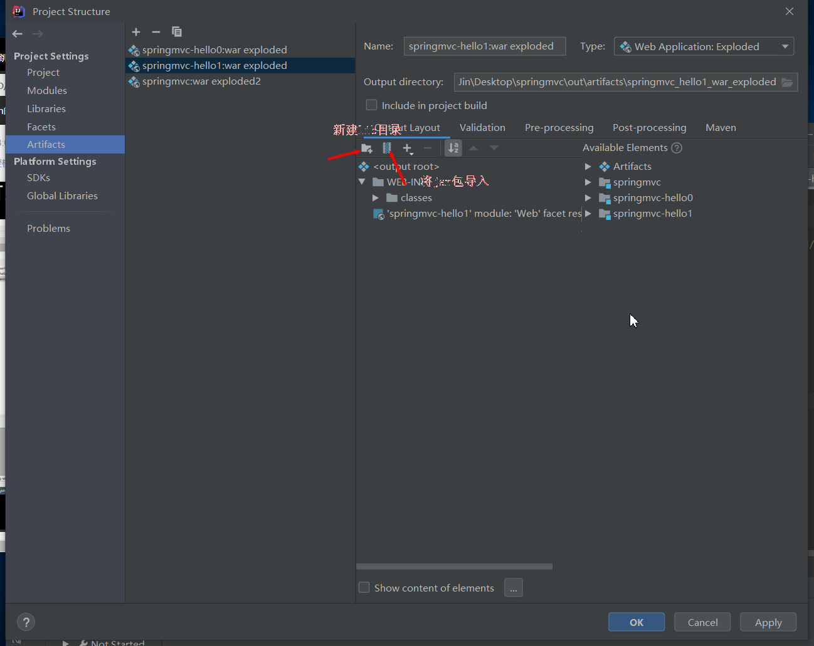
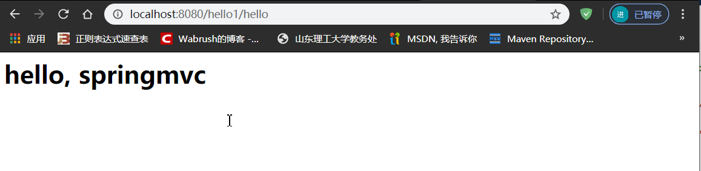

## 一、简介

 Spring的web框架围绕DispatcherServlet设计。 DispatcherServlet的作用是将请求分发到不同的处理器。从Spring 2.5开始，使用Java 5或者以上版本的用户可以采用基于注解的controller声明方式。

 Spring MVC框架像许多其他MVC框架一样, **以请求为驱动** , **围绕一个中心Servlet分派请求及提供其他功能**，**DispatcherServlet是一个实际的Servlet (它继承自HttpServlet 基类)**。


SpringMVC的原理如下图所示：

 当发起请求时被前置的控制器拦截到请求，根据请求参数生成代理请求，找到请求对应的实际控制器，控制器处理请求，创建数据模型，访问数据库，将模型响应给中心控制器，控制器使用模型与视图渲染视图结果，将结果返回给中心控制器，再将结果返回给请求者。


### 1. SpringMVC执行原理


图为SpringMVC的一个较完整的流程图，实线表示SpringMVC框架提供的技术，不需要开发者实现，虚线表示需要开发者实现。

**简要分析执行流程**

1. DispatcherServlet表示前置控制器，是整个SpringMVC的控制中心。用户发出请求，DispatcherServlet接收请求并拦截请求。

   - 我们假设请求的url为 : [http://localhost](http://localhost/):8080/SpringMVC/hello
   - **如上url拆分成三部分：**
   - [http://localhost](http://localhost/):8080服务器域名
   - SpringMVC部署在服务器上的web站点
   - hello表示控制器
   - 通过分析，如上url表示为：请求位于服务器localhost:8080上的SpringMVC站点的hello控制器。

2. HandlerMapping为处理器映射。DispatcherServlet调用HandlerMapping,HandlerMapping根据请求url查找Handler。

3. HandlerExecution表示具体的Handler,其主要作用是根据url查找控制器，如上url被查找控制器为：hello。

4. HandlerExecution将解析后的信息传递给DispatcherServlet,如解析控制器映射等。

5. HandlerAdapter表示处理器适配器，其按照特定的规则去执行Handler。

6. Handler让具体的Controller执行。

7. Controller将具体的执行信息返回给HandlerAdapter,如ModelAndView。

8. HandlerAdapter将视图逻辑名或模型传递给DispatcherServlet。

9. DispatcherServlet调用视图解析器(ViewResolver)来解析HandlerAdapter传递的逻辑视图名。

   视图解析器的作用：

   * 获取ModelAndView的数据
   * 解析ModelAndView的视图名字
   * 拼接视图名字，找到对应的视图  /WEB-INF/jsp/

10. 视图解析器将解析的逻辑视图名传给DispatcherServlet。

11. DispatcherServlet根据视图解析器解析的视图结果，调用具体的视图。

12. 最终视图呈现给用户。

### 2.实例(仅用来讲原理)

> 源码springmvc-hello0
>
> 注意：IDEA新建web工程时，需要点项目结构
>
> 

0. 新建Maven工程

1. 导入依赖

```xml
<!-- https://mvnrepository.com/artifact/org.springframework/spring-webmvc -->
<dependency>
    <groupId>org.springframework</groupId>
    <artifactId>spring-webmvc</artifactId>
    <version>5.2.3.RELEASE</version>
</dependency>

<!-- https://mvnrepository.com/artifact/javax.servlet/javax.servlet-api -->
<dependency>
    <groupId>javax.servlet</groupId>
    <artifactId>javax.servlet-api</artifactId>
    <version>4.0.1</version>
    <scope>provided</scope>
</dependency>
```

2. 配置springmvc配置文件

   在resources目录下新建springmvc-servlet.xml(名字随意)， 配置各种解析器

   ```xml
   <?xml version="1.0" encoding="UTF-8"?>
   <beans xmlns="http://www.springframework.org/schema/beans"
          xmlns:xsi="http://www.w3.org/2001/XMLSchema-instance"
          xsi:schemaLocation="
           http://www.springframework.org/schema/beans
           http://www.springframework.org/schema/beans/spring-beans.xsd">
   
       <!-- 处理器映射器 -->
       <bean class="org.springframework.web.servlet.handler.BeanNameUrlHandlerMapping"></bean>
       <!-- 处理器适配器 -->
       <bean class="org.springframework.web.servlet.mvc.SimpleControllerHandlerAdapter"></bean>
       <!-- 处理器解析器 : 模板引擎 -->
       <bean class="org.springframework.web.servlet.view.InternalResourceViewResolver" id="internalResourceViewResolver">
           <property name="prefix" value="/WEB-INF/jsp/"/>
           <property name="suffix" value=".jsp"/>
       </bean>
   
   <!--    BeanNameUrlHandlerMapping-->
       <bean id="/hello" class="com.shj.HelloController"></bean>
   </beans>
   ```

   **注意：将jsp页面放在WEB-INF目录下是为了保证jsp页面的安全，因为web客户端无法直接访问WEB-INF目录。**

3. 注册Dispatcher

   web.xml配置DispatcherServlet

   ```xml
   <?xml version="1.0" encoding="UTF-8"?>
   <web-app xmlns="http://xmlns.jcp.org/xml/ns/javaee"
            xmlns:xsi="http://www.w3.org/2001/XMLSchema-instance"
            xsi:schemaLocation="http://xmlns.jcp.org/xml/ns/javaee http://xmlns.jcp.org/xml/ns/javaee/web-app_4_0.xsd"
            version="4.0">
   
   <!--    配置DispatchServlet: 这个是SpringMVC的核心：请求分发器，前端控制器-->
       <servlet>
           <servlet-name>springmvc</servlet-name>
           <servlet-class>org.springframework.web.servlet.DispatcherServlet</servlet-class>
   
   <!--        Dispatcher要绑定的Spring配置文件-->
           <init-param>
               <param-name>contextConfigLocation</param-name>
               <param-value>classpath:springmvc-servlet.xml</param-value>
           </init-param>
   <!--        启动级别-->
           <load-on-startup>1</load-on-startup>
       </servlet>
       <!--
           在SpringgMVC中，
           /: 只会匹配所有的请求，不会匹配JSP页面
           /*: 匹配所以的请求，包括jsp页面
           -->
       <servlet-mapping>
           <servlet-name>springmvc</servlet-name>
           <url-pattern>/</url-pattern>
       </servlet-mapping>
   </web-app>
   ```

4. 编写一个Controller

   ```java
   public class HelloController implements Controller {
   
       @Override
       public ModelAndView handleRequest(HttpServletRequest httpServletRequest, HttpServletResponse httpServletResponse) throws Exception {
           ModelAndView mv = new ModelAndView();
           //业务代码
           String resul = "HelloSpringMvc";
           mv.addObject("msg", resul);
   
           //视图跳转 /WEN-INF/jsp/  + test + jsp
           mv.setViewName("test");
           return mv;
       }
   }
   ```

5. 效果：浏览器发送/hello请求时，页面跳转到WEB-INF/jsp/test.jsp页面下。

### 3.注解版实例（常用）

> 源码：springmvc-hello1

1. 注册DispatcherServlet

   ```xml
   <?xml version="1.0" encoding="UTF-8"?>
   <web-app xmlns="http://xmlns.jcp.org/xml/ns/javaee"
            xmlns:xsi="http://www.w3.org/2001/XMLSchema-instance"
            xsi:schemaLocation="http://xmlns.jcp.org/xml/ns/javaee http://xmlns.jcp.org/xml/ns/javaee/web-app_4_0.xsd"
            version="4.0">
   
       <!--    配置DispatchServlet: 这个是SpringMVC的核心：请求分发器，前端控制器-->
       <servlet>
           <servlet-name>springmvc</servlet-name>
           <servlet-class>org.springframework.web.servlet.DispatcherServlet</servlet-class>
   
           <!--        Dispatcher要绑定的Spring配置文件-->
           <init-param>
               <param-name>contextConfigLocation</param-name>
               <param-value>classpath:springmvc-servlet.xml</param-value>
           </init-param>
           <!--        启动级别-->
           <load-on-startup>1</load-on-startup>
       </servlet>
       <!--
           在SpringgMVC中，
           /: 只会匹配所有的请求，不会匹配JSP页面
           /*: 匹配所以的请求，包括jsp页面
           -->
       <servlet-mapping>
           <servlet-name>springmvc</servlet-name>
           <url-pattern>/</url-pattern>
       </servlet-mapping>
   </web-app>
   ```

2. 关联SpingMVC配置文件

   ```xml
   <?xml version="1.0" encoding="UTF-8"?>
   <beans xmlns="http://www.springframework.org/schema/beans"
          xmlns:xsi="http://www.w3.org/2001/XMLSchema-instance"
          xmlns:context="http://www.springframework.org/schema/context"
          xmlns:mvc="http://www.springframework.org/schema/mvc"
          xsi:schemaLocation="http://www.springframework.org/schema/beans
           http://www.springframework.org/schema/beans/spring-beans.xsd
           http://www.springframework.org/schema/context
           https://www.springframework.org/schema/context/spring-context.xsd
           http://www.springframework.org/schema/mvc
           https://www.springframework.org/schema/mvc/spring-mvc.xsd">
   
       <!-- 自动扫描包，让指定包下的注解生效,由IOC容器统一管理 -->
       <context:component-scan base-package="com.shj.controller"/>
       <!-- 让Spring MVC不处理静态资源 -->
       <mvc:default-servlet-handler />
       <!--
       支持mvc注解驱动
           在spring中一般采用@RequestMapping注解来完成映射关系
           要想使@RequestMapping注解生效
           必须向上下文中注册DefaultAnnotationHandlerMapping
           和一个AnnotationMethodHandlerAdapter实例
           这两个实例分别在类级别和方法级别处理。
           而annotation-driven配置帮助我们自动完成上述两个实例的注入。
        -->
       <mvc:annotation-driven />
   
       <!-- 视图解析器 -->
       <bean class="org.springframework.web.servlet.view.InternalResourceViewResolver"
             id="internalResourceViewResolver">
           <!-- 前缀 -->
           <property name="prefix" value="/jsp/" />
           <!-- 后缀 -->
           <property name="suffix" value=".jsp" />
       </bean>
   
   </beans>
   ```

3. 编写jsp页面

   ```jsp
   <%@ page contentType="text/html;charset=UTF-8" language="java" %>
   <html>
   <head>
       <title>Hello</title>
   </head>
   <body>
   <H1>${msg}</H1>
   </body>
   </html>
   ```

4. 效果

   

## 二、Controller

@Controller： 代表这个类被spring接管，被这个注解的类，如果返回值是String,并且有具体的页面可以跳转，那么就会被视图解析器解析。

### 1. @RequestMapping

```java
@Controller
@RequestMapping(name="/t1", method=)
public class DemoController {
    @RequestMapping(value = "/c1", method = RequestMethod.GET)// 同@GetMapping("/c1")
   
    //在 /t1/c1的请求会执行此方法
    public String test(){
        return null;
    }
}
```

### 2.获取HttpServletRequest,HttpServletResponse

在Controller方法中声明即可，SpringBoot会自动将其注入。

```java
@GetMapping("/hello")
public String getHttpServletRequest(HttpServletRequest request, HttpServletResponse response){}
```

## 三、Restful风格

Restful就是一个资源定位及资源操作的风格。不是标准也不是协议，只是一种风格。基于这个风格设计的软件可以更简洁，更有层次，更易于实现缓存等机制。

**功能**

- 资源：互联网所有的事物都可以被抽象为资源
- 资源操作：使用POST、DELETE、PUT、GET，使用不同方法对资源进行操作。
- 分别对应 添加、 删除、修改、查询。

**传统方式操作资源** ：通过不同的参数来实现不同的效果！方法单一，post 和 get

- http://127.0.0.1/item/queryItem.action?id=1 查询,GET
- http://127.0.0.1/item/saveItem.action 新增,POST
- http://127.0.0.1/item/updateItem.action 更新,POST
- http://127.0.0.1/item/deleteItem.action?id=1 删除,GET或POST

**使用RESTful操作资源** ： 可以通过不同的请求方式来实现不同的效果！如下：请求地址一样，但是功能可以不同！

- http://127.0.0.1/item/1 查询,GET
- http://127.0.0.1/item 新增,POST
- http://127.0.0.1/item 更新,PUT
- http://127.0.0.1/item/1 删除,DELETE

**@PathVariable**

```java
@Controller
public class DemoController {
//    @RequestMapping(value = "/c1", method = RequestMethod.GET)
    @GetMapping("/c1/{a}/{b}")
    @ResponseBody
    //在 /t1/c1的请求会执行此方法
    public String test(@PathVariable("a") Integer a, @PathVariable("b")Integer b){
        return "a=" + a + ",b=" + b;
    }
}
```

## 四、重定向和转发

视图解析器配置如下

```xml
<bean class="org.springframework.web.servlet.view.InternalResourceViewResolver" id="internalResourceViewResolver">
    <property name="suffix" value=".jsp"/>
    <property name="prefix" value="/jsp"/>
</bean>
```

Controller

```java
@Controller
public class DemoController {
    @GetMapping("/hello")
    public String hello(){
        //默认为转发,转发URL= /jsp/hello.jsp
        //显式写法: return "forward:hello";
        return "hello";
        //重定向方式,重定向URL=/jsp/hello.jsp
        return "redirect:hello"
    }
}
```

## 五、接收请求数据及数据回显

实体类如下

```java
@Data
public class User {
    private String name;
    private Integer id;
    private String password;
}
```

### 1. 提交的参数名和Controller方法参数名一致

```java
    @GetMapping("/user1")
    //前端请求 localhost:8080/user?name=xxx
    public String test1(String name, Model model){
//        1.接收前端参数
//        2.将返回的结果传递给前端
        model.addAttribute("msg", name);
//        3.视图跳转
        return "test";
    }
```

### 2.提交的参数名与方法参数名不一致

```java
//推荐方式
@GetMapping("/user2")
public String test2(@RequestParam("name") String n, Model model){
    //        1.接收前端参数
    //        2.将返回的结果传递给前端
    model.addAttribute("msg", n);
    //        3.视图跳转
    return "test";
}
```

### 3.前端接收一个对象

```java
/*
 * 1. 接收前端用户传递的参数，判断参数的名字，假设名字直接在方法上，可以直接使用
 * 2. 假设传递的是一个对象User, 匹配User对象中的字段名，如果名字一致则OK, 否则匹配不到
 */
@GetMapping("/user3")
public String test3(User user, Model model){
    model.addAttribute("msg", user);
    return "test";
}
```

### 4. ModelMap

Model、ModelMap、ModelAndView区别：

* Model 只有寥寥几个方法只适合用于储存数据，简化了新手对于Model对象的操作和理解；

*  ModelMap 继承了 LinkedMap ，除了实现了自身的一些方法，同样的继承 LinkedMap 的方法和特性；

* ModelAndView 可以在储存数据的同时，可以进行设置返回的逻辑视图，进行控制展示层的跳转

### 5.表单提交中文乱码问题

方法一：在web.xml中加入

```xml
<filter>
    <filter-name>encoding</filter-name>
    <filter-class>org.springframework.web.filter.CharacterEncodingFilter</filter-class>
    <init-param>
        <param-name>encoding</param-name>
        <param-value>utf-8</param-value>
    </init-param>
</filter>
<filter-mapping>
    <filter-name>encoding</filter-name>
    <url-pattern>/</url-pattern>
</filter-mapping>
```

方法二：其它的处理方法 :

1. 修改tomcat配置文件 ： 设置编码！

   ```xml
   <Connector URIEncoding="utf-8" port="8080" protocol="HTTP/1.1"
              connectionTimeout="20000"
              redirectPort="8443" />
   ```

2. 自定义过滤器

   ```java
   package com.kuang.filter;
   
   import javax.servlet.*;
   import javax.servlet.http.HttpServletRequest;
   import javax.servlet.http.HttpServletRequestWrapper;
   import javax.servlet.http.HttpServletResponse;
   import java.io.IOException;
   import java.io.UnsupportedEncodingException;
   import java.util.Map;
   
   /**
    * 解决get和post请求 全部乱码的过滤器
    */
   public class GenericEncodingFilter implements Filter {
   
       @Override
       public void destroy() {
       }
   
       @Override
       public void doFilter(ServletRequest request, ServletResponse response, FilterChain chain) throws IOException, ServletException {
           //处理response的字符编码
           HttpServletResponse myResponse=(HttpServletResponse) response;
           myResponse.setContentType("text/html;charset=UTF-8");
   
           // 转型为与协议相关对象
           HttpServletRequest httpServletRequest = (HttpServletRequest) request;
           // 对request包装增强
           HttpServletRequest myrequest = new MyRequest(httpServletRequest);
           chain.doFilter(myrequest, response);
       }
   
       @Override
       public void init(FilterConfig filterConfig) throws ServletException {
       }
   
   }
   
   //自定义request对象，HttpServletRequest的包装类
   class MyRequest extends HttpServletRequestWrapper {
   
       private HttpServletRequest request;
       //是否编码的标记
       private boolean hasEncode;
       //定义一个可以传入HttpServletRequest对象的构造函数，以便对其进行装饰
       public MyRequest(HttpServletRequest request) {
           super(request);// super必须写
           this.request = request;
       }
   
       // 对需要增强方法 进行覆盖
       @Override
       public Map getParameterMap() {
           // 先获得请求方式
           String method = request.getMethod();
           if (method.equalsIgnoreCase("post")) {
               // post请求
               try {
                   // 处理post乱码
                   request.setCharacterEncoding("utf-8");
                   return request.getParameterMap();
               } catch (UnsupportedEncodingException e) {
                   e.printStackTrace();
               }
           } else if (method.equalsIgnoreCase("get")) {
               // get请求
               Map<String, String[]> parameterMap = request.getParameterMap();
               if (!hasEncode) { // 确保get手动编码逻辑只运行一次
                   for (String parameterName : parameterMap.keySet()) {
                       String[] values = parameterMap.get(parameterName);
                       if (values != null) {
                           for (int i = 0; i < values.length; i++) {
                               try {
                                   // 处理get乱码
                                   values[i] = new String(values[i]
                                           .getBytes("ISO-8859-1"), "utf-8");
                               } catch (UnsupportedEncodingException e) {
                                   e.printStackTrace();
                               }
                           }
                       }
                   }
                   hasEncode = true;
               }
               return parameterMap;
           }
           return super.getParameterMap();
       }
   
       //取一个值
       @Override
       public String getParameter(String name) {
           Map<String, String[]> parameterMap = getParameterMap();
           String[] values = parameterMap.get(name);
           if (values == null) {
               return null;
           }
           return values[0]; // 取回参数的第一个值
       }
   
       //取所有值
       @Override
       public String[] getParameterValues(String name) {
           Map<String, String[]> parameterMap = getParameterMap();
           String[] values = parameterMap.get(name);
           return values;
       }
   }
   ```

这个也是我在网上找的一些大神写的，一般情况下，SpringMVC默认的乱码处理就已经能够很好的解决了！

**然后在web.xml中配置这个过滤器即可！**

## 六、拦截器

> 本章对应源码spring-intercepter

**过滤器与拦截器的区别：**拦截器是AOP思想的具体应用。

**过滤器**

- servlet规范中的一部分，任何java web工程都可以使用
- 在url-pattern中配置了/*之后，可以对所有要访问的资源进行拦截

**拦截器**

- 拦截器是SpringMVC框架自己的，只有使用了SpringMVC框架的工程才能使用
- 拦截器只会拦截访问的控制器方法， 如果访问的是jsp/html/css/image/js是不会进行拦截的

**使用：**

1. 编写一个HandlerInterceptor的实现类

   ```java
   public class MyIntercepter implements HandlerInterceptor {
       @Override
       public boolean preHandle(HttpServletRequest request, HttpServletResponse response, Object handler) throws Exception {
           System.out.println("********************处理前");
           return true;
       }
   
       //日志
       @Override
       public void postHandle(HttpServletRequest request, HttpServletResponse response, Object handler, ModelAndView modelAndView) throws Exception {
           System.out.println("********************处理后");
       }
   
       @Override
       public void afterCompletion(HttpServletRequest request, HttpServletResponse response, Object handler, Exception ex) throws Exception {
           System.out.println("********************清理");
       }
   }
   ```

2. 在springMVC中加入配置

   ```xml
   <mvc:interceptors>
       <mvc:interceptor>
           <!--            在这个请求下的所以请求-->
           <mvc:mapping path="/**"/>
           <bean class="com.shj.config.MyIntercepter"></bean>
       </mvc:interceptor>
   </mvc:interceptors>
   ```

## 七、文件上传、下载

> 源码springmvc-file-download-upload

 文件上传是项目开发中最常见的功能之一 ,springMVC 可以很好的支持文件上传，但是SpringMVC上下文中默认没有装配MultipartResolver，因此默认情况下其不能处理文件上传工作。如果想使用Spring的文件上传功能，则需要在上下文中配置MultipartResolver。

 **前端表单要求：为了能上传文件，必须将表单的method设置为POST，并将enctype设置为multipart/form-data。**只有在这样的情况下，浏览器才会把用户选择的文件以二进制数据发送给服务器；

**对表单中的 enctype 属性做个详细的说明：**

- application/x-www=form-urlencoded：默认方式，只处理表单域中的 value 属性值，采用这种编码方式的表单会将表单域中的值处理成 URL 编码方式。
- multipart/form-data：这种编码方式会以二进制流的方式来处理表单数据，这种编码方式会把文件域指定文件的内容也封装到请求参数中，不会对字符编码。
- text/plain：除了把空格转换为 "+" 号外，其他字符都不做编码处理，这种方式适用直接通过表单发送邮件。

```html
<form action="" enctype="multipart/form-data" method="post">
    <input type="file" name="file"/>
    <input type="submit">
</form>
```

 一旦设置了enctype为multipart/form-data，浏览器即会采用二进制流的方式来处理表单数据，而对于文件上传的处理则涉及在服务器端解析原始的HTTP响应。在2003年，Apache Software Foundation发布了开源的Commons FileUpload组件，其很快成为Servlet/JSP程序员上传文件的最佳选择。

- Servlet3.0规范已经提供方法来处理文件上传，但这种上传需要在Servlet中完成。
- 而Spring MVC则提供了更简单的封装。
- Spring MVC为文件上传提供了直接的支持，这种支持是用即插即用的MultipartResolver实现的。
- Spring MVC使用Apache Commons FileUpload技术实现了一个MultipartResolver实现类：CommonsMultipartResolver。因此，==SpringMVC的文件上传还需要依赖Apache Commons FileUpload的组件==。

### 文件上传

一、导入文件上传的jar包，commons-fileupload ， Maven会自动帮我们导入他的依赖包 commons-io包；

```xml
<!--文件上传-->
<dependency>
    <groupId>commons-fileupload</groupId>
    <artifactId>commons-fileupload</artifactId>
    <version>1.3.3</version>
</dependency>
<!--servlet-api导入高版本的-->
<dependency>
    <groupId>javax.servlet</groupId>
    <artifactId>javax.servlet-api</artifactId>
    <version>4.0.1</version>
</dependency>
```

二、配置bean：multipartResolver
【**注意！！！这个bena的id必须为：multipartResolver ， 否则上传文件会报400的错误！在这里栽过坑,教训！**】

```xml
<!--文件上传配置-->
<bean id="multipartResolver"  class="org.springframework.web.multipart.commons.CommonsMultipartResolver">
    <!-- 请求的编码格式，必须和jSP的pageEncoding属性一致，以便正确读取表单的内容，默认为ISO-8859-1 -->
    <property name="defaultEncoding" value="utf-8"/>
    <!-- 上传文件大小上限，单位为字节（10485760=10M） -->
    <property name="maxUploadSize" value="10485760"/>
    <property name="maxInMemorySize" value="40960"/>
</bean>
```

CommonsMultipartFile 的 常用方法：

- **String getOriginalFilename()：获取上传文件的原名**
- **InputStream getInputStream()：获取文件流**
- **void transferTo(File dest)：将上传文件保存到一个目录文件中**

我们去实际测试一下

三、编写前端页面

```html
<form action="/upload" enctype="multipart/form-data" method="post">
  <input type="file" name="file"/>
  <input type="submit" value="upload">
</form>
```

四、**Controller**

```java
package com.kuang.controller;

import org.springframework.stereotype.Controller;
import org.springframework.web.bind.annotation.RequestMapping;
import org.springframework.web.bind.annotation.RequestParam;
import org.springframework.web.multipart.commons.CommonsMultipartFile;

import javax.servlet.http.HttpServletRequest;
import java.io.*;

@Controller
public class FileController {
    //@RequestParam("file") 将name=file控件得到的文件封装成CommonsMultipartFile 对象
    //批量上传CommonsMultipartFile则为数组即可
    @RequestMapping("/upload")
    public String fileUpload(@RequestParam("file") CommonsMultipartFile file , HttpServletRequest request) throws IOException {

        //获取文件名 : file.getOriginalFilename();
        String uploadFileName = file.getOriginalFilename();

        //如果文件名为空，直接回到首页！
        if ("".equals(uploadFileName)){
            return "redirect:/index.jsp";
        }
        System.out.println("上传文件名 : "+uploadFileName);

        //上传路径保存设置
        String path = request.getServletContext().getRealPath("/upload");
        //如果路径不存在，创建一个
        File realPath = new File(path);
        if (!realPath.exists()){
            realPath.mkdir();
        }
        System.out.println("上传文件保存地址："+realPath);

        InputStream is = file.getInputStream(); //文件输入流
        OutputStream os = new FileOutputStream(new File(realPath,uploadFileName)); //文件输出流

        //读取写出
        int len=0;
        byte[] buffer = new byte[1024];
        while ((len=is.read(buffer))!=-1){
            os.write(buffer,0,len);
            os.flush();
        }
        os.close();
        is.close();
        return "redirect:/index.jsp";
    }
}
```

五、测试上传文件，OK！

### 采用file.Transto 来保存上传的文件

1. 编写Controller

   ```java
   /*
    * 采用file.Transto 来保存上传的文件
    */
   @RequestMapping("/upload2")
   public String  fileUpload2(@RequestParam("file") CommonsMultipartFile file, HttpServletRequest request) throws IOException {
   
       //上传路径保存设置
       String path = request.getServletContext().getRealPath("/upload");
       File realPath = new File(path);
       if (!realPath.exists()){
           realPath.mkdir();
       }
       //上传文件地址
       System.out.println("上传文件保存地址："+realPath);
   
       //通过CommonsMultipartFile的方法直接写文件（注意这个时候）
       file.transferTo(new File(realPath +"/"+ file.getOriginalFilename()));
   
       return "redirect:/index.jsp";
   }
   ```

2. 前端表单提交地址修改

3. 访问提交测试，OK！

### 文件下载（原生）

文件下载步骤：

1. 设置 response 响应头
2. 读取文件 -- InputStream
3. 写出文件 -- OutputStream
4. 执行操作
5. 关闭流 （先开后关）

代码实现：

```java
@RequestMapping(value="/download")
public String downloads(HttpServletResponse response ,HttpServletRequest request) throws Exception{
    //要下载的图片地址
    String  path = request.getServletContext().getRealPath("/upload");
    String  fileName = "基础语法.jpg";

    //1、设置response 响应头
    response.reset(); //设置页面不缓存,清空buffer
    response.setCharacterEncoding("UTF-8"); //字符编码
    response.setContentType("multipart/form-data"); //二进制传输数据
    //设置响应头
    response.setHeader("Content-Disposition",
            "attachment;fileName="+URLEncoder.encode(fileName, "UTF-8"));

    File file = new File(path,fileName);
    //2、 读取文件--输入流
    InputStream input=new FileInputStream(file);
    //3、 写出文件--输出流
    OutputStream out = response.getOutputStream();

    byte[] buff =new byte[1024];
    int index=0;
    //4、执行 写出操作
    while((index= input.read(buff))!= -1){
        out.write(buff, 0, index);
        out.flush();
    }
    out.close();
    input.close();
    return null;
}
```

前端

```html
<a href="/download">点击下载</a>
```

测试，文件下载OK，大家可以和我们之前学习的JavaWeb原生的方式对比一下，就可以知道这个便捷多了!