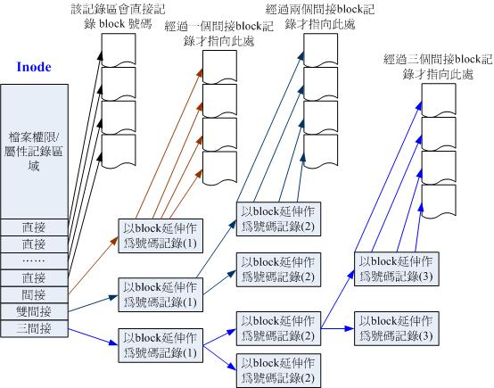
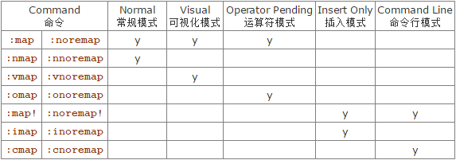

## 2.2磁盘分区

> 盘面中一圈圈同心圆为一条条磁道（磁轨），从圆心向外画直线，可以将磁道划分为若干个弧段，每个磁上一个弧段被称之为一个扇区（磁区）。扇区是磁盘的最小组成单元，通常是512字节。（由于不断提高磁盘的大小，部分厂商设定每个扇区的大小是4096字节)
>
> 
>
> 硬盘通常由重叠的一组盘片构成，每个盘面都被划分为数目相等的磁道，并从外缘的“0”开始编号，具有相同编号的磁道形成一个圆柱，称之为磁盘的柱面。

### 2.2.1 磁盘连接的方式与配置文件名的关系

正常的实体机器大概使用的都是**/dev/sd[a-]**的磁盘名，至于虚拟机环境下，为了加速，可能就会使用**/dev/vd[a-p]**这种装置文件名。

| 装置              | 装置在Linux内的文件名                                        |
| ----------------- | ------------------------------------------------------------ |
| SCSI/SATA/USB硬驱 | /dev/sd[a-p]                                                 |
| USB快闪碟         | /dev/sd[a-p] （与SATA相同）                                  |
| VirtI/O界面       | /dev/vd[a-p] （用于虚拟机内）                                |
| 软碟机            | /dev/fd[0-1]                                                 |
| 打印机            | /dev/lp[0-2] （25针打印机） /dev/usb/lp[0-15] （USB 接口）   |
| 鼠标              | /dev/input/mouse[0-15] （通用） /dev/psaux （PS/2界面） /dev/mouse （当前鼠标） |
| CDROM/DVDROM      | /dev/scd[0-1] （通用） /dev/sr[0-1] （通用，CentOS 较常见） /dev/cdrom （当前 CDROM） |
| 磁带机            | /dev/ht0 （IDE 界面） /dev/st0 （SATA/SCSI界面） /dev/tape （当前磁带） |
| IDE硬盘机         | /dev/hd[a-d] （旧式系统才有）                                |

### 2.2.2 MSDOS(MBR)与GPT磁盘分割表（partition table）

#### 1. MSDOS(MBR) 分割表格式与限制

早期的 Linux 系统为了兼容于 Windows 的磁盘，因此使用的是支持 Windows 的 MBR（Master Boot Record， 主要开机纪录区） 的方式来处理开机管理器与分割表！ 而启动管理程序纪录区与分割表则通通放在磁盘的第一个扇区， 这个扇区通常是 512bytes 的大小 （旧的磁盘扇区都是 512bytes 喔！ ），所以说，第一个磁区 512bytes 会有这两个数据：

- 主要开机记录区（Master Boot Record， MBR）：可以安装开机管理程序的地方，有446 bytes
- 分割表（partition table）：记录整颗硬盘分割的状态，有64 bytes

由于分割表所在区块仅有64 bytes容量，因此最多仅能有四组记录区，每组记录区记录了该区段的启始与结束的磁柱号码。 若将硬盘以长条形来看，然后将磁柱以直条图来看，那么那64 bytes的记录区段有点像底下的图标：


上述四个分割槽在Linux系统中设备文件名为：

- P1:/dev/sda1
- P2:/dev/sda2
- P3:/dev/sda3
- P4:/dev/sda4

由于分割表就只有64 bytes而已，最多只能容纳四笔分割的记录， 这四个分割的记录被称为主要（Primary）或延伸（Extended）分割槽。 根据上面的图标与说明，我们可以得到几个重点信息：

- 其实所谓的'分割'只是针对那个64 bytes的分割表进行设定而已！
- 硬盘预设的分割表仅能写入四组分割信息
- 这四组分割信息我们称为主要（Primary）或延伸（Extended）分割槽
- 分割槽的最小单位'通常'为磁柱（cylinder）
- 当系统要写入磁盘时，一定会参考磁盘分割表，才能针对某个分割槽进行数据的处理

使用分割表的意义：

* 数据安全性

  当需要将某个分区的数据重整时（例如装系统），其它分区的数据不受影响。

* 系统效能考量

  在系统读取某个分区的数据时，磁盘只要搜索本分区范围内的磁柱即可。

尽管第一个磁区所在的扇区（磁区）只能记录四笔数据，但可以利用额外的磁区来记录更多的分割信息（**拓展分割**）：


* 上图中P1为**主要分割**， P2为**延伸分割**（硬盘限制两种分割数之和最多四笔，操作系统限制延伸分割最多一个）。 
* 延伸分割的目的是使用额外的扇区来记录分割信息，延伸分割本身不能被拿来格式化。
* 上图中五个由延伸分割继续切出来的分割槽，被称为**逻辑分割槽** 。
* 由于逻辑分割槽是有延伸分割继续分割出来的，所以其可以使用柱面范围就是延伸分割所设定的范围。

上图中由于前四个号码是保留给主要分割或延伸分割使用，所以逻辑分割槽的号码是由5号开始：

- P1:/dev/sda1
- P2:/dev/sda2
- L1:/dev/sda5
- L2:/dev/sda6
- L3:/dev/sda7
- L4:/dev/sda8
- L5:/dev/sda9

MBR分割表的限制：

- 操作系统无法获取到 2.2T 以上的磁盘容量！
- MBR 仅有一个区块，若被破坏后，经常无法或很难救援。
- MBR 内的存放开机管理程序的区块仅 446bytes，无法容纳较多的代码。

#### 2. GUID paritiontable, GPT磁盘分割表

GPT为兼容所有硬盘，在磁区的定义上面，使用逻辑区块地址LBA（块/簇）,默认为512Bytes。

与 MBR 仅使用第一个 512bytes 区块来纪录不同， GPT 使用了 34 个 LBA 区块来纪录分割信息。 除了前面 34 个 LBA 之外，整个磁盘的最后 33 个 LBA 也拿来作为另一个备份。


上述图标的解释说明如下：

- LBA0 （MBR 兼容区块）

  与 MBR 模式相似的，这个兼容区块也分为两个部份，一个就是跟之前 446 bytes 相似的区块，储存了第一阶段的开机管理程序！ 而在原本的分割表的纪录区内，这个兼容模式仅放入一个特殊标志的分割，用来表示此磁盘为 GPT 格式之意。 而不懂 GPT 分割表的磁盘管理程序， 就不会认识这颗磁盘，除非用户有特别要求要处理这颗磁盘，否则该管理软件不能修改此分割信息，进一步保护了此磁盘喔！

- LBA1 （GPT 表头纪录）

  这个部分纪录了分割表本身的位置与大小，同时纪录了备份用的 GPT 分割 （就是前面谈到的在最后 34 个 LBA 区块） 放置的位置， 同时放置了分割表的检验机制码 （CRC32），操作系统可以根据这个检验码来判断 GPT 是否正确。 若有错误，还可以通过这个记录区来取得备份的 GPT（磁盘最后的那个备份区块） 来恢复 GPT 的正常运作！

- LBA2-33 （实际日志分信息处）

  从 LBA2 区块开始，每个 LBA 都可以纪录 4 笔分割纪录，所以在预设的情况下，总共可以有 4*32 = 128 笔分割纪录喔！ 因为每个LBA有512bytes，因此每笔纪录用到128 bytes的空间，除了每笔纪录所需要的识别码与相关的纪录之外，GPT在每笔纪录中分别提供了64bits来记载开始/结束的磁区号码，因此，GPT分割表对于单一分割槽来说，他的最大容量限制就会在' 2^64 * 512bytes = 2^63 * 1Kbytes = 2^33*TB = 8 ZB ，要注意 1ZB = 2^30 TB 啦！

  

  查资料补充：

> 块/簇： 磁盘块/簇（虚拟出来的）。 块是操作系统中最小的逻辑存储单位。操作系统与磁盘打交道的最小单位是磁盘块。
>
> 为什么存在磁盘块：
>
> * 读取方便：由于扇区的数量比较小，数目众多在寻址时比较困难，所以操作系统就将相邻的扇区组合在一起，形成一个块，再对块进行整体的操作。
> * 分离对底层的依赖：操作系统忽略对底层物理存储结构的设计。通过虚拟出来磁盘块的概念，在系统中认为块是最小的单位。
>
> page: 操作系统经常与内存和硬盘这两种存储设备进行通信，类似于“块”的概念，都需要一种虚拟的基本单位。所以，与内存操作，是虚拟一个页的概念来作为最小单位。与硬盘打交道，就是以块为最小单位。
>
> 扇区、块/簇、page的关系：
>
> * 扇区： 硬盘的最小读写单元
> * 块/簇： 是操作系统针对硬盘读写的最小单元
> * page： 是内存与操作系统之间操作的最小单元。
> * 扇区 <= 块/簇 <= page

### 2.2.3 开机流程中的BIOS与UEFI开机检测程序

#### 1. BIOS搭配MBR/GPT的开机流程：

1. **BIOS**：开机主动执行的韧体，会认识第一个可开机的装置;
2. **MBR**：第一个可开机装置的第一个磁区内的主要开机记录区块，内含开机管理程序;
3. **启动管理器（boot loader）**：一支可读取核心文件来执行的软件;
4. **核心文件**：启动操作系统的功能...

开机管理器除了可以安装在MBR之外， 还可以安装在每个分割槽的开机扇区（boot sector）。

例如：


- 每个分割槽都拥有自己的开机扇区（boot sector）
- 图中的系统槽为第一及第二分割槽，
- 实际可开机的核心文件是放置到各分割槽内的！
- loader只会认识自己的系统槽内的可开机核心文件，以及其他loader而已;
- loader可直接指向或者是间接将管理权转交给另一个管理程序。

#### 2. UEFI BIOS搭配GPT开机的流程

UEFI主要是想要取代BIOS这个固件界面， 使用 C 程序语言，比起使用组合语言的传统 BIOS 要更容易开发。

EFI 大多用来作为启动操作系统之前的硬件检测、开机管理、软件设定等目的，基本上是比较难的。 同时，当加载操作系统后，一般来说，UEFI 就会停止工作，并将系统交给操作系统，这与早期的 BIOS 差异不大。 

### 2.2.4 Linux安装模式下，磁盘分割的选择

#### 1. 目录树结构


#### 2. 文件系统和目录树的关系（挂载）

所谓的'挂载'就是利用一个目录当成进入点，将磁盘分割槽的数据放置在该目录下; 也就是说，进入该目录就可以读取该分割槽的意思。


# 第四章、首次登入与线上求助

## 4.1首次登陆系统

### 4.1.4 在终端接口登入Linux

 Linux默认的情况下会提供六个Terminal来让用户登录， 切换的方式为使用：**[Ctrl] + [Alt] + [F1]~[F6]**的组合按钮。

- [Ctrl] + [Alt] + [F2] ~ [F6] ：文本接口登录 tty2 ~ tty6 终端机;
- [Ctrl] + [Alt] + [F1] ：图形界面桌面。

## 4.2文字模式下指令的下达

### 4.2.1 开始下达指令

指令格式

```shell
[dmtsai@study ~]$ command  [-options]  parameter1  parameter2 ...
                     指令     選項        參數(1)     參數(2)
```

上述指令详细说明如下：

1. 一行指令中第一个输入的部分绝对是'指令（command）'或'可执行文件（例如批次脚本，script）'
2. command 为指令的名称，例如变换工作目录的指令为 cd 等等;
3. 中刮号[]并不存在于实际的指令中，而加入选项设定时，通常选项前会带 - 号，例如 -h;有时候会使用选项的完整全名，则选项前带有 -- 符号，例如 --help;
4. parameter1 parameter2.. 为依附在选项后面的参数，或者是 command 的参数;
5. 指令， 选项， 参数等这几个咚咚中间以空格来区分，不论空几格 shell 都视为一格。 所以空格是很重要的特殊字符！ ；
6. 按下[Enter]按键后，该指令就立即执行。 [Enter]按键代表着一行指令的开始启动。
7. 指令太长的时候，可以使用反斜线 （\） 来跳脱 [Enter] 符号，使指令连续到下一行。 注意！ 反斜线后就立刻接特殊字符，才能跳脱！

#### 1. 语系的支持

```shell
1. 顯示目前所支援的語系
[dmtsai@study ~]$ locale
LANG=zh_TW.utf8              # 語言語系的輸出
LC_CTYPE="zh_TW.utf8"        # 底下為許多資訊的輸出使用的特別語系
LC_NUMERIC=zh_TW.UTF-8
LC_TIME=zh_TW.UTF-8          # 時間方面的語系資料
LC_COLLATE="zh_TW.utf8"
....中間省略....
LC_ALL=                      # 全部的資料同步更新的設定值
# 上面的意思是說，目前的語系(LANG)為zh_TW.UTF-8，亦即台灣繁體中文的萬國碼
[dmtsai@study ~]$ date
鈭? 5??29 14:24:36 CST 2015  # 純文字界面下，無法顯示中文字，所以前面是亂碼

2. 修改語系成為英文語系
[dmtsai@study ~]$ LANG=en_US.utf8
[dmtsai@study ~]$ export LC_ALL=en_US.utf8
# LANG 只與輸出訊息有關，若需要更改其他不同的資訊，要同步更新 LC_ALL 才行！

[dmtsai@study ~]$ date
Fri May 29 14:26:45 CST 2015 # 順利顯示出正確的英文日期時間啊！

[dmtsai@study ~]$ locale
LANG=en_US.utf8
LC_CTYPE="en_US.utf8"
LC_NUMERIC="en_US.utf8"
....中間省略....
LC_ALL=en_US.utf8
# 再次確認一下，結果出現，確實是en_US.utf8這個英文語系！
```

### 4.2.2 基本指令操作

- 显示日期与时间的指令： date

- 显示日历的指令： cal 

  `cal [month] [year]`

- 简单好用的计算机： bc

  `scale=3`: 显示小数点后三位

- 命令补全 `[tab]`按键

  - [Tab] 接在一串指令的第一个字的后面，则为『命令补全』;
  - [Tab] 接在一串指令的第二个字以后时，则为『档案补齐』！
  - 若安装 bash-completion 软件，则在某些指令后面使用 [tab] 按键时，可以进行『选项/参数的补齐』功能！

- `[ctr]+c`:终止正在运行的指令

- `[ctr] + d`: 键盘输入结束

- `[shift]+{[PageUp] | [PageDown]}`:文本模式时上下翻页

- 查看某指令的说明

  * `command --help`
  * `man command`

### 4.3.2 man page

man page页面命令后数字代表含义：

| 代号 | 代表内容                                                     |
| ---- | ------------------------------------------------------------ |
| 1    | **用户在shell环境中可以操作的指令或可执行文件**              |
| 2    | 系统核心可调用的函数与工具等                                 |
| 3    | 一些常用的函数（function）与函式库（library），大部分为C的函式库（libc） |
| 4    | 装置文件的说明，通常在/dev下的文件                           |
| 5    | **配置文件或者是某些文件的格式**                             |
| 6    | 游戏（games）                                                |
| 7    | 惯例与协议等，例如Linux文件系统、网路协定、ASCII code等等的说明 |
| 8    | **系统管理员可用的管理指令**                                 |
| 9    | 跟kernel有关的文件                                           |

文字模式下常用按键

| 按键        | 进行工作                                                     |
| ----------- | ------------------------------------------------------------ |
| 空白键      | 向下翻一页                                                   |
| [Page Down] | 向下翻一页                                                   |
| [Page Up]   | 向上翻一页                                                   |
| [Home]      | 去到第一页                                                   |
| [End]       | 去到最后一页                                                 |
| /string     | 向'下'搜寻 string 这个字符串，如果要搜索 vbird 的话，就输入 /vbird |
| ?string     | 向'上'搜寻 string 这个字符串                                 |
| n, N        | 利用 / 或 ？ 来搜索字符串时，可以用 n 来继续下一个搜索 （不论是 / 或 ？） ，可以利用 N 来进行「反向」搜索。 举例来说，我以 /vbird 搜寻 vbird 字符串， 那么可以 n 继续往下查询，用 N 往上查询。 若以 ？vbird 向上查询 vbird 字符串， 那我可以用 n 继续「向上」查询，用 N 反向查询。 |
| q           | 结束这次的 man page                                          |

#### 1. 搜索特定命令/文件的man page 说明文件

使用`man -f command`命令搜索相应命令的man page文件。

```shell
#搜索man命令的man page 说明文件
[dmtsai@study ~]$ man -f man
man (1)              - an interface to the on-line reference manuals
man (1p)             - display system documentation
man (7)              - macros to format man pages

#查看man(1)的文件资料
[dmtsai@study ~]$ man 1 man
```

使用`man -k command`命令，列出所有包含`command`字眼的说明文件。

```shell
[dmtsai@study ~]$ man -k man
fallocate (2)        - manipulate file space
zshall (1)           - the Z shell meta-man page
...
```

在以root身份建立`whatis`数据库

```shell
[root@study ~]# mandb
```

之后就可以使用两个`man`命令的缩写版

```shell
[dmtsai@study ~]$ whatis  [指令或者是資料]   <==相當於 man -f [指令或者是資料]
[dmtsai@study ~]$ apropos [指令或者是資料]   <==相當於 man -k [指令或者是資料]
```

### 4.3.3 info  page

在Linux里面则又额外提供了一种线上求助的方法--info。

`info page`显示解读：

```shell
[dmtsai@study ~]$ info info
File: info.info,  Node: Top,  Next: Getting Started,  Up: (dir)

Info: An Introduction
*********************

The GNU Project distributes most of its on-line manuals in the "Info
format", which you read using an "Info reader".  You are probably using
an Info reader to read this now.
....(中間省略)....

   If you are new to the Info reader and want to learn how to use it,
type the command 'h' now.  It brings you to a programmed instruction
sequence. # 這一段在說明，按下 h 可以有簡易的指令說明！很好用！
....(中間省略)....

* Menu:

* Getting Started::             Getting started using an Info reader.
* Advanced::                    Advanced Info commands.
* Expert Info::                 Info commands for experts.
* Index::                       An index of topics, commands, and variables.

--zz-Info: (info.info.gz)Top, 52 lines --Bot------------------------------------------
```

- File：代表这个info page的数据是来自 info.info 文件所提供的;
- Node：代表目前的这个页面是属于Top节点。 意思是 info.info 内含有很多信息，而Top仅是 info.info 文件内的一个节点内容而已;
- Next：下一个节点的名称为Getting Started，你也可以按'N'到下个节点去;
- Up：回到上一层的节点总揽画面，你也可以按下'U'回到上一层;
- Prev：前一个节点。 但由于Top是 info.info 的第一个节点，所以上面没有前一个节点的信息。

另外，如论你在任何一个页面，只要不知道怎么使用 info 了，直接按下 h 系统就能够提供一些基本按键功能的介绍。

阅读`info page`界面常用按键

| 按键        | 进行工作                                            |
| ----------- | --------------------------------------------------- |
| 空白键      | 向下翻一页                                          |
| [Page Down] | 向下翻一页                                          |
| [Page Up]   | 向上翻一页                                          |
| [tab]       | 在 node 之间移动，有 node 的地方，通常会以 * 显示。 |
| [Enter]     | 当光标在 node 上面时，按下 Enter 可以进入该 node 。 |
| b           | 移动光标到该info画面当中的第一个node处              |
| e           | 移动光标到该info画面当中的最后一个node处            |
| n           | 前往下一个 node 处                                  |
| p           | 前往上一个 node 处                                  |
| u           | 向上移动一层                                        |
| s(/)        | 在 info page 当中进行搜寻                           |
| h, ?        | 显示求助菜单                                        |
| q           | 结束这次的 info page                                |

### 4.3.4 其它有用的文件

文件目录：/usr/share/doc

# 五、Linux文件权限与目录配置

## 5.2 Linux文件权限概念

### 5.2.1 Linux文件属性

使用`ls -al`命令查看当前目录所有文件以及文件属性。

```shell
[root@study ~]# ls -al
total 48
drwxr-xr-x.  3    root     root      17  May  6 00:14 .config               <=範例說明處
drwx------.  3    root     root      24  May  4 17:59 .dbus
-rw-r--r--.  1    root     root    1864  May  4 18:01 initial-setup-ks.cfg  <=範例說明處
....
```

文件属性示意：


> 连结应该类似windows系统的快捷方式（猜想未证实）。

文件属性详细介绍：

1. 第一列代表这个文件的类型与权限

   

   * 第一个字母代表这个文件是目录、文件、或链接文件等等
     - 当为[ **d** ]则是目录
     - 当为[ **-** ]则是文件
     - 若是[ **l** ]则表示为链接文件（link file）;
     - 若是[ **b** ]则表示为设备文件里面的可供储存的周边设备（可随机存取装置）;
     - 若是[ **c**]则表示为设备文件里面的串口设备，例如键盘、鼠标（一次性读取设备）。
   * 接下来的字符中，三个为一组
     - 第一组为'文件所有者可具备的权限'
     - 第二组为'加入此群组之帐号的权限';
     - 第三组为'非本人且没有加入本群组之其他帐号的权限'。

2. 第二栏表示有多少文件名链接到此节点（i-node）

   每个文件都会将他的权限与属性记录到文件系统的i-node中，不过，我们使用的目录树却是使用文件名来记录， 因此每个文件名就会连结到一个i-node。这个属性记录的，就是有多少不同的文件名链接到相同的一个i-node号码。(第七章详解)
   
3. 第三列表示此文件（或目录）的'所有者帐号'

4. 第四列表示这个文件的所属组

   Linux系统下，一个账号可以加入多个组。

5. 第五栏为这个文件的容量大小，单位为Bytes.

6. 第六列为此文件的建档日期或者是最近的修改日期

7. 第七栏为这个文件的文件名

### 5.2.2 如何改变文件属性与权限

- `chgrp [-R] groupName dirname/filename ...` ：改变文件所属组

  * 要改变的群组名必须在`etc/group`文件内存在才可以。

  * `-R`参数: 进行递归的持续变更，即连同子目录下的所有文件、目录都更新为这个新的群组

  * 示例：

    ```shell
    [root@study ~]# chgrp users initial-setup-ks.cfg
    [root@study ~]# ls -l
    -rw-r--r--. 1 root users 1864 May  4 18:01 initial-setup-ks.cfg
    ```

- `chown `：改变文件所有者

  * 用户必须在`etc/passwd`这个文件中有记录。
  * 用法：
    * `chown [-R] 账号名称 文件或目录`
    * `chown -[R] 账号名称：组名 文件或目录`

- `chmod` ：改变文件的权限， SUID， SGID， SBIT等等的特性

  * 数字类型改变文件权限

    文件权限字符为：`[-rwxrwxrwx]`, r 、w、 x权限的分数分别为4、2、1

    例如一个文件的权限字符为`[-rwxrwx---]`,各身份分数则是：

    owner = rwx = 4 + 2 + 1 = 7

    group = rwx = 4 + 2 + 1 = 7

    others = --- = 0 + 0 + 0 =0

    * `chmod [-R] xyz 文件或目录`

      `xyz`: 就是该文件数字类型的权限分数之和。

      `-R`: 进行递归的持续变更。

      示例：

      ```shell
      [root@study ~]# ls -al .bashrc
      -rw-r--r--. 1 root root 176 Dec 29  2013 .bashrc
      [root@study ~]# chmod 777 .bashrc
      [root@study ~]# ls -al .bashrc
      -rwxrwxrwx. 1 root root 176 Dec 29  2013 .bashrc
      ```

  * 符号类型改变文件权限

    

    * 在`chmod`命令中，可以分别使用 u、g、o分别代表user、group、others三种身份，另外使用a代表上述全部身份。

      一种使用符号类型改变文件权限的命令：`chmod u=rwx，g=rx，o=r filename`

      示例：

      ```shell
      [root@study ~]# chmod  u=rwx,go=rx  .bashrc
      [root@study ~]# ls -al .bashrc
      -rwxr-xr-x. 1 root root 176 Dec 29  2013 .bashrc
      ```

    * 使用 `+` 、`-`符号分别来加入或去除`u`、`g`、`o`等身份的`rwx`权限

      示例：

      ```shell
      [root@study ~]# ls -al .bashrc
      -rwxr-xr-x. 1 root root 176 Dec 29  2013 .bashrc
      [root@study ~]# chmod  a+w  .bashrc #给全部身份都提供写入权限
      [root@study ~]# ls -al .bashrc
      -rwxrwxrwx. 1 root root 176 Dec 29  2013 .bashrc
      ```

### 5.2.3 目录和文件的权限意义

1. 权限对**目录**的重要性

   * r (read contents in directory):

     表示具有读取目录内结构清单的权限。

     （`ls` 命令无法查看该目录下文件）

   * w(modify contents of directory)：

     表示你具有异动该目录结构清单的权限。

     - 建立新的文件与目录;
     - 删除已经存在的文件与目录（不论该文件的权限为何！ )
     - 将已存在的文件或目录进行更名;
     - 搬移该目录内的文件、目录位置。

   * x (access directory)：

     目录的x代表的是用户能否进入该目录成为工作目录的用途。

     （`cd` 命令无法进入该文件夹）

2. 权限对文件的重要性

   - r （read）：可读取此一文件的实际内容，如读取文字文件的文字内容等;
   - w （write）：可以编辑、新增或者是修改该文件的内容（但不含删除该文件）;
   - x （execute）：该文件具有可以被系统执行的权限。

3. 示例

   现有目录结构如下：

   * `/dir1/file1`
   * `/dir2`

   给文件/目录分配最小权限来达成任务:

   | 操作动作              | /dir1 | /dir1/file1 | /dir2 | 重点                                      |
   | --------------------- | ----- | ----------- | ----- | ----------------------------------------- |
   | 读取 file1 内容       | x     | r           | -     | 要能够进入 /dir1 才能读到里面的文件资料！ |
   | 修改 file1 内容       | x     | rw          | -     | 能够进入 /dir1 且修改 file1 才行！        |
   | 执行 file1 内容       | x     | rx          | -     | 能够进入 /dir1 且 file1 能运作才行！      |
   | 删除 file1 文件       | wx    | -           | -     | 能够进入 /dir1 具有目录修改的权限即可！   |
   | 将 file1 复制到 /dir2 | x     | r           | wx    | 要能够读 file1 且能够修改 /dir2 内的数据  |

   > 开放一个目录，通常需要具备`rx`这两个权限。

### 5.2.4 Linux文件种类与拓展名

1. 文件种类

   * 正规文件（regular file）

     使用`ls -l`命令列出的文件属性为 `[-]`

     * 纯文本文档（ASCII）

     * 二进制文件（binary）

       Linux中的可执行文件就是这种格式。

     * 数据格式文件（data）

       有些程序在运作的过程中会读取到某些特定格式的文件，那些特定格式的文件可以被称为数据文件。

   * 目录（directory）

     文件属性为`[d]`。

   * 链接档（link）

     类似Windows系统中快捷方式，文件属性为`[l]`。

   * 设备与装置文件（device）

     * 区块设备档：就是一些储存数据，以提供系统随机存取的接口设备，例如硬盘和软盘。文件属性为`[b]`。
     * 字符设备文件：即一些串行端口的接口设备，例如键盘、鼠标等。文件属性为`[c]`。

   * 资料接口文件（sockets）

     我们可以启动一个程序来监听客户端的要求， 而客户端就可以通过这个socket来进行数据的沟通了。 文件属性为 `[s]`。 常在`/run`或`/tmp`目录中看到。

   * 资料输送文件（FIFO, pipe）

     FIFO也是一种特殊的档案类型，他主要的目的在解决多个程序同时访问一个文件所造成的错误问题。 FIFO是first-in-first-out的缩写。 第一个属性为`[p] `。

2. Linux文件拓展名：

   **一个Linux档案能不能被执行，与它的十个文件属性有关， 与文件名根本一点关系也没有**。但通常我们还是会以适当的副档名来表示该档案是什么种类的。

   常用拓展名：

   - `*.sh `： 脚本或批次文件 （scripts），因为批次文件为使用shell写成的;
   - `*Z`，` *.tar`， `*.tar.gz`， `*.zip`，` *.tgz`： 经过打包的压缩文件。 这是因为压缩软件分别为 gunzip， tar 等等的，由于不同的压缩软件，而取其相关的扩展名！
   - `*.html`， `*.php`：网页相关档案，分别代表 HTML 语法与 PHP 语法的网页文件。

3. Linux文件名长度限制

   - 单一档案或目录的最大容许文件名为 255bytes，以一个 ASCII 英文占用一个 bytes 来说，则大约可达 255 个字符长度。 若是以每个中文字占用 2bytes 来说， 最大档名就是大约在 128 个中文字之间。

4. Linux文件名限制

   由于Linux在文字界面下的一些指令操作关系，一般来说，你在设定Linux底下的档案名称时， 最好可以避免一些特殊字符比较好！ 例如底下这些：

   > \* ? > < ; & ! [ ] | \ ' " ` ( ) { }

## 5.3 Linux目录配置

### 5.3.1 Linux 目录配合的依据 FHS

（乍看一头雾水，看完后面内容回头再看可能好些）

FHS根据文件系统所使用的频繁与否与是否允许用户随意更动， 而将目录定义成为四种交互作用的形态：

- 可分享的：可以分享给其他系统挂载使用的目录，所以包括执行文件与使用者的邮件等资料， 是能够分享给网络上其他主机挂载用的目录;
- 不可分享的：自己机器上面运作的装置文件或者是与程序有关的socket文件等， 由于仅与自身机器有关，所以当然就不适合分享给其他主机了。
- 不变的：有些数据是不会经常变动的，跟随着distribution而不变动。 例如函式库、文档说明文件、系统管理员所管理的主机服务配置文件等等;
- 可变动的：经常改变的资料，例如登录文件、一般用户可自行收受的新闻群组等。

下为一些代表性目录：


FHS针对目录树架构仅定义出三层目录底下应该放置什么文件：

- `/` （root， 根目录）：与开机系统有关;
- `/usr` （unix software resource）：与软件安装/执行有关;
- `/var `（variable）：与系统运作过程有关。


1. **根目录`（/） `的意义和内容**

   FHS标准建议：根目录（/）所在分区槽应该越小越好， 且应用程序所安装的软件最好不要与根目录放在同一个分割槽内，保持根目录越小越好。 如此不但效能较佳，根目录所在的档案系统也较不容易发生问题。

   

   

2. `/usr `的意义与内容：

   > usr是Unix Software Resource的缩写。

   因为是所有系统预设的软件（distribution发布者提供的软件）都会放置到/usr底下，因此这个目录有点类似Windows 系统的'C：\Windows\ （当中的一部份） + C：\Program files\'这两个目录的综合体，系统刚安装完毕时，这个目录会占用最多的硬盘容量。

   

   

3. `/var` 的意义与内容：

   `/var`目录主要针对常态性变动的文件，包括缓存（cache）、登录文件（log file）以及某些软件运作所产生的档案， 包括程序文件（lock file， run file），或者例如MySQL数据库的档案等等。

   

   

4. 针对FHS，各家distributions的异同，与CentOS7的变化

   - /bin --> /usr/bin
   - /sbin --> /usr/sbin
   - /lib --> /usr/lib
   - /lib64 --> /usr/lib64
   - /var/lock --> /run/lock
   - /var/run --> /run

### 5.3.2 目录树


# 六、Linux文件与目录管理

 ## 6.1 目录与路径

### 6.1.2 目录的相关操作

* `.`：代表当前目录

* `..`：代表上一层目录

* `-`：代表上一个工作目录

* `~`：代表当前使用者的`home`目录

`~account`：  代表account账号的`home`目录

常用处理目录的指令：

* `cd`：更换目录

* `pwd -[p]`：显示当前目录

  `-p`：显示确实的路径，而非使用链接路径。

* `mkdir -[mp]`：建立一个新目录

  `-m`：设定文件权限，默认使用系统预设权限。

  `-p`：直接将需要的目录（包含上层目录）递归建立起来。

  示例：

  ```shell
  [root@study tmp]# mkdir -p test1/test2/test3/test4
  
  建立权限为rwx--x--x的目錄
  [root@study tmp]# mkdir -m 711 test2 #同 mkdir -m u=rwx,g=x,o=x test2
  [root@study tmp]# ls -ld test*
  drwxr-xr-x. 3 root   root 18 Jun  4 19:04 test1
  drwx--x--x. 2 root   root  6 Jun  4 19:05 test2
  ```

* `rmdir -[p]`：删除一个空目录

  `-p`：连同上层空目录一起删除。

  示例：

  ```shell
  [root@study tmp]# ls -ld test*   <==看看有多少目錄存在？
  drwxr-xr-x. 3 root   root 18 Jun  4 19:04 test1
  drwx--x--x. 2 root   root  6 Jun  4 19:05 test2
  
  #删除mkdir示例新建的 test1/test2/test3/test4目录
  [root@study tmp]# rmdir -p test1/test2/test3/test4
  ```

  > 此命令仅删除空目录，如果想要删除含有文件的目录
  >
  > `rm -r diratoryPath`

### 6.1.3 关于可执行文件路径的变量：$PATH

当我们在执行一个指令的时候，例如`ls`命令，系统会依照PATH的设定去每个PATH定义的目录下搜索文件名为`ls`的可执行文件， 如果在PATH定义的目录中含有多个文件名为ls的可执行文件，那么先搜寻到的同名指令先被执行。

PATH这个变量的内容是由一堆目录所组成的，每个目录中间用冒号（:)来隔开， 每个目录是有'顺序'之分的。

使用`echo $PATH`查看PATH定义的目录：

```shell
[dmtsai@study ~]$ echo $PATH
/usr/local/bin:/usr/bin:/usr/local/sbin:/usr/sbin:/home/dmtsai/.local/bin:/home/dmtsai/bin
```

追加`$PATH`路径：

```shell
[root@study ~]# PATH="${PATH}:/root"
#效果同上
[root@study ~]# PATH=$PATH:/root
```

## 6.2 文件与目录管理

### 6.2.1 文件与目录的查看：ls

```shell
[root@study~]# ls [-aAdfFhilnrRSt]文件名或目录名称..
[root@study~]# ls [--color={never，auto，always}]文件名或目录名称..
[root@study~]# ls [--full-time]文件名或目录名称..
-a：全部的档案，连同隐藏档（开头为.的档案）一起列出来（常用）
-A：全部的档案，连同隐藏档，但不包括.与..这两个目录
-d：仅列出目录本身，而不是列出目录内的档案数据（常用）
-f：直接列出结果，而不进行排序（ls预设会以文件名排序！）
-F：根据档案、目录等信息，给予附加数据结构，例如：
*：代表可执行档；/：代表目录；=：代表socket档案；|：代表FIFO档案；
-h：将档案容量以人类较易读的方式（例如GB，KB等等）列出来；
-i：列出inode号码，inode的意义下一章将会介绍；
-l：长数据列表出，包含档案的属性与权限等等数据；（常用）
-n：列出UID与GID而非使用者与群组的名称（UID与GID会在帐号管理提到！）
-r：将排序结果反向输出，例如：原本文件名由小到大，反向则为由大到小；
-R：连同子目录内容一起列出来，等于该目录下的所有档案都会显示出来；
-S：以档案容量大小排序，而不是用文件名排序；
-t：依时间排序，而不是用文件名。
--color=never：不要依据档案特性给予颜色显示；
--color=always：显示颜色
--color=auto：让系统自行依据设定来判断是否给予颜色
--full-time：以完整时间模式（包含年、月、日、时、分）输出
--time={atime，ctime}：输出access时间或改变权限属性时间（ctime）,而非内容变更时间（modification time）
```

(可使用`ls --help`查看`ls`命令其它用法)

### 6.2.2 复制、删除与移动：cp，rm, mv

**`cp`复制文件或目录**

```shell
[root@study ~]# cp [-adfilprsu] 來源檔(source) 目標檔(destination)
[root@study ~]# cp [options] source1 source2 source3 .... directory
選項與參數：
-a：相当于-dr --preserve=all的意思，至于dr请参考下列说明；（常用）
-d：若来源档为连接档的属性（link file），则复制连接档属性而非档案本身；
-f：为强制（force）的意思，若目标档案已经存在且无法开启，则移除后再尝试一次；
-i：若目标档（destination）已经存在时，在覆盖时会先询问动作的进行（常用）
-l：进行硬式连接（hard link）的连接档建立，而非复制档案本身；
-p：连同档案的属性（权限、用户、时间）一起复制过去，而非使用预设属性（备份常用）；
-r：递归持续复制，用于目录的复制行为；（常用）
-s：复制成为符号连接档（symbolic link），亦即『捷径』档案；
-u :destination比source旧才更新destination，或destination不存在的情况下才复制。
--preserve=all：除了-p的权限相关参数外，还加入SELinux的属性，links，xattr等也复制了。
最后需要注意的，如果来源档有两个以上，则最后一个目的档一定要是『目录』才行！
```

* 在预设的条件中， cp 的来源文件与目的文件的权限是不同的，目的文件的所有者通常会是指令操作者本身。
* 普通用户一般没有修改文件所有者与群组的权限，因此即使使用`cp -a`命令也无法复制原文件的所有者和群组信息。

**`rm`删除文件或目录**

```shell
[root@study~]# rm [-fir]档案或目录
选项与参数：
-f：就是force的意思，忽略不存在的档案，不会出现警告信息；
-i：互动模式，在删除前会询问使用者是否动作(宜配合正则表达式使用)；
  在命令前加反斜杠可以忽略alias的指定选项（\rm -i）
-r：递归删除啊！最常用在目录的删除了！这是非常危险的选项！！！
```

**mv （移动文件和目录，或更名）**

```shell
[root@study~]# mv [-fiu] source destination
[root@study~]# mv [options] source1 source2 source3….directory
选项与参数：
-f :force强制的意思，如果目标档案已经存在，不会询问而直接覆盖；
-i：若目标档案（destination）已经存在时，就会询问是否覆盖！
-u：若目标档案已经存在，且source比较新，才会更新（update）

#如果有多个来源档案或目录，则最后一个目标档一定是『目录！』
#大量修改文件名，可以使用rename命令
```

### 6.2.3 取得路径的文件名称与目录名称

```shell
[root@study ~]# basename /etc/sysconfig/network
network         <== 取得文件名称
[root@study ~]# dirname /etc/sysconfig/network
/etc/sysconfig  <== 取得路径名称
```

## 6.3 文件内容查询

- `cat` 由第一行开始显示文件内容
- `tac` 从最后一行开始显示，可以看出 tac 是 cat 的倒着写！
- `nl `显示的时候，顺道输出行号！
- `more` 一页一页的显示文件内容
- `less` 与 `more` 类似，但是比 `more `更好的是，他可以往前翻页！
- `head` 只看头几行
- `tail` 只看尾巴几行
- `od` 以二进制的方式读取文件内容！

### 6.3.1 直接检视文件内容

`cat` `tac` `nl`.

* `cat`

  ```shell
  [root@study~]# cat [-AbEnTv]
  选项与参数：
  -A：相当于-vET的整合选项，可列出一些特殊字符而不是空白而已；
  -b：列出行号，仅针对非空白行做行号显示，空白行不标行号！
  -E：将结尾的断行字元$显示出来；
  -n：打印出行号，连同空白行也会有行号，与-b的选项不同；
  -T：将[tab]按键以^I显示出来；
  -v：列出一些看不出来的特殊字符
  ```

* `tac`(反向行示)

  `tac` 是由最后一行到第一行反向在屏幕上显示出来 。

* `nl`(添加行号打印)

  ```shell
  [root@study~]# nl [-bnw]档案
  选项与参数：
  -b：指定行号指定的方式，主要有两种：
  -b a：表示不论是否为空行，也同样列出行号（类似cat -n）；
  -b t：如果有空行，空的那一行不要列出行号（预设值）；
  -n：列出行号表示的方法，主要有三种：
  -n ln：行号在屏幕的最左方显示；
  -n rn：行号在自己字段的最右方显示，且不加0；
  -n rz：行号在自己字段的最右方显示，且加0；
  -w：行号字段的占用的字元数。
  ```

### 6.3.2 可翻页检视

* `more`（一页一页翻动）
  - `空白键` （space）：代表向下翻一页;
  - `Enter` ：代表向下翻'一行';
  - `/字符串 `：代表在这个显示的内容当中，向下搜索'字符串'这个关键词;
  - `:f `：立刻显示出文件名以及目前显示的行数;
  - `q `：代表立刻离开 more ，不再显示该档案内容。
  - `b `或 `[ctrl]-b` ：代表往回翻页，不过这动作只对档案有用，对管线无用。
* `less`（一页一页翻动）
  - `空格键` ：向下翻动一页;
  - `[pagedown]`：向下翻动一页;
  - `[pageup]` ：向上翻动一页;
  - `/字符串` ：向下搜索『字串』的功能;
  - `?字符串`：向上搜索『字串』的功能;
  - `n` ：重复前一个搜索 （与 / 或 ？ 有关！ )
  - `N `：反向的重复前一个搜索 （ 与 / 或 ？ 有关！ )
  - `g` ：前进到这个数据的第一行去;
  - `G `：前进到这个数据的最后一行去 （注意大小写）;
  - `q `：离开 `less `这个程序;

### 6.3.3 数据撷取

* `head`（取出前几行）

  ```shell
  [root@study~]# head [-n number]档案
  选项与参数：
  -n：后面接数字，代表显示几行的意思
  
  [root@study~]# head /etc/man_db.conf
  #预设的情况中，显示前面十行！若要显示前20行，就得要这样：
  [root@study~]# head -n 20 /etc/man_db.conf
  
  示例：如果后面100行的数据都不打印，只打印/etc/man_db.conf的前面几行，该如何是好？
  [root@study~]# head -n -100 /etc/man_db.conf
  ```

* `tail` (取出后面几行)

  ```shell
  [root@study~]# tail [-n number]档案
  选项与参数：
  -n：后面接数字，代表显示几行的意思
  -f：表示持续侦测后面所接的文件名，要等到按下[ctrl]-c才会结束tail的侦测
  
  [root@study~]# tail /etc/man_db.conf
  #预设的情况中，显示最后的十行！若要显示最后的20行，就得要这样：
  [root@study~]# tail -n 20 /etc/man_db.conf
  
  示例一：如果不知道/etc/man_db.conf有几行，却只想列出100行以后的数据时？
  [root@study~]# tail -n +100 /etc/man_db.conf
  
  示例二：持续侦测/var/log/messages的内容
  [root@study~]# tail -f /var/log/messages
  <==要等到输入[ctrl]-c之后才会离开tail这个指令的侦测！
  ```

### 6.3.4 非纯文字文件：od

```shell
[root@study~]# od [-t TYPE]档案
选项或参数：
-t：后面可以接各种『类型（TYPE）』的输出，例如：
a：利用预设的字元来输出；
c：使用ASCII字元来输出
d[size]：利用十进制（decimal）来输出数据，每个整数占用size bytes；
f[size]：利用浮点数值（floating）来输出数据，每个数占用size bytes；
o[size]：利用八进位（octal）来输出数据，每个整数占用size bytes；
x[size]：利用十六进位（hexadecimal）来输出数据，每个整数占用size bytes；
```

### 6.3.5 修改文件时间或新建文件：touch

使用`ls`指令时，提到过一些时间相关参数。主要有三个变动时间：

- **modification time （mtime）**：
  当该文件的**「内容资料」**变更时，就会更新这个时间！ 内容数据指的是文件的内容，而不是文件的属性或权限喔！
- **status time （ctime）**：
  当该档案的**状态** （status）改变时，就会更新这个时间，举例来说，像是权限与属性被更改了，都会更新这个时间啊。
- **access time （atime）**：
  当该文件的**内容被取用**时，就会更新这个读取时间 （access）。 举例来说，我们使用 `cat` 去读取 `/etc/man_db.conf `， 就会更新该档案的 atime 了。

```shell
[root@study~]# touch [-acdmt] 档案
选项与参数：
-a：仅修订access time；
-c：仅修改档案的时间，若该档案不存在则不建立新档案；
-d：后面可以接欲修订的日期而不用目前的日期，也可以使用--date=“日期或时间”
-m：仅修改mtime；
-t：后面可以接欲修订的时间而不用目前的时间，格式为[YYYYMMDDhhmm]
```

在预设状态下，如果`touch`后面有接文件，则该文件的三个时间（atime，mtime，ctime）都会更新为当前时间。若文件不存在，则会建立一个空文件。

要注意的是，即使我们复制一个文件时，复制所有的属性，但也没有办法复制 `ctime` 这个属性的。

`touch`命令最常用的情形：

* 新建一个空文件
* 修改某文件的`mtime`和`atime`为当前。

## 6.4 文件与目录的预设权限与隐藏权限

### 6.4.1 档案预设权限：umask

 `umask` 就是指定 『当前用户在建立文件或目录时候的权限预设值』。

查看`umask`:

```shell
[root@study ~]# umask
0022             <==與一般權限有關的是後面三個數字！第一个数字0为特殊权限。
[root@study ~]# umask -S
u=rwx,g=rx,o=rx
```

要注意的是，`umask `的分数指的是**该预设值需要减掉的权限！**

预设情况下：

* 用户新建文件默认权限分为666，即`-rw-rw-rw-`。
* 用户新建目录默认权限分为777，即`drwxrwxrwx`。

`umask`分数是在上面预设分数的基础上减去相应的`umask`分数。

示例：

```shell
#预设情况下，新建文件默认权限分为666，新建目录为777
root@localhost:~# touch file1
root@localhost:~# mkdir dir1
root@localhost:~# ll -d file1 dir1
drwxrwxrwx 2 root root 4096 3月  31 13:33 dir1/
-rw-rw-rw- 1 root root    0 3月  31 13:33 file1

#设置umask为002，即拿掉预设情况下的w权限
root@localhost:~# umask 002
root@localhost:~# touch file2
root@localhost:~# mkdir dir2
root@localhost:~# ll -d file2 dir2
drwxrwxr-x 2 root root 4096 3月  31 13:34 dir2/
-rw-rw-r-- 1 root root    0 3月  31 13:34 file2
```

### 6.4.2 文件隐藏属性

* `chattr`(配置文件隐藏属性)

  ```shell
  [root@study~]# chattr [+-=][ASacdistu]档案或目录名称
  选项与参数：
  +：增加某一个特殊参数，其他原本存在参数则不动。
  -：移除某一个特殊参数，其他原本存在参数则不动。
  =：设定一定，且仅有后面接的参数
  A：当设定了A这个属性时，若你有存取此档案（或目录）时，他的存取时间atime将不会被修改，可避免I/O较慢的机器过度的存取磁盘。（目前建议使用档案系统挂载参数处理这个项目）
  S：一般档案是非同步写入磁盘的（原理请参考前一章sync的说明），如果加上S这个属性时，当你进行任何档案的修改，该更动会『同步』写入磁盘中。
  a：当设定a之后，这个档案将只能增加数据，而不能删除也不能修改资料，只有root才能设定这属性
  c：这个属性设定之后，将会自动的将此档案『压缩』，在读取的时候将会自动解压缩，但是在储存的时候，将会先进行压缩后再储存（看来对于大档案似乎蛮有用的！）
  d：当dump程序被执行的时候，设定d属性将可使该档案（或目录）不会被dump备份
  i：这个i可就很厉害了！他可以让一个档案『不能被删除、改名、设定连接也无法写入或新增数据！』对于系统安全性有相当大的助益！只有root能设定此属性
  s：当档案设定了s属性时，如果这个档案被删除，他将会被完全的移除出这个硬盘空间，所以如果误删了，完全无法救回来了喔！
  u：与s相反的，当使用u来设定档案时，如果该档案被删除了，则数据内容其实还存在磁盘中，可以使用来救援该档案喔！
  ```

  （`a` `i`属性较为常用）

  **注意1：属性设定常见的是a与i的设定值，而且很多设定值必须要身为root才能设定**
  **注意2:xfs档案系统仅支持AadiS而已**

* `lsattr`（显示文件隐藏属性）

  ```shell
  [root@study~]# lsattr [-adR]档案或目录
  选项与参数：
  -a：将隐藏档的属性也秀出来；
  -d：如果接的是目录，仅列出目录本身的属性而非目录内的文件名；
  -R：连同子目录的数据也一并列出来！
  [root@studytmp]# chattr +aiS attrtest
  [root@studytmp]# lsattr attrtest
  --S-ia---------- attrtest
  ```

### 6.4.3 档案特殊权限：SUID, SGID, SBIT

(乍看一头雾水，本节内容与**系统账号**和**系统的程序**章节内容相关)

文件的重要权限除了`r` `w` `x`外，还有其它特殊权限，如`s` `t`。

* Set UID

  - SUID 权限仅对二进制程序（binary program）有效;
  - 执行者对于该程序需要具有 x 的可执行权限;
  - 本权限仅在执行该程序的过程中有效（run-time）;
  - 执行者将具有该程序所有者（owner）的权限。

  例如`/etc/shadow`这个文件仅有root可读且只有root可以强制写入，但用户却可以通过`/usr/bin/passwd`命令修改自己账号密码。因为 `/usr/bin/passwd`这个文件具有`s`特殊属性，普通用户这行这个命令时，可以暂时获得该命令的所有者(root)的权限。

  

* Set GID

  SUID可以对文件或目录设定。对文件来说， SGID具有以下功能：

  - SGID 对二进制程序有用;
  - 程序执行者对于该程序来说，需具备 x 的权限;
  - 执行者在执行的过程中将会获得该程序组支持！

  对于目录，SGID有以下功能：

  - 用户若对于此目录具有 r 与 x 的权限时，该用户能够进入此目录;
  - 用户在此目录下的有效群组（effective group）将会变成该目录的群组;
  - 用途：若用户在此目录下具有 w 的权限（可以新建档案），则使用者所建立的新档案，该新档案的群组与此目录的群组相同。

* Sticky Bit

  SBIT仅对目录有效，作用如下：

  - 当用户对于此目录具有 w， x 权限，亦即具有写入的权限时;
  - 当用户在该目录下建立文件或目录时，仅有自己与 root 才有权力删除该档案

  > 我的理解：这个权限用于限制w权限的能力。当一个用户对某目录就有`w`的权限时，他不仅可以在此目录下删除、更改、移动自己创建的文件，也可以对别人的文件进行上述操作。对一个目录加上`SBIT`权限时，就拿掉了此用户删除、更改、移动别人的文件的权限。

* SUID/SGID/SBIT 权限设定

  **在之前学到的三位数字型权限前再加一位数字，用于表示SUID/SGID/SBIT权限**。

  三种数字权限分数如下：

  - 4 为SUID
  - 2 为 SGID
  - 1 为 SBIT

  示例：

  ```shell
  shang@localhost:/tmp$ touch test
  # 在751权限的基础上，为文件设置SUID、SGID权限
  shang@localhost:/tmp$ chmod 6754; ls -l test
  -rwsr-sr-- 1 shang shang 0 3月  31 15:19 test*
  
  # 在754的基础上，为目录设置SBIT权限
  shang@localhost:/tmp$ mkdir dir
  shang@localhost:/tmp$ chmod 1754 dirtest
  shang@localhost:/tmp$ ll -d dir
  drwxr-xr-T 2 shang shang 4096 3月  31 15:54 dir/ #注意！这个other权限第三项T为大写
  ```

  `s` 和 `t`都是用来取代 `x`权限的。

  但`s`  和 `t`的生效前提是必须具有 `x`权限，当这个生效前提不被满足，且设置权限时又恰好设置了`s` `t` 时，会用大写字母 `S` `T` 来表示这个权限其实是空的。

  > 暂时的疑惑：
  >
  > SBIT权限约束的是全部用户还是仅仅是Other用户？
  >
  > 1. 当目录权限分数为1771时，查看目录权限显示为`t`，此时的owner和group用户可以修改别人的文件吗？
  > 2. 当目录权限分数为1770时，查看目录权限为`T`,此时的owner和group用户可以修改别的文件吗？

  

  **使用符号法来处理**

  示例

  ```shell
  shang@localhost:/tmp$ chmod u=rws,go=x dir; ll -d dir
  drwS--x--x 2 shang shang 4096 3月  31 15:54 dir/
  
  shang@localhost:/tmp$ chmod g+s,o+t dir; ll -d dir
  drwS--s--t 2 shang shang 4096 3月  31 15:54 dir/
  ```

### 6.4.4 观察文件类型：file

```shell
[root@study~]# file ~/.bashrc
/root/.bashrc: ASCII text <==告诉我们是ASCII的纯文字档啊！
[root@study~]# file /usr/bin/passwd
/usr/bin/passwd: setuid ELF 64-bit LSB shared object，x86-64，version 1（SYSV），dynamically
linked（uses shared libs），for GNU/Linux 2.6.32，
BuildID[sha1]=0xbf35571e607e317bf107b9bcf65199988d0ed5ab，stripped
#执行档的数据可就多的不得了！包括这个档案的suid权限、兼容于Intel x86-64等级的硬件平台
#使用的是Linux核心2.6.32的动态函式库连接等等。
[root@study~]# file /var/lib/mlocate/mlocate.db
/var/lib/mlocate/mlocate.db: data <==这是data档案！
```

## 6.5 指令与文件的搜寻

### 6.5.1 指令文件名的搜寻

* `which`（寻找执行文件）

  ```shell
  [root@study~]# which [-a] command
  选项或参数：
  -a：将所有由PATH目录中可以找到的指令均列出，而不止第一个被找到的指令名称
  ```

  这个指令是根据[PATH](#6.1.3 关于可执行文件路径的变量：$PATH)这个环境变量所规范的路径，去搜索执行文件的文件名

### 6.5.2 文件文件名的搜寻

查找文件很少用`find`。

 `whereis` 只找系统中某些特定目录底下的档案而已，`locate` 则是利用数据库来搜索文件名，当然两者就相当的快速， 并且没有实际的搜索硬盘内的文件系统状态。

* `whereis` (从一些特定的目录中查找文件名)

  ```shell
  [root@study~]# whereis [-bmsu]档案或目录名
  选项与参数：
  -l：可以列出whereis会去查询的几个主要目录而已
  -b：只找binary格式的档案
  -m：只找在说明档manual路径下的档案
  -s：只找source来源档案
  -u：搜寻不在上述三个项目当中的其他特殊档案
  ```

  示例：

  ```shell
  # 全部文件名全部列出
  shang@localhost:/tmp$ whereis passwd
  passwd: /usr/bin/passwd /etc/passwd /usr/share/man/man1/passwd.1.gz /usr/share/man/man1/passwd.1ssl.gz /usr/share/man/man5/passwd.5.gz
  
  # 只查找在man里面的文件名
  shang@localhost:/tmp$ whereis -m passwd
  passwd: /usr/share/man/man1/passwd.1.gz /usr/share/man/man1/passwd.1ssl.gz /usr/share/man/man5/passwd.5.gz
  ```

* `locate`/`updatedb`

  - `updatedb`：根据` /etc/updatedb.conf `的设定去搜寻系统硬盘内的文件名，并更新` /var/lib/mlocate `内的数据库档案;
  - `locate`：依据 `/var/lib/mlocate `内的数据库记载，找出用户输入的关键词档名。

  ```shell
  [root@study~]# locate [-ir] keyword
  选项与参数：
  -i：忽略大小写的差异；
  -c：不输出文件名，仅计算找到的档案数量
  -l：仅输出几行的意思，例如输出五行则是-l 5
  -S：输出locate所使用的数据库档案的相关资讯，包括该数据库纪录的档案/目录数量等
  -r：后面可接正规表示法的显示方式
  ```

* `find`

  **与时间有关的参数**

  ```shell
  [root@study~]# find [PATH] [option] [action]
  选项与参数：
  与时间有关的选项：共有-atime，-ctime与-mtime，以-mtime说明
  -mtime n :n为数字，意义为在n天之前的『一天之内』被更动过内容的档案；
  -mtime +n：列出在n天之前（不含n天本身）被更动过内容的档案文件名；
  -mtime -n：列出在n天之内（含n天本身）被更动过内容的档案文件名。
  -newer file :file为一个存在的档案，列出比file还要新的档案文件名
  
  上述选项中mtime可以替换为atime、ctime.
  ```

  示例：

  ```shell
  # 在/tmp目录中查找24小时内修改过的文件（0代表当前）
  shang@localhost:/tmp$ find /tmp -mtime 0
  ```

  

  ​                                                                          find 相关的时间参数意义

  **与使用者或群组名有关的参数：**

  ```shell
  -uid n :n为数字，这个数字是使用者的帐号ID，亦即UID，这个UID是记录在
  /etc/passwd里面与帐号名称对应的数字。这方面我们会在第四篇介绍。
  -gid n :n为数字，这个数字是群组名称的ID，亦即GID，这个GID记录在
  /etc/group，相关的介绍我们会第四篇说明～
  -user name :name为使用者帐号名称喔！例如dmtsai
  -group name:name为群组名称喔，例如users；
  -nouser：寻找档案的拥有者不存在/etc/passwd的人！
  -nogroup：寻找档案的拥有群组不存在于/etc/group的档案！
  当你自行安装软件时，很可能该软件的属性当中并没有档案拥有者，
  这是可能的！在这个时候，就可以使用-nouser与-nogroup搜寻。
  ```

  **与文件权限及名称有关的参数**

  ```shell
  -name filename：搜寻档案名称为filename的档案；
  -size [+-]SIZE：搜寻比SIZE还要大（+）或小（-）的档案。这个SIZE的规格有：
  c:代表byte，k:代表1024bytes。所以，要找比50KB
  还要大的档案，就是『-size +50k』
  -type TYPE：搜寻档案的类型为TYPE的，类型主要有：一般正规档案（f），装置档案（b，c），
  目录（d），连接档（l），socket（s），及FIFO（p）等属性。
  -perm mode：搜寻档案权限『刚好等于』mode的档案，这个mode为类似chmod
  的属性值，举例来说，-rwsr-xr-x的属性为4755！
  -perm -mode：搜寻档案权限『必须要全部囊括mode的权限』的档案，举例来说，
  我们要搜寻-rwxr--r--，亦即0744的档案，使用-perm -0744，
  当一个档案的权限为-rwsr-xr-x，亦即4755时，也会被列出来，
  因为-rwsr-xr-x的属性已经囊括了-rwxr--r--的属性了。
  -perm /mode：搜寻档案权限『包含任一mode的权限』的档案，举例来说，我们搜寻
  -rwxr-xr-x，亦即-perm /755时，但一个档案属性为-rw-------
  也会被列出来，因为他有-rw….的属性存在！
  ```

  **额外可进行的动作**

  ```shell
  -exec command :command为其他指令，-exec后面可再接额外的指令来处理搜寻到的结果。
  -print：将结果打印到屏幕上，这个动作是预设动作！
  示例八：将上个示例找到的档案使用ls -l列出来～
  [root@study~]# find /usr/bin /usr/sbin -perm /7000 -exec ls -l {} \；
  #注意到，那个-exec后面的ls -l就是额外的指令，指令不支持命令别名，
  #所以仅能使用ls -l不可以使用ll喔！注意注意！
  ```

  - `{}` 代表的是『由 `find` 找到的内容』，如上图所示，`find `的结果会被放置到 `{} `位置中;
  - `-exec` 一直到 `\; `是关键词，代表 `find `额外动作的开始 （`-exec`） 到结束 （`\;`) ，在这中间的就是 `find `指令内的额外动作。 在本例中就是『 `ls -l {} `』啰！
  - 因为 `; `在 bash 环境下是有特殊意义的，因此利用反斜线来跳脱。

# 七、Linux磁盘与档案系统管理
## 7.1 认识Linux文件系统
### 7.1.1 磁盘组成与分割的复习
(略)
### 7.1.2 档案系统特性
Linux的正统文件系统为`Ext2`。

传统的磁盘与档案系统应用中一个分割槽只能被格式化为一个文件系统，即一个filesystem就是一个partition（但LVM与磁盘阵列可以经一个分割槽格式化为多个文件系统）。

关于`inode` `block` `superblock` 的简要说明：
* `superblock`: 记录此filesystem的整体信息，包括`inode`/`block` 的总量、使用量、剩余量以及文件系统的格式等相关信息。

* `inode`: 记录文件的属性，一个文件占用的`inode`. 同时记录此文件的数据所在的`block`号码。

* `block`: 实际记录文件的内容，若文件太大时，会占用多个block。

例如`inode` 4号记录了放置在2,7,13, 15四个`block`的文件，图示如下：


这种数据访问的方式成为**索引式文件系统**。

### 7.1.3 Linux的EXT2文件系统

当文件系统高达百G时，将所有`inode`和`block`都放在一起不易管理，因此Ext文件系统在格式化时区分出多个区块（block group）,每个区块都有独立的`inode`/`block`/`superblock`系统。如下图所示：


文件系统最前面的有个开机扇区，这个开机扇区可以安装开机管理程序（详见[BIOS搭配MBR/GPT的开机流程](#1. BIOS搭配MBR/GPT的开机流程：)）

下面介绍区块组的六个主要内容：

* `data block`(数据块）

  Ext2文件系统支持的block大小有1k,2k以及4k三种。

  |Block大小|1KB|2KB|4KB|
  |---------|---|---|---|
  |最大单一文件限制|16GB|256GB|2TB|
  |最大文件系统总容量|2TB|8TB|16TB|

  **Ext2系统的限制：**
  * 原则上，`block`的大小与数量在格式化后就不能改变了（除非重新格式化）
  * 每个block内最多只能放置一个文件的数据
  * 承上， 如果文件大于block的大小，则一个文件会占用多个`block`；
  * 承上，若文件小于block，则被占用的blcok剩余的容量就不能再被使用了。
  
* `inode table`(inode表格）

  `inode`表格至少记录以下数据：
  * 该文件的访问模式(read/write/excute)
  * 该文件的所有者与组（owner/group）
  * 该文件的容量
  * 该文件建立或状态改变的时间（ctime）
  * 最近一次读取的时间（atime）
  * 最近修改的时间（mtime）
  * 定义文件特性的标志（flag），如SetUID...
  * 该文件真正的内容指向（pointer）
  
  除此之外，`inode`的一些特征：
  * 每个`inode`大小均固定为128bytes (新的ext4和xfs可以配置到256bytes)
  * 每个文件仅占用一个`inode`
  * 承上，因此文件系统能建立的文件数量与`inode`数量有关
  * 系统读取文件时会先读取`inode`,再分析`inode`记录的权限与用户是否符合，若符合才开始实际读取`block`的内容

  针对单个文件过大的情况，`inode`记录`block`号码的区域定义为12个直接，一个间接和，一个双间接和一个三简介记录区，关系如下：
  
  


* `Superblock` (超级区块）

  记录的信息主要有：
  * `block` 与`inode`的数量
  * 未使用与已使用的`inode` / `block`数量
  * `block` 与 `inode`的大小（block为1，2，4k, inode为128bytes或256bytes）
  * filesystem的挂载时间，最近一次写入数据的时间、最近一次检查磁盘的时间等文件系统的相关信息
  * 一个`valid bit`数值，若此文件系统已被挂载，则`valid bit`为0，否则为1

* `Filesystem Description`(文件系统描述说明）

这个区段可以描述每个block group的开始与结束的block号码，以及说明每个区段（superblock，bitmap， inodemap， data block） 分别介于哪一个block号码之间。

* `block bitmap` (区块对照表）

 从block bitmap当中可以知道哪些block是空的。

* `inode bitmap`(inode 对照表)

inode bitmap则是记录使用与未使用的inode号码。

* `dumpe2fs`:查询Ext家族`superblock`信息的指令
```shell
[root@study~]# dumpe2fs [-bh]装置文件名
选项与参数：
-b：列出保留为坏轨的部分（一般用不到吧！？）
-h：仅列出superblock的数据，不会列出其他的区段内容！
```

### 7.1.4与目录树的关系
* 目录
  当我们在 Linux 下的文件系统建立一个目录时，文件系统会分配一个 inode 与至少一块 block 给该目录。 其中，inode 记录该目录的相关权限与属性，并可记录分配到的那块block号码; 而 block 则是记录在这个目录下的文件名与该档名占用的 inode 号码数据。

  实际观察文件站用户的`inode`号码，可以使用`ls -i`来显示：
  ```shell
  shang@local ~ $ ll -i
  total 44K
  1597821 drwxr-xr-x  2 shang shang 4.0K 4月   2 09:19 Desktop
  1597825 drwxr-xr-x  2 shang shang 4.0K 4月   2 09:19 Documents
  ```

* 目录树读取
  ```shell
  [root@study ~]# ll -di / /etc /etc/passwd
       128 dr-xr-xr-x.  17 root root 4096 May  4 17:56 /
  33595521 drwxr-xr-x. 131 root root 8192 Jun 17 00:20 /etc
  36628004 -rw-r--r--.   1 root root 2092 Jun 17 00:20 /etc/passwd
  
  ```

  上述命令的文件读取流程为：

  1.  ` /inode` ：
  通过挂载点的信息找到` inode` 号码为 128 的根目录 `inode`，且 `inode` 规范的权限让我们可以读取该 `block` 的内容（有 r 与 x） ;
  2. ` / `的 `block`：
  经过上个步骤取得 `block` 的号码，并找到该内容有 `etc/` 目录的 `inode` 号码 （33595521）;
  3. `etc/`的`inode`:
  读取 33595521 号 `inode` 得知 `dmtsai` 具有 r 与 x 的权限，因此可以读取 `etc/` 的 `block` 内容;
  4. `etc/` 的 `block`：
  经过上个步骤取得 `block` 号码，并找到该内容有 `passwd` 档案的 inode 号码 （36628004）;
  5. `passwd` 的 `inode`：
  读取 36628004 号 `inode` 得知 dmtsai 具有 r 的权限，因此可以读取 passwd 的 `block` 内容;
  6. `passwd` 的 `block`：
  最后将该 block 内容的数据读出来。

### 7.1.5 Ext2/Ext3/Ext4文件的访问与日志式文件系统的功能

当用户新建一个文件时，此时文件系统的行为是：
1. 先确定用户对于新增文件的目录是否具有`w`和`x`的权限，若有的话才能新增；
2. 根据`inode bitmap` 找到没有使用的`inode`号码，并将新文件的权限/属性写入；
3. 根据`block bitmap`找到没有使用中的`block`号码，并将实际的数据写入`block`中，且更新`inode`的`block`指向资料；
4. 将刚刚写入的`inode`与`block`资料同步更新`inode bitmap` 与`block bitmap`, 并更新`superblock`的内容。

因为`superblock`, `inode bitmap`和`block bitmap`的数据时经常变动的，新增、移除、编辑都会影响到这三个部分的数据，因此别成为**中介资料**(metadata)。

实际情况下，当文件系统在上述步骤中某一步意外中断时，就会导致**资料的不一致（Inconsistent）状态**。

* 日志式文件系统

为避免出现文件系统的不一致情况发生，在filesystem中划出一块区块，该区块专门记录写入或修订文件的步骤：

1. 预备：当系统要写入一个文件时，会先在日志记录区块中记录某文件要写入的信息。
2. 实际写入：开始写入文件的权限与数据，开始个您`metadata`的数据； 
3. 结束：完成资料与`metadata`的更新后，在日志记录区块中完成该文件的记录。

### 7.1.6 Linux 文件系统的运作

系统加载一个文件到内存后，如果内存中的该文件数据被修改过了，此时内存中该文件的数据就会被设定成脏的（Dirty）。此时的所有动作都还在内存中执行，并没有写入到磁盘。 系统会不定时将内存中的‘Dirty’数据写会磁盘，来保证磁盘与内存数据的一致性。

* 可以手动使用`sync`命令强制'Dirty'数据写回；
* 正常关机，关机指令会主动呼叫`sync`写会数据；
* 异常关机，数据可能未正常写回，引发一系列问题。

### 7.1.7 挂载点的意义

挂载点一定是目录，该目录为进入该档案系统的入口。 因此并不是你有任何档案系统都能使用，必须要'挂载'到目录树的某个目录后，才能够使用该档案系统的。

## 7.2文件系统的简单操作

### 7.2.1磁盘与目录的容量

* `df`: 列出文件系统的整体磁盘使用量
* `du`:评估文件系统的磁盘使用量。

**df**

```shell
[root@study~]# df [-ahikHTm] [目录或文件名]
选项与参数：
-a：列出所有的档案系统，包括系统特有的/proc等档案系统；
-k：以KBytes的容量显示各档案系统；
-m：以MBytes的容量显示各档案系统；
-h：以人们较易阅读的GBytes，MBytes，KBytes等格式自行显示；(常用）
-H：以M=1000K取代M=1024K的进位方式；
-T：连同该partition的filesystem名称（例如xfs）也列出；
-i：不用磁盘容量，而以inode的数量来显示(常用）

#示例
shang@local ~ $ df
Filesystem     1K-blocks     Used Available Use% Mounted on
udev             5330916        0   5330916   0% /dev
tmpfs            1072880     1908   1070972   1% /run
/dev/sda5       30313412 10888264  17862268  38% /
tmpfs            5364380        0   5364380   0% /dev/shm
```

输出信息：
* Filesystem：代表该文件系统输入哪个partition；
* Mounted on: 磁盘挂载的目录（挂载点）。

**du**

```shell
[root@study~]# du [-ahskm]档案或目录名称
选项与参数：
-a：列出所有的档案与目录容量，因为预设仅统计目录底下的档案量而已。
-h：以人们较易读的容量格式（G/M）显示；(默认情况下单位为KB)
-s：列出总量而已，而不列出每个各别的目录占用容量；
-S：不包括子目录下的总计，与-s有点差别。
-k：以KBytes列出容量显示；
-m：以MBytes列出容量显示；
```

### 7.2.2 实体链接与符号链接：ln
* Hard Line(物理链接）

  * 每个文件都会占用一个`inode`, 文件内容由`inode`的记录来指向;
  * 想要读取某档案，必须要经过目录记录的文件名来指向到正确的`inode`号码才能读取。

  设置`/dir1/fielA` hardline到 `/dir2/fileB`, 只是在`/dir1`目录下添加一笔文件名链接到 `/dir2/fileB`的`inode`而已。
  > (我的理解）文件系统在`/dir1`的'block`中寻找到的`/dir1/fileA`的`inode`其实就是`/dir2/fileB`的`inode`。
  > 
  
  示例：
  
  ```shell
  [root@study ~]# ll -i /etc/crontab
  34474855 -rw-r--r--. 1 root root 451 Jun 10  2014 /etc/crontab
  
  [root@study ~]# ln /etc/crontab .   <==建立實體連結的指令
  [root@study ~]# ll -i /etc/crontab crontab
  34474855 -rw-r--r--. 2 root root 451 Jun 10  2014 crontab # 数字2表示有两个档名链接到这个inode号码
  34474855 -rw-r--r--. 2 root root 451 Jun 10  2014 /etc/crontab  
  ```
  
  上述链接示意图：
  
  
  
  **Hard line的限制**：
    * 不能跨 Filesystem;
    * 不能link目录
  
* Symbolic line（符号链接）
  Symboliclink就是在建立一个独立的档案，而这个档案会让数据的读取指向他link的那个档案的文件名.

  当源文件被删除之后，symbolic line的文件就无法打开。

  示例：
  ```shell
  [root@study ~]# ln -s /etc/crontab crontab2
  [root@study ~]# ll -i /etc/crontab /root/crontab2
  34474855 -rw-r--r--. 2 root root 451 Jun 10  2014 /etc/crontab
  53745909 lrwxrwxrwx. 1 root root  12 Jun 23 22:31 /root/crontab2 -> /etc/crontab
  ```
  图示：
  
  
  
* `ln`指令用法
  ```shell
  [root@study ~]# ln [-sf] 來源檔 目標檔
  選項與參數：
  -s  ：如果不加任何參數就進行連結，那就是hard link，至於 -s 就是symbolic link
  -f  ：如果 目標檔 存在時，就主動的將目標檔直接移除後再建立！
  ```

## 7.3磁盘的分割、格式化、检验与挂载

## 7.4设定开机挂载

## 7.5内存置换空间(swap)的配置

## 7.6文件系统的特殊观察与操作

# 八、文件与档案系统的压缩，打包与备份


## 8.2 Linux 系统常见的压缩指令

```shell
*.Z         compress 程式壓縮的檔案；
*.zip       zip 程式壓縮的檔案；
*.gz        gzip 程式壓縮的檔案；
*.bz2       bzip2 程式壓縮的檔案；
*.xz        xz 程式壓縮的檔案；
*.tar       tar 程式打包的資料，並沒有壓縮過；
*.tar.gz    tar 程式打包的檔案，其中並且經過 gzip 的壓縮
*.tar.bz2   tar 程式打包的檔案，其中並且經過 bzip2 的壓縮
*.tar.xz    tar 程式打包的檔案，其中並且經過 xz 的壓縮
```


### 8.2.1 gzip, zcat/zmore/zless/zgrep

```shell
[dmtsai@study~]$ gzip [-cdtv#]文件名
[dmtsai@study~]$ zcat 文件名.gz
选项与参数：
-c：将压缩的数据输出到屏幕上，可透过数据流重导向来处理；
-d：解压缩的参数；
-t：可以用来检验一个压缩档的一致性～看看档案有无错误；
-v：可以显示出原档案/压缩档案的压缩比等信息；
-# :#为数字的意思，代表压缩等级，-1最快，但是压缩比最差、-9最慢，但是压缩比最好！预设是-6
```

示例：
```shell
# 压缩Git.md文件，压缩等级为9，并保留原文件，压缩后的文件为Git.gz
shang@local ~/Learning (vubuntu_pc?) $ gzip -cv -9 git/Git.md>Git.gz 
git/Git.md:  65.5%
```
### 8.2.2 bzip, bzcat/bzmore/bzless/bzgrep

```shell
[dmtsai@study~]$ bzip2 [-cdkzv#]文件名
[dmtsai@study~]$ bzcat文件名.bz2
选项与参数：
-c：将压缩的过程产生的数据输出到屏幕上！
-d：解压缩的参数
-k：保留原始档案，而不会删除原始的档案喔！
-z：压缩的参数（预设值，可以不加）
-v：可以显示出原档案/压缩档案的压缩比等信息；
-#：与gzip同样的，都是在计算压缩比的参数，-9最佳，-1最快！
```
### 8.2.3  xz, xzcat/xzmore/xzless/xzgrep

(因为这个命令用法和上面很相似，所以略过）

虽然 bzip2 已经具有很棒的压缩比，不过显然某些自由软件开发者还不满足，因此后来还推出了 xz 这个压缩比更高的软件！

## 8.3打包指令 tar

### 8.3.1 tar

```shell
[dmtsai@study~]$ tar [-z|-j|-J] [cv] [-f待建立的新文件名] filename…<==打包与压缩
[dmtsai@study~]$ tar [-z|-j|-J] [tv] [-f既有的tar文件名] <==察看文件名
[dmtsai@study~]$ tar [-z|-j|-J] [xv] [-f既有的tar文件名] [-C目录] <==解压缩
选项与参数：
-c：建立打包档案，可搭配-v来察看过程中被打包的文件名（filename）
-t：察看打包档案的内容含有哪些文件名，重点在察看『文件名』就是了；
-x：解打包或解压缩的功能，可以搭配-C（大写）在特定目录解开
特别留意的是，-c，-t，-x不可同时出现在一串指令列中。
-z：透过gzip的支持进行压缩/解压缩：此时文件名最好为*.tar.gz
-j：透过bzip2的支持进行压缩/解压缩：此时文件名最好为*.tar.bz2
-J：透过xz的支持进行压缩/解压缩：此时文件名最好为*.tar.xz
特别留意，-z，-j，-J不可以同时出现在一串指令列中
-v：在压缩/解压缩的过程中，将正在处理的文件名显示出来！
-f filename:-f后面要立刻接要被处理的文件名！建议-f单独写一个选项啰！（比较不会忘记）
-C目录：这个选项用在解压缩，若要在特定目录解压缩，可以使用这个选项。
其他后续练习会使用到的选项介绍：
-p（小写）：保留备份数据的原本权限与属性，常用于备份（-c）重要的设定档
-P（大写）：保留绝对路径，亦即允许备份数据中含有根目录存在之意；
--exclude=FILE：在压缩的过程中，不要将FILE打包！
```

常用参数组合：

* 压缩： `tar -jcv -f filename.tar.bz2 要被压缩的文件或者目录名称`
* 查看： `tar -jtv -f filename.tar.bz2`
* 解压： `tar -jxv -f filebane.tar.bz2 -C 要解压到的目录`

(记法： tar + 用哪个软件？（j、z、x）+ 要干什么？（c、t、x）+ 其他命令)


# 九、vim程序编辑器

## 9.2 vi的使用

vi的三种模式：一般指令模式、编辑模式、指令模式。

三种模式相互关系如下图


### 9.2.2 按键说明

* 按键说明、光标移动、复制粘贴、搜索替换等

  

  

  

  

  

  * 第二部分：一般指令模式切换到编辑模式可用的按键说明

    

  * 第三部分，一般指令模式切换到指令行模式的可用按键说明

    

### 9.3.1 区块选择


### 9.3.2 多文件编辑


### 9.3.3 多窗口功能


### 9.3.4 Vim配置文件键盘映射（额外补充）

* 不同模式下的键盘映射

   

    * `Operator Pending`：是指你输入操作符时（例如d）,然后继续输入的移动步长和文本对象（dw）的状态.
    * 第一行定义的映射，仍然可以被重新映射.

* 键盘映射示例
    ```shell
    :map <F10> <Esc>:tabnew<CR>
    ```
    
    其中 `<Esc>` 代表Escape键，`<CR>`代表Enter键。

    同理对于组合键，可以用`<C-Esc>`代表Ctr-Esc; 使用`<S-F1>`代表Shift-F1。

    Alt键可以使用`<M-key>`或`<A-key>`表示。

    使用`:h key-notation`查看帮助信息。

    使用`:map`查看所有键盘映射

# 第十章、认识与学习BASH

## 10.1 认识BASH这个Shell

`etc/shells` 目录下可以查看系统可使用shell的文件。

### 10.1.5 查询指令是否为Bash shell 的内置命令： type

```shell
[dmtsai@study ~]$ type [-tpa] name
选项和参数 ：
    ：不加任何选项与参数时，type 会显示出 name 是外部指令还是 bash 内建指令
-t ：当加入 -t 参数时，type 会将 name 以底下这些字眼显示出他的意义：
      file ：表示为外部指令;
      alias ：表示该指令为命令别名所设定的名称;
      builtin ：表示该指令为 bash 内建的指令功能;
-p ：如果后面接的 name 为外部指令时，才会显示完整文件名;
-a ：会由 PATH 变量定义的路径中，将所有含 name 的指令都列出来，包含 alias
```

## 10.2 Shell的变量功能

### 10.2.2变量的取用与设定：echo，变量设定规则，unset

* 变量的取用： echo

    1. 变量的设定规则：

        * 变量与变量内容以一个等号`=`链接
        
          ```shell
          myname=Shin
          ```

        * 变量内容若有空白字符可以使用双引号或单引号将变量内容包裹起来，但
            - 双引号内的特殊字符如`$`等，可以保有原有特性：
        
                ```shell
                var="lang is $LANG"
                echo $var #输出应为 lang is en_US.UTF-8
                ```
        
            - 单引号内的特殊字体则为一般字符
              
                ```shell
                var='lang is $LANG'
                echo $var #输出应为 lang is $LANG
        
    2. 可以用跳脱字符 `\`将特殊符号（如`[Enter]`, `$`, `\`, 空白字符等）变成一般字符，如
    
        ```shell
        myname=Shin\ Jang
        ```

    3. 在一串指令的执行中，还需要借由其他额外的指令所提供的信息时，可以使用反单引号''指令'或 '$（指令）'。 特别注意，那个 ' 是键盘上方的数字键 1 左边那个按键，而不是单引号！(括号和\`\`里的内容将先被执行)
    
        ```shell
        #进入到自己的核心模组目录

        cd /lib/modules/`uname -r`/kernel

        cd /lib/moudles/$(uname -r)/kernel

        ```

    4. 扩增变量内容：
       
        ```shell
        PATH="$PATH":/home/bin
        PATH=${PATH}:home/bin
       
        ```

    5. 若某变量需要在其他子程序执行，则需要使用`export`来使变量变成环境变量：
       
        ```shell
        export PATH
        ```

    6. 通常大写字符为系统预设变量
    
    7. 取消变量使用`unset`:
    
        ```shell
        unset myname
        
        ```
    
    > 什么是'子程序'呢？ 就是说，在我目前这个shell的情况下，去启用另一个新的shell，新的那个shell就是子程序啦！ 在一般的状态下，父程序的自定义变量是无法在子程序内使用的。 但是透过 export 将变量变成环境变量后，就能够在子程序底下应用了
    
### 10.2.3环境变量的功能

1. 使用`env`观察环境变量与常见环境变量说明


    ```shell
    shang@local ~/Learning (main) $ env
    LC_TELEPHONE=zh_CN.UTF-8
    GDMSESSION=ubuntu
    DESKTOP_SESSION=ubuntu
    PWD=/home/shang/Learning
    all_proxy=socks://127.0.0.1:7891/
    ...
    ```
    
    * HOME: 代表用户的家目录。
    * SHELL: 指定环境使用的SHELL，默认是`/bin/bash`。
        
        * 查看存在的shell
            `cat /etc/shells`
        * 切换shell(临时生效)
            `chsh -s /bin/zsh`
    
    * HISTSIZE: 记录历史命令条数。
    * MAIL: 系统或区读取的邮件信箱文件(mailbox).
    * PATH: 执行文件搜索的路径，目录之间以`:`相隔。
    * LANG: 语系资料。
    * RANDOM:随机数变量,数值介于0~32767.
        
        ```shell
        declare -i number=$RANDOM*10/32768;echo $number  #随机输出0~9
    
        ```

2. 使用`set`观察所有变量
   
    `set`除了显示环境变量之外，还会显示bash操作界面有关的变量。

    * `PS1`: 命令提示字符，当我们每次按下 `Enter` 按键去执行某个指令后，最后要再次出现提示字符时， 就会主动去读取这个变量值了。 上头 PS1 内显示的是一些特殊符号，这些特殊符号可以显示不同的信息，

        ```shell
        \d ：可显示出『星期 月 日』的日期格式，如："Mon Feb 2"
        \H ：完整的主机名称。 举例来说，鸟哥的练习机为『study.centos.vbird』
        \h ：仅取主机名称在第一个小数点之前的名字，如鸟哥主机则为『study』后面省略
        \t ：显示时间，为 24 小时格式的『HH：MM：SS』
        \T ：显示时间，为 12 小时格式的『HH：MM：SS』
        \A ：显示时间，为 24 小时格式的『HH：MM』
        \@ ：显示时间，为 12 小时格式的『am/pm』样式
        \u ：目前用户的账号名称，如『dmtsai』;
        \v ：BASH 的版本信息，如鸟哥的测试主机版本为 4.2.46（1）-release，仅取『4.2』显示
        \w ：完整的工作目录名称，由根目录写起的目录名称。 但家目录会以 ~ 取代;
        \W ：利用 basename 函数取得工作目录名称，所以仅会列出最后一个目录名。
        \# ：下达的第几个指令。
        \$ ：提示字符，如果是 root 时，提示字符为 # ，否则就是 $ 啰~
        ```

    * `$` ：当前shell的PID.
    * `?` ：关于上个命令的回传值。我们执行某些指令时， 这些指令都会回传一个执行后的代码。 一般来说，如果成功的执行该指令， 则会回传一个 0 值，如果执行过程发生错误，就会回传'错误代码'才对。
    * `OSTYPE`,`HOSTTYPE`,`MACHTYPE`:主机硬件与和核心等级。

3. `expert`:自定义变量转成环境变量

    当你登录 Linux 并取得一个 bash 之后，你的 bash就是一个独立的程序，这个程序的识别使用的是一个称为程序识别码，被称为 PID。接下来你在这个 bash 底下所下达的任何指令都是由这个 bash 所衍生出来的，那些被下达的指令就被称为子程序了。

    

    子程序仅会继承父程序的环境变量， 子程序不会继承父程序的自订变量。

    使用`export`将自定义变量转换成环境变量

    ```shell
    
    export 变量名称
    
    ```


### 10.2.4 影响显示结果的语系变量（locale）

查询当前系统支持的语系

```shell
shang@local ~/Learning (main*?) $ locale -a
C
C.UTF-8
en_AG
en_AG.utf8
en_AU.utf8
en_BW.utf8
en_CA.utf8
en_DK.utf8
....
```

可以通过下面显示的变量来更改编码

```shell
[dmtsai@study ~]$ locale <==后面不加任何选项与参数即可！
LANG=en_US <==主语言的环境
LC_CTYPE="en_US" <==字符（文字）辨识的编码
LC_NUMERIC="en_US" <==数字系统的显示信息
LC_TIME="en_US" <==时间系统的显示数据
LC_COLLATE="en_US" <==字符串的比较与排序等
LC_MONETARY="en_US" <==币值格式的显示等
LC_MESSAGES="en_US" <==信息显示的内容，如菜单、错误消息等
LC_ALL= <==整体语系的环境
```
> 你有设定 LANG 或者是 LC_ALL 时，则其他的语系变量就会被这两个变量所取代.
> 
> ```shell
> # 临时更改，重启失效
> export LANG=en_US.UTF-8
> ```

整体系统预设语系定义在`/etc/local.conf`目录下(实测Ubuntu为`/etc/default/locale`)，修改可永久生效。


### 10.2.6 变量键盘读取、数组与声明：read,array,declare

1. read
   
    >此命令ubuntu下貌似不能接受参数.

    ```shell
    [dmtsai@study ~]$ read [-pt] variable
    选项和参数 ：
    -p ：后面可以接提示字符！
    -t ：后面可以接等待的'秒数！' 这个比较有趣~不会一直等待用户啦！
    ```
    示例：

    ```shell
        [dmtsai@study ~]$ read -p "Please keyin your name: " -t 30 named
    ```


2. declare/typeset
   
    两者功能一样。

    ```shell
    [dmtsai@study ~]$ declare [-aixr] variable
    选项和参数 ：
    -a ：将后面名为 variable 的变量定义成为阵列 （array） 类型
    -i ：将后面名为 variable 的变量定义成为整数数字 （integer） 类型
    -x ：用法与 export 一样，就是将后面的 variable 变成环境变量;
    -r ：将变量设定成为 readonly 类型，该变量不可被更改内容，也不能 unset
    -p :显示变量类型
    ```

    示例：

    ```shell
    declare -i sum=100+200+300
    echo declare
    ```

    * bash默认变量类型为**字符串**；
    * bash环境的数值运算，最多仅能达到整数形态。
    
3. 数组变量类型
   
    >数组下标从1开始。
    
    ```shell
    shang@local ~/Desktop $ var[1]="Have"
    shang@local ~/Desktop $ var[2]="a nice"
    shang@local ~/Desktop $ var[3]="day"
    shang@local ~/Desktop $ echo "${var[1]} ${var[2]} ${var[3]}！"
    Have a nice day！
    ```

### 10.2.7 与文件系统及程序的限制关系：ulimit

bash 是可以'限制用户的某些系统资源'的，包括可以开启的档案数量， 可以使用的 CPU 时间，可以使用的内存总量等等

```shell
[dmtsai@study~]$ ulimit [-SHacdfltu] [配额]
选项与参数：
-H :hard limit，严格的设定，必定不能超过这个设定的数值；
-S :soft limit，警告的设定，可以超过这个设定值，但是若超过则有警告信息。
在设定上，通常soft会比hard小，举例来说，soft可设定为80而hard
设定为100，那么你可以使用到90（因为没有超过100），但介于80~100之间时，
系统会有警告信息通知你！
-a：后面不接任何选项与参数，可列出所有的限制额度；
-c：当某些程序发生错误时，系统可能会将该程序在內存中的信息写成档案（除错用），
这种档案就被称为核心档案（core file）。此为限制每个核心档案的最大容量。
-f：此shell可以建立的最大档案容量（一般可能设定为2GB）单位为Kbytes
-d：程序可使用的最大断裂內存（segment）容量；
-l：可用于锁定（lock）的记忆体量
-t：可使用的最大CPU时间（单位为秒）
-u：单一使用者可以使用的最大程序（process）数量。
```

### 10.2.8 变量内容的删除、替换

1. 变量内容的删除和替换

    ```shell
    shang@local ~/Desktop $ path=${PATH}
    shang@local ~/Desktop $ echo $path
    /usr/local/sbin:/usr/local/bin:/usr/sbin:/usr/bin:/sbin:/bin:/usr/games:/usr/local/games:/snap/bin
    
    shang@local ~/Desktop $ echo ${path#/*local/bin:}
    /usr/sbin:/usr/bin:/sbin:/bin:/usr/games:/usr/local/games:/snap/bin
    
    ```

    其中`${variable#/*local/bin;}`：

      + `#`代表从变量内容最前面开始删除，且删除最短哪个
      
      + `/*loacl/bin`: 代表从这里删起，`*`匹配0到多个任意字符
        （正则表达式相关）

    总结：

    |变量设定方式|说明|
    |----------|---|
    |`${变量#关键词}`|若变量内容从头开始的数据符合'关键字'，则将符合的最短数据删除|
    |`${变量##关键词}`|若变量内容从头开始的数据符合'关键字'，则将符合的最长数据删除|
    |`${变量%关键字}`|若变量内容从尾向前的数据符合'关键字'，则将符合的最短数据删除|
    |`${变量%%关键词}`|若变量内容从尾向前的数据符合'关键词'，则将符合的最长数据删除|
    |`${变量/旧字符串/新字符串}`|如果变量内容符合「旧字符串」则第一个旧字符串会被新字符串替换|
    |`${变量//旧字符串/新字符串}`|若变量内容符合「旧字符串」则「全部的旧字符串会被新字符串替换」|

2. 变量的测试与内容替换

    | 变量设定方式     | str 没有设定       | str 为空字串       | str 已设置非为空字串 |
    | ---------------- | ------------------ | ------------------ | -------------------- |
    | var=${str-expr}  | var=expr           | var=               | var=$str             |
    | var=${str:-expr} | var=expr           | var=expr           | var=$str             |
    | var=${str+expr}  | var=               | var=expr           | var=expr             |
    | var=${str:+expr} | var=               | var=               | var=expr             |
    | var=${str=expr}  | str=expr var=expr  | str 不变 var=      | str 不变 var=$str    |
    | var=${str:=expr} | str=expr var=expr  | str=expr var=expr  | str 不变 var=$str    |
    | var=${str?expr}  | expr 输出至 stderr | var=               | var=$str             |
    | var=${str:?expr} | expr 输出至 stderr | expr 输出至 stderr | var=$str             |

## 10.3 命令历史与历史命令

### 10.3.1 命令别名设定： alias, unalias

```shell

#给某命令取别名（临时）
shang@local ~ $ alias rm='rm -i'

#查看别名
shang@local ~ $ alias
la='ls -lAh'
ll='ls -lh'
ls='ls --color=tty'
lsa='ls -lah'
md='mkdir -p'
rd=rmdir

#取消别名
shang@local ~ $ unalias rm
```

> 永久修改别名可以去修改 `~/.bashrc`文件。

### 10.3.2 历史命令：history

```shell
[dmtsai@study~]$ history [n]
[dmtsai@study~]$ history [-c]
[dmtsai@study~]$ history [-raw] histfiles
选项与参数：
n：数字，意思是『要列出最近的n笔命令列表』的意思！
-c：将目前的shell中的所有history内容全部消除
-a：将目前新增的history指令新增入histfiles中，若没有加histfiles，
则预设写入~/.bash_history
-r：将histfiles的内容读到目前这个shell的history记忆中；
-w：将目前的history记忆内容写入histfiles中！
```

执行在history中记录的命令：

```shell
[dmtsai@study ~]$ !number
[dmtsai@study ~]$ !command
[dmtsai@study ~]$ !!
選項與參數：
number  ：執行第幾筆指令的意思；
command ：由最近的指令向前搜尋『指令串開頭為 command』的那個指令，並執行；
!!      ：就是執行上一個指令(相當於按↑按鍵後，按 Enter)
```

## 10.4 Bash Shell的操作环境

### 10.4.1路径与指令搜索顺序

一个指令被下达时，指令运作顺序：

* 以相对/绝对路径执行指令，例如`/bin/ls`。
* 由`alias`找到指令并执行。
* 由bash内置的命令来执行
* 通过`$PATH`这个变量的熟悉怒搜寻到的第一个指令执行。

```shell
shang@local ~ $ alias echo='echo -n'
shang@local ~ $ type -a echo
echo is an alias for echo -n
echo is a shell builtin
echo is /usr/bin/echo

```

### 10.4.2 bash的进站与欢迎信息：/etc/issue,/etc/motd

issue内的各代码意义:

```shell
\d 本地时间的日期;
\l 显示第几个终端机接口;
\m 显示硬件的等级 （i386/i486/i586/i686...） ;
\n 显示主机的网络名称;
\O 显示 domain name;
\r 操作系统的版本 （相当于 uname -r）
\t 显示本地端时间的时间;
\S 操作系统的名称;
\v 操作系统的版本。
```

`/etc/motd/`：用户登录后可以看到的信息。

### 10.4.3 bash的环境设定文件

login shell： 取得bash时需要完整的登录流程的，成为**login shell**.

non-longin shell: 取得bash接口的方法不需要重复登录的举动。

login shell的配置文件读取流程，如下图(右下角`/etc/bashrc`Centos独有)：


1. `/etc/profile` (login shell才会读)
  
    每个用户登录取得bash时一定会读取的配置文件。

    此文件设定的变量只要有：

    - PATH：会依据 UID 决定 PATH 变量要不要含有 sbin 的系统指令目录;
    - MAIL：依据帐号设定好用户的 mailbox 到 /var/spool/mail/账号名;
    - USER：根据用户的帐号设定此一变量内容;
    - HOSTNAME：依据主机的 hostname 指令决定此一变量内容;
    - HISTSIZE：历史命令记录笔数。 CentOS 7.x 设置为1000 ;
    - umask：包括 root 默认为 022 而一般用户为 002 等！
    
    除了设定上述文件`/etc/profile`还会调用其他的设定文件。

2. `~/.bash_profile`(login shell才会读)

    bash在读取完整体环境设定`/etc/profile`后，就会加载用户个人设定，读取下列文件中的其中一个：

    * `~/.bash_profile`
    * `~/.bash_login`
    * `~/.profile` (Ubuntu中只有这一个)
    

3. `source`:读入环境配置文件的命令
    
    修改`/etc/profile`与`~/.bash_profile`都得在重启bash后才会生效。

    可以使用`source`命令读入bash配置文件：

    ```shell
    [dmtsai@study ~]$ source 設定檔檔名
    ```

    例如重新读取`~/.bashrc`:

    (下面的示例在Ubuntu环境执行时会报错，不知道为啥)

    ```shell
    [dmtsai@study ~]$ source ~/.bashrc  <==底下這兩個指令是一樣的！
    [dmtsai@study ~]$  .  ~/.bashrc  # 实际情况下需要root权限
    ```
        
4. `~/.bashrc`(non-login shell 会读)

    一些个人bash配置。

5. 其它相关配置文件

    * `/etc/man_db.conf`
    
        规范了使用 man 的时候， man page 的路径到哪里去寻找.

    * `~/.bash_history`
    
        默认情况下，历史命令存放在这里。

    * `~/.bash_logout`

        档案记录了'当我注销 bash 后，系统再帮我做完什么动作后才离开'的意思.


### 10.4.4 终端机的环境设定：stty,set

```shell
[dmtsai@study~]$ stty [-a]
选项与参数：
-a：将目前所有的stty参数列出来；

shang@local ~ $ stty -a
speed 38400 baud; rows 24; columns 80; line = 0;
intr = ^C; quit = ^\; erase = ^?; kill = ^U; eof = ^D; eol = <undef>;
eol2 = <undef>; swtch = <undef>; start = ^Q; stop = ^S; susp = ^Z; rprnt = ^R;
werase = ^W; lnext = ^V; discard = ^O; min = 1; time = 0;
-parenb -parodd -cmspar cs8 -hupcl -cstopb cread -clocal -crtscts
-ignbrk -brkint -ignpar -parmrk -inpck -istrip -inlcr -igncr icrnl ixon -ixoff
-iuclc -ixany -imaxbel iutf8
opost -olcuc -ocrnl onlcr -onocr -onlret -ofill -ofdel nl0 cr0 tab0 bs0 vt0 ff0
isig icanon iexten echo echoe echok -echonl -noflsh -xcase -tostop -echoprt

```
重要的输出符号代表的意义：

* intr: 送出一个interupt(中断)信号给当前正在运行的程序。
* quit: 送出一个quit信号给正在运行的游戏。
* erase: 向后删除字符。
* kill: **删除当前命令行上的所有文字**
* eof: End of lin的意思，代表输入结束。（想起了`scanf() != EOF`）
* start: **当某个程序停止后，重新启用他的output**
* stop: **停止当前屏幕的输出**
* susp: 发送一个terminal stop信号给正在运行的程序。

若要修改某个设定值，如使用`ctr+h`来删除字符：

```shell
stty erase ^h
```

set在[之前](#10.2.3环境变量的功能)讲过可以查看bash环境变量, 也可以设定一些终端设置：

```shell
[dmtsai@study~]$ set [-uvCHhmBx]
选项与参数：
-u：预设不启用。若启用后，当使用未设定变数时，会显示错误讯息；
-v：预设不启用。若启用后，在信息被输出前，会先显示信息的原始内容；
-x：预设不启用。若启用后，在指令被执行前，会显示指令内容（前面有++符号）
-h：预设启用。与历史命令有关；
-H：预设启用。与历史命令有关；
-m：预设启用。与工作管理有关；
-B：预设启用。与刮号[]的作用有关；
-C：预设不启用。若使用>等，则若档案存在时，该档案不会被覆盖。

# 查看目前所有set设定值
shang@local ~ $ echo $-
569JNRXZghikms


# 启用u
shang@local ~ $ set -u
shang@local ~ $ echo $var
zsh: var: parameter not set

# 不启用u
shang@local ~ $ set +u
shang@local ~ $ echo $var #输出空行

```

常用bash默认组合键汇总

|组合按键|执行结果|
|------|-------|
|Ctr+C|终止当前命令|
|Ctr+D|输入结束（EOF）|
|Ctr+M|回车键|
|Ctr+S|暂停屏幕输出|
|Ctr+Q|回复屏幕输出|
|Ctr+U|提示字符下，将整行命令删除|
|Ctr+Z|暂停当前命令|

### 10.4.5 占位符与特殊符号

一些常用占位符：

|符号|意义|
|---|---|
|\*| 代表0~无穷个任意字符|
|？|代表一个任意字符|
|[]|代表一个括号内的任意字符|
|[-]|例如[0-9]代表0~9任意一个字符|
|[^]|例如 [^abc]代表一个除abc以外的任意字符|

一些bash环境中的特殊符号：

|符号|内容|
|---|---|
|#|注释符号|
|\\|跳脱符号|
|\||管线（pipe）:分割两个管线命令的界定|
|；|连续指令下的分割号|
|~|用户家目录|
|$|取用变量前置字符|
|&|工作控制：将指令变成后台运行|
|！|逻辑非|
|/|路径分隔符|
|>, >>|文件流重定向：输出导向，分别是`取代`和`累加`|
|<, <<|数据流重定向：输入导向|
|‘ ’|单引号，不具有变量置换的功能（类似原生字符？）|
|“ ”|双引号，具备变量置换功能|
|\` \`|类似$()，里面的命令优先执行|
|（ ）| 在中间为子shell的起始与结束|
|{ }| 中间为命令区块的组合|


## 10.5 数据流重定向


1. standard output 和standard error output
    
    标准输出指的是'指令执行所回传的正确的讯息'，而标准错误输出可理解为' 指令执行失败后，所回传的错误讯息'.

    传送所用的特殊字符则如下所示:
        * 标准输入（stdin）: 代码为0，使用`<`或`<<`;
        * 标准输出（stdout）:代码为1，使用`>`或`>>`;
        * 标准错误输出（stderr）: 代码为2，使用`2>`或`2>>`
    
    示例：

    ```shell
    # 列出根目录下的所有文件和目录，将结果保留到`~/log`文件。
    
    shang@local ~ $ ll / > ~/log

    #範例二，將 stdout 與 stderr 分存到不同的檔案去
    [dmtsai@study ~]$ find /home -name .bashrc > list_right 2> list_error

    # 範例三，將錯誤的資料丟棄，螢幕上顯示正確的資料
    [dmtsai@study ~]$ find /home -name .bashrc 2> /dev/null

    範例四：將指令的資料全部寫入名為 list 的檔案中
    [dmtsai@study ~]$ find /home -name .bashrc > list 2> list  <==錯誤
    [dmtsai@study ~]$ find /home -name .bashrc > list 2>&1     <==正確 (2>&1个人理解是让2输入流加入到1中)
    [dmtsai@study ~]$ find /home -name .bashrc &> list         <==正確

    ```

2. standard input: <与<<
    
    使用cat指令新建一个文件，文件内容由键盘输入：
    ```shell
    shang@local ~ $ cat > catfile
    123
    abc
    ^d

    # 将~/.bashrc的内容复制到catfile中去
    shang@local ~ $ cat > catfile < ~/.bashrc
    shang@local ~ $ ll catfile ~/.bashrc
    -rw-rw-r-- 1 shang shang 3.7K 4月   8 19:53 catfile
    -rwxr--r-- 1 shang shang 3.7K 4月   1 19:24 /home/shang/.bashrc
    ```

### 10.5.2 命令执行的判断依据

* `cmd;cmd`：不考虑指令相关性的连续指令下达
    
    ```shell
    shang@local ~ $ echo 'Have ';echo 'a nice ';echo 'day!'
    Have 
    a nice 
    day!
    ```

* 指令回传值`$?`、与`&&`、或`||`

    |指令下达情况|说明|
    |---------|----|
    |cmd1 && cmd2| 若cmd1执行完毕且正确执行（$?==0）,则执行cmd2，否则不执行cmd2|
    |cmd1 \|\| cmd2| 若cmd1正确执行且执行完毕（$?==0）,则cmd2不执行，否则执行cmd2| 


## 10.6 管线命令

管线命令使用的是`|` 这个界定符号。


例如用`less`命令读取`ls -al /ect`命令得到的信息：

`ls -al /etc | less`

两个需要注意的地方：

* 管线命令只会处理 standard output, 对于standard error output会予以忽略。
* 管线命令必须要能够接受来自前一个指令的数据成为 standard input 继续处理才行.

### 10.6.1 撷取命令： cut, grep

* `cut`
    
    ```shell
    [dmtsai@study~]$ cut -d 分隔字元 -f fields <==用于有特定分隔字元
    [dmtsai@study~]$ cut -c 字元区间 <==用于排列整齐的信息
    选项与参数：
    -d：后面接分隔字元。与-f一起使用；
    -f：依据-d的分隔字元将一段信息分割成为数段，用-f取出第几段的意思；
    -c：以字元（characters）的单位取出固定字元区间；
    ```
    示例：

    ```shell
    #将PATH以:为分割，展示前三段
    shang@local ~ $ echo $PATH| cut -d ':' -f 1,2,3
    /usr/local/sbin:/usr/local/bin:/usr/sbin

    #显示40个字节后的PATH内容
    shang@local ~ $ echo $PATH | cut -c 40-
    n:/usr/bin:/sbin:/bin:/usr/games:/usr/local/games:/snap/bin

    #显示PATH第3到第5字节的内容
    shang@local ~ $ echo $PATH | cut -c 3-5
    sr/
    ```

* `grep`

    grep 则是分析一行讯息， 若当中有我们所需要的信息，就将该行拿出来
    
    ```shell
    [dmtsai@study~]$ grep [-acinv] [--color=auto] '搜寻字串' filename
    选项与参数：
    -a：将binary档案以text档案的方式搜寻数据
    -c：计算找到'搜寻字串'的次数
    -i：忽略大小写的不同，所以大小写视为相同
    -n：顺便输出行号
    -v：反向选择，亦即显示出没有'搜寻字串'内容的那一行！
    --color=auto：可以将找到的关键字部分加上颜色的显示喔！
    ```
    > grep可以和正则表达式一起使用。

### 10.6.2 排序命令: sort, wc, uniq

* `sort`
    ```shell
    [dmtsai@study~]$ sort [-fbMnrtuk] [file or stdin]
    选项与参数：
    -f：忽略大小写的差异，例如A与a视为编码相同；
    -b：忽略最前面的空白字元部分；
    -M：以月份的名字来排序，例如JAN，DEC等等的排序方法；
    -n：使用『纯数字』进行排序（预设是以文字型态来排序的）；
    -r：反向排序；
    -u：就是uniq，相同的数据中，仅出现一行代表；
    -t：分隔符号，预设是用[tab]键来分隔；
    -k：以那个区间（field）来进行排序的意思
    ```

    示例：
    ```shell
    # 将/etc/passwd文件内容，每行以:分割，按照第三项为关键字进行排序
    [dmtsai@study ~]$ cat /etc/passwd | sort -t ':' -k 3
    root:x:0:0:root:/root:/bin/bash
    dmtsai:x:1000:1000:dmtsai:/home/dmtsai:/bin/bash
    alex:x:1001:1002::/home/alex:/bin/bash
    arod:x:1002:1003::/home/arod:/bin/bash
    ```

* `uniq`
    
    去掉重复的行。

    ```shell
    [dmtsai@study~]$ uniq [-ic]
    选项与参数：
    -i：忽略大小写字元的不同；
    -c：进行计数
    ```

* `wc`
    
    使用这个命令统计某文件内有多少行、字符、字节。

    ```shell
    [dmtsai@study~]$ wc [-lwm]
    选项与参数：
    -l：仅列出行；
    -w：仅列出多少字（英文单字）；
    -m：多少字节；
    ```

### 10.6.3 双向重定向：tee

我们由前一节知道 >会将数据流整个传送给档案或装置，因此我们除非去读取该档案或设备， 否则就无法继续利用这个数据流。 万一我想要将这个数据流的处理过程中将某段讯息存下来，应该怎么做？ 利用 tee 就可以啰。


```shell

[dmtsai@study~]$ tee [-a] file
选项与参数：
-a：以累加（append）的方式，将数据加入file当中！

# 列出/home下的目录，将结果保存到/homeFile中的同时输出结果
shang@local ~ $ ls -l /home | tee ~/homeFile | more
total 4
drwxr-xr-x 25 shang shang 4096 4月   8 21:16 shang
```

### 10.6.4 字符转换命令：tr, col, join, paste, expand

* `tr`
    
    删除文本中的某字符，或者替换若干字符。

    ```shell
    shang@local ~ $ tr [OPTION]... SET1 [SET2]
    选项与参数：
    -d: 删除文本文档中的 SET1字符串
    -s: 用单个SET2替换若干重复的SET1
    ```

* `col`

    常用来把tab替换成空格键
    ```shell
    [dmtsai@study~]$ col [-xb]
    选项与参数：
    -x：将tab键转换成对等的空白键
    ```

* `join`
    
    对比两文件的差异，将相同的一列合并。（类似数据库的join）

    ```shell
    [dmtsai@study~]$ join [-ti12] file1 file2
    选项与参数：
    -t :join预设以空白字元分隔数据，并且比对『第一个字段』的数据，
    如果两个档案相同，则将两笔数据联成一行，且第一个字段放在第一个！
    -i：忽略大小写的差异；
    -1：这个是数字的1，代表『第一个档案要用那个字段来分析』的意思；
    -2：代表『第二个档案要用那个字段来分析』的意思。
    ```

    示例：

    ```shell
    示例一：用root的身份，将/etc/passwd与/etc/shadow相关数据整合成一栏
    [root@study~]# head -n 3 /etc/passwd /etc/shadow
    ==> /etc/passwd <==
    root:x:0:0:root:/root:/bin/bash
    bin:x:1:1:bin:/bin:/sbin/nologin
    daemon:x:2:2:daemon:/sbin:/sbin/nologin
    ==> /etc/shadow <==
    root:$6$wtbCCce/PxMeE5wm$KE2IfSJr…：16559:0:99999:7:：：
    bin:*：16372:0:99999:7:：：
    daemon:*：16372:0:99999:7:：：
    #由输出的数据可以发现这两个档案的最左边字段都是相同帐号！且以：分隔
    [root@study~]# join -t '：' /etc/passwd /etc/shadow | head -n 3
    root:x:0:0:root:/root:/bin/bash:$6$wtbCCce/PxMeE5wm$KE2IfSJr…：16559:0:99999:7:：：
    bin:x:1:1:bin:/bin:/sbin/nologin:*：16372:0:99999:7:：：
    daemon:x:2:2:daemon:/sbin:/sbin/nologin:*：16372:0:99999:7:：：
    #透过上面这个动作，我们可以将两个档案第一栏位相同者整合成一列！
    #第二个档案的相同字段并不会显示（因为已经在最左边的字段出现了啊！）
    示例二：我们知道/etc/passwd第四个字段是GID，那个GID记录在
    /etc/group当中的第三个字段，请问如何将两个档案整合？
    [root@study~]# head -n 3 /etc/passwd /etc/group
    ==> /etc/passwd <==
    root:x:0:0:root:/root:/bin/bash
    bin:x:1:1:bin:/bin:/sbin/nologin
    daemon:x:2:2:daemon:/sbin:/sbin/nologin
    ==> /etc/group <==
    root:x:0:
    bin:x:1:
    daemon:x:2:
    #从上面可以看到，确实有相同的部分喔！赶紧来整合一下！
    [root@study~]# join -t '：' -1 4 /etc/passwd -2 3 /etc/group | head -n 3
    0:root:x:0:root:/root:/bin/bash:root:x:
    1:bin:x:1:bin:/bin:/sbin/nologin:bin:x:
    2:daemon:x:2:daemon:/sbin:/sbin/nologin:daemon:x:
    #同样的，相同的字段部分被移动到最前面了！所以第二个档案的内容就没再显示。
    #请读者们配合上述显示两个档案的实际内容来比对！
    ```

* `paste`

    直接『将两行贴在一起，且中间以 `tab`键隔开』.

    ```shell
    [dmtsai@study~]$ paste [-d] file1 file2
    选项与参数：
    -d：后面可以接分隔字元。预设是以[tab]来分隔的！
    -：如果file部分写成-，表示来自standard input的数据的意思。
    ```

* `expand`
    
    与`paste`基本相同，不过是以空格键相隔开。

    ```shell
    [dmtsai@study~]$ expand [-t] file
    选项与参数：
    -t：后面可以接数字。一般来说，一个tab按键可以用8个空白键取代。
    我们也可以自行定义一个[tab]按键代表多少个字元呢！
    ```

### 10.6.5 分割命令：split

```shell
[dmtsai@study~]$ split [-bl] file PREFIX
选项与参数：
-b：后面可接欲分割成的档案大小，可加单位，例如b，k，m等；
-l：以行数来进行分割。
PREFIX：代表前置字元的意思，可作为分割档案的前导文字。
示例一：我的/etc/services有六百多K，若想要分成300K一个档案时？
[dmtsai@study~]$ cd /tmp；split -b 300k /etc/services services
[dmtsai@studytmp]$ ll -k services*
-rw-rw-r--.1 dmtsai dmtsai 307200 Jul 9 22:52 servicesaa
-rw-rw-r--.1 dmtsai dmtsai 307200 Jul 9 22:52 servicesab
-rw-rw-r--.1 dmtsai dmtsai 55893 Jul 9 22:52 servicesac
#那个文件名可以随意取的啦！我们只要写上前导文字，小档案就会以
# xxxaa，xxxab，xxxac等方式来建立小档案的！
示例二：如何将上面的三个小档案合成一个档案，文件名为servicesback
[dmtsai@studytmp]$ cat services* >> servicesback
#很简单吧？就用数据流重导向就好啦！简单！
示例三：使用ls -al /输出的信息中，每十行记录成一个档案
[dmtsai@studytmp]$ ls -al / | split -l 10 - lsroot
[dmtsai@studytmp]$ wc -l lsroot*
10 lsrootaa
10 lsrootab
4 lsrootac
24 total
#重点在那个-啦！一般来说，如果需要stdout/stdin时，但偏偏又没有档案，
#有的只是-时，那么那个-就会被当成stdin或stdout～
```

### 10.6.6 参数代换： xargs

可以用来给不支持管线的命令提供参数。

```shell
[dmtsai@study~]$ xargs [-0epn] command
选项与参数：
-0：如果输入的stdin含有特殊字元，例如`，\，空白键等等字元时，这个-0参数
可以将他还原成一般字元。这个参数可以用于特殊状态喔！
-e：这个是EOF（end of file）的意思。后面可以接一个字串，当xargs分析到这个字串时，
就会停止继续工作！
-p：在执行每个指令的argument时，都会询问使用者的意思；
-n：后面接次数，每次command指令执行时，要使用几个参数的意思。
当xargs后面没有接任何的指令时，预设是以echo来进行输出喔！
示例一：将/etc/passwd内的第一栏取出，仅取三行，使用id这个指令将每个帐号内容秀出来
[dmtsai@study~]$ id root
uid=0（root）gid=0（root）groups=0（root）#这个id指令可以查询使用者的UID/GID等信息
[dmtsai@study~]$ id $（cut -d '：' -f 1 /etc/passwd | head -n 3）
#虽然使用$（cmd）可以预先取得参数，但可惜的是，id这个指令『仅』能接受一个参数而已！
#所以上述的这个指令执行会出现错误！根本不会显示用户的ID啊！
[dmtsai@study~]$ cut -d '：' -f 1 /etc/passwd | head -n 3 | id
uid=1000（dmtsai）gid=1000（dmtsai）groups=1000（dmtsai），10（wheel）#我不是要查自己啊！
#因为id并不是管线命令，因此在上面这个指令执行后，前面的东西通通不见！只会执行id！
[dmtsai@study~]$ cut -d '：' -f 1 /etc/passwd | head -n 3 | xargs id
#依旧会出现错误！这是因为xargs一口气将全部的数据通通丢给id处理～但id就接受1个啊最多！
[dmtsai@study~]$ cut -d '：' -f 1 /etc/passwd | head -n 3 | xargs -n 1 id
uid=0（root）gid=0（root）groups=0（root）
uid=1（bin）gid=1（bin）groups=1（bin）
uid=2（daemon）gid=2（daemon）groups=2（daemon）
#透过-n来处理，一次给予一个参数，因此上述的结果就OK正常的显示啰！
示例二：同上，但是每次执行id时，都要询问使用者是否动作？
[dmtsai@study~]$ cut -d '：' -f 1 /etc/passwd | head -n 3 | xargs -p -n 1 id
id root？…y
uid=0（root）gid=0（root）groups=0（root）
id bin？…y
…..（底下省略）…..
#呵呵！这个-p的选项可以让使用者的使用过程中，被询问到每个指令是否执行！
示例三：将所有的/etc/passwd内的帐号都以id查阅，但查到sync就结束指令串
[dmtsai@study~]$ cut -d '：' -f 1 /etc/passwd | xargs -e'sync' -n 1 id
#仔细与上面的案例做比较。也同时注意，那个-e'sync'是连在一起的，中间没有空白键。
#上个例子当中，第六个参数是sync啊，那么我们下达-e'sync'后，则分析到sync这个字串时，
#后面的其他stdin的内容就会被xargs舍弃掉了！
```

### 10.6.7 关于减号-的用途

`-`可以代替上一个命令的标准输出流。

```shell

[root@study ~]# mkdir /tmp/homeback
[root@study ~]# tar -cvf - /home | tar -xvf - -C /tmp/homeback
```