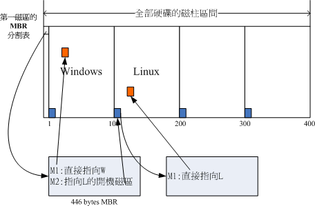

# 第二章 主机规划与磁盘分区

## 2.2磁盘分区

> 盘面中一圈圈同心圆为一条条磁道（磁轨），从圆心向外画直线，可以将磁道划分为若干个弧段，每个磁上一个弧段被称之为一个扇区（磁区）。扇区是磁盘的最小组成单元，通常是512字节。（由于不断提高磁盘的大小，部分厂商设定每个扇区的大小是4096字节)
>
> 
>
> 硬盘通常由重叠的一组盘片构成，每个盘面都被划分为数目相等的磁道，并从外缘的“0”开始编号，具有相同编号的磁道形成一个圆柱，称之为磁盘的柱面。

### 2.2.1 磁盘连接的方式与配置文件名的关系

正常的实体机器大概使用的都是**/dev/sd[a-]**的磁盘名，至于虚拟机环境下，为了加速，可能就会使用**/dev/vd[a-p]**这种装置文件名。

| 装置              | 装置在Linux内的文件名                                        |
| ----------------- | ------------------------------------------------------------ |
| SCSI/SATA/USB硬驱 | /dev/sd[a-p]                                                 |
| USB快闪碟         | /dev/sd[a-p] （与SATA相同）                                  |
| VirtI/O界面       | /dev/vd[a-p] （用于虚拟机内）                                |
| 软碟机            | /dev/fd[0-1]                                                 |
| 打印机            | /dev/lp[0-2] （25针打印机） /dev/usb/lp[0-15] （USB 接口）   |
| 鼠标              | /dev/input/mouse[0-15] （通用） /dev/psaux （PS/2界面） /dev/mouse （当前鼠标） |
| CDROM/DVDROM      | /dev/scd[0-1] （通用） /dev/sr[0-1] （通用，CentOS 较常见） /dev/cdrom （当前 CDROM） |
| 磁带机            | /dev/ht0 （IDE 界面） /dev/st0 （SATA/SCSI界面） /dev/tape （当前磁带） |
| IDE硬盘机         | /dev/hd[a-d] （旧式系统才有）                                |

### 2.2.2 MSDOS(MBR)与GPT磁盘分割表（partition table）

#### 1. MSDOS(MBR) 分割表格式与限制

早期的 Linux 系统为了兼容于 Windows 的磁盘，因此使用的是支持 Windows 的 MBR（Master Boot Record， 主要开机纪录区） 的方式来处理开机管理器与分割表！ 而启动管理程序纪录区与分割表则通通放在磁盘的第一个扇区， 这个扇区通常是 512bytes 的大小 （旧的磁盘扇区都是 512bytes 喔！ ），所以说，第一个磁区 512bytes 会有这两个数据：

- 主要开机记录区（Master Boot Record， MBR）：可以安装开机管理程序的地方，有446 bytes
- 分割表（partition table）：记录整颗硬盘分割的状态，有64 bytes

由于分割表所在区块仅有64 bytes容量，因此最多仅能有四组记录区，每组记录区记录了该区段的启始与结束的磁柱号码。 若将硬盘以长条形来看，然后将磁柱以直条图来看，那么那64 bytes的记录区段有点像底下的图标：


上述四个分割槽在Linux系统中设备文件名为：

- P1:/dev/sda1
- P2:/dev/sda2
- P3:/dev/sda3
- P4:/dev/sda4

由于分割表就只有64 bytes而已，最多只能容纳四笔分割的记录， 这四个分割的记录被称为主要（Primary）或延伸（Extended）分割槽。 根据上面的图标与说明，我们可以得到几个重点信息：

- 其实所谓的'分割'只是针对那个64 bytes的分割表进行设定而已！
- 硬盘预设的分割表仅能写入四组分割信息
- 这四组分割信息我们称为主要（Primary）或延伸（Extended）分割槽
- 分割槽的最小单位'通常'为磁柱（cylinder）
- 当系统要写入磁盘时，一定会参考磁盘分割表，才能针对某个分割槽进行数据的处理

使用分割表的意义：

* 数据安全性

  当需要将某个分区的数据重整时（例如装系统），其它分区的数据不受影响。

* 系统效能考量

  在系统读取某个分区的数据时，磁盘只要搜索本分区范围内的磁柱即可。

尽管第一个磁区所在的扇区（磁区）只能记录四笔数据，但可以利用额外的磁区来记录更多的分割信息（**拓展分割**）：


* 上图中P1为**主要分割**， P2为**延伸分割**（硬盘限制两种分割数之和最多四笔，操作系统限制延伸分割最多一个）。 
* 延伸分割的目的是使用额外的扇区来记录分割信息，延伸分割本身不能被拿来格式化。
* 上图中五个由延伸分割继续切出来的分割槽，被称为**逻辑分割槽** 。
* 由于逻辑分割槽是有延伸分割继续分割出来的，所以其可以使用柱面范围就是延伸分割所设定的范围。

上图中由于前四个号码是保留给主要分割或延伸分割使用，所以逻辑分割槽的号码是由5号开始：

- P1:/dev/sda1
- P2:/dev/sda2
- L1:/dev/sda5
- L2:/dev/sda6
- L3:/dev/sda7
- L4:/dev/sda8
- L5:/dev/sda9

MBR分割表的限制：

- 操作系统无法获取到 2.2T 以上的磁盘容量！
- MBR 仅有一个区块，若被破坏后，经常无法或很难救援。
- MBR 内的存放开机管理程序的区块仅 446bytes，无法容纳较多的代码。

#### 2. GUID paritiontable, GPT磁盘分割表

GPT为兼容所有硬盘，在磁区的定义上面，使用逻辑区块地址LBA（块/簇）,默认为512Bytes。

与 MBR 仅使用第一个 512bytes 区块来纪录不同， GPT 使用了 34 个 LBA 区块来纪录分割信息。 除了前面 34 个 LBA 之外，整个磁盘的最后 33 个 LBA 也拿来作为另一个备份。


上述图标的解释说明如下：

- LBA0 （MBR 兼容区块）

  与 MBR 模式相似的，这个兼容区块也分为两个部份，一个就是跟之前 446 bytes 相似的区块，储存了第一阶段的开机管理程序！ 而在原本的分割表的纪录区内，这个兼容模式仅放入一个特殊标志的分割，用来表示此磁盘为 GPT 格式之意。 而不懂 GPT 分割表的磁盘管理程序， 就不会认识这颗磁盘，除非用户有特别要求要处理这颗磁盘，否则该管理软件不能修改此分割信息，进一步保护了此磁盘喔！

- LBA1 （GPT 表头纪录）

  这个部分纪录了分割表本身的位置与大小，同时纪录了备份用的 GPT 分割 （就是前面谈到的在最后 34 个 LBA 区块） 放置的位置， 同时放置了分割表的检验机制码 （CRC32），操作系统可以根据这个检验码来判断 GPT 是否正确。 若有错误，还可以通过这个记录区来取得备份的 GPT（磁盘最后的那个备份区块） 来恢复 GPT 的正常运作！

- LBA2-33 （实际日志分信息处）

  从 LBA2 区块开始，每个 LBA 都可以纪录 4 笔分割纪录，所以在预设的情况下，总共可以有 4*32 = 128 笔分割纪录喔！ 因为每个LBA有512bytes，因此每笔纪录用到128 bytes的空间，除了每笔纪录所需要的识别码与相关的纪录之外，GPT在每笔纪录中分别提供了64bits来记载开始/结束的磁区号码，因此，GPT分割表对于单一分割槽来说，他的最大容量限制就会在' 2^64 * 512bytes = 2^63 * 1Kbytes = 2^33*TB = 8 ZB ，要注意 1ZB = 2^30 TB 啦！

  

  查资料补充：

> 块/簇： 磁盘块/簇（虚拟出来的）。 块是操作系统中最小的逻辑存储单位。操作系统与磁盘打交道的最小单位是磁盘块。
>
> 为什么存在磁盘块：
>
> * 读取方便：由于扇区的数量比较小，数目众多在寻址时比较困难，所以操作系统就将相邻的扇区组合在一起，形成一个块，再对块进行整体的操作。
> * 分离对底层的依赖：操作系统忽略对底层物理存储结构的设计。通过虚拟出来磁盘块的概念，在系统中认为块是最小的单位。
>
> page: 操作系统经常与内存和硬盘这两种存储设备进行通信，类似于“块”的概念，都需要一种虚拟的基本单位。所以，与内存操作，是虚拟一个页的概念来作为最小单位。与硬盘打交道，就是以块为最小单位。
>
> 扇区、块/簇、page的关系：
>
> * 扇区： 硬盘的最小读写单元
> * 块/簇： 是操作系统针对硬盘读写的最小单元
> * page： 是内存与操作系统之间操作的最小单元。
> * 扇区 <= 块/簇 <= page

### 2.2.3 开机流程中的BIOS与UEFI开机检测程序

#### 1. BIOS搭配MBR/GPT的开机流程：

1. **BIOS**：开机主动执行的韧体，会认识第一个可开机的装置;
2. **MBR**：第一个可开机装置的第一个磁区内的主要开机记录区块，内含开机管理程序;
3. **启动管理器（boot loader）**：一支可读取核心档案来执行的软件;
4. **核心文件**：启动操作系统的功能...

开机管理器除了可以安装在MBR之外， 还可以安装在每个分割槽的开机扇区（boot sector）。

例如：



- 每个分割槽都拥有自己的开机扇区（boot sector）
- 图中的系统槽为第一及第二分割槽，
- 实际可开机的核心档案是放置到各分割槽内的！
- loader只会认识自己的系统槽内的可开机核心档案，以及其他loader而已;
- loader可直接指向或者是间接将管理权转交给另一个管理程序。

#### 2. UEFI BIOS搭配GPT开机的流程

UEFI主要是想要取代BIOS这个固件界面， 使用 C 程序语言，比起使用组合语言的传统 BIOS 要更容易开发。

EFI 大多用来作为启动操作系统之前的硬件检测、开机管理、软件设定等目的，基本上是比较难的。 同时，当加载操作系统后，一般来说，UEFI 就会停止工作，并将系统交给操作系统，这与早期的 BIOS 差异不大。 

### 2.2.4 Linux安装模式下，磁盘分割的选择

#### 1. 目录树结构


#### 2. 文件系统和目录树的关系（挂载）

所谓的'挂载'就是利用一个目录当成进入点，将磁盘分割槽的数据放置在该目录下; 也就是说，进入该目录就可以读取该分割槽的意思。


# 第四章、首次登入与线上求助

## 4.1首次登陆系统

### 4.1.4 在终端接口登入Linux

 Linux默认的情况下会提供六个Terminal来让用户登录， 切换的方式为使用：**[Ctrl] + [Alt] + [F1]~[F6]**的组合按钮。

- [Ctrl] + [Alt] + [F2] ~ [F6] ：文本接口登录 tty2 ~ tty6 终端机;
- [Ctrl] + [Alt] + [F1] ：图形界面桌面。

## 4.2文字模式下指令的下达

### 4.2.1 开始下达指令

指令格式

```shell
[dmtsai@study ~]$ command  [-options]  parameter1  parameter2 ...
                     指令     選項        參數(1)     參數(2)
```

上述指令详细说明如下：

1. 一行指令中第一个输入的部分绝对是'指令（command）'或'可执行文件（例如批次脚本，script）'
2. command 为指令的名称，例如变换工作目录的指令为 cd 等等;
3. 中刮号[]并不存在于实际的指令中，而加入选项设定时，通常选项前会带 - 号，例如 -h;有时候会使用选项的完整全名，则选项前带有 -- 符号，例如 --help;
4. parameter1 parameter2.. 为依附在选项后面的参数，或者是 command 的参数;
5. 指令， 选项， 参数等这几个咚咚中间以空格来区分，不论空几格 shell 都视为一格。 所以空格是很重要的特殊字符！ ；
6. 按下[Enter]按键后，该指令就立即执行。 [Enter]按键代表着一行指令的开始启动。
7. 指令太长的时候，可以使用反斜线 （\） 来跳脱 [Enter] 符号，使指令连续到下一行。 注意！ 反斜线后就立刻接特殊字符，才能跳脱！

#### 1. 语系的支持

```shell
1. 顯示目前所支援的語系
[dmtsai@study ~]$ locale
LANG=zh_TW.utf8              # 語言語系的輸出
LC_CTYPE="zh_TW.utf8"        # 底下為許多資訊的輸出使用的特別語系
LC_NUMERIC=zh_TW.UTF-8
LC_TIME=zh_TW.UTF-8          # 時間方面的語系資料
LC_COLLATE="zh_TW.utf8"
....中間省略....
LC_ALL=                      # 全部的資料同步更新的設定值
# 上面的意思是說，目前的語系(LANG)為zh_TW.UTF-8，亦即台灣繁體中文的萬國碼
[dmtsai@study ~]$ date
鈭? 5??29 14:24:36 CST 2015  # 純文字界面下，無法顯示中文字，所以前面是亂碼

2. 修改語系成為英文語系
[dmtsai@study ~]$ LANG=en_US.utf8
[dmtsai@study ~]$ export LC_ALL=en_US.utf8
# LANG 只與輸出訊息有關，若需要更改其他不同的資訊，要同步更新 LC_ALL 才行！

[dmtsai@study ~]$ date
Fri May 29 14:26:45 CST 2015 # 順利顯示出正確的英文日期時間啊！

[dmtsai@study ~]$ locale
LANG=en_US.utf8
LC_CTYPE="en_US.utf8"
LC_NUMERIC="en_US.utf8"
....中間省略....
LC_ALL=en_US.utf8
# 再次確認一下，結果出現，確實是en_US.utf8這個英文語系！
```

### 4.2.2 基本指令操作

- 显示日期与时间的指令： date

- 显示日历的指令： cal 

  `cal [month] [year]`

- 简单好用的计算机： bc

  `scale=3`: 显示小数点后三位

- 命令补全 `[tab]`按键

  - [Tab] 接在一串指令的第一个字的后面，则为『命令补全』;
  - [Tab] 接在一串指令的第二个字以后时，则为『档案补齐』！
  - 若安装 bash-completion 软件，则在某些指令后面使用 [tab] 按键时，可以进行『选项/参数的补齐』功能！

- `[ctr]+c`:终止正在运行的指令

- `[ctr] + d`: 键盘输入结束

- `[shift]+{[PageUp] | [PageDown]}`:文本模式时上下翻页

- 查看某指令的说明

  * `command --help`
  * `man command`

### 4.3.2 man page

man page页面命令后数字代表含义：

| 代号 | 代表内容                                                     |
| ---- | ------------------------------------------------------------ |
| 1    | **用户在shell环境中可以操作的指令或可执行文件**              |
| 2    | 系统核心可调用的函数与工具等                                 |
| 3    | 一些常用的函数（function）与函式库（library），大部分为C的函式库（libc） |
| 4    | 装置档案的说明，通常在/dev下的档案                           |
| 5    | **配置文件或者是某些文件的格式**                             |
| 6    | 游戏（games）                                                |
| 7    | 惯例与协议等，例如Linux档案系统、网路协定、ASCII code等等的说明 |
| 8    | **系统管理员可用的管理指令**                                 |
| 9    | 跟kernel有关的文件                                           |

文字模式下常用按键

| 按键        | 进行工作                                                     |
| ----------- | ------------------------------------------------------------ |
| 空白键      | 向下翻一页                                                   |
| [Page Down] | 向下翻一页                                                   |
| [Page Up]   | 向上翻一页                                                   |
| [Home]      | 去到第一页                                                   |
| [End]       | 去到最后一页                                                 |
| /string     | 向'下'搜寻 string 这个字符串，如果要搜索 vbird 的话，就输入 /vbird |
| ?string     | 向'上'搜寻 string 这个字符串                                 |
| n, N        | 利用 / 或 ？ 来搜索字符串时，可以用 n 来继续下一个搜索 （不论是 / 或 ？） ，可以利用 N 来进行「反向」搜索。 举例来说，我以 /vbird 搜寻 vbird 字符串， 那么可以 n 继续往下查询，用 N 往上查询。 若以 ？vbird 向上查询 vbird 字符串， 那我可以用 n 继续「向上」查询，用 N 反向查询。 |
| q           | 结束这次的 man page                                          |

#### 1. 搜索特定命令/文件的man page 说明文件

使用`man -f command`命令搜索相应命令的man page文件。

```shell
#搜索man命令的man page 说明文件
[dmtsai@study ~]$ man -f man
man (1)              - an interface to the on-line reference manuals
man (1p)             - display system documentation
man (7)              - macros to format man pages

#查看man(1)的文件资料
[dmtsai@study ~]$ man 1 man
```

使用`man -k command`命令，列出所有包含`command`字眼的说明文件。

```shell
[dmtsai@study ~]$ man -k man
fallocate (2)        - manipulate file space
zshall (1)           - the Z shell meta-man page
...
```

在以root身份建立`whatis`数据库

```shell
[root@study ~]# mandb
```

之后就可以使用两个`man`命令的缩写版

```shell
[dmtsai@study ~]$ whatis  [指令或者是資料]   <==相當於 man -f [指令或者是資料]
[dmtsai@study ~]$ apropos [指令或者是資料]   <==相當於 man -k [指令或者是資料]
```

### 4.3.3 info  page

在Linux里面则又额外提供了一种线上求助的方法--info。

`info page`显示解读：

```shell
[dmtsai@study ~]$ info info
File: info.info,  Node: Top,  Next: Getting Started,  Up: (dir)

Info: An Introduction
*********************

The GNU Project distributes most of its on-line manuals in the "Info
format", which you read using an "Info reader".  You are probably using
an Info reader to read this now.
....(中間省略)....

   If you are new to the Info reader and want to learn how to use it,
type the command 'h' now.  It brings you to a programmed instruction
sequence. # 這一段在說明，按下 h 可以有簡易的指令說明！很好用！
....(中間省略)....

* Menu:

* Getting Started::             Getting started using an Info reader.
* Advanced::                    Advanced Info commands.
* Expert Info::                 Info commands for experts.
* Index::                       An index of topics, commands, and variables.

--zz-Info: (info.info.gz)Top, 52 lines --Bot------------------------------------------
```

- File：代表这个info page的数据是来自 info.info 档案所提供的;
- Node：代表目前的这个页面是属于Top节点。 意思是 info.info 内含有很多信息，而Top仅是 info.info 档案内的一个节点内容而已;
- Next：下一个节点的名称为Getting Started，你也可以按'N'到下个节点去;
- Up：回到上一层的节点总揽画面，你也可以按下'U'回到上一层;
- Prev：前一个节点。 但由于Top是 info.info 的第一个节点，所以上面没有前一个节点的信息。

另外，如论你在任何一个页面，只要不知道怎么使用 info 了，直接按下 h 系统就能够提供一些基本按键功能的介绍。

阅读`info page`界面常用按键

| 按键        | 进行工作                                            |
| ----------- | --------------------------------------------------- |
| 空白键      | 向下翻一页                                          |
| [Page Down] | 向下翻一页                                          |
| [Page Up]   | 向上翻一页                                          |
| [tab]       | 在 node 之间移动，有 node 的地方，通常会以 * 显示。 |
| [Enter]     | 当光标在 node 上面时，按下 Enter 可以进入该 node 。 |
| b           | 移动光标到该info画面当中的第一个node处              |
| e           | 移动光标到该info画面当中的最后一个node处            |
| n           | 前往下一个 node 处                                  |
| p           | 前往上一个 node 处                                  |
| u           | 向上移动一层                                        |
| s(/)        | 在 info page 当中进行搜寻                           |
| h, ?        | 显示求助菜单                                        |
| q           | 结束这次的 info page                                |

### 4.3.4 其它有用的文件

文件目录：/usr/share/doc

# 五、Linux档案权限与目录配置

## 5.2 Linux档案权限概念

### 5.2.1 Linux档案属性

使用`ls -al`命令查看当前目录所有文件以及文件属性。

```shell
[root@study ~]# ls -al
total 48
drwxr-xr-x.  3    root     root      17  May  6 00:14 .config               <=範例說明處
drwx------.  3    root     root      24  May  4 17:59 .dbus
-rw-r--r--.  1    root     root    1864  May  4 18:01 initial-setup-ks.cfg  <=範例說明處
....
```

档案属性示意：


> 连结应该类似windows系统的快捷方式（猜想未证实）。

档案属性详细介绍：

1. 第一列代表这个文件的类型与权限

   

   * 第一个字母代表这个文件是目录、文件、或链接文件等等
     - 当为[ **d** ]则是目录
     - 当为[ **-** ]则是文件
     - 若是[ **l** ]则表示为链接文件（link file）;
     - 若是[ **b** ]则表示为设备文件里面的可供储存的周边设备（可随机存取装置）;
     - 若是[ **c**]则表示为设备文件里面的串口设备，例如键盘、鼠标（一次性读取设备）。
   * 接下来的字符中，三个为一组
     - 第一组为'档案所有者可具备的权限'
     - 第二组为'加入此群组之帐号的权限';
     - 第三组为'非本人且没有加入本群组之其他帐号的权限'。

2. 第二栏表示有多少文件名链接到此节点（i-node）

   每个档案都会将他的权限与属性记录到档案系统的i-node中，不过，我们使用的目录树却是使用文件名来记录， 因此每个文件名就会连结到一个i-node。这个属性记录的，就是有多少不同的文件名链接到相同的一个i-node号码。(第七章详解)
   
3. 第三列表示此文件（或目录）的'所有者帐号'

4. 第四列表示这个档案的所属组

   Linux系统下，一个账号可以加入多个组。

5. 第五栏为这个文件的容量大小，单位为Bytes.

6. 第六列为此文件的建档日期或者是最近的修改日期

7. 第七栏为这个文件的文件名

### 5.2.2 如何改变档案属性与权限

- `chgrp [-R] groupName dirname/filename ...` ：改变文件所属组

  * 要改变的群组名必须在`etc/group`文件内存在才可以。

  * `-R`参数: 进行递归的持续变更，即连同子目录下的所有文件、目录都更新为这个新的群组

  * 示例：

    ```shell
    [root@study ~]# chgrp users initial-setup-ks.cfg
    [root@study ~]# ls -l
    -rw-r--r--. 1 root users 1864 May  4 18:01 initial-setup-ks.cfg
    ```

- `chown `：改变文件所有者

  * 用户必须在`etc/passwd`这个文件中有记录。
  * 用法：
    * `chown [-R] 账号名称 文件或目录`
    * `chown -[R] 账号名称：组名 文件或目录`

- `chmod` ：改变文件的权限， SUID， SGID， SBIT等等的特性

  * 数字类型改变文件权限

    文件权限字符为：`[-rwxrwxrwx]`, r 、w、 x权限的分数分别为4、2、1

    例如一个文件的权限字符为`[-rwxrwx---]`,各身份分数则是：

    owner = rwx = 4 + 2 + 1 = 7

    group = rwx = 4 + 2 + 1 = 7

    others = --- = 0 + 0 + 0 =0

    * `chmod [-R] xyz 文件或目录`

      `xyz`: 就是该文件数字类型的权限分数之和。

      `-R`: 进行递归的持续变更。

      示例：

      ```shell
      [root@study ~]# ls -al .bashrc
      -rw-r--r--. 1 root root 176 Dec 29  2013 .bashrc
      [root@study ~]# chmod 777 .bashrc
      [root@study ~]# ls -al .bashrc
      -rwxrwxrwx. 1 root root 176 Dec 29  2013 .bashrc
      ```

  * 符号类型改变档案权限

    

    * 在`chmod`命令中，可以分别使用 u、g、o分别代表user、group、others三种身份，另外使用a代表上述全部身份。

      一种使用符号类型改变档案权限的命令：`chmod u=rwx，g=rx，o=r filename`

      示例：

      ```shell
      [root@study ~]# chmod  u=rwx,go=rx  .bashrc
      [root@study ~]# ls -al .bashrc
      -rwxr-xr-x. 1 root root 176 Dec 29  2013 .bashrc
      ```

    * 使用 `+` 、`-`符号分别来加入或去除`u`、`g`、`o`等身份的`rwx`权限

      示例：

      ```shell
      [root@study ~]# ls -al .bashrc
      -rwxr-xr-x. 1 root root 176 Dec 29  2013 .bashrc
      [root@study ~]# chmod  a+w  .bashrc #给全部身份都提供写入权限
      [root@study ~]# ls -al .bashrc
      -rwxrwxrwx. 1 root root 176 Dec 29  2013 .bashrc
      ```

### 5.2.3 目录和文件的权限意义

